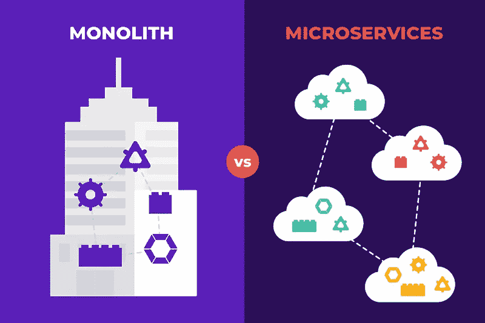
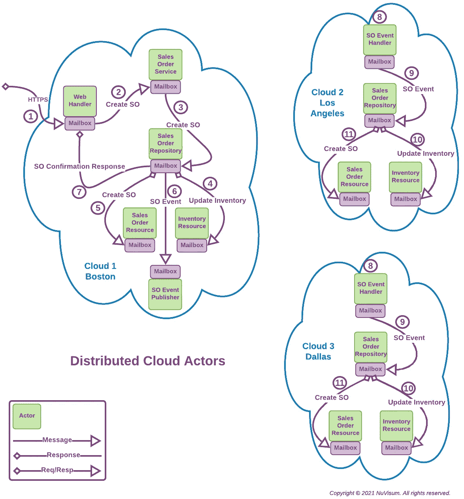
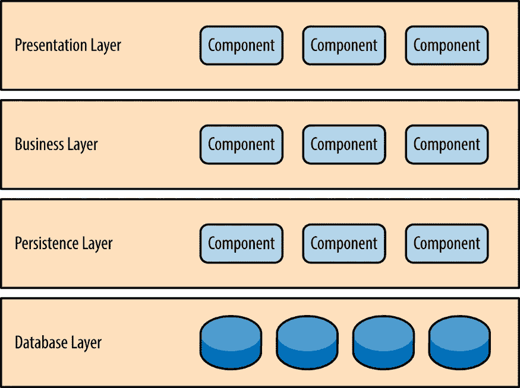

# 微服务适合你吗？

> 原文：<https://medium.com/nerd-for-tech/are-microservices-right-for-you-8fd0a6cb3183?source=collection_archive---------7----------------------->

## 答案是……视情况而定

**图片由** [**内容堆栈**](https://www.contentstack.com/) 提供

***您如何知道微服务对您的组织是否有意义？如果你想弄清楚，请继续读下去。***

## 什么是微服务？

微服务不是魔术，但它们是一种将应用程序分解成可用组件的方法，这些组件可以连接在一起形成系统。之所以称之为微服务，是因为它们的组件往往比流行了十多年的传统 [*面向服务架构*](https://en.wikipedia.org/wiki/Service-oriented_architecture) (SOA)服务更小。单个微服务:

*   在域**有界上下文**内实现**单任务**。这是微服务的一个基本特征，它促进了高层次的*粒度*和*关注点分离*，从而保留了微服务的*自主性*和*独立可部署性*。
*   是松耦合的，并且很少或根本不使用其他微服务的定义——强制关注点分离。
*   是**自主的**，并且可以在不同开发团队之间较少协调的情况下进行开发和修改——促进*敏捷开发实践*。
*   **可独立部署**，并且可以单独测试、部署和回滚，而不会影响其他微服务——支持**基于云的** *自动化部署、扩展、可靠性和故障转移*。

如果应用程序组件不满足这四个基本目标，它就不是微服务——它不能提供微服务架构风格的所有优势。

[**点击查看详情**](https://drive.google.com/file/d/10KLDVswfBmWy9nfgtFtRqx7SsJmRKKRU/view?usp=sharing)

## 什么是独石？

在软件工程中，*单片应用程序*描述了一个设计和/或部署时没有明显模块化的软件应用程序。实际上，大型的完全单一的应用程序已经很久没有被实现了——尽管有一些可能仍然存在。如今，当与微服务相比使用术语 monolith 时，它通常意味着当今最常用的架构模式之一，即*分层架构*，也称为 *n 层架构*模式。

**分层架构，版权 2015–2021**[**奥莱利媒体**](https://www.oreilly.com/) **，Inc .保留所有权利。**

分层架构很受欢迎，因为它相当容易理解和使用。它将应用组件分解成整齐的层或层，每个层都有自己的职责范围。它还将用户表示与应用程序的其余部分分离开来，便于为同一个应用程序实现 Web、移动和/或桌面 GUI。有了设计良好的持久层，甚至可以保持高度的 DBMS 独立性。

今天最流行的 SOA 框架， [*Spring Boot*](https://en.wikipedia.org/wiki/Spring_Framework) 和[*Jakarta RESTful Web Services*](https://en.wikipedia.org/wiki/Jakarta_RESTful_Web_Services)(JAX-RS)是分层架构，可以很好地工作。它们是 SOA 模式的强大、可靠和可管理的实现。在云计算出现之前，很容易认为 SOA 是非常广泛的业务应用程序和服务的最佳架构。然而，对于云计算来说，它有一些固有的缺点:

*   至少，它的业务层和持久层必须作为一个单一的、可执行的整体部署在一起——尽管它的表示层和数据库层可以通过网络连接到整体的其余部分。
*   它的许多大型支持软件**框架必须和它一起部署**。
*   **控制流必须从上到下穿过每一层**(表示层- >业务层- >持久性层- >数据库层)，然后向上穿过相同的层。
*   其**固有的紧密组件耦合**会对开发速度和敏捷性产生负面影响。

## 微服务解决什么问题？

微服务架构通过以下方式帮助解决一些基本的软件开发、部署和运行时问题:

*   缩短软件开发周期，优化敏捷软件开发和维护实践。
*   促进快速的应用程序特性迭代，并简化软件测试、持续集成和持续交付。
*   利用云容器和容器编排提供的自动化部署、扩展、可靠性和故障转移功能。

最终的想法是，通过增加软件组件之间的隔离，微服务可以快速和独立地交付系统的小型离散部分，通过利用[容器和容器编排](https://cloud.google.com/containers/)可以跨云集群提供高度的水平可伸缩性和容错能力。

## 微服务的利与弊是什么？

*天下没有免费的午餐！* *对于软件设计来说尤其如此——几乎每一个重要的选择都代表着成本与收益之间的妥协。*

如果做得好，微服务架构真的可以带来它承诺的好处。它实际上可以:

*   实现更快、更敏捷的软件开发。
*   帮助您更快地迭代应用程序功能，减少麻烦。
*   为您的应用程序和用户开放云的真正力量和功能。

但是，所有这些都是有代价的。使用微服务架构需要更多的软件工程纪律和严谨性——用更少的代码进行更多的思考。

> 因为微服务需要软件架构和设计的有效应用，所以消除一些关于敏捷软件开发的错误假设很重要。敏捷并不禁止软件架构和设计。[敏捷宣言](https://agilemanifesto.org/principles.html)说，**“最好的架构、需求和设计来自自组织团队”**，这是一种非常有用和实用的方法。

微服务架构的一个缺点是它倾向于创建比 SOA 更多但更小的组件。这可能会增加复杂性，复杂性会随着组件数量的增加而呈指数级增长。量化复杂度的一个相当好的公式是 **c = n(n-1)/2** ，其中 **n** 是组件的数量。这意味着传统的分层、自上而下的配置和控制机制对于微服务来说不是特别有效。大型微服务部署需要更多的 [*动态和自组织*](https://drive.google.com/file/d/10Xftbv0OH4m_laJgnbosf9OSZ4VncILo/view?usp=sharing) 配置和控制技术，幸运的是，这也可以在云中带来更好的水平可伸缩性和故障转移能力。

微服务和云计算对大多数组织来说都是新事物。直接跳进游泳池的深水区可能会有风险。通常最好是从浅的一端开始，一步一步来，从小的项目开始——当你进入一种实现软件的新方法时，强调学习和交流。像亚马逊和网飞这样的公司使用微服务方法取得了巨大的成功，但他们不是一夜之间就成功的。

## 我如何决定？

如果贵公司对以下任何陈述的回答为“正确”,那么您可以从微服务中获益:

*   *数字化转型*确实是我们业务战略的重要组成部分。
*   我们确实需要利用*自动化* *部署*、*扩展*、*可靠性*和*故障转移*功能，这些功能可用于*云计算*。
*   在软件开发*和应用*特性迭代*方面，我们确实需要*更快*和*更敏捷*。*
*   我们真的愿意创新，改变我们做事的方式。
*   我们真的不能继续维持现状。

如果你不能对这些陈述中的一些做出“正确”的回答，那么你最好尽你所能使用 SOA 和一个主要的 SOA 框架。在他们的能力范围内，他们真的可以做得很好。

## 附加阅读

如果您想更深入地了解微服务，我们建议您阅读用于云的 [***软件架构***](/nerd-for-tech/software-architecture-for-the-cloud-c9226150c1f3) 和 [***设计微服务***](/nerd-for-tech/designing-microservices-4130bc41c046) 。

如果你想了解更多关于敏捷开发的原则，我们建议看看敏捷宣言 背后的 [***原则。***](https://agilemanifesto.org/principles.html)