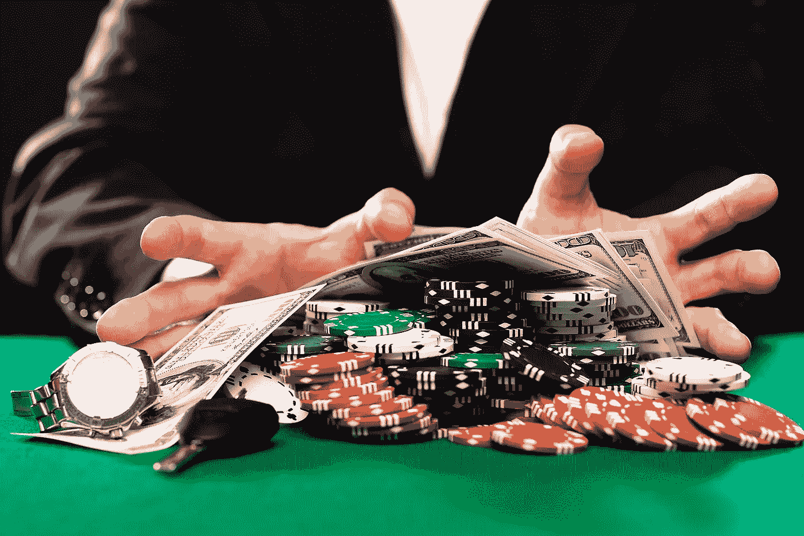
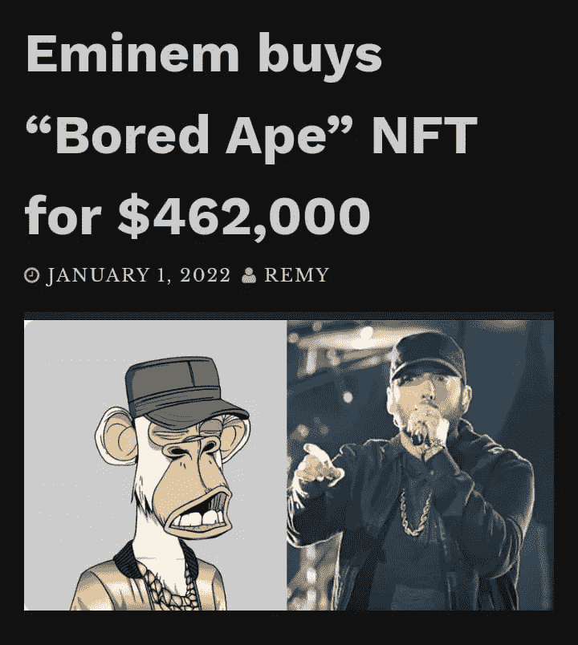
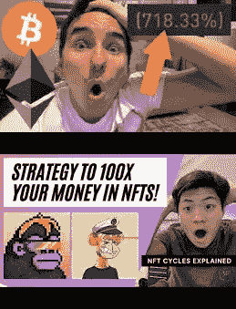
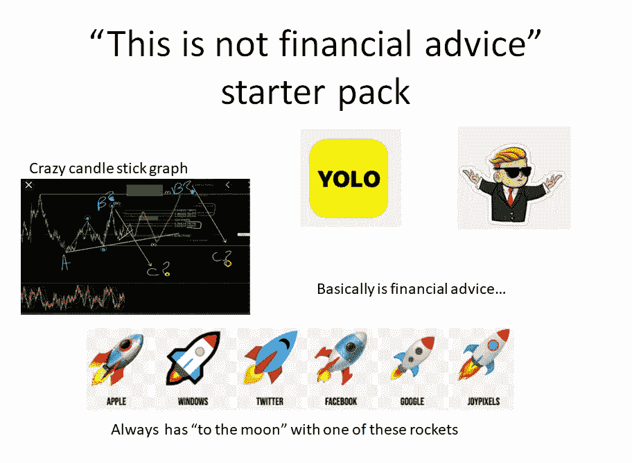
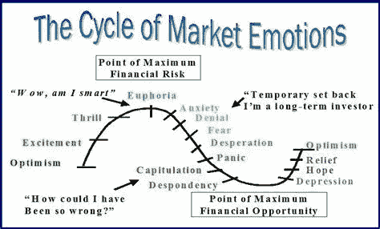

# NFT 的加密货币会把我们培养成赌徒和冲动的一代吗？

> 原文：<https://medium.com/nerd-for-tech/are-nfts-cryptocurrencies-breeding-us-into-gamblers-and-impulse-driven-generation-4555f1218e9c?source=collection_archive---------4----------------------->

FOMO，绝望带给我们所有人最坏的一面…

我认为 NFT 的 crypto(此外还可以提到元宇宙，但我们现在跳过它)与乐透有一些关联。两者都追求更好的生活，通过乐透/刮刮卡赚钱，这是婴儿潮一代和 X 一代更熟悉的老一代，而 crypto/NFT 主要是千禧一代和 z 一代。我自己参加了两者，并仍在参与其中(主要是 NFT 的)，并有一种解决我的问题的冲动。

> 加密货币的唯一价值是，另一个赌客会过来支付更多。它们没有社会效益。

这同样适用于 NFT，数字土地以及体育卡，古董和更多，它主要是关于我们给他们带来的感知价值，赚快钱肯定是很高的。

# 投机

投资是长期的，而赌博是短期的，这可能是为什么 cryptos 和 NFT 的游戏与赌博一样情绪化的原因。即使持有人通常是长期持有，他们可能进入的原因可能是快速和高多巴胺高峰。

此外，还有很多加密货币赌场，例如 True Flip Bet 和 King。骗子也非常普遍，他们厌倦了这个机会，但是我们现在不要谈这个。赌博作为一个结果也可以取消贷款资格，这可能会带来不变，如果你会计划得到你一直想要的梦想房子。这些行为可以报告给你的金融机构，以便他们知道你的参与。

> 在某些情况下，金融机构避免贷款给赌徒。所以，如果你在寻找贷款，你可能没有机会获得贷款。

新冠肺炎·疫情让我们在社交媒体、游戏，当然还有不计后果的赌博的漩涡中陷得更深，因为大量的人感到无聊、不安和绝望。

对于 NFT 的作品来说，更是如此，因为它们没有任何内在价值，给你的 NFT 定价取决于这样一个问题:人们是否会寻找你的作品，以及它是否足够罕见，一旦上市，它的价值就会飙升。自然，给你的 NFT 资产定价是基于它对你的意义，而不是 NFT 市场的实际需求。

> 交易员们正在出售自己的 NFT 葡萄酒，以推高价格

这种☝️☝️☝️被称为“清洗交易”，为了欺骗市场而买卖证券的行为曾经是华尔街司空见惯的事情，并且在近一个世纪以来一直是非法的。但是巨大且不受监管的 NFT 市场已经被证明是骗子的黄金机会。

NFT 的风险报酬率要低得多，但是我们仍然不断地假设我们投资的项目会成功(包括我自己)。

> 牛津风险公司的一项研究发现，五分之一的英国加密投资者对加密知识了解不多或一无所知。

# FOMO

每个人都知道 FOMO，但我想参考维基百科对它的描述。

> 害怕错过 ( **FOMO** )是一种恐惧的感觉，担心自己要么不了解情况，要么错过了可以让自己生活更好的信息、事件、经历或人生决策。[【2】](https://en.wikipedia.org/wiki/Fear_of_missing_out#cite_note-PMDG20132-2)【FOMO】还与对[后悔](https://en.wikipedia.org/wiki/Regret)[【3】](https://en.wikipedia.org/wiki/Fear_of_missing_out#cite_note-Wortham20112-3)的恐惧联系在一起，这可能会导致人们担心自己可能会错过[社交互动](https://en.wikipedia.org/wiki/Social_interaction)的机会、一次新奇的经历、一次难忘的事件或一项有利可图的投资。[【4】](https://en.wikipedia.org/wiki/Fear_of_missing_out#cite_note-4)

每个人现在都知道加密和许多人 FOMO 希望不合理的利润。叔叔、妈妈、爸爸、表弟甚至祖父母现在都在打开他们自己的钱包。

## 时机！

时机是关键，而我们大多数人都不明白，为了最大化利润和最小化风险，这是至关重要的，可悲的是，牛市最有可能已经结束，以获得这些疯狂的收益。自 2021 年初以来，比特币已经上涨了近 70%，推动整个加密市场的总价值达到 2 万亿美元。

许多人因为它而涌入 NFT，因为 BAYC 和 crypto 朋克。许多名人跳船成为 BAYC 的老板，包括波斯特马龙，吉米·法伦，斯蒂芬库里，贾斯汀比伯等。

到目前为止，BAYC 的地板是第 91 层，上周高达第 100 层！

社交媒体是所有 **FOMO** 、Youtube、Twitter 等正在成为 crypto 和 NFT(NFT 的名单上有一个额外的不和谐)的垃圾节目的重要原因

缩略图中始终保留的一件事是“O”形脸的表情🙃

总有这么一句话， ***这不是理财建议！NFT 所有的事情似乎都是基于情感而不是逻辑，这也影响了我。***

> 你会看，他们会告诉你你能在网上找到的同样的东西——他们会告诉你你想听到的可能的高回报。他们通常不会跳过简单的项目纲要、路线图和价格行动。风险回报比率很少(可以说从来没有)被提及，因为现实不会带来访客！

很多内容创作者和骗子正在利用人性的一部分来致富，因为我们是最容易陷入骗局的受害者。遵循最普通的赚钱流程，无论它有多慢，远离快速致富计划和传播这些计划的人。这导致了最后一部分冲动…

# 脉冲

由于详尽的解释，人们将再次引用维基百科:

> 在[心理学](https://en.wikipedia.org/wiki/Psychology)、**冲动**(或**冲动**)是一种按照[突发奇想](https://en.wikipedia.org/wiki/Impulse_(psychology))行事的倾向，表现出很少或根本没有[事先考虑](https://en.wikipedia.org/wiki/Forethought)、反思或考虑后果的行为特征。[【1】](https://en.wikipedia.org/wiki/Impulsivity#cite_note-1)冲动行为通常是“考虑不周、过早表达、过度冒险或不适合经常导致不良后果的情况”，[【2】](https://en.wikipedia.org/wiki/Impulsivity#cite_note-Daruna-2)

我提到这一点是因为我注意到它对我的个人生活产生了负面影响，除了克罗珀/NFT 等。从工作、关系、健康(饮酒等)等日常情况的较低逻辑方法开始，以财务纪律、限制屏幕时间、容易分心等结束。

有多少人凭冲动行事，不同的骗子出现在秘密的[泵和转储](https://www.investopedia.com/news/how-cryptocurrency-pumpanddump-scams-work/)组。

> 截至 2013 年底，有超过 50 种不同的加密货币。到 2014 年底，这一数字增加了约 10 倍，达到 500 多家。
> 
> 今天，有超过 16，000 种加密货币在流通。

这应该是令人担忧的，因为越来越多的新人涌入，他们的成功就会急剧下降。我们中的许多人仍然出于自我意识与新来者交往，觉得自己比其他人更聪明。

与 NFT 的 it 类似，但在这里有更多的**以及 [**追逐**](https://lmhsrampage.com/2021/04/15/cloutchasing-is-terrible/) **的影响力。**你可能会问，这是怎样的影响力追逐和时尚？好吧，看看推特就知道了，首先，名人会把他们的个人资料照片换成 BAYC。从最近的更新开始，Twitter 将允许您从您的 **MetaMask** 钱包中选择和 NFT，并将其设置为您的个人资料图片。**

> **在我们对可信解释的绝望中，出现了一个令人信服的 NFT 的理由:**它们是*地位的象征*。至少这是我们对他们的主观评价。****

****

**所有这些都不是为了抨击 crypto 或 NFT，因为我在 crypto 上投入了大量资金，现在更多地转移到了 NFTs。我的操作系统帐户👇**

**[https://opensea.io/Mozes721](https://opensea.io/Mozes721)**

**我只是提出我的错误和我希望我能早点知道的事情，关于如何避免骗局，如何正确评估市场和避免烧钱心态。**

**最后，做一些能给他人带来价值的事情总是更好，回报会随着时间自然而来。在 medium 上赚的 5 美元感觉比我从用 crypto 做的**定时**投资中获得的更大一笔钱更有回报！🦾 💖**