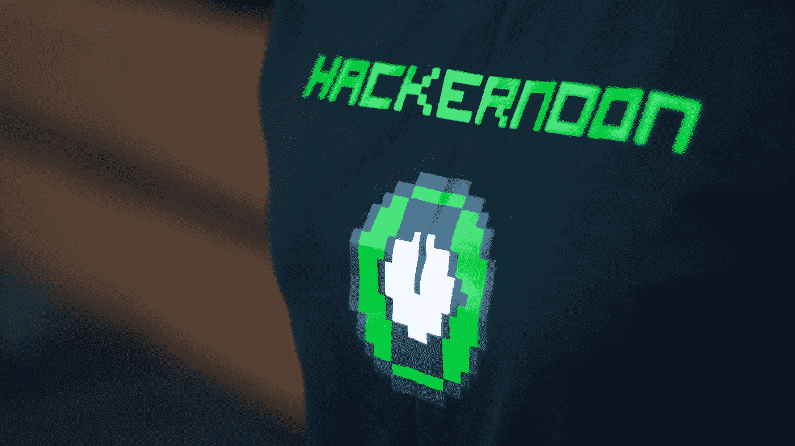
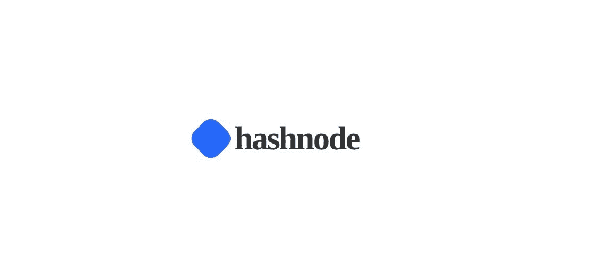

# 2022 年开发者顶级社交网站。

> 原文：<https://medium.com/nerd-for-tech/are-you-a-developer-here-are-the-top-social-networking-sites-for-you-22bffb79cc14?source=collection_archive---------0----------------------->

本文将讨论 2022 年的一些顶级社交网站，它们可以帮助你的 web 开发之旅。

照片由 [Cookie 在](https://unsplash.com/@cookiethepom?utm_source=medium&utm_medium=referral) [Unsplash](https://unsplash.com?utm_source=medium&utm_medium=referral) 上的 Pom 拍摄

> 在社交媒体的世界里，我们的联系越来越紧密，人们应该学会利用社区的力量。

## 中等

[拍照](https://unsplash.com/@retrosupply?utm_source=medium&utm_medium=referral)在[上反溅](https://unsplash.com?utm_source=medium&utm_medium=referral)

埃文·威廉在 2012 年 8 月创建了这个网站。他创造了 blogger 这个词，后来这个词作为博客变得很流行。Medium 背后的想法是给人们更多的单词长度来表达自己，而不是之前公司 Twitter 提供的大约 140 个字符。

2016 年，该媒体发表了 750 万篇文章，超过 6000 万读者使用了该平台。

你可以在媒体上写文章或帖子，并可以根据文章的总阅读时间获得报酬。

因此，你可以阅读任何东西，你可以在 Medium 上找到大量与网站开发相关的文章，你可以阅读、喜欢并与你的朋友分享。

## 哈克农

[黑客中午](https://unsplash.com/@hackernoon?utm_source=medium&utm_medium=referral)在 [Unsplash](https://unsplash.com?utm_source=medium&utm_medium=referral) 上的照片

Hackernoon 于 2016 年 1 月作为 Medium 上的黑客日报开始了它的旅程，并最终在 2016 年 4 月成为 Hackernoon。

该网站由 David 和 Linh Dao Smooke 这对夫妻二人组运营，并在 2016 年 10 月因文章 [*为什么每个人都错过了加密货币最令人兴奋的功能*而走红。我正在从你的网站收集信用卡号码和密码。下面是方法。2016 年学 Javascript 有什么感受，](https://hackernoon.com/why-everyone-missed-the-most-mind-blowing-feature-of-cryptocurrency-860c3f25f1fb) [以太坊区块链大小已经超过 1TB，没错，这是个问题。](https://hackernoon.com/the-ethereum-blockchain-size-has-exceeded-1tb-and-yes-its-an-issue-2b650b5f4f62)

在这里，人们撰写关于元宇宙、加密、区块链或 Web 开发等主题的技术星球的最新趋势。

你可以通过 Hackernoon 阅读互联网上一些高质量的内容，它也是无广告的。

## 哈希诺德

标志出自 [Geeki Chakri](https://geeky-chakri.hashnode.dev/)

HashNode 的创始人是 Fazel Rahman 和 Sandeep Panda(联合创始人兼 CTO)，始于 2020 年。

Hashnode 的目的是创建一个全球开发者社区，在这里你可以与其他开发者联系，分享知识，并帮助社区发展。

在这里，人们写下他们在从事酷项目时的学习和经历。

也可以从 Medium 导入文章，发布在 Hash 节点上。

## 代码项目

图片由 [ICONFINDER](https://www.iconfinder.com/) 提供

克里斯蒙德和大卫坎宁安创建了代码项目。

Code Project 为开发人员提供了一个开放的平台，在这里他们可以自由地分享他们的知识、想法和代码。

它包含各种文章主题，例如技术博客中针对初学者的内容突出提示和技巧。为了帮助社区成长，开发人员和程序员可以撰写他们的文章，并将他们的工作提交给 Code Project。

成员可以从代码项目快速回答部分获得帮助。本节提供了 C#、HTML、CSS、C++、ASP.NET 和 C#4.0 等主题的问题和答案。

## 开发社区

图片来自[开发社区](https://www.linkedin.com/showcase/dev-a-forem-community/)

Dev community 为软件开发人员提供了一个聚集在一起互相帮助的平台。

DEV 建立在 Forem 之上:旨在增强社区能力的开源软件。因为我们的应用程序是开源的，你可以自己检查代码或芯片的每个细节！Forem 适用于任何有兴趣在任何领域或激情中创建类似社区的人。更多信息请访问我们的 meta Forem，forem.dev。

DEV 由 Forem 的联合创始人本·哈尔彭、李佳薇和彼得·弗兰克(“PB&J”)领导。

您会发现许多与 web 开发和其他主题相关的技术内容，您可以浏览这些内容。

## 最后，这完全是关于学习和与社区分享你所学到的东西，因为，正如 Muhammad Tahir-ul-Qadri 所引用的，“如果知识不付诸实践，它不会使你受益。

## 参考资料:

 [## 中等——好主意找到你的地方。

### Medium 是一个开放的平台，读者可以在这里找到动态思维，专家和未被发现的声音可以在这里分享…

medium.com](/)  [## 开发社区

### 面向软件开发人员的建设性和包容性社交网络。伴随你旅途的每一步。

开发到](https://dev.to/)  [## 黑客日——阅读、写作和学习任何技术

### 黑客如何开始他们的下午？HackerNoon 是一个免费平台，有 25k 多名撰稿人。超过 1 亿人拥有…

hackernoon.com](https://hackernoon.com/)  [## hash node——面向开发人员和技术人员的博客社区

### ✨为团队介绍 Hashnode:邀请你的团队一起发布。针对开发工具、工程和…

hashnode.com](https://hashnode.com/)  [## code project——面向编码人员

### 面向软件开发人员和架构师的免费源代码和教程。；更新日期:2022 年 7 月 3 日

www.codeproject.com](https://www.codeproject.com/)