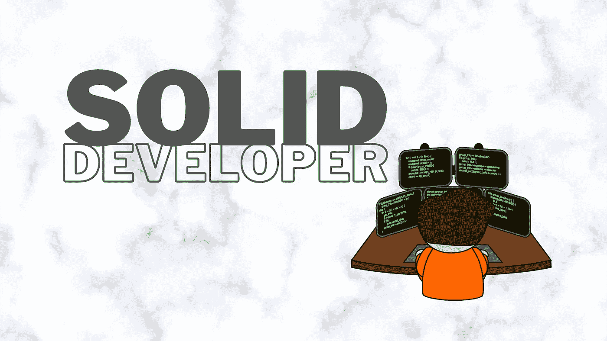

# 你是一个可靠的开发者吗？

> 原文：<https://medium.com/nerd-for-tech/are-you-a-solid-developer-e230f5f58368?source=collection_archive---------1----------------------->

## 用 5 个原则打造一个开发者

好的软件通常被描述为遵循**坚实的**原则，这些原则是:

*   **单一责任**
*   **打开/关闭**
*   里斯科夫
*   **界面偏析**
*   **依赖倒置**