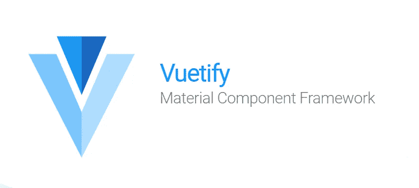
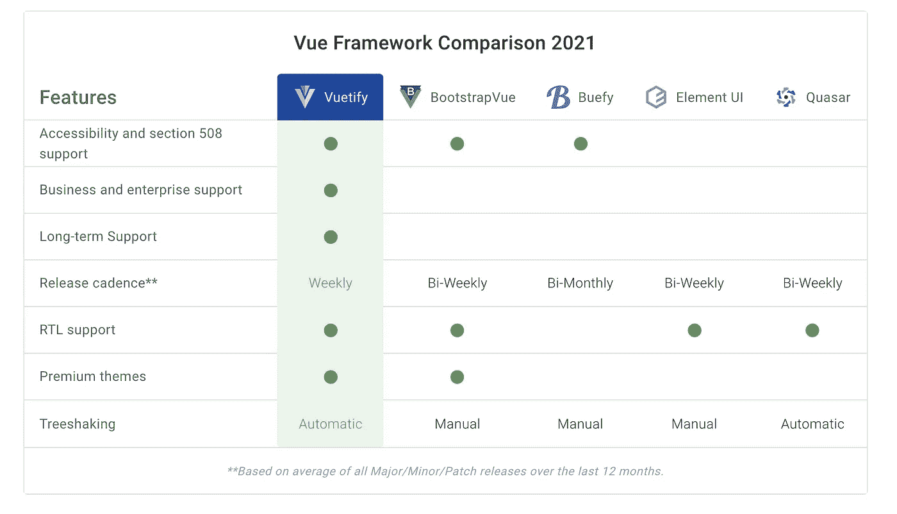

# 你在找一个 Vue 吗？Js UI 框架？

> 原文：<https://medium.com/nerd-for-tech/are-you-looking-for-a-vue-js-ui-framework-c1ee9b2d8d90?source=collection_archive---------6----------------------->



我开始学习 Vue。Js 最近。一旦我熟悉了 Vue，我就需要一个 UI 框架来构建一些 UI。如果你也像我一样缺乏一些设计技巧，但仍然想创建漂亮的 ui。Vuetify 是给你的。

## 什么是 Vuetify？

> Vuetify 是一个 Vue UI 库，拥有精美的手工材质组件。不需要设计技巧。创建令人惊叹的应用程序所需的一切触手可及。

Vuetify 采用移动优先的设计方法，这意味着您的应用程序可以开箱即用，无论是在手机、平板电脑还是台式机上。

## 为什么是 Veutify？

总结这一点的最好方法是将 Vuetify 与其他框架进行比较。下面列出了一些顶级的 Vue.js 框架和特性，我们认为这些特性在选择 UI 库时对单个开发者和企业非常重要。



资料来源:Veutify

## 成分

Vue 为您提供了各种各样的组件，包括不同类型的拾取器、传送带、覆盖等等。您可以访问 Vuetify 来查看组件。

## 应用程序接口

Veutify API 允许你根据自己的需要定制组件的道具、风格和方法。

## 装置

有多种方法可以为您的 Vue 项目安装 Vuetify。我推荐你使用 [Vue CLI](https://cli.vuejs.org/) 。Vue CLI 让一切变得简单。您也可以使用 Vue UI。

```
vue add vuetify
```

如果你正在寻找一个 Vue UI 框架，你可以考虑在你的项目中使用它。因为这是对 Vuetify 的简要介绍，所以你可以参考文档来了解更多关于 vue tify 的细节。

说完，我们来到了文章的结尾。别忘了看看我的其他文章。下次再见了。在那之前保持安全！✌️

# 参考资料:

[1].Veutify。[2021]文档[在线]。可在:【https://vuetifyjs.com/en/ 【2021 年 9 月 30 日获取】