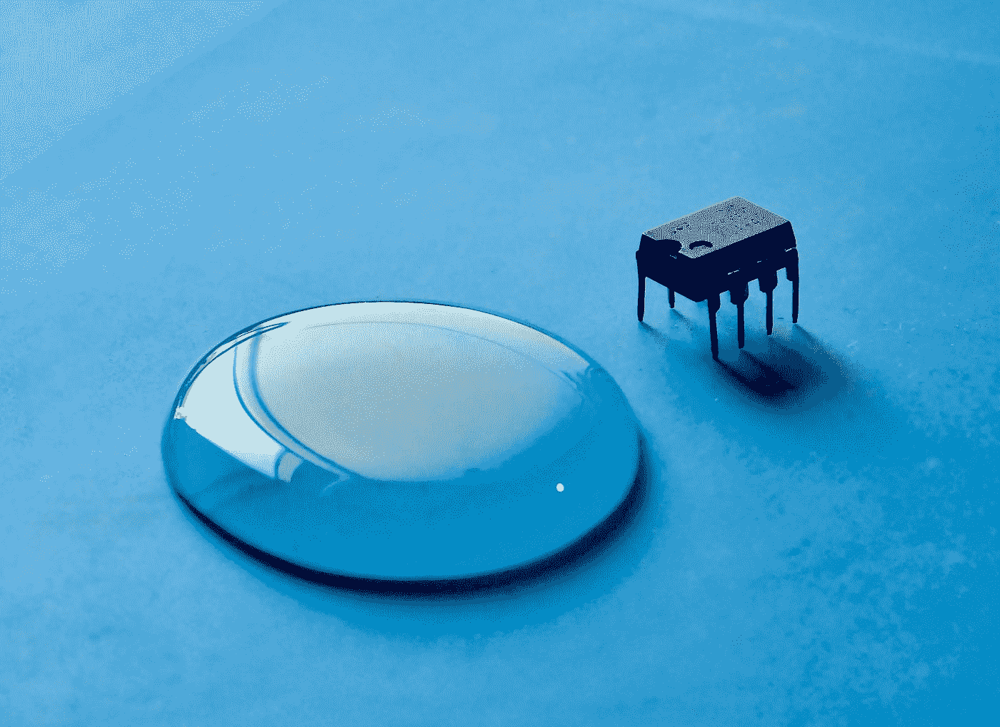

# 你在为基于超大规模集成电路的行业做准备吗？

> 原文：<https://medium.com/nerd-for-tech/are-you-preparing-for-a-vlsi-based-industry-9df8e11de39d?source=collection_archive---------14----------------------->

Brian Kostiuk 在 [Unsplash](https://unsplash.com?utm_source=medium&utm_medium=referral) 上拍摄的照片

*大家好，*

今天我要谈的是，一个希望在超大规模集成电路行业发展的人如何规划他们的准备之旅。

首先，我们必须清楚什么是基于超大规模集成电路的产业，它与其他软件产业有何不同。超大规模集成电路行业是全球电子毕业生的首选，而受过广泛教育(或没有正规教育)的人可以成为软件工程师。
超大规模集成电路行业需要对电子学和相关概念有深入了解的专业人士。

*超大规模集成电路是一个广泛的技术领域，公司招聘的工作有几个子类，大致可以分为三类*

***1)前端设计*** *(RTL 设计、微架构、功能验证、综合等)*

***2)*******后端设计*** *(布图规划、布局布线、时序和时钟树综合等)以及**

****3)芯片验证和测试*** *(实验室芯片测试的软硬件框架和测试生成)**

**

*[毗湿奴莫哈南](https://unsplash.com/@vishnumaiea?utm_source=medium&utm_medium=referral)在 [Unsplash](https://unsplash.com?utm_source=medium&utm_medium=referral) 上的照片*

****很多面试题目——无论是笔试还是面试——都很常见，而且是针对入门级工程师的，需要准备超大规模集成电路技术的基础知识。这些一般可以包括以下主题:****

*此外，如果候选人在某个特定领域有经验，那么面试过程将会更深入地关注他特定的专业领域。*

****数字电子/数字逻辑/计算机架构:*** *这是任何 VLSI 面试中非常重要的一部分，可以包括与组合/时序电路、使用门的逻辑设计、状态机等相关的问题。**

****编程基础知识/HDL:*** *对于一份前端设计或验证工作来说，软件技能越来越像硬件技能一样重要。可能存在与基本编程概念和硬件描述语言相关的问题，如 Verilog、SystemVerilog、C 和面向对象编程概念。根据经验和前端工作的不同，难度也不同，从基本概念到编程问题或设计实现、验证方法和脚本语言(如 Perl/Python 等)都不同。**

****MOS 晶体管/电路/时钟树:*** *对于后端设计工作来说，了解 MOS 晶体管理论、工艺技术、串扰和传输线效应、时钟树、电源分配机制、时序分析、缓冲器建模等非常重要。**

****逻辑推理/能力倾向*** *:解题技巧测试。有时能力倾向和程序设计问题结合在一起，要求考生用程序解决能力倾向问题。**

****行为:*** *除了拥有强大的技术技能，行为技能是任何公司工作文化的重要组成部分，因此这也需要一些基本的准备。像你的兴趣和激情、强项和弱项、短期和长期职业目标、你在团队中工作和处理冲突的能力等问题是这一轮的评判标准。**

**

*[Floriane Vita](https://unsplash.com/@flo_?utm_source=medium&utm_medium=referral) 在 [Unsplash](https://unsplash.com?utm_source=medium&utm_medium=referral) 上拍摄的照片*

*下面列出了一些你可以申请的基于超大规模集成电路的行业:*

1.  **英特尔**
2.  **英伟达**
3.  **高通**
4.  **博通**
5.  **三星**
6.  **德州仪器(TI)**
7.  **AMD**
8.  **手臂**
9.  **模拟设备公司**
10.  **ST 微电子**
11.  **联发科**
12.  **恩智浦半导体**

****一些与 VLSI 相关的 EDA 公司——工具以及 IP 设计****

1.  **节奏**
2.  **导师图形**
3.  **Synopsys**

****准备时可以参考的资源:-****

> *1.数字电子:-莫里斯·马诺，盖茨数字图书*
> 
> *2.VHDl/Verilog:-萨默·普莱尼克，像 Chipverify.com，Asicworld.com 这样的网站。
> 3。系统 Verilog:- [斯图尔特·萨瑟兰](https://www.researchgate.net/scientific-contributions/Stuart-Sutherland-18121468)，网站如 Verification.guide*
> 
> *4.CMOS 与电路:- Puknell，Tutorialpoints 等网站。*
> 
> *5.静态时间分析:- J bhaskar，Vlsiexpert.com，vlsiresources.com 之类的网站*

**在我的下一篇文章中，我将分享在为这些行业制作简历时的建议、注意事项和禁忌。
希望这篇文章对你有所帮助。请关注我，这是一个与不同技术相关的有趣帖子。**

**感谢阅读。**