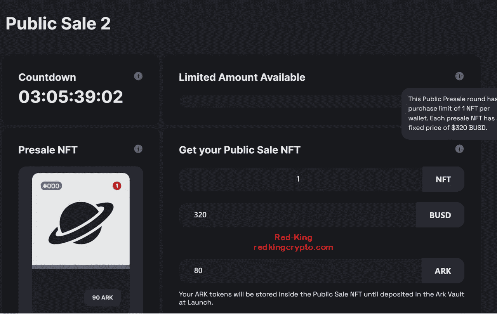
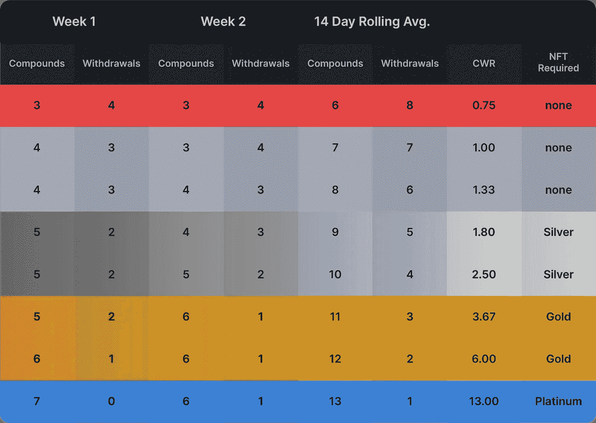
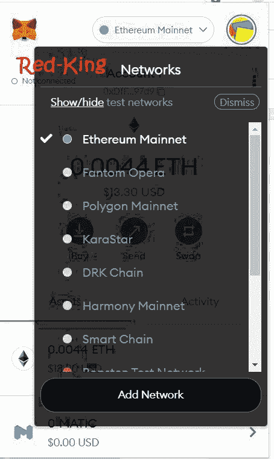

# 方舟:Furio 和滴滴最好的部分。还有更多。

> 原文：<https://medium.com/nerd-for-tech/ark-the-best-parts-of-furio-and-drip-and-more-f62930360687?source=collection_archive---------0----------------------->

## 开始以每天 2%的速度赚钱。

对我来说，Furio 和滴滴都是不错的投资；我过去写过关于他们的文章。

 [## 我投资了 294 美元，现在价值 3954 美元

### 短短 52 天疯狂增长 1250%！

medium.com](/@Red-King/i-invested-294-now-worth-3954-b4f8df929211) 

我最近在浮利欧投资，现在已经开始获利。我还开始了第二个钱包，并很快实现了 2.5%的日复利，所以现在金库增长很快。我也一直在给我的浮利欧团队空投物资。

# 方舟:它是如何工作的？

Ark 是这个“Drip/Furio”模具中的最新平台，它的工作方式与它们非常相似。从绝对的基础上来说，这是一个投资回报率的 dapp，但它有巨大的潜力。

私人销售已经结束，但几天后(11 月 18 日)将进行公开预售。

首先你[到这里的网站](https://app.arkfi.io?ref=0xcf900b03d697149feaa0d02ee5e49cdd5643574f)，你需要输入一个推荐地址(如果你需要，你可以用我的:0 xcf 900 b 03d 697149 feaa 0d 02 ee 5 e 49 cdd 5643574 f)

然后你购买你的$方舟代币(你需要在你的钱包里放 BUSD 或 BNB 来交换方舟)。**在他们的 dapp 中进行互换**是零税收的。

一旦您进行了交换，您的$ARK 将自动存入您的 Ark Vault 帐户。

和前面提到的平台一样，你存入的$ARK 代币是不能提现的。您只能提取以每天 2%的初始利率获得的可申请奖励。

方舟金库是一个“先支付自己”的平台。当奖励可用时，点击“提取”按钮，它们将被转移到您的钱包。

复合可用奖励，以增加您的本金余额和最高支出。你复合的越多，你的奖励就越大，直到你达到 80，000 $ARK 的最高支付额。

# 滴滴和 Furio 有什么不同？

最大的区别在于提取和复利(或者他们所说的“**分配控制”**)

**分配控制—** 当点击一个动作按钮(如撤回、复合、发送空投)时，**用户可以为该动作分配一定数量的可用令牌。**

**这样你就不必宣称或复合所有可用的东西。**

例如，用户选择他们想要提取的 50%的可用奖励，并点击“提取”按钮。

然后，用户可以选择手动输入金额或点击“最大”，然后点击“取款”

这使得投资者可以做出决定，并完全控制他们可获得的奖励的去向。

因此，当你有一些奖励时，你可以选择要求一些，然后补偿其余的。

# 他们的策略简单来说

*“方舟 dApp 是基于币安智能链打造的日被动收益高达 2%的平台。通过将$ ARK tokens 存入 dApp 合约，您将立即开始每天从本金余额中获得 2%的收益，最高可达 300%。通过复合每日奖励和新存款，将您的最高支付额增加到 80，000 $方舟代币。*

*经常从方舟金库中获利，将 BUSD 存入方舟基金会以赚取可变收益，或者购买传统的非定期基金来加速你的投资增长。”*

# 重要统计数据

*   你最多只能合成 80，000 个方舟代币。
*   任何时候最多可存入 4000 个方舟代币。
*   你每天最多可以卖出 200 个方舟代币。
*   对 dapp 内部的互换不征税。
*   你最初开始每天赚 2%，这个数字会随着你采取的行动而减少(见下面的“奖励控制”)。
*   存款、取款、空投都要交 10%的税费。
*   你的红利在 24 小时后停止累积(如 Furio ),所以在那个阶段(或之前),你需要申请或复利。

# 奖励控制

每日奖励排放率可以根据投资者行为降低。

## 存款净值(NDV)

要从您的本金余额中获得 2%的每日奖励，帐户必须有正的净存款值(NDV)。

**NDV =(税后存款+直接/间接引荐奖励)-税后提款**

*   如果结果是肯定的，你将每天收到 2%。
*   如果结果是否定的，你将每天收到 1%。
*   化合物和空投被认为是中性行为，不会影响 NDV 计算。

# 物价稳定

***复合:撤比***

为了稳定方舟金库和代币价格，鼓励用户以平衡的方式复利和提现。通过设定复利和提款限额来阻止过度行为。这有助于在接近最高派息时减轻卖出压力。

**税前计算:**

*   复合金额/总可用金额= %复合金额
*   撤回或空投的数量/可用总量= %撤回
*   %复合 x 经过的时间(秒)=复合时间(秒)
*   撤回百分比 x 经过时间(秒)=撤回时间(秒)

**CWR =复合时间(秒)/提取时间(秒)**

*   采取行动时，从 24 小时奖励计时器中获取经过的时间。
*   如果采取了行动(复合/撤回/空投),奖励将停止，并以秒为单位记录经过的时间。
*   24 小时计时器将不会重新启动，直到 100%的可用奖励已被分配(可用奖励= 0)。
*   CWR 是在 14 天的滚动平均值(1，209，600 秒)上采取复合或提取操作后，通过将复合秒数除以该时间内提取的秒数来计算的。
*   对于新账户，CWR 从首次存款后的 1.0 开始:
*   1.0 的 CWR = 7 天的化合物/7 天的提取
*   1.0 的 CWR = 604，800 秒的化合物/604，800 秒的提取

# CWR 限值

*   **CWR 下限= 0.75**
*   如果你的 CWR 低于 0.75(下限)，你的每日奖励将下降到 0.5%，并永久保持在那里，不能恢复。
*   **CWR 上限= 1.5**
*   除非你持有 NFT，否则你的 CWR 不能超过 1.5(上限)。如果超过上限，化合物将被暂停，直到撤出或空投执行。

# 方舟基金会

方舟基金会是方舟保险库的一个独立选项，在这里**你可以通过存入 BUSD 或$方舟赚取可变收益。**

方舟基金会建立了一个深度流动性池，以支持互换功能，稳定$方舟代币价格，并提供一个稳定的方式来赚取被动收入，同时为方舟提供流动性。只有拥有方舟保险库账户的钱包才能加入方舟基金会。

# —债券投资

流动性赌注，即 BUSD 或$ARK 被存入并自动交换和配对以创建债券，即 50/50 的 BUSD/$ARK 流动性对。所有存款都会自动下注。

## 赚取可变的每日收益

基于方舟基金会征收的税收的一部分，股份债券将获得可变收益，税收在 BUSD 支付。

您的池所有权百分比也根据池中下注的债券总额而波动。

可用奖励根据您的池所有权百分比从税收中支付，可以提取到您的钱包中(10%的税收)或复利(零税收)回到您的债券股份中。

债券可以随时出售(无锁定，需缴纳 10%的提取税)，并在 BUSD 支付。

***记住只使用风险资本****——你“能承受”损失的钱。换句话说，如果项目失败，你失去了投资，可能会有点痛，但不会让你破产，也不会让你承受严重的财务压力。做你的研究，享受赚钱的乐趣。*

*   *我最近最好的三笔投资分别是*[***Furio***](https://redkingcrypto.com/furio)[***财富山***](https://redkingcrypto.com/wealthmtn) ***和 t*** [***他在动物庄园里存钱罐***](https://redkingcrypto.com/animalfarm) ***。***
*   你可以 [**在这里**](https://t.me/redkingcrypto) 加入我的电报群，在 [**Twitter 这里**](https://twitter.com/RedKingDefi) 和我全新的 [**YouTube 这里**](https://www.youtube.com/channel/UCtJMEcrr-PKYy6h_LgxSAtg) 和我联系。
*   你可以在这里看到我所有的文章。
*   我不是财务顾问。这不是一个财务建议，无论你在我的文章中读到什么，都完全是出于教育目的。
*   这些 defi 项目都是高风险高回报，只用风险资本，小心谨慎。
*   这篇文章包含附属链接。
*   大多数这些赌注 dApps 使用锁定赌注，这意味着你不能拿出你的原始投资。

# 觉得这有帮助吗？

我希望这篇文章对你有所帮助。如果你喜欢这个故事，请给它一些掌声(最多 50 个)并在下面留下评论！这对我真的很有帮助。

**我的文章没有通过媒介获得报酬。**

[如果您想了解更多关于**加密货币、被动收入、玩赚取游戏和产量农业的信息，请关注我的**媒体****](/@Red-King) 。

# 没有元掩码？下面是如何设置它

你要做的第一件事是建立一个元掩码钱包(如果你还没有这样做)。只需打开 Chrome 或 Brave 浏览器，进入 *metamask.io* ，点击*添加 Chrome 扩展*。

然后，您需要将币安智能链添加到您的 Metamask 钱包中。

点击钱包里的*以太坊*，然后向下滚动到*添加网络*。

单击该按钮，并添加以下详细信息:

网络名称:智能链

新的 RPC 网址:[https://bsc-dataseed.binance.org/](https://bsc-dataseed.binance.org/)

ChainID: 56

象征:BNB

阻止浏览器网址:[https://bscscan.com](https://bscscan.com/)

**免责声明:** *这不是财务建议，本文中的信息仅用于教育目的。永远不要投资你输不起的东西。我否认任何根据我文章中讨论的信息、想法或策略行事的人所承担的任何责任或损失。自己做研究。*