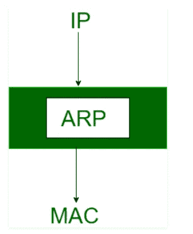
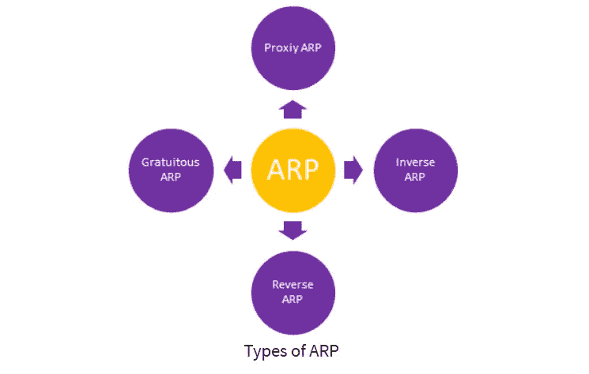
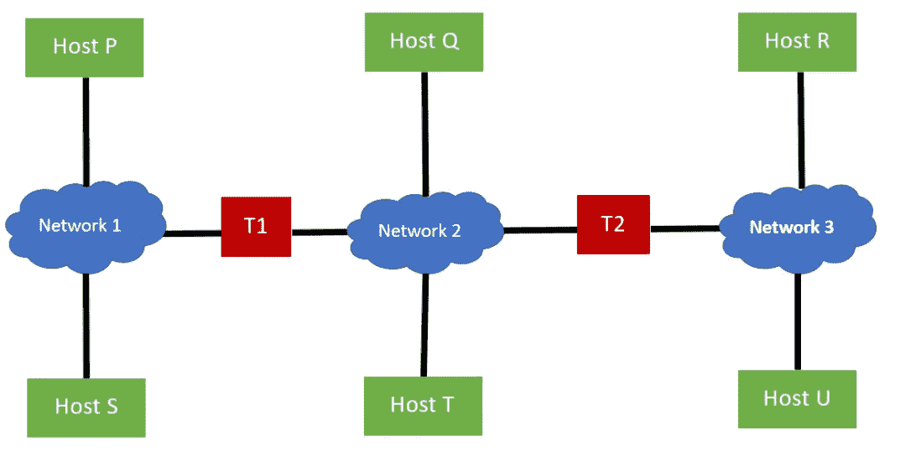
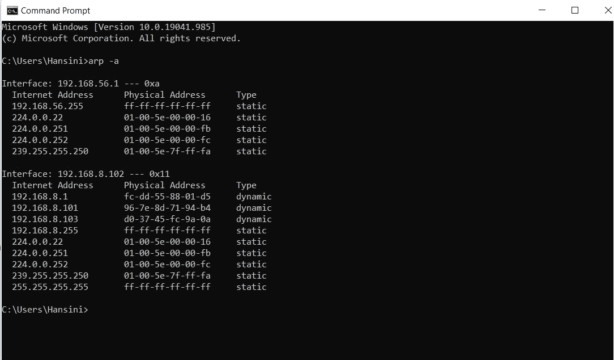
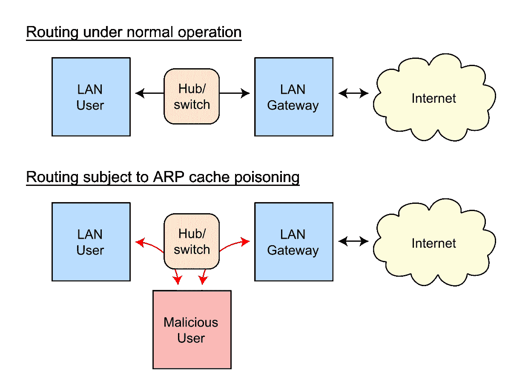
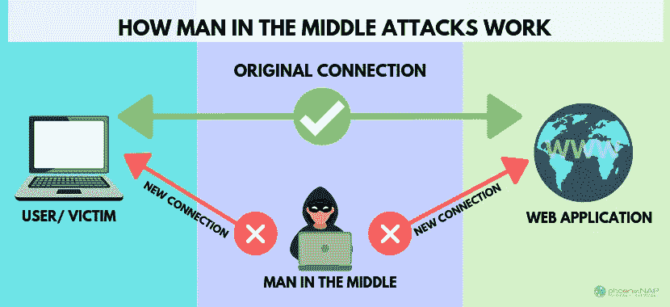
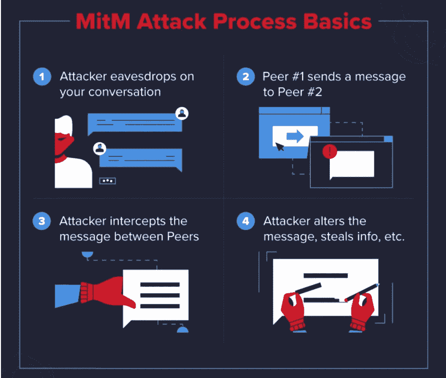

# ARP 中毒和 MITM 攻击

> 原文：<https://medium.com/nerd-for-tech/arp-poisoning-mitm-attacks-19d2648986bf?source=collection_archive---------12----------------------->


# 什么是 ARP？

代表地址解析协议(无状态)的✽ ARP 被认为是第一个网络级协议，有助于通过系统的已知 IP 地址找到 MAC(媒体访问控制)地址/硬件地址。



arp 的主要任务是将 32 位 IP 地址(用于 IPv4)转换为 48 位 MAC 地址。

✽:ARP 有很多种。

1.  代理 ARP
2.  无偿 ARP
3.  反向地址解析协议
4.  逆向 ARP (IARP)



# ARP 是如何工作的？

✽当一台新计算机加入局域网时，它会被分配一个唯一的 IP 地址。这样做是为了识别和通信的目的。

✽在 IPV4 以太网中，每个操作系统都有一个 ARP 缓存。

✽每当一台主机请求一个 MAC 地址以便向连接到局域网的另一台主机发送数据包时，它都会检查其 ARP 缓存，以验证 IP 到 MAC 地址的转换是否已经完成。

✽如果新的请求已经存在，则不需要新的请求。但是如果转换过程尚未完成，ARP 将执行并发送网络地址请求。



🔎要查看当前的 **ARP** 缓存，可以使用以下命令。

```
**arp -a**
```



🔹该 ARP 表显示了您通过网络与之通信的所有设备。

# 什么是 ARP 中毒？

✽ ARP 中毒是一种网络攻击，当攻击者通过局域网发送恶意 ARP 数据包，意图破坏网络上其他设备的 MAC-IP 配对并劫持网络流量时，就会发生这种攻击。

✽如果 ARP 中毒完成，攻击者将能够；

☠️接收发送到合法 MAC 地址的消息。

☠️拦截，篡改和窃取数据。

☠️用伪造和不准确的条目填充 ARP 缓存。

☠️阻塞所需设备之间的通信。

☠️执行会话劫持。

✽ ARP 中毒还会在局域网上造成拒绝服务情况，此时系统会因流量过大而不堪重负，用户将无法访问系统。

# 攻击者如何进行 ARP 中毒？



参赛:https://images.app.goo.gl/5e92DTsnCSs7m6P37

✽虽然不同的攻击者可能会使用不同的技术来进行 ARP 中毒，下面提到的是 ARP 中毒过程中通常要做的 3 个步骤。

1.  攻击者选择一台或多台受害设备
2.  攻击者煽动工具并开始攻击
3.  攻击者使用伪造的流量执行某些操作

# 如何防范 ARP 攻击？

**🔰使用虚拟专用网**

VPN 对通过隧道在客户端和服务器之间传输的所有数据进行加密。这保证了数据的安全，因为攻击者看不到密文。

**🔰使用包过滤**

数据包过滤器可以过滤、识别中毒的 ARP 数据包，并阻止包含冲突源地址的数据包。

**🔰网络隔离**

ARP 消息不能超出本地子网。ARP 中毒攻击的影响可以通过划分良好的网络来降低，这样一个子网中发生的攻击就不会影响另一个子网中的机器。

**🔰使用加密网络协议**

使用传输层安全(TLS)、HTTP 安全(HTTPS)、安全外壳(SSH)等协议。可以加密数据并减轻 ARP 中毒造成的潜在损害。

**🔰使用 ARP 欺骗检测软件**

检测 ARP 中毒攻击的软件和工具有很多种。下面提到的是其中的一些。

📌Wireshark

📌ARP 防护

📌Arpwatch

📌XArp

**🔰使用静态 ARP**

用户可以为每个 IP 地址定义一个静态 ARP 条目，并阻止设备侦听 ARP 为该特定地址提供的响应。

**🔰物理安全**

由于 ARP 消息只能在局域网内传播，攻击者应该在附近发动这种 ARP 中毒攻击。因此，应该准确控制对设备和网络的访问，以减少 ARP 中毒攻击。

# 中间人(MITM)攻击



参考:https://images.app.goo.gl/cXBjNxNnbbbkV7hi7

✽中间人攻击也称为 MITM 攻击，是一种网络攻击，攻击者通过发起连接来冒充用户，同时拦截和修改双方之间的重要数据，以达到窃取的目的。

✽攻击者将自己置于通信过程的中间，窃听并假装成双方，截取他们的有价值的信息，如个人信息、用户凭证、财务信息。

✽:除此之外，攻击者通过 URL 等各种方式分发难以检测的恶意软件，以控制受害者的网络浏览器。攻击者在网站和受害者之间创建一个代理，并收集敏感信息。

✽:此外，他们使用一些先进的软件，能够模仿文本和语音记录的对话模式。



参赛作品:[https://www.varonis.com/blog/man-in-the-middle-attack/](https://www.varonis.com/blog/man-in-the-middle-attack/)

# MITM 攻击技术

1.  **ARP 缓存中毒**

攻击者通过向系统中注入虚假信息来获取用户的数据包，该系统对用户伪装成真实的网关。一旦用户连接到该特定网络，攻击者就获得网络流量并将其传递到真正的目的地，但是您的数据包会暴露给攻击者。

**2。DNS 缓存中毒**

在 DNS 缓存中毒中，攻击者提供了一个伪装的 DNS 条目，该条目会在捕获用户数据的同时将用户引导至一个完全不同的网站。

**3。HTTPS 恶搞**

HTTPS 代表超文本传输协议安全，被认为是确保数据安全的最安全的方式之一。但是，攻击者创建的 HTTPS 域名看起来几乎与选择的域名相同。这也被称为“同形异义攻击”。

**4。Wi-fi 窃听**

对手监视公共或不安全的 Wi-Fi 网络，以窃取通过该网络发送的敏感信息。他们不断监听不安全的 wi-fi 的流量，或者以一种人们陷入其中的方式创建 wi-fi 网络名称，以便他们可以接管它们。

**5。会话劫持**

当对手窃取用户的会话 ID，获取用户的 web 会话并冒充该用户时，就会发生这种情况。对手能够在该网络上使用窃取的会话 ID 进行授权给特定用户的任何活动。

# 如何检测 MITM 攻击？

✽用户可以做几件事来检测中间人攻击。以下是其中的一些。

专心于；

**🔎意外或连续断开**

攻击者故意这样做，以便在用户重新登录系统时收集他们的用户名和密码。

**🔎连接到不安全的无线网络**

如果你加入了他们的 Wi-fi 网络，攻击者就可以监视你通过互联网发送的任何东西。

**🔎浏览器地址栏中的陌生地址**

如果地址稍有变化，请重新检查，因为这可能是 DNS 劫持。

**🔎未知位置的网络连接**

# 如何防止 MITM 袭击？

**🔰**仅连接到可信且安全的 Wi-fi 网络

**🔰**连接到 HTTPS 连接

**🔰**定期监控你的网络活动

**🔰**使用密码管理器

**🔰**使用多因素认证

**🔰**保持系统和恶意软件的更新

**🔰遵循零信任原则**

**🔰发送敏感数据时使用 VPN**

**🔰**在 HTTPS 部署 DNS

**🔰**使用端到端加密

# 参考

[](https://www.geeksforgeeks.org/how-address-resolution-protocol-arp-works/) [## 地址解析协议(ARP)是如何工作的？- GeeksforGeeks

### 大多数计算机程序/应用程序使用逻辑地址(IP 地址)来发送/接收消息，然而…

www.geeksforgeeks.org](https://www.geeksforgeeks.org/how-address-resolution-protocol-arp-works/) [](https://www.guru99.com/address-resolution-protocol.html) [## 地址解析协议(ARP)

### 地址解析协议(ARP)是 OSI 模型中网络层的一个重要协议，它有助于发现问题的根源

www.guru99.com](https://www.guru99.com/address-resolution-protocol.html) [](https://www.varonis.com/blog/arp-poisoning/) [## ARP 中毒:它是什么&如何防止 ARP 欺骗攻击

### ARP 中毒是一种网络攻击，它滥用广泛使用的地址解析协议(ARP)中的弱点来…

www.varonis.com](https://www.varonis.com/blog/arp-poisoning/) [](https://www.varonis.com/blog/man-in-the-middle-attack/) [## 什么是中间人攻击:检测和防范技巧| Varonis

### 中间人(MitM)攻击是一种网络攻击形式，攻击者使用…

www.varonis.com](https://www.varonis.com/blog/man-in-the-middle-attack/)