# 数组方法第一部分

> 原文：<https://medium.com/nerd-for-tech/array-methods-part-i-cd08c552356a?source=collection_archive---------21----------------------->

## JavaScript 能为您和您的阵列做些什么？

答案其实相当多。JavaScript 有 30 多个内置的数组方法，这让我们作为开发人员的生活变得更加轻松。几乎所有这些内置方法都可以帮助我们节省时间，不仅使数组更容易导航，而且通过简单地使用这些方法来实现我们的目标。假设有这样一个内置的方法可以做到这一点，否则你可能需要做一些额外的工作，但这就是我们努力的方向。解决方案。

如果您是阵列的新手，我建议您在继续之前先看一下本文[,让自己完全熟悉和适应。如果你已经准备好开始，这第一部分我们将会看一些数组方法，这些方法已经被证明对我很有用。然后，在第二部分，我们将触及过滤器的必要性，对于每一个，地图，并减少，因为没有开发人员应该没有这些。但是我们不要想得太多。](https://real-kevbot.medium.com/intro-to-arrays-a6627d656c59)

## 有用的方法

如上所述，在这一节中，我将回顾一些我个人认为在处理数组时特别有用的方法。这不是一个广泛的列表，因为还有很多，我恳求你在准备好的时候去探索。

**Concat()**

这种方法使我们能够将多个数组连接成一个数组。举个例子，我们班有一系列现在的学生。我们还有另外两个数组，一个保存即将进入班级的新生，两个保存即将加入班级的海外留学生。看看下面的例子，有助于更好地理解 concat 是如何工作的。

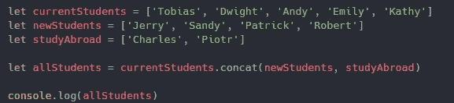

返回

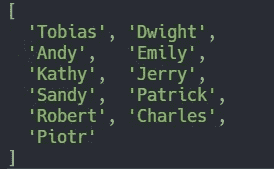

**找到()**

我们可以用这个方法，你猜对了，找到我们要找的值。重要的是要注意，它只会“找到”通过我们测试的第一个元素，如果您希望返回多个值，恐怕这一个就不太好了。举个例子，我们有一个数组，包含了我们富有的朋友拥有的汽车。在这种情况下，我们可以使用我们的 find 方法来找到我们的周日和赛道日赛车应该基于它们是什么。看看下面的例子，有助于更好地理解 find 是如何工作的。

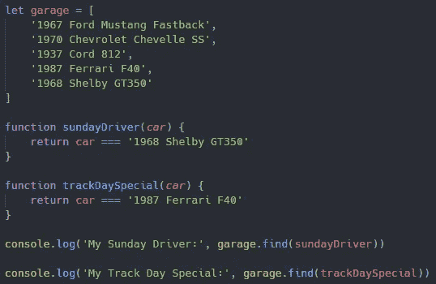

返回

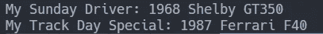

**包括()**

我认为这个方法有点类似于 find，它将遍历我们的数组，并根据我们的搜索参数返回 true 或 false。举个例子，我们有一个数组，其中包含了制作美味水果拼盘所需的水果。购物的时候或者有人问的时候，我们可以简单地用 include 看看它是不是我们菜肴的一部分。看看下面的例子，有助于更好地理解 includes 是如何工作的。

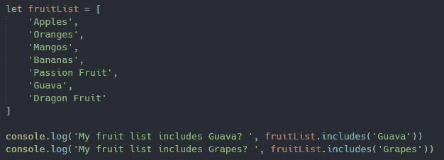

返回

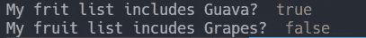

**Pop()**

我们可以用这个方法移除数组的最后一项。值得注意的是，这将改变或“变异”正在使用它的阵列。举个例子，田纳西淘汰赛正在进行，我们只剩下前 5 名耐力赛选手。这些位置似乎是固定的，所以我们的阵列在每次弹出或击倒后都保持不变。看看下面的例子，有助于更好地理解 pop 是如何工作的。我还包含了 racers 数组的控制台日志，以便让您更好地了解它是如何改变原始数组的。

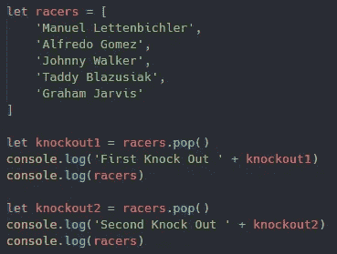

返回

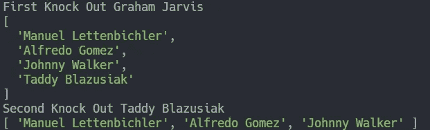

**Push()**

另一方面，这个方法允许我们在现有数组的末尾添加新元素。需要注意的是，您返回的将是数字形式的数组长度，而不是添加了项的原始数组。要做到这一点，你会看到，将返回原来的数组后，已经'推'你的新元素。举个例子，你制作了一个电子购物清单，上面列有你想要购买的物品。在你走之前，你要让你的另一半知道，并要求他们把他们需要的东西添加到清单上。这些项目可以被“推”到已经定义的列表上，以形成一个完整的列表。看看下面的例子，有助于更好地理解推送是如何工作的。

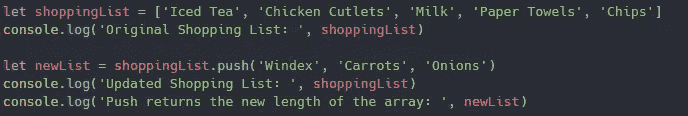

返回

**Shift()**

这个方法实际上与 pop 正好相反，用于移除数组中的第一项。同样，像 pop 一样，这个数组方法改变了原始数组，这就是为什么我们在每次运行 shift 方法后都要返回原始数组。举个例子，你的任务是调查美国最畅销的 5 辆车，却震惊地发现没有一辆是汽车！我们可以使用我们的 shift 方法来获得第一、第二和第三名，但是需要确保我们的返回，或者在这种情况下，我们的控制台日志在正确的位置，以获得期望的结果。看看下面的例子，更好地理解 shift 是如何工作的。

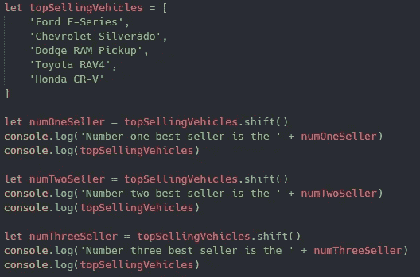

返回

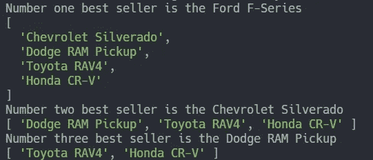

**切()**

我们可以用这个方法来选择数组中我们想要的部分，并用它们来创建一个新的数组。唯一需要的参数是“切片”应该发生的位置，但可以伴随第二个参数，该参数应该结束。例如，我们有一个很大的骑手列表，我们需要根据他们的技能水平对他们进行分类。专家级骑手或中级骑手。看看下面的例子，更好地理解 slice 是如何工作的。

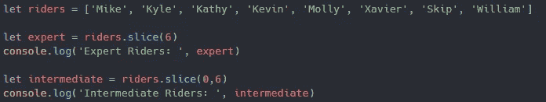

返回

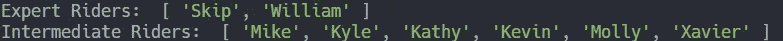

**拼接()**

这个方法只允许我们在数组中添加或删除元素。这个方法也接受三个参数。第一个是我们希望在数组中插入的元素的位置，第二个是我们希望移除的元素的数量，最后是我们希望在数组中添加什么。举个例子，我们给幼儿园的孩子们布置了家庭作业。他们得到了字母表的一部分，但三个字母碰巧不见了。他们将需要知道它的空间，我们将为他们自己放入索引，0。如果他们增加了额外的字母，那么答案是否定的，所以零会在那里。最后，需要添加什么字母，F、G 和 h。看看下面的例子，有助于更好地理解拼接是如何工作的。

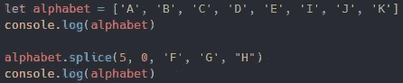

返回

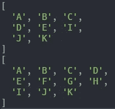

我要感谢你的阅读，并希望你学到了新的东西！在这里查看第二部分！

请关注未来的更多文章！

如果你想查看这些例子的副本，或者只是作为参考，你可以在这里找到 GitHub 回购[的链接。](https://github.com/TheRealKevBot/JSArrayMethods)