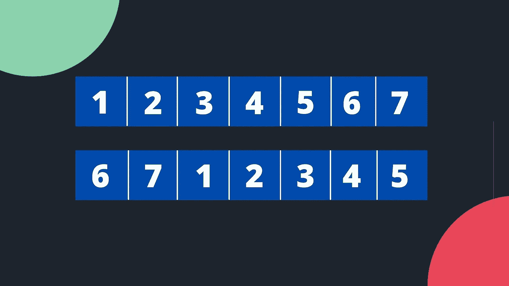
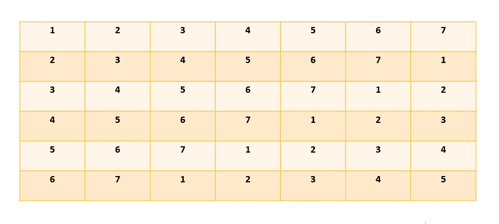
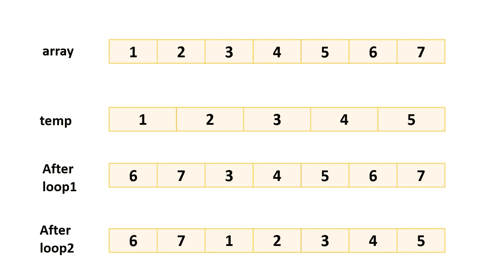
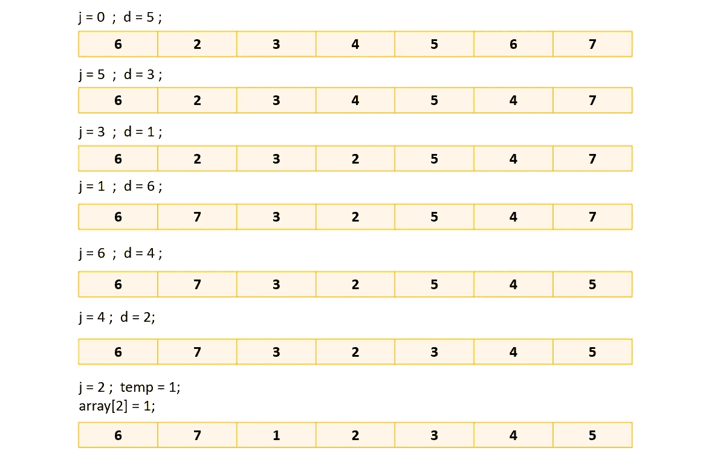
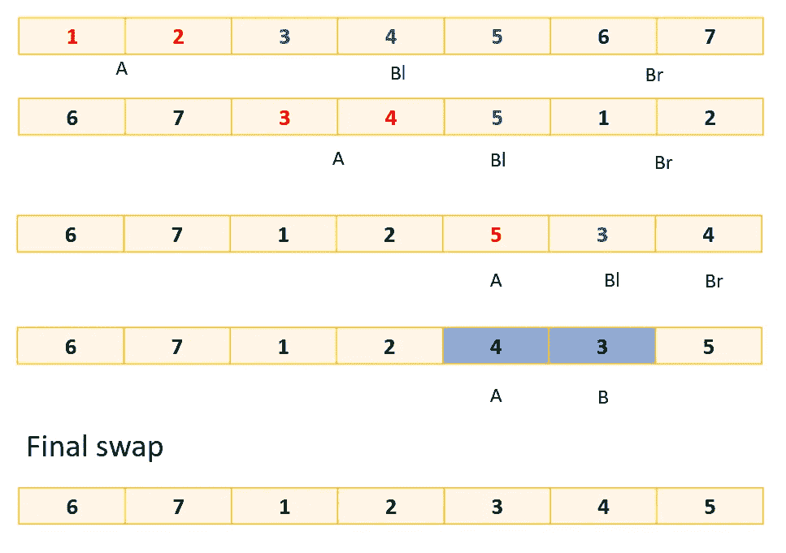
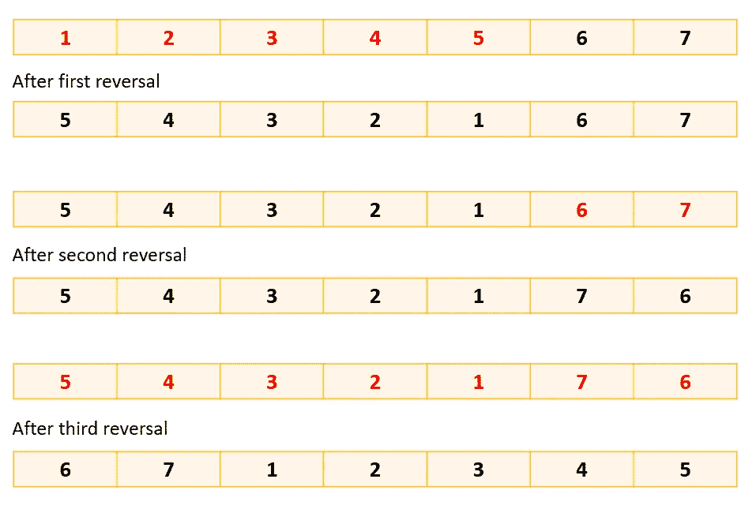

# 阵列旋转

> 原文：<https://medium.com/nerd-for-tech/array-rotation-73021cd851dd?source=collection_archive---------2----------------------->



阵列旋转

> **问题:** *给定一个数组，将数组向左旋转 k 步，其中 k 为非负。*

今天，我们要解决数组旋转的问题。我们将从简单的解决方案开始，然后转向更优化的解决方案。

**举例:**

对于数组:*【1，2，3，4，5，6，7】*，k = *5* ，旋转后的数组为*【6，7，1，2，3，4，5】。*

**边缘情况:**

(I)如果 k 相等，则不需要旋转阵列。

(ii)如果 k 大于或等于数组的长度，则 k = k % arrayLength。在上面的例子中，如果 k=9，旋转 7 次后，数组的元素回到原来的位置，再旋转 2 次就可以得到答案。所以不把 k 看成 9，我们会把它看成 2。

[***方法 1:***](https://repl.it/@Sapna2001/arrayRotation1)

这是最简单的方法。在这种方法中，我们将逐个旋转阵列。



***时间复杂度:***

o(数组长度* k)

**空间复杂度:**

O(1)

[***方法二:***](https://repl.it/@Sapna2001/arrayRotation2)

在这种方法中，我们将使用一个临时数组来存储 k 个元素的值。



***时间复杂度:***

o(数组长度)

**空间复杂度:**

O(k)

[***方法三:***](https://repl.it/@Sapna2001/arrayRotation3#Main.java)

在这种方法中，我们将使用杂耍算法。在这种方法中，我们将数组分成“m”个集合，其中“m”是“数组长度”和“k”的 gcd。然后我们旋转每个集合的元素。



***时间复杂度:***

o(数组长度)

**空间复杂度:**

O(1)

[***方法 4:***](https://repl.it/@Sapna2001/arrayRotation4)

在这种方法中，我们将使用块交换算法。

步骤:-

1.  创建两个数组 A 和 B，其中 A 从 0 到 k-1，B 从 k 到 n。

2.如果 A 的大小小于 B，则将数组 B 分成两部分 Bl 和 Br，使 Br 的大小等于 A 的大小。然后对 A 和 B2 执行交换操作。因此，该数组成为 BrBlA。

3.如果 B 的大小小于 A，那么将数组 A 分成两部分 a1 和 Ar，使得 a1 的大小等于 B 的大小。然后对 a1 和 B 执行交换操作。因此，数组成为 BArAl。

4.这个过程一直持续到 A 和 B 的大小相同。

5.然后执行最终的交换。



***时间复杂度:***

o(数组长度)

**空间复杂度:**

O(1)

[***方法 5:***](https://repl.it/@Sapna2001/arrayRotation5)

在这种方法中，我们将使用反转算法。

步骤:-

1.  创建两个数组 A 和 B，其中 A 从 0 到 k-1，B 从 k 到 n。
2.  逆转 A
3.  反向 B
4.  反转整个数组



***时间复杂度:***

o(数组长度)

**空间复杂度:**

O(1)

***输出:***

```
Original Array
[1, 2, 3, 4, 5, 6, 7]
Reversed Array
[6, 7, 1, 2, 3, 4, 5]
```

## 代码链接

方法 1-[https://repl.it/@Sapna2001/arrayRotation1](https://repl.it/@Sapna2001/arrayRotation1)

方法 2-[https://repl.it/@Sapna2001/arrayRotation2](https://repl.it/@Sapna2001/arrayRotation2)

方法 3-[https://repl.it/@Sapna2001/arrayRotation3](https://repl.it/@Sapna2001/arrayRotation3#Main.java)

方法 4-[https://repl.it/@Sapna2001/arrayRotation4](https://repl.it/@Sapna2001/arrayRotation4)

方法 5-[https://repl.it/@Sapna2001/arrayRotation](https://repl.it/@Sapna2001/arrayRotation4)5

> 我这边就这样。我希望你喜欢阅读这篇文章😊。

> 如果你想和我联系，请点击以下链接:
> 
> [*LinkedIn*](https://www.linkedin.com/in/sapna2001/)*-*[*https://www.linkedin.com/in/sapna2001/*](https://www.linkedin.com/in/sapna2001/)
> 
> 【https://github.com/Sapna2001*Github**-*[*Github*](https://github.com/Sapna2001)
> 
> [*网站*](https://sapna2001.github.io/Portfolio/)*-*[*https://sapna2001.github.io/Portfolio/*](https://sapna2001.github.io/Portfolio/)
> 
> [*Quora*](https://www.quora.com/profile/Sapna-191)*-*[*https://www.quora.com/profile/Sapna-191*](https://www.quora.com/profile/Sapna-191)
> 
> [*博客*](https://sapna2001.github.io/Portfolio/html/blogs.html)*-[*https://sapna2001.github.io/Portfolio/html/blogs.html*](https://sapna2001.github.io/Portfolio/html/blogs.html)*

*如果你有任何建议，请随时通过[**LinkedIn**](https://www.linkedin.com/in/sapna2001/)**&与我联系，评论区也是你的。***

*如果你喜欢这个故事，请点击拍手按钮，因为它激励我写更多更好的东西。*

****感谢阅读！！！！****