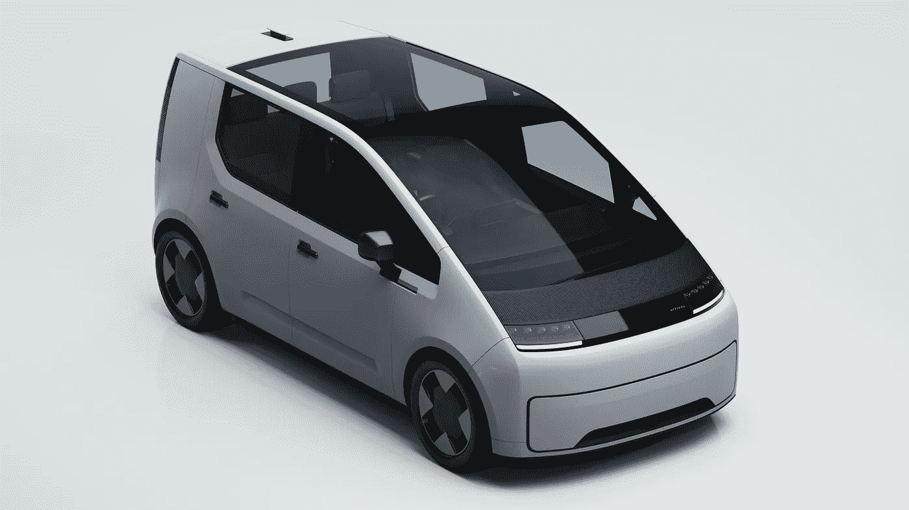
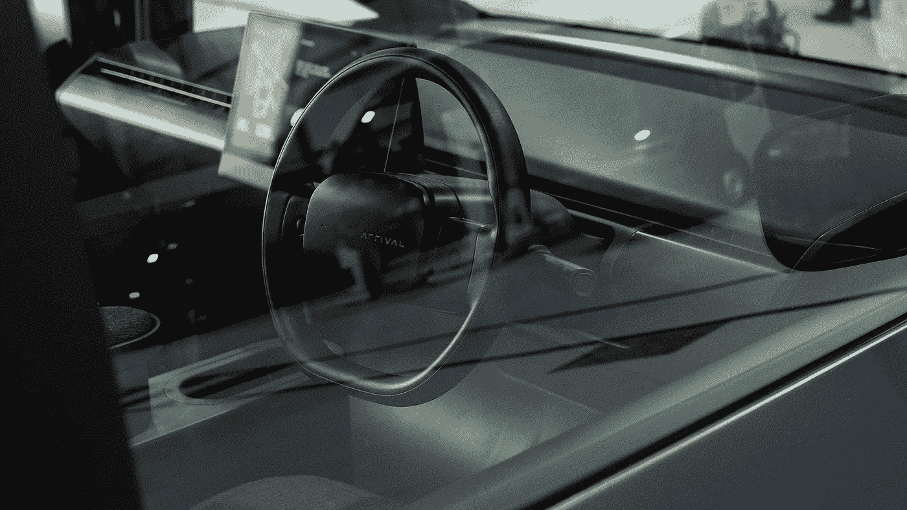
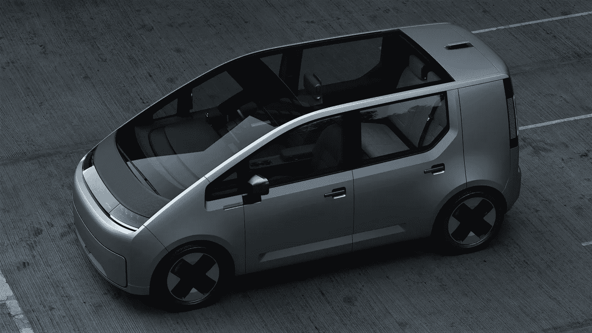
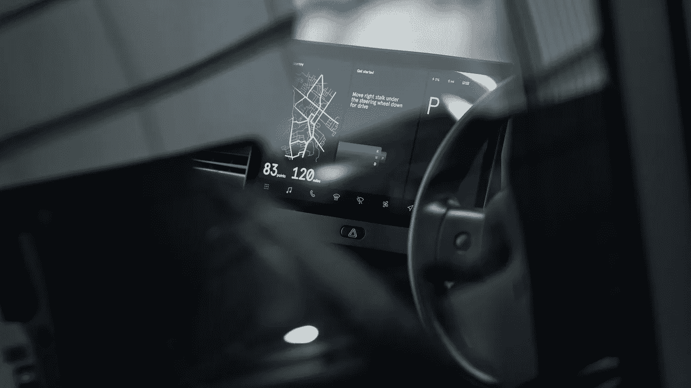
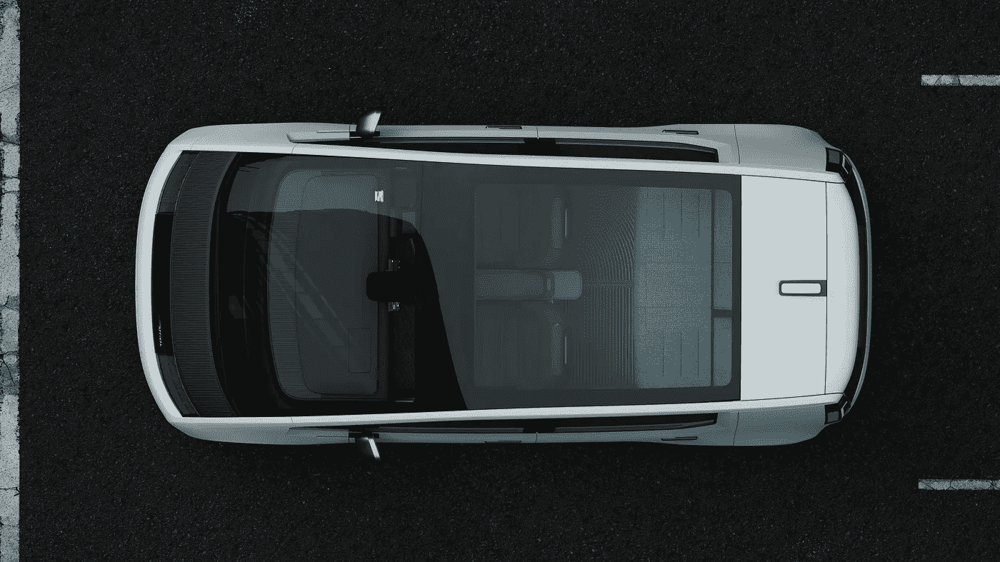

# 到来可能会创造出一种全新的汽车

> 原文：<https://medium.com/nerd-for-tech/arrival-car-6775259cbd16?source=collection_archive---------4----------------------->

## 城市交通运输

## 一家总部位于伦敦的制造商希望让所有人都能使用电动汽车，同时可能会彻底改变拼车应用程序

到达车的数字渲染(来源:到达)

对于生活在城市中的人来说，交通应用已经成为生活的一大部分。它们帮助我们确保准时参加重要的活动，为短途旅行提供廉价的解决方案，使我们能够在晚上出去喝酒…我们中的一些人甚至在工作通勤中使用它们。在大多数情况下，它们作为第一解决方案和最后手段都做得很好。

最近的数据显示，仅优步一个城市每季度就完成超过 14 亿次[出行；唯一与之构成相关竞争的公司是中国滴滴出行，尽管它一直面临监管问题。也有其他重要的，但它们是有限的地区，如北美的 Lyft，或人口统计，如 DriveHer。](https://appinventiv.com/blog/uber-statistics/)

当一家公司变得如此重要时，其他公司开始做出调整与它合作。购物中心现在有指定的区域，修理店收取较低的费用…甚至政府正在制定法规，使他们与公共汽车和出租车和平共处。现在，这个行业即将迈出另一大步:获得专用汽车。

抵达车厢(来源:抵达)

# 到达之前，乘坐什么车打招呼？

总的来说，轿车和 SUV 被保留给优质的乘车应用程序，因为这些车身风格有几个时尚和复杂的模型。小型货车在机场附近工作的司机中很常见，因为它们的行李箱很大。最后，掀背车是在基本类别工作的司机的主要选择。

“总体上”这一部分很重要，因为这些答案会根据每个地区的车型、购买和保留每辆车的估计成本以及每位司机参与应用程序的方式而有很大差异:一些人将它作为全职工作，而另一些人则只是在业余时间使用家用汽车来赚取额外收入。

当然也有例外，比如偶尔出现的高级豪华车，甚至是超级跑车。然而，事实是，那些车即使在那个高级别中也很少见；绝大多数打车司机选择美国的丰田普锐斯(T0)、巴西的雷诺桑德罗(T2)、加拿大的丰田凯美瑞(T4)和其他国家的类似汽车。

抵达车有一个小型货车的形状，尾部被截断，车顶是玻璃的(来源:Arrival)

# 为什么那些车效率不高？

首先，它们在私人使用中如此普遍，以至于很难发现你的什么时候会出现。其次，打车应用导致汽车在街上出现过多，这有损其市场形象。最后，但绝对不是最不重要的，这些汽车都不是为这种用途设计的。这涉及一些不能忽视的技术问题。

掀背车往往太小。小型货车在狭小的空间里很难操纵。SUV 耗油太多。混合动力和电动汽车可能无法抗拒如此高强度的使用。高档轿车可能变得过于昂贵，等等。现有的汽车类别都不适合打车应用，因为它们不是为打车应用设计的。

这款名为 Arrival 的汽车的第一款原型已于上周完成，其用途与比亚迪 D1 几个月前展示的一样:满足打车应用的特定需求。当我们得知抵达公司的总部设在伦敦时，这个事件就变得更加有趣了。伦敦是一个以一直拥有特定出租车而闻名的城市。

极简主义的仪表板提供了一个类似平板电脑的触摸屏，专注于打车应用程序(来源:Arrival)

# 为什么到站车有意思？

从外部来看，小型货车的设计最大化了内部空间。垂直的前端和后端加上短的突出部分使得任何机动都是小菜一碟。客观风格使组件生产成本低廉，易于维修或更换。四四方方的车尾非常适合未来的新变化，比如第三排座位的长轴距。

在机舱里，大挡风玻璃提高了能见度。全景玻璃车顶有助于加热，让乘客感觉更安全。仪表板有一个大触摸屏，易于使用，省去了塑料旋钮和按钮的生产。最后，乘客座椅可以折叠并部分向前移动，以创造更多的腿部空间。

根据优步司机的反馈，这辆[到达车](https://arrival.com/world/en/news/arrival-reveals-its-first-electric-car-designed-to-transform-the-global-ride-hailing-industry)是在六个月内构思出来的。该公司还将自己在电动动力系统方面的经验应用于商务车辆，这些车辆是通过其已经上路的公交车和货车获得的。到目前为止，该项目将进入测试阶段，并继续利用用户的反馈来进一步改进。

看看到目前为止什么是到达车(来源:到达)

# 接下来会发生什么？

越多的电动汽车上路，对基础设施的需求就越大。汽车制造商已经对[在几个方面与政府](https://www.carscoops.com/2021/12/hondas-road-condition-monitoring-system-will-identify-poor-lane-markings-and-tell-authorities-to-fix-them/)合作表现出兴趣，尽管反过来通常[更难发生](https://www.carscoops.com/2021/12/why-bidens-7-5-billion-ev-charging-plan-may-not-convince-you-to-switch/)。一个庞大而可靠的充电站网络是电动汽车成功的必要条件。

此外，Arrival 采用了微工厂的有前途的战略，专注于“基于单元的装配，而不是传统的汽车生产线”。拥有许多小工厂减少了最终问题的范围，最大限度地降低了物流成本，并使生产更加灵活，无论是接受新产品还是进行区域调整。

如果像这样的车辆获得成功，长期的后果将是创造一个专用于乘车的汽车细分市场，就像我们一直以来拥有的公共汽车、卡车和货车一样。私家车将回到它们的主要目的，新汽车产业的每个部分将能够专注于自己的需求，并专门从事于此。

全景玻璃车顶将给乘客带来更好的体验(来源:抵达)

既然打车应用已经成为全球市场上最大的行业之一，那么其他公司就有机会利用这一点来满足他们的特定需求。虽然这是到货车的首要目的，但它也可以从总体上促进电气化，甚至建立一个新的细分市场。你对这个话题有什么看法？