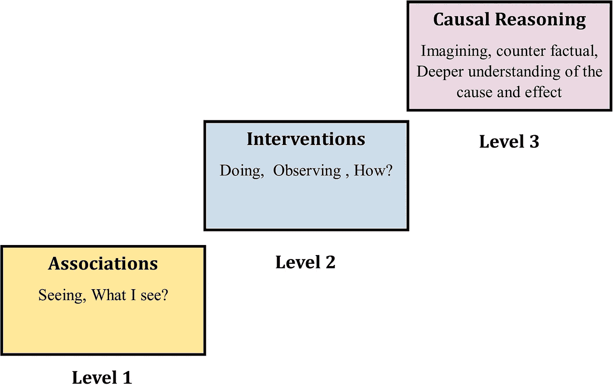

# 人工智能、因果关系和意识

> 原文：<https://medium.com/nerd-for-tech/artificial-intelligence-causality-and-consciousness-8500719a5910?source=collection_archive---------4----------------------->

# **人工智能和**因果关系

人工智能在游戏等领域已经超越了人类，例如在国际象棋领域。但 AI 经常在一些普通领域出错，例如，一个聊天机器人表现出“种族主义行为”，自动信用评分系统对性别进行“歧视”，监视系统专注于“针对一个种族”(Bishop，2021)。此外，与人工智能部署相关的伦理问题是一个大问题。

根据 Judea Pearl 的说法，这些错误背后的根本原因是，人工智能算法/机器学习的基础是曲线拟合或模式匹配。即使是人工智能中使用的复杂的预测算法，将相关性与因果关系等同起来也是一个坑。因此，想法应该是从“通过关联或模式推理”到“因果推理”(Bishop，2021)。例如，美国使用预测软件来预测未来的医疗费用，但却低估了某一部分人口的需求。该算法使用保险索赔(健康成本)数据源来预测患者未来的健康需求。但是该算法没有考虑到弱势群体获得医疗保健和保险的不平等，从而低估了他们未来的医疗需求(Sgaier 等人。al，2020，Obermeyer 等人，2019)。

因此，理解数据集中的偏差和因果联系与选择人工智能算法解决问题同等重要。因果推理是从观察到的现象中推断原因的能力，它可能比相关性超前几个步骤。因果推理用于了解反事实(我们永远无法观察到的数据)。因果关系可以定义为实际结果和反事实结果之间的差异(Pearl & Mackenzie 2019)。

现在，问题是数字计算机是否能拥有人类思维的目的论的因果能力，理解和推理，这些都是强人工智能的方面。朱迪亚·珀尔认为，只有具备了“对因果关系的掌握”，智能系统才能被创造出来。根据他的说法，人工智能需要从神经网络和纯粹的概率关联中走出来，制造具有推理技能的机器，以便理解世界是如何工作的。他提出了一个“因果阶梯”，对应于三个不同层次的认知能力——即看到、做和想象，如图**图 1 所示(** Pearl & Mackenzie 2019)。

【图一:因果阶梯(珀尔&麦肯齐 2019，凯里&吴 2022)

第一级包括通过观察关联来观察，包括纯粹的统计关系。第二个层次是通过做，通过调用一些变化来观察一个真实的生活模型，并另外制作一个因果模型。第三层也是最高层涉及想象和反事实。反事实是一种推理方式，通过询问/想象，“如果 X 没有发生，Y 发生了，会发生什么，反之亦然”。它包括对变化的回顾性推理，并对原因和结果有更深的理解。事实上，有一种叫做“交替历史”的独立体裁来探索历史背景中的反事实。珀尔把大多数动物和机器放在梯子的第一级，也就是说，它们从联想中学习。更高级的动物在第二层，它们从现实生活中的经验中学习。第三个层次是留给有能力想象不存在的系统(人类)，并建立观察到的现象的因果关系理论(Pearl & Mackenzie 2019)。

因果革命无疑将有助于在许多工程领域更精确地执行以人为中心的工作，但缺乏理解将推迟创造人工智能的梦想(AGI)。此外，没有能力去感受和感知，即使是一个完整的解释模型也仍然缺乏意向性和理解。到目前为止，人工智能的所有新进展，例如深度学习、神经网络，基本上都在第一个阶梯上。计算系统的建立应该掌握三个基本概念:时间、空间和因果关系，以及在决策和发现数据集中的统计模式方面的进步。如果没有确定因果关系，仅仅确定大型数据集中的相关性和模式没有任何意义(Bishop，2021)。

# **意识和人工智能**

适当计算的机械执行会在机器中实现意识吗？答案是否定的，但是意识的问题仍然存在。意识仍然是身心问题中的一个争论话题，争论点在于人工智能的强弱。虽然我们知道意识是真实的，因为我们可以在每一秒钟体验它，但这很难解释，特别是意识的内在本质。通常被称为意识的难题，难以解释主观性如何从物质中出现(Hildt，2019)。

与意识相关的两个非常有趣的思想流派是唯物主义观点和泛灵论观点，我认为这两个观点给出了灌输某种程度的意识(人工)的解释，如果这些理论实际上成立的话。唯物主义的意识观认为，“心灵和意识是物质过程的副产品或附带现象(如人脑和神经系统的生物化学)，没有它们就不能存在”。泛灵论观点认为一些基本的物理实体有精神状态。这些精神状态与有意识的经验有关(查默斯。2019).此外，泛灵论综合了唯物主义和二元论(认为精神和身体是分离的)的对立面。虽然这在定义上是非常模糊的，但是泛灵论观点的论据是，即使我们说我们理解物质，那也仅仅意味着它的特性，而不是物质的内在特性。例如，我们说花是红色是因为它的外部特征，我们不知道红色的经历或颜色的内在本质，甚至气味。但是，泛灵论受到组合问题的困扰。它未能解释基本意识思维最初是如何组成的，以及当两个或更多基本实体结合在一起时，它如何进一步提升意识状态(Chalmers，2016)。

这是非常模糊的理论，但是如果基本物理物质的内在本质与一些精神状态一致，那么通过这些物质的正确组合，它们的相互作用，一些水平(非常微小的尺度)的意识可以被实现。这可能甚至与我们所谓的人类意识不太接近，但它可能被称为人工体现的意识。

## **参考文献**

1.主教 JM (2021)人工智能是愚蠢的，因果推理不会修复它。前面。心理学。11:513474.货币供应量指数:10.3389/每平方英尺。36389.68668686666

2.李，安，吴，谢(2022)。因果公平领域指南:来自社会和形式科学的观点。*大数据前沿*， *5* ，1–40。[https://doi.org/10.3389/fdata.2022.892837](https://doi.org/10.3389/fdata.2022.892837)

3.泛灵论和泛灵论。*阿默斯特哲学讲座*8(2013):1–35。<http://www.amherstlecture.org/chalmers2013/>

4.Chalmers，D. J. (2016 年)。泛灵论的组合问题。*泛灵学*，*2013 年 8 月*，179–214。[https://doi.org/10.1093/acprof:oso/9780199359943.003.0008](https://doi.org/10.1093/acprof:oso/9780199359943.003.0008)

5.Hildt E (2019)人工智能:意识重要吗？前面。心理学。10:1535.doi: 10.3389/fpsyg.2019.01535

6.j .珀尔和麦肯齐博士(2019 年)。原因之书。企鹅图书。

7.斯盖尔，S. K，黄，v .，，查尔斯，G. (2020)。因果人工智能的案例。斯坦福社会创新评论，18(3)，50-55 页。[https://doi.org/10.48558/KT81-SN73](https://doi.org/10.48558/KT81-SN73)

8.Obermeyer，z .，Powers，b .，Vogeli，c .，和 Mullainathan，S. (2019 年)。剖析用于管理人口健康的算法中的种族偏见。*理科*， *366* (6464)，447–453。[https://doi.org/10.1126/science.aax2342](https://doi.org/10.1126/science.aax2342)