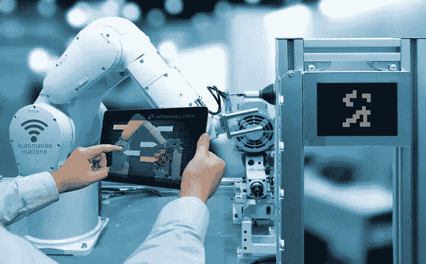

# 制造业的人工智能还有很长的路要走

> 原文：<https://medium.com/nerd-for-tech/artificial-intelligence-in-manufacturing-still-has-a-long-way-to-go-7474dc7ea4c1?source=collection_archive---------3----------------------->

https://zhuanlan.zhihu.com/p/375007858

工业发展赋予了人类更大的改造自然、获取资源的能力。产品直接或间接用于人们的消费，显著提高生活水平。自第一次工业革命以来，工业在一定程度上决定了人类的生存和发展。

与此同时，随着人工智能技术的快速进步及其在消费流通领域的广泛应用，越来越多的制造企业和人工智能公司将目光投向了“人工智能+制造”。但目前来看，制造业的人工智能之路还很远。

## AI 制造困境依然存在

无论是智能 R&D 和设计、制造，还是智能供应链，数字化都是制造业人工智能的基础。但制造业信息化参差不齐，产业链远比这复杂。这就导致了制造业的人工智能赋能比其他行业有更高的门槛和更大的难度。

虽然人工智能技术在行业的一些环节和流程中得到了一定程度的应用，但整体普及率仍处于较低水平。

此外，现阶段人工智能的价值还难以准确衡量。而一些中小企业应用 AI 产品的动力不足。

究其原因，一些技术的应用往往旨在提升品牌，增加产品赋能，从而提高盈利能力或内部降低运营成本。然而，由于企业规模小，生存往往是基本目标。

换句话说，中小型制造企业在构建智能系统时注重效率，然而，效率是以更大的成本获得的。换句话说，效率和成本之间没有真正的平衡。

## 人是智能制造的核心

自动化追求机器自动化生产。本质是“机器换人”，强调大规模机器生产。同时，“智能”追求机器的柔性生产，本质是“人机协作”，强调机器可以独立与人合作。可见，智能化并不一定意味着百分之百自动化。在大量推动智能制造的过程中，只有通过机器和人的融合来推动决策的变化，才能扩大人的可工作性和方向，才能最大限度地增强机器的赋能。

要实现人机一体化的智能制造，需要经过人到机器。人工智能更多的是解决产业链上的单点问题。但是，加工制造业的人工智能应该解决整个商业链的问题。制造业的人工智能之路依然任重道远。

## 定制数据集

随着 AI 商业化进程的加快，以及辅助驾驶、客服聊天机器人等 AI 技术在各行各业的应用，人们对特殊场景下的数据质量的期望越来越高。高质量的标签数据将是人工智能公司的核心竞争力之一。

如果说之前的算法模型使用的一般数据集是粗粮，那么算法模型目前需要的是定制的营养餐。如果公司想要进一步提高某些模型的商业化，他们必须逐步从通用数据集向前发展，以创建独特的数据集。

# 结束

将您的数据标注任务外包给[字节桥](https://tinyurl.com/bdh5vjbm)，您可以更便宜、更快速地获得高质量的 ML 训练数据集！

*   无需信用卡的免费试用:您可以快速获得样品结果，检查输出，并直接向我们的项目经理反馈。
*   100%人工验证
*   透明标准定价:[有明确定价](https://www.bytebridge.io/#/?module=price)(含人工成本)

为什么不试一试呢？

资料来源:https://www.robot-china.com/news/202101/29/65436.html