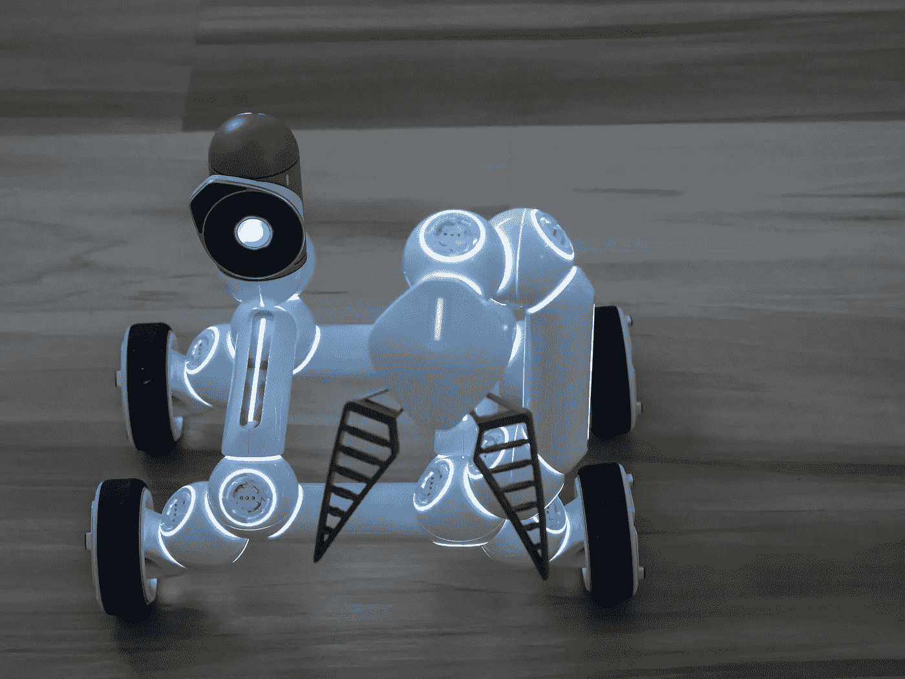

# 人工智能对机器学习:解释

> 原文：<https://medium.com/nerd-for-tech/artificial-intelligence-versus-machine-learning-explained-c08ff1c3eded?source=collection_archive---------2----------------------->

图片来源:Pexels.com

# 介绍

机器学习和人工智能经常互换使用，但它们是两个非常不同的东西。人工智能(AI)是一个已经存在了几十年的广阔领域——它是 Siri 和 Alexa 背后的技术。另一方面，机器学习(ML)是人工智能的一个子集，它使用统计技术来允许…