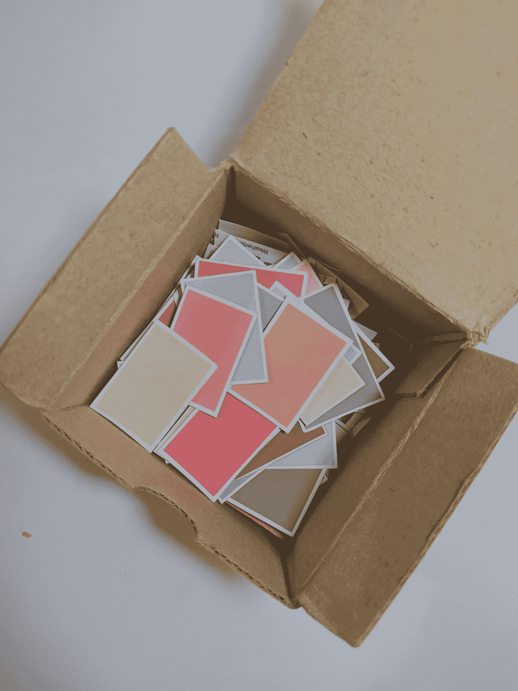

# 作为一名学生，你在科技书呆子学校有什么？

> 原文：<https://medium.com/nerd-for-tech/as-a-student-whats-there-for-you-at-nerd-for-tech-75e290135764?source=collection_archive---------3----------------------->

## 加入实践学习和合作成长的文化

> 让我们给你一个关于我们的想法。我们是如何开始的&到目前为止我们的旅程如何？

Katthy K. Mal 在 [Unsplash](https://unsplash.com?utm_source=medium&utm_medium=referral) 上拍摄的照片

2020 年 6 月，我们以媒体出版物起家，现在我们是一家**教育媒体公司**，我们的愿景是围绕协作&实践学习创造强大的文化。

我们迄今为止的旅程—

*   [LinkedIn 社区](https://www.linkedin.com/company/68185327/admin/) —相信我们愿景的 6.9K 会员。
*   [媒体出版](https://medium.com/nerd-for-tech)—45k 作家，71k 读者，15K 独立每日访问者，作家在这里与世界分享智慧。
*   [真实脱口秀](https://www.youtube.com/channel/UCZy3TVD71ttqVHL5P9A_JBw)——原创播客系列，我们采访了 25 位以上的嘉宾，其中一些是来自 **NASA** 的光学工程师，来自 **Google** 的软件工程师，来自 **Tesla** 的机械设计工程师，来自**网飞**的全球产品设计负责人
*   [Slack 社区空间](https://join.slack.com/t/nerdfortech/shared_invite/zt-zd135ylv-iZrvQBvwCTT56e~bBtQZVA)——在这里你可以找到来自数据、软件的专业人士&其他有多年经验的专业人士随时准备为你提供指导。一个你可以和其他同龄人交流的地方。
*   查看我们的网站获得完整的图片—[www.nerdfortech.org](http://www.nerdfortech.org/)

> 现在，知道我们的愿景是什么，我们关心什么，我们正在解决什么问题&作为一名学生/学习者，你如何适应这一点非常重要。

由[absolute vision](https://unsplash.com/@freegraphictoday?utm_source=medium&utm_medium=referral)在 [Unsplash](https://unsplash.com?utm_source=medium&utm_medium=referral) 上拍摄的照片

这里有一个小故事可能会让你想起什么。

在学校，当你努力学习的时候，是什么驱使你这样做…是在考试中取得好成绩，对吗？

当你来到大学，推动你学习任何技能的动力是什么……它是获得一份**证书**的简历&最终获得一份**工作**。

照片由[达米尔·斯班尼克](https://unsplash.com/@spanic?utm_source=medium&utm_medium=referral)在 [Unsplash](https://unsplash.com?utm_source=medium&utm_medium=referral) 拍摄

想象一下，如果**尼古拉·特斯拉(塞尔维亚发明家，电气工程师)**努力工作**只是**得到一份工作，那么我们可能会坐在这里被蒙在鼓里。如果你没有得到这个参考，读读尼古拉·特斯拉。

关键是，我们都有这样一种天性，我们不应该用我们的大脑，我们应该总是盲目地学习技能，带着找工作的动机。你们中的一些人可能会说——“嘿，我认为找一份工作真的很重要，这是我们应该如何赚钱&并以此为生”

你说得对，我们同意。但是做一些事情是因为有人告诉你，不使用你的大脑，不考虑使用技能通过解决现实世界的问题来做一些有意义的事情，你认为如果每个人都走这条路，我们可能没有像 NASA 这样的先进组织吗？

我们可能无法将人类送上月球，也无法将漫游者送上火星。

美国宇航局在 [Unsplash](https://unsplash.com?utm_source=medium&utm_medium=referral) 拍摄的照片

如果所有发现癌症药物的科学家，或发明飞机或汽车的科学家，我们可能生活在树林里。

现在，我们的哲学讨论到此为止。让我们看看解决方案，我们正在努力的文化。

[廷杰伤害律师事务所](https://unsplash.com/@tingeyinjurylawfirm?utm_source=medium&utm_medium=referral)关于 [Unsplash](https://unsplash.com?utm_source=medium&utm_medium=referral) 的照片

看，大多数最好的资源都可以在网上免费获得。我们所说的资源不仅仅指课程材料，还包括人力资源，还有非常乐意免费指导你的专业人士，还有学习者，他们正在寻找像你这样充满热情的人来参与一些项目或解决方案。

[菠萝供应公司](https://unsplash.com/@pineapple?utm_source=medium&utm_medium=referral)在 [Unsplash](https://unsplash.com?utm_source=medium&utm_medium=referral) 上拍摄的照片

有些社区([产品学院](https://productschool.com/)、[聪明的程序员](https://www.youtube.com/c/CleverProgrammer)、[FreeCodeCamp.Org](http://freecodecamp.org))正在努力让你接触到世界上一些最优秀的头脑。你可以联系谷歌、亚马逊和其他巨头的人，向他们提问。

在书呆子科技公司，我们将这种文化带到了一个新的高度。在我们前进之前，让我告诉你，这个社区是非盈利的，我们做这些是为了回报社区。

照片由[蒂姆·莫斯霍尔德](https://unsplash.com/@timmossholder?utm_source=medium&utm_medium=referral)在 [Unsplash](https://unsplash.com?utm_source=medium&utm_medium=referral) 上拍摄

我们发起了一项名为 **ELA 的倡议。**听起来很诡异的名字，但却是围绕着**E**xplore->Learn->**A**pply 的一个循环。你可以在这里阅读更多关于它的细节[。点击](https://www.nerdfortech.org/post/explore-learn-apply-ela)查看这一过程。

让我来告诉你，当你成为技术呆子文化的一部分时，你可以做些什么。

我们在 Slack 上创建了一个社区空间，所以你不必去任何地方与其他同行交流&那些自愿指导你的专业人士。

您可以找到您感兴趣的不同领域(数据科学、软件工程等)的不同文化，在这里您可以与他人交流，从我们为您构建的免费资源中探索和学习技能，您可以从社区中提问，解决现实世界中的问题，而不仅仅是团队中的项目，如果您面临任何问题，我们会让您与行业专业人士联系。

作为一个社区，我们将为您提供一切，您所要做的就是探索、学习&然后应用您的技能作为解决现实世界问题的工具。

照片由 [rizki rama28](https://unsplash.com/@rizkirama?utm_source=medium&utm_medium=referral) 在 [Unsplash](https://unsplash.com?utm_source=medium&utm_medium=referral) 上拍摄

如果你有任何建议或想法或反馈。不要犹豫&通过 mail(nerdfortech000@gmail.com 联系)或通过 [LinkedIn](https://www.linkedin.com/in/nerd-for-tech/) 给我们发短信，或加入我们的 slack 社区&通过 slack 在**# 02 _ 建议**频道发送消息。

干杯！

技术团队呆子

[Linkedin](https://www.linkedin.com/company/nerdfortech/?viewAsMember=true) | [网站](https://www.nerdfortech.org/) | [媒体](https://medium.com/nerd-for-tech)|[YouTube](https://www.youtube.com/channel/UCZy3TVD71ttqVHL5P9A_JBw)|[Slack 社区](https://join.slack.com/t/nerdfortech/shared_invite/zt-zd135ylv-iZrvQBvwCTT56e~bBtQZVA)|[Twitter](https://twitter.com/nerdfortech)|[insta gram](https://instagram.com/_therealtalkshow)|[邮件](http://nerdfortech@gmail.com/)