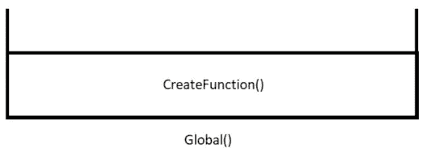
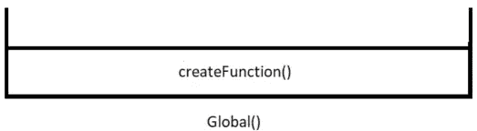
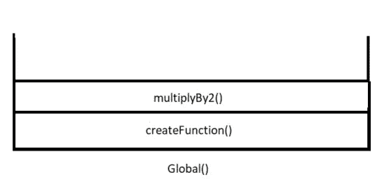
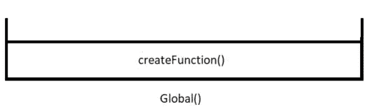
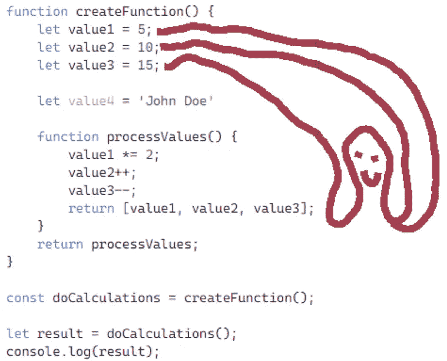
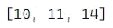
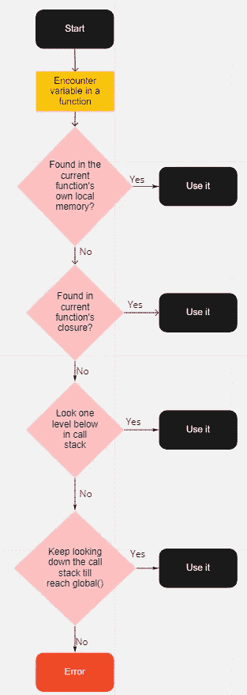
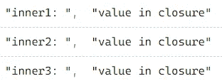

# 很容易就结束了

> 原文：<https://medium.com/nerd-for-tech/as-easy-as-closure-abb71f70f283?source=collection_archive---------20----------------------->

鸣谢:昂斯佩什的弗兰克·麦肯纳

自从闭包在 JavaScript 中出现以来，它就一直困扰着人类😉😁然而，如果你仔细观察它，了解它是如何工作的，它被证明是一个令人难以置信的优雅和简单的构造。在这篇博客中，除了理论，我将带你通过几个例子来建立一个心智的、概念的模型，这个模型(希望)会一直留在你的脑海中，你永远不会再*想知道*什么是闭包。

这些是我们将在这篇博客中熟悉的概念:

*   执行线程
*   执行上下文
*   调用栈
*   高阶函数
*   词法范围以及 JS 是怎样一种词法范围的语言
*   关闭

## 开始理解终结的旅程

让我们先从一个基本的例子开始，来理解 JavaScript 的执行线程是如何工作的:

*   当这个程序执行时，首先从第 1 行到第 6 行的`createFunction`的函数定义存储在全局存储器中，标识符为`createFunction`。
*   然后在第 8 行，标识符`generatedFunction`被创建，并且*未初始化*，直到`createFunction`运行并返回。我们知道`createFunction`将要运行，而不仅仅是*引用了*，因为在第 8 行有 paranthesis。
*   当`createFunction`将要运行时，将在内存中为它创建一个新的执行上下文，并且`createFunction()`将被添加到调用堆栈中。此时调用堆栈看起来是这样的:

调用堆栈的当前状态

*   请注意，全局()始终位于调用堆栈的底部。
*   然后将在(全局)存储器中查找`createFunction`的定义，并开始执行。注意，执行线程不会从第 8 行转到第 1 行。这条线一直向前延伸。为了执行`createFunction`，从存储器中取出其定义。
*   在`createFunction`内部，首先`multiplyBy2`的定义被存储在`createFunction`的本地内存中(你可以看一下第 2 到 4 行来对此做一个心理模型，但是执行的线程，正如我之前所说的，并没有*实际上*转到第 2–4 行)。
*   然后`multiplyBy2`的定义被提取并返回到调用环境，存储在`generatedFunction`变量中。实际上，这意味着`multiplyBy2`的定义获得了一个新标签:`generatedFunction`
*   一旦在第 5 行点击了`return`关键字(这再次意味着您可以*在第 5 行查看*以读取返回的内容，但是执行线程并不*实际上*转到第 5 行——它只是在遇到来自内存的`createFunction`的函数定义中的`return`关键字时返回`multiplyBy2`函数)，就会删除`createFunction`的执行上下文，以及它在调用堆栈中的条目。

调用堆栈的当前状态

*   接下来在第 10 行，标识符`result`被创建并被统一，直到`generatedFunction`运行并返回。
*   这里值得注意的一点是，创建`generatedFunction`定义的原始环境已经不存在了。它甚至是不需要的，因为`multiplyBy2`的定义现在存在于标签`generatedFunction`下的全局内存中。
*   `generatedFunction`被运行，它自己的执行上下文被创建，它的条目被添加到调用堆栈中。

调用堆栈的当前状态

*   在`generatedFunction`的执行过程中，首先将参数 5 存储在其本地内存中，标签为`number`。
*   然后完成`number * 2`的计算，其评估为 10。然后将值 10 返回到调用环境中，并存储在变量`result`中。
*   同时，删除`generatedFunction`的执行上下文和调用堆栈条目。

调用堆栈的当前状态

*   在第 11 行，记录了`result`的值。

这次讨论中值得注意的一点是:

在第 5 行，返回了`multiplyBy2`的**定义**和**而不是**的**引用**。如果引用被返回，那么如何在第 10 行调用它(带有新标签`generatedFunction`)?记住，函数一返回，`createFunction`的执行上下文和本地内存就被删除了！！

所以现在我们知道了**执行上下文**、**调用栈**是什么，以及**函数**是如何从其他函数**返回**的。

顺便说一下，接受和/或返回其他函数的函数被称为**高阶函数**。

让我们再举一个例子:

这个例子建立在`basicExample.js`之上。为了完整起见，让我们再看一遍执行线程的机制，这次要快一点，因为上次我们已经非常详细地理解了它。

*   第 1–10 行:存储在存储器中的`createFunction`的定义。
*   第 12 行:标识符`result`被创建，直到`createFunction`运行并返回，它仍未初始化。`createFunction`开始运行，同时创建它自己的执行上下文和它在调用堆栈中的条目。

调用堆栈的当前状态

*   在`createFunction`的执行过程中，标识符`value`被创建为值 5。`multiplyBy2`的定义与标识符`multiplyBy2`一起存储。所有这些都存储在分配给`createFunction`的**本地存储器**中。

**再次注意**:当函数`createFunction`运行时，执行线程不会从第 12 行返回到第 1 行。当它必须执行这个`createFunction`时，它从存储在存储器中的`createFunction`的定义执行它。我一直在引用第 12 行的第 1 行，因为这是我们看到正在发生的事情的方式。

*   此外，当调用`multiplyBy2`时，为其创建一个新的执行上下文，并且将其条目推入调用堆栈。

调用堆栈的当前状态

*   在`multiplyBy2`的执行上下文中，`value`的值必须更新为双精度值。但是`value`在`multiplyBy2`的本地内存/执行上下文中不存在。

JS 引擎在这种情况下做什么？

它会在调用栈中向下移动来寻找`value`的定义吗？

你可能会想，是的，的确如此！

好吧，为了让你开心，我会假设它会。因此，假设`value`的定义在父上下文(即`createFunction`的本地内存)中找到，并更新为自身的两倍。

*   接下来，点击`multiplyBy2`的右括号，函数结束，其执行上下文被删除，并弹出调用堆栈。

调用堆栈的当前状态

*   进一步在`createFunction`的执行中，`value`的值被返回到调用环境。
*   第 12 行:现在来自`createFunction()`的返回值用标识符`result`存储在全局上下文中。与此同时，`createFunction`的执行上下文也被删除，它也被弹出调用堆栈。

调用堆栈的当前状态

*   第 13 行:`result`的值被打印到控制台。

现在回到我们做了一个*大的*假设的地方:当一个函数不能在它自己的本地内存中找到一个变量的定义时，它会在调用栈中一步一步的往下走，在找到那个变量定义的第一个位置停下来。

我们这样假设对吗？

与其制造更多的悬念，我将简单地探究另一个可以澄清事实的例子。

我想把关于执行线程如何进行以及如何处理执行上下文和调用堆栈的讨论留给您作为练习。你可以参考上面的讨论来做😊

这里需要重点关注的是:

在第 11 行中，`createFunction`函数返回`multiplyBy2`函数的定义，并用新标签`doubleItUp`存储它。这个返回的函数有*引用*到一个变量(`value`)，这个变量不是在它自己的本地内存中*定义的*(*见*第 4 行到第 7 行，但是执行的线程实际上不去那里)，而是在`multiplyBy2`被*定义*的上下文的本地内存中定义的(即在`createFunction` 的上下文中，即它的父上下文)*。*

此外，当这个返回的函数实际被*调用时，*`createFunction`的上下文甚至不再存在！！！

那么我们如何期望这个*返回的函数*成功运行并处理变量`value`呢？

那么第 13-14 行发生了什么？如果我们之前的假设是正确的，那么当调用`doubleItUp`时，它试图将`value`的值加倍并返回它。但是首先，它在自己的执行上下文中找不到变量，所以它(根据我们的假设)试图在调用堆栈中向下一级查找变量。但是在调用堆栈的下一层，在这个阶段是…鼓点…T2 上下文！！因为`createFunction`的调用栈条目在`createFunction`返回的时候早就被删除了！！

暂时消化一下这一点。如果需要的话，在这个例子中再运行一次执行上下文…

准备好下一件事了吗？好了，现在我们确定了`value`变量不能来自`multiplyBy2`的*父*作用域，并且这个例子运行成功，问题来了:`value`的定义从何而来？？

答案，你可能已经猜到了…来自`multiplyBy2.`啊哈的*关闭*！我们终于到了！！

但是等一下。我们首先不知道什么是终结。

所以让我们更正式地谈论它。

当`multiplyBy2`或者任何一个函数被创建时，它会得到一个小的内存来保存函数定义中引用的变量。在 JavaScript 中，这个**存储的内存**以及整个**概念**被称为**闭包**。这就像周围的环境被放在一个盒子里，*关闭*然后和功能一起运送，无论功能去哪里。

函数的**闭包**保存的值来自函数的**词法范围**。函数的**词法范围**是函数被**创建**的**环境**。

让我们把这个和我们的例子`closuresInFullForm.js`联系起来。

当`createFunction`返回`multiplyBy2`时，它不仅返回了`multiplyBy2`的定义，还返回了它在定义中保存的少量引用。所以这个*存储*包含了`value`字段，并且和`multiplyBy2`的定义一起被送回了全局上下文。

此后，正如预期的那样，`multiplyBy2`的定义有了一个新的标签:`doubleItUp`，但商店(又名*关闭*)仍然完好无损。每当我们想运行以前叫做`multiplyBy2`的`doubleItUp`时，JS 引擎就需要引用`value`，它首先在:

*   `doubleItUp`的(新创建的)执行上下文，在那里没有找到。
*   然后在闭包里查找，在那里找到并处理它。因此，第 14 行的输出是 10。

唷！！那是相当多的讨论。

为了形象化闭包是如何创建的，您可以将闭包(比如说`processValues`函数)想象成一只章鱼，它的触角伸向创建`processValues`的环境中的引用。这个**环境**就是`processValues.`的**词法范围**

封闭类似于章鱼的触角

输出

**最后一个例子需要注意的要点:**

*   没有被`processValues`引用的`processValues`函数的本地环境中的字段没有被添加到闭包中。这是 JavaScript 设计者采用的一种优化措施。所以一旦`createFunction`执行完毕`value4`就永远丢失了。
*   存储在闭包存储库中的数据是私有的，不能以任何方式直接访问。只有当`doCalculations`运行时，`value1`、`value2`和`value3`的值才会更新。参见上面的输出。
*   正是返回的`processValues`函数的隐藏的`[[scope]]`属性使得关闭机制成为可能。
*   JS 引擎查找引用的顺序如下:

JS 引擎查找引用的顺序

## 为什么我们说 JavaScript 是词汇作用域语言

这是因为在 JS 中创建的每个函数都有它的闭包，而这个闭包来自这个函数最初被定义的地方，也就是函数的词法范围。所以函数在某种程度上对它们的出生地有一些记忆。这个词法作用域与*调用/调用*这个函数的环境/作用域无关。

这里有一个例子:

*   当第 19 行`createFunction`运行时，它返回`processValues`函数定义及其闭包。
*   当`doCalculations`在第 21 行运行时，它的闭包只记住最初*定义*的词法范围。所以它的闭包包含来自`createFunction`的(现已删除)执行上下文的`value1`、`value2` 和`value3`。记住`createFunction`的执行上下文被删除，但是值`value1`、`value2` 和`value3`在闭包中保持不变。
*   `doCalculations`在`global`的执行上下文中*被调用/调用*。全局中的数据对`doCalculations`的运行没有影响。所以全局范围内的`value3`对`doCalculations`没有影响。

顺便提一下，如果 JS 是一种动态作用域语言，函数被*调用的环境**的作用域*** 会对函数的运行产生影响。

# 用更多的例子展示我们的理解能力

**多次更新闭包变量**

**输出:**

第 13 行打印 1。

第 14 行打印 2。

需要快速解释吗？

第 11 行运行`outer`，存储`inner`的函数定义和闭包，标签为`newFunction`。当`newFunction`在第 13 行运行时，它开始寻找`counter`的定义，并在闭包中找到，`counter`的当前值为 0，将其更新为 1 并打印出来。当第 14 行再次运行`newFunction`时，它再次在闭包中找到`counter`的定义，这次`counter`的现有值是 1，它将其更新为 2 并打印出来。

这是一种便捷的方式来记忆来自之前运行的函数的数据，正式名称为记忆化。如果`newFunction`涉及复杂且耗时的计算，那么 JS 引擎很容易记住上一次运行的值，并在下一次调用中从该点继续。

## 多个函数可以共享同一个闭包

**输出:**

相当简单的东西，我把这个例子的解释作为练习留给你。

唯一需要特别注意的是，返回函数数组中的每个函数(`inner1, inner2` 和`inner3`)都可以访问完全相同的闭包。因此，从一个高阶函数一起返回的多个函数具有相同的闭包。

## **多个闭包实例**

现在事情越来越令人兴奋。在第 11 行，`inner`函数带着它的闭包被返回，并被赋予一个新标签`newFunction1`。第 12 行和第 13 行的`newFunction1`调用更新了它们闭包中的计数器变量，并将其打印为 1(第 12 行)和 2(第 13 行)。

第 15 行包含一个新的调用`outer`，它返回一个新的副本`inner`和一个新的闭包实例，它得到一个新的标签`newFunction2`。所以第 16 行和第 17 行再次打印 1 和 2。

与`newFunction1`和`newFunction2`相关的闭合装置相互隔离。

## 多闭包实例的另一个例子

这次，第 12、13、16 和 17 行的输出都是:1。

第 11 行:`outer`返回，用标签`newFunction1`存储`inner`函数的定义和闭包。每次在第 12 行和第 13 行调用`newFunction1`时，该函数都会运行，但是这次它不需要在闭包中寻找`counter`的定义。它的定义就在`newFunction1`自己的本地存储器中。每次调用`newFunction1`时，`counter`重新初始化为 0，并递增至 1。

在第 15 行，`inner`的新副本被返回，带有标签`newFunction2`的闭包的新实例。同样的过程再次重复。同样，执行线程不必在`newFunction2`的本地存储器之外寻找`counter`的定义。第 16 行和第 17 行中对`newFunction2`的每次调用都将计数器重新初始化为 0，并每次递增 1。

在上述两种情况下，闭包的概念都是多余的。

## 读取全局数据

**输出**:

第 13 行:1

第 13 行:2

第 13 行:3

第 13 行:4

这是因为这次每次调用*都会返回* `inner`函数，以`newFunction1`和`newFunction2`的形式更新并打印*全局*变量`counter`。

为什么？因为当`newFunction1`或`newFunction2`被调用时，它们在本地内存或闭包中找不到`counter`的定义。因此，JS 引擎在调用栈中寻找`counter`,在全局中找到它并更新它。

## 闭包的用例

闭包对于理解 JavScript 的几个特性很重要，如下所示。

*   **记忆化:**如上所述，为我们的函数提供对其先前输入和输出的持久记忆。
*   **迭代器和生成器:**使用词法范围和闭包来实现 JS 中处理数据的最新模式。
*   **模块模式:**在不污染全局名称空间的情况下，为应用程序的生命周期保留状态。
*   **异步 JavaScript:** 回调和承诺依赖闭包来在异步环境中保持状态。

这就是所有的人。我知道这是一篇相当长的阅读，但希望它能让您对 JS 的这个深奥特性有所了解。如果感觉很多，我建议你用纸和笔完成每个例子，看看执行的线程是如何移动的。