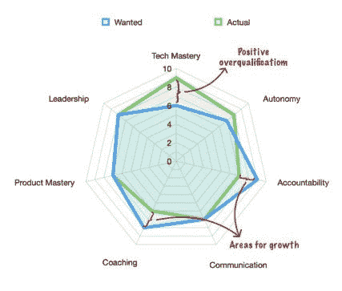

# 评估工程经理

> 原文：<https://medium.com/nerd-for-tech/assessing-engineering-managers-2023ad732dbf?source=collection_archive---------0----------------------->

每年的这个时候，全球各地的许多领导者都在争先恐后地开始他们的“绩效评估”流程或公司认为正确的任何仪式。不要误会我；我不会向我的任何客户推荐一年一次的反馈。尽管如此，考虑到这是你们中许多人最关心的问题，用正确的工具做这件事可以帮助你们创造正确的反馈文化和健康的讨论，这将发展你们的团队。这篇文章将关注你的组织中的力量倍增器——管理者。

# 客观主观

如果我们能够获得客观的衡量标准来轻松地评估经理并指出他们需要改进的地方，那将是令人惊讶的。不幸的是，生活没那么简单。这意味着我们必须接受你如何衡量经理们不同特质和技能的主观性。例如，在一个组织中，如果有多个主管必须对他们的工程经理进行评估，那么尝试并明确地定义这些将会很有帮助。公司经常用语言描述不同水平的才能是如何表现出来的，就像你在定义职业阶梯时可能会做的那样。

接下来，我建议列出一份你想用的技能和特质的清单。不要将这些与可能用于衡量不同技能的其他绩效指标相混淆。例如，我认为团队的交付记录或健康(快乐和损耗)不是技能，而是领导者指导、领导、沟通等能力的指标。接下来，我将列出我默认的技能列表，但是如果你觉得合适的话，可以随意修改这个列表。

对于每项技能，决定你期望看到的水平。我的客户通常从默认的工程经理角色开始，然后根据具体情况进行调整。第一次尝试的人通常被不同地衡量，并且一些团队可能比其他团队需要不同的技能。

# 技能

以下是我的默认列表，以及每个列表的简短定义。正如我已经说过的，请随意定制这些。我的一些客户对技能的定义有些不同，或者使用其他的。我倾向于在 1-10 之间给这些评分，1 代表这个人毫无头绪，10 代表几乎没有改进的余地。

**技术精通**:专业的一般知识，也许是与你的团队专长相关的特定领域的专业知识。这取决于该角色需要多少技术工作，可能或多或少很重要。

**自主**:给他们的报告提供自主和代理的能力，让他们自己做事情，在有意义的地方委派事情。在某种程度上，这是微观管理的对立面。

**责任**:这种技能包括几个较小的特征，围绕着经理如何跟踪任务和承诺，以及获得和保持信任。我经常用的一个例子是，“当你说你有什么东西的时候，对方完全信任你的可能性有多大？”

**沟通**:另一种更小技能的融合。沟通包括能够向他们的团队以及非技术同行传达他们的想法。它也可以延伸到对你或多或少重要的其他领域，比如公开演讲。

**指导** : *任何一个领导者都需要的*技能，也是一项经常被忽视的技能。我使用的一个很好的指标是他们团队的[彼得潘计数](https://avivbenyosef.com/peter-pan-employees/)。管理者不应该让团队成员停滞不前多年而没有改进。

**产品精通**:随便一个经理和你公司的经理之间的区别在于，他们还必须对你的产品空间、市场、用户、行话、竞争对手等有很好的了解。就我个人而言，我认为这是至关重要的，必须放在首位。

**领导力**:我过去曾写过领导力的一些方面，比如[管理思维](https://avivbenyosef.com/the-executive-mindset/)、[灌输目标](https://avivbenyosef.com/stop-being-a-floating-leader/)，以及[成长思维](https://avivbenyosef.com/growing-growth-mindsets/)。

# 评估和行动

有了这份清单和不同角色的每项技能的预期水平，是时候坐下来评估你认为经理对每项技能的要求了。在那之后，你会有一些看起来有点像下图的东西。使用它，你可以更容易地发现你应该在哪里花费你的注意力。

假设你自己的*教练*达到了标准，是时候卷起袖子开始训练你的经理了。我鼓励你选择一个单一的领域，并在 2-3 个月内专注于此。没有任何行动的评估比根本没有评估更糟糕。有了这个过程——说实话，建立这个过程需要大约一个小时，每个经理需要 30 分钟来评估——你应该拥有比 90%的公司做得更好所需的一切。

Aviv Ben-Yosef 2021——最初发表在[面向科技高管的最佳时事通讯](https://avivbenyosef.com/newsletter/)上