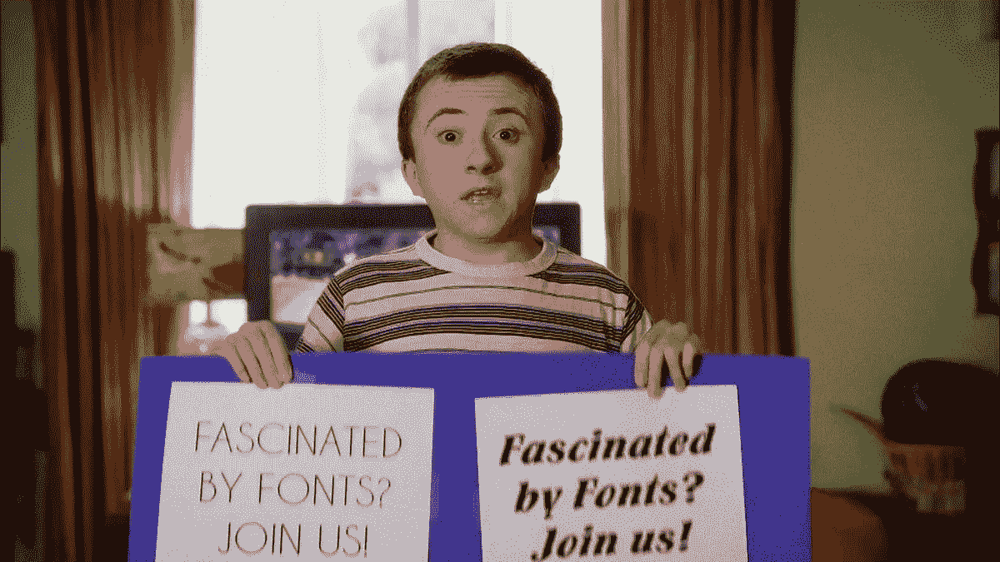

# 评估 CSS 评估，第 2 部分

> 原文：<https://medium.com/nerd-for-tech/assessing-the-css-assessment-part-2-a13bf94acc6a?source=collection_archive---------14----------------------->

这是我关于 LinkedIn 的 CSS 评估系列的下一篇文章…

**被字体迷住……**



如果你是情景喜剧《中间的 T2》的粉丝，你可能会记得布里克·赫克决定在学校成立一个名为字体俱乐部的俱乐部，在那里孩子们可以聚在一起讨论……字体。大多数人可能没有 Brick 对字体的痴迷，但是对于 web 开发人员来说，了解字体是很重要的。正如 W3Schools.com 向[建议的那样:](https://www.w3schools.com/css/css_font_style.asp)

选择合适的字体对读者如何体验一个网站有着巨大的影响。

*合适的字体可以为你的品牌创造一个强有力的标识。*

使用易读的字体很重要。字体增加了文本的价值。为字体选择正确的颜色和文本大小也很重要。

我想布里克·赫克会热情地同意的！但是即使你不是一个字体狂热者，你仍然需要知道如何使用 CSS 来为你的网站字体设置正确的属性。

不足为奇的是，LinkedIn CSS 评估中的一些问题涉及到了这个主题。有一个问题问道，“对于字体样式属性，*和*哪一个选项不是有效值？”您的选择:斜体、正常、无、倾斜。与评估中的其他问题不同，这个问题很容易回答。font-style 属性只有三个可能的值，其中 *none* 不是选项。

你什么时候会用到 font-family 属性？你熟悉三个实际值——正常、斜体和倾斜——的含义吗？W3Schools.com 指出，使用该属性的典型原因是“指定斜体文本”如果你不知道(！)什么是斜体文本，这里有个例子:

*这是斜体文本。有点偏，不是吗？*

*正常*值无需解释。把字体风格设置成斜的怎么样？实际上看起来和斜体一样，那有什么区别呢？Mozilla 开发者网络解释道:“如果没有斜体版本的字体，就用斜体字来代替。如果两者都不具备，则风格是人为模拟的。”同样，如果没有斜体字版本，将使用斜体字版本。W3Schools.com 还告诉我们，斜体字的浏览器支持比斜体少。顺便说一句，我从来没有用过斜射。斜体对我来说很好。

评估中出现的另一个 CSS 字体属性是字体粗细。用于设置字体的粗细，字体粗细有多种可能的值。其中一个问题首先提到这个属性的值可以用一个关键字或者一个数字来表示。我们来回顾一下这些。首先，有四个关键词:

*   驳船
*   常态
*   大胆的
*   粗体的

然后是九个数值，从最细到最粗:

*   100
*   200
*   300
*   400
*   500
*   600
*   700
*   800
*   900

该问题要求您选择与数值 400 和 700 匹配的两个关键字。如果你还不知道答案，这是另一个可以通过快速谷歌搜索很容易得到答案的问题。可能的答案如下:

*   粗体；常态
*   光；常态
*   正常；大胆的
*   正常；粗体的

你能不用查找就选择正确的吗？我承认我没有，所以感谢谷歌！答案是第三，“正常；大胆”。另外两个关键字，较亮和较粗的，不对应于特定的数值，而是相对于父元素的[。](https://developer.mozilla.org/en-US/docs/Web/CSS/font-weight)

评估还询问了一种完全不同的字体:图标字体。[2012 年](https://www.lambdatest.com/blog/its-2019-lets-end-the-debate-on-icon-fonts-vs-svg-icons/)推出，这种新形式的网络图标提供了精灵和图像的替代物。对于评估中的这个问题，您需要选择关于图标字体的陈述中哪一项是正确的。图标字体…

*   …只能使用 JavaScript 插入
*   …需要浏览器扩展
*   …作为内嵌图像插入
*   …可以使用字体大小和颜色等与排版相关的属性来设计样式

要使用图标，你需要下载它们的集合，比如通过[字体 Awesome](https://fontawesome.com/) ，或者在你的文档的< head >元素中包含一个< script >元素，在开始< script >标签的“src”属性中包含一组图标的地址。

```
<script src=”https://kit.fontawesome.com/xxxxxxxx.js" crossorigin=”anonymous”></script>
```

下面是一个图标的 HTML 示例:

```
<i class=”fab fa-accessible-icon”></i>
```

那么你会选择哪个答案呢？根据 LambdaTest 的说法，图标字体的一个巨大优势是“我们可以使用 CSS 样式规则来轻松地更改和修改颜色、大小/分辨率、应用框阴影、应用 CSS 动画和过渡。”并且 [Icons Mind](https://iconsmind.com/advantages-icon-fonts/) 通知我们“这些图标具有完整的 CSS 样式能力和跨浏览器兼容性。”因此，我们可以排除前三个选项，选择第四个选项，因为很明显，图标字体“可以用与排版相关的属性来设计”

**用正确的值给我上色**

即使是 CSS 新手也应该知道分配[颜色值](https://www.w3schools.com/css/css_colors.asp)有不同的方法，包括使用特定的颜色名称(其中 CSS 预定义了 140 个)、RGB(设置红色、绿色和蓝色的数值)、HEX(即十六进制值)和 HSL(设置色调的数值以及饱和度和亮度的百分比值)。

评估中的一个问题要求您在四个可能的答案中选择哪一个是*而不是*有效的颜色值:

*   rgb(0，0，0)
*   #000
*   #000000
*   000000

这对你来说应该很简单。你可能知道使用全 0 的颜色值会产生黑色，所以问题不在于数字。更确切地说，确定无效的颜色值只需要知道表达 rgb 颜色和十六进制颜色的正确语法。对于 rgb，第一选择使用正确的语法。剩下三个哪个是错的？答案是第四个，因为十六进制值要求前面有“#”。

直到下一次…