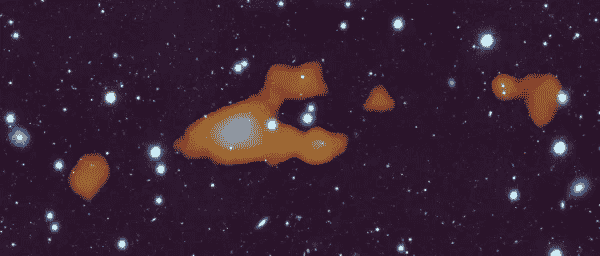

# 天文学家发现了一个神秘的自由漂浮的氢云

> 原文：<https://medium.com/nerd-for-tech/astronomers-discover-a-mysterious-free-floating-hydrogen-cloud-fdbe47455abd?source=collection_archive---------2----------------------->

## 猫鼬望远镜拍摄了一张“黑暗”氢气云的快照，它和星系一样大，但没有形成任何恒星！

在一张深度光学图像上，猫鼬探测到了 21 厘米的中性氢气。

大约就在去年 12 月，备受期待的 T2 詹姆斯·韦伯太空望远镜(JWST)T3 发射的时候…