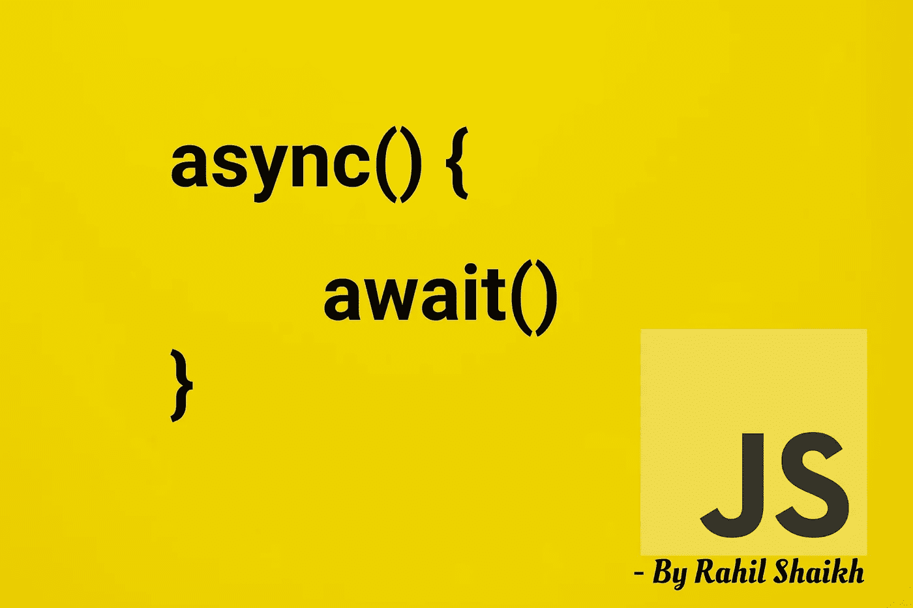
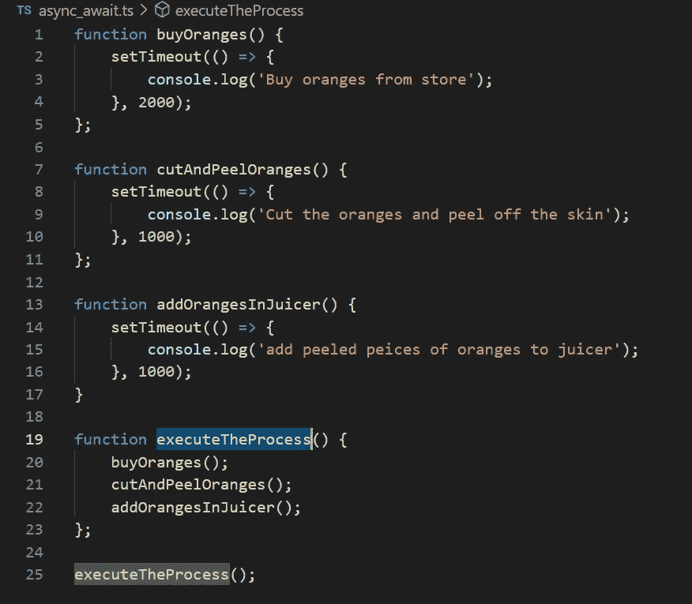
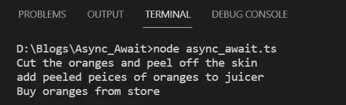
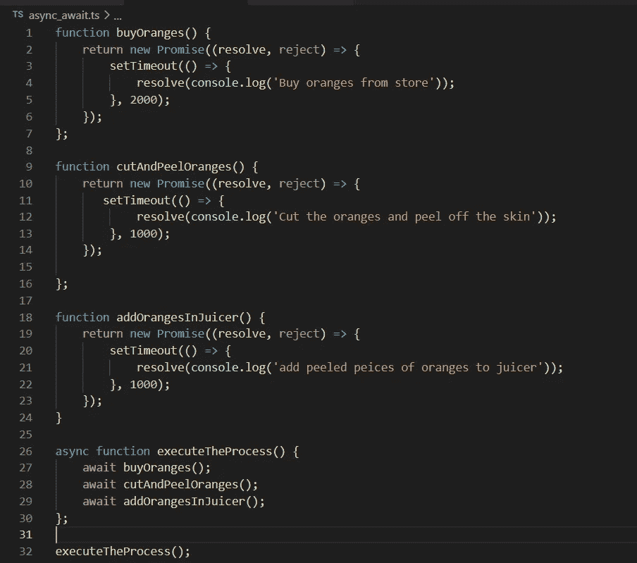
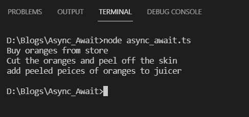

# Javascript 中的异步等待

> 原文：<https://medium.com/nerd-for-tech/async-await-in-javascript-e29abc2bfab7?source=collection_archive---------9----------------------->

## 如何用 async，await 处理 JavaScript 中的异步执行

刚接触 javascript 的人似乎经常对如何处理 Javascript 的异步特性感到困惑。这篇文章通过实用且易于理解的例子来帮助你理解 async await 是什么，为什么和什么时候。

# 为什么异步/等待 introduced❔

异步编程肯定有它的好处，但当要求某段代码只有在上面的代码成功执行后才能执行时，这就成了一个问题，为了处理这种情况，JavaScript 在 ECMAScript 2017 中引入了 async/await。在引入 async/await 之前，曾经有过承诺。Async/Await 使用 promises 本身，但使用 async/ await 比使用 promises 更容易，在本文中，我们将通过示例来了解如何使用 async/await。

# 让我们首先理解这个问题👀

考虑一个场景，你希望在家里制作橙汁，你首先需要从商店购买橙子，切开并去皮，最后加入榨汁机制作清爽的橙汁，但这些活动需要一些时间，需要按上述顺序完成，让我们将这些步骤写在代码中，并为每个任务关联一个时间，这个时间将是 JavaScript 的 setTimeout 函数。

用代码制作橙汁😋

我们为每个任务创建了三个函数，通过调用 executeTheProcess()函数中的这些函数来实现制作橙汁的最终目标，并通过 setTimeOut 为每个任务分配时间，我从商店购买橙子花费了更多时间，而将橙子切开/去皮并添加到榨汁机中花费的时间则更少。现在我们运行 executeTheProcess()函数来启动橙汁制作过程，让我们看看得到的输出。

不，这不是我们想要的过程，☹

哦！！，我们肯定不是这样做橙汁的！！。我们来了解一下这里发生了什么。

我们想先执行 buyOranges()函数，但它有 2 秒的超时，由于 JavaScript 的异步执行，这被添加到 eventloop 中，并开始执行下一个函数，即 cutAndPeelOranges()和 addOrangesInJuicer()，此时 2 秒的等待时间已完成 buyOranges()函数及其执行已完成，但这影响了使 juice 处理这个问题的步骤 async/await 在 JavaScript 中引入。

# 理解 async/await 以及它如何帮助解决问题😁

**Async/Await 与 promises** 一起工作，该函数在成功执行时返回一个 promises**resolve()**或者可以使用 **reject()** 拒绝。 **Await 关键字将保持进一步的执行，直到函数**返回承诺。当一个函数被标记为 async only 时，那么 await 关键字可以在其中使用。通过将**父函数标记为 async** 并将返回承诺的**子函数标记为 await** ，可以暂停执行直到完成，然后继续下一行。如果你还不知道到底要做什么，不要担心，一旦我们看到并理解了下面的例子，就清楚了。

现在让我们使用 async/await 来解决橙汁问题

我们将从三个子函数 buyOranges()、cutAndPeelOranges()、addOrangesInJuicer()中的每一个返回 promise，并将父函数 executeTheProcess()标记为 async，然后通过将它们标记为 await 来调用父函数中的上述每一个函数。

使用 async/await 制作橙汁😋

如上面的代码示例所示，我们已经从三个函数中的每一个函数返回了 promise，并且该函数通过使用 resolve()关键字解析 promise，我们希望打印的输出也在 resolve 关键字内，如果不是 console，而是您想要返回某个值，您可以使用 resolve 关键字作为 resolve("some value ")返回相同的值；。

来到 executeProcess()函数，您可以看到它已被标记为 async，并且其中的所有子函数都被标记为 await，现在下一行代码将保持挂起，直到标记为 await 的上一行代码的执行没有完成。因此，现在将首先执行 buyOranges()，执行将持续 2 秒钟，然后执行 cutAndPeelOranges()，执行将持续 1 秒钟，最后执行 addOrangesInJuicer()。现在让我们看看输出

成功制备橙汁✨🎉😋

**任务完成！！！😎🍊🍊🍊**

**完整代码示例:**

asyn_await 示例完整代码

# 关闭

我们已经了解了如何使用 async/await 关键字和承诺将同步行为传递给 JavaScript 代码的异步特性。

如果你觉得这篇文章有帮助，请鼓掌👏并与你的朋友和同事分享这些知识。不断学习📖，保持增长📈