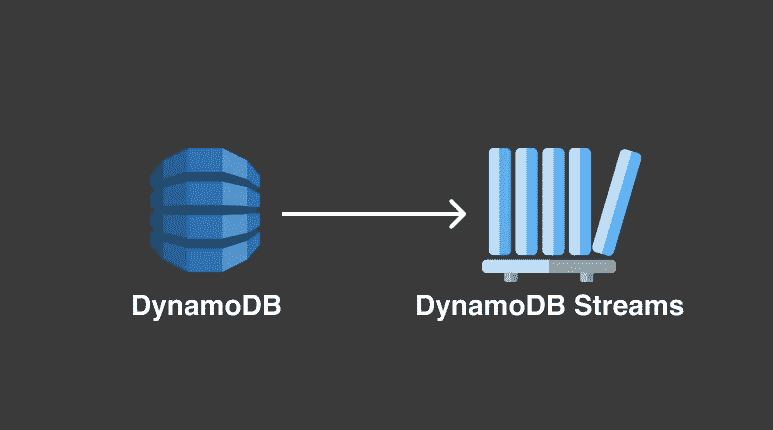

# 带 DynamoDB 流的异步 API

> 原文：<https://medium.com/nerd-for-tech/asynchronous-api-with-dynamodb-streams-4117776f2fa4?source=collection_archive---------5----------------------->

## 最佳速度和弹性

响应能力是任何 web 应用程序成功的最重要的参数之一。异步处理是实现这种响应的解决方案。来自浏览器的服务器请求应该立即返回，而不是等待完成。数据流应该被设计成不依赖于直接的…