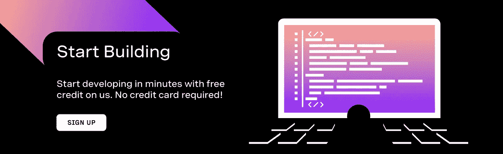
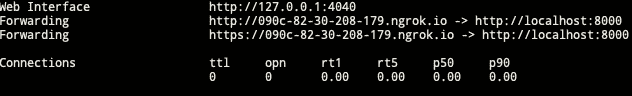

# 带有 Revoltphp & Vonage 语音 API 的异步 PHP

> 原文：<https://medium.com/nerd-for-tech/asynchronous-php-with-revoltphp-vonage-voice-api-a505c672aa2b?source=collection_archive---------0----------------------->

一些读者可能会感到惊讶，异步 PHP 并不是什么新鲜事。PHP5.5 早在 2014 年就引入了生成器，让我们走上了这条道路，从那时起，我们已经看到了 [amphp](https://amphp.org/) 、 [ReactPhp](https://reactphp.org/) 和[opens wole](https://www.swoole.co.uk/)的创建。

# 你好，纤维！

PHP 开发人员倾向于不考虑异步编程，因为我们习惯于处理请求/响应生命周期的本质(封装状态)。发生的一些事情可能会改变这一点:[将原生纤维引入 PHP8.1](https://wiki.php.net/rfc/fibers) 。虽然纤程可能不是“真正的”异步执行，而像 [node.js](https://nodejs.org/en/) 和 [Go](https://golang.org/) 这样的运行时是，但如果在没有任何阻塞 I/O 的情况下执行，它肯定会给你带来巨大的性能提升。

# 你好，RevoltPhp！

一个新的项目已经在 PHP8.1 发布后创建，[revert PHP](https://revolt.run/)，这是 amphp & ReactPhp 的创建者的合作，旨在将他们在协同例程中的经验用于利用新的纤程特性。虽然最好把它看作是一个“底层库”,供框架在其上使用(读/写流回调之类的概念可能很难导航)，但我将向您展示如何学习这个概念的一个小尝试。

# 紧急情况！资产失控！

好的，我的意思是我将介绍我们的用例，但我喜欢有时有点戏剧性。假设我们有现实世界的恐龙公园。当一只暴怒的食人蜥蜴逃出围栏时，需要通知员工。事实是，通信系统是用编写的，因此从技术上来说，它是一种阻塞式 I/O 语言。您需要使用 Vonage 同时呼叫 2000 名公园工作人员，并发出文本到语音的警告，对吗？让我们开始创建一个异步代码线程。

# 设置:PHP 8.1，Composer，Slim，ngrok，Vonage，RevoltPhp

## PHP 8.1

为此你需要 PHP 8.1，这还没有正式发布。Mac 用户可以在 [shivammathur 的家酿库](https://github.com/shivammathur/homebrew-php)下找到，Linux 用户可以在 [ondrej 的 apt PPA](https://launchpad.net/~ondrej/+archive/ubuntu/php/) 上找到，Windows 用户可以在 [PHP for Windows](https://windows.php.net/qa/) 的 QA 版块上找到。

## 设计者

我们需要 composer，PHP 事实上的依赖管理器，所以[如果你还没有得到它，请按照这里的安装说明](https://getcomposer.org/doc/00-intro.md#installation-linux-unix-macos)来做。

## 项目空间

以下需求将需要您的项目空间，因此创建一个新的目录来存放代码，并使用 composer 创建一个`composer.json`配置。为此，请在空白目录中运行以下命令:

`composer init`

## 纤细的骨架

为了让真正的非阻塞事件循环*和*拥有 HTTP 请求处理，您可能希望使用类似于 [ReactPhp 的 HTTP 客户端](https://reactphp.org/http/)的东西。不过对于这个例子，我们需要为语音 API 处理打开一些路径，而 [Slim](https://www.slimframework.com/) 是一种快速的方法。为了得到它，我们使用 composer:

`composer require slim/slim`

我们还需要一个 PSR-7 兼容的库来处理请求/响应(我已经用了 Guzzle 的，但是有几个选项可用):

`composer require guzzlehttp/psr7`

## ngrok

如果你以前没有遇到过 ngrok ，它是一个超级有用的工具，可以创建安全的 URL 隧道进入你的本地主机。我们需要这个来让 Vonage 的网钩工作。查看这里的[安装说明](https://ngrok.com/download)并为自己创建一个帐户。

## Vonage 语音 API

Vonage 为发送和接收调用提供了一个全功能的 API，所以我们将使用核心的 [PHP SDK](https://github.com/Vonage/vonage-php-sdk-core) 来发送出站调用。用 composer 安装它:

`composer require vonage/client-core`

# RevoltPhp

最后，我们需要从 RevoltPhp 获取事件循环。它目前仍然是预发布的，所以您需要指定 dev 分支:

`composer require revolt/event-loop:dev-main`

# 设置 Vonage 应用程序和号码

要创建呼出电话来警告幸福无知的公园工作人员海湾的危险，你需要相应地设置你的 Vonage 帐户。

# Vonage API 帐户

要完成本教程，您将需要一个 [Vonage API 帐户](http://developer.nexmo.com/ed?c=blog_text&ct=2021-11-12-asyncronous-php-with-revoltphp-vonage-voice-api)。如果您还没有，您可以今天就[注册](http://developer.nexmo.com/ed?c=blog_text&ct=2021-11-12-asyncronous-php-with-revoltphp-vonage-voice-api)并开始使用免费信用点数进行构建。一旦你有了一个帐户，你可以在 [Vonage API 仪表板](http://developer.nexmo.com/ed?c=blog_text&ct=2021-11-12-asyncronous-php-with-revoltphp-vonage-voice-api)的顶部找到你的 API 密匙和 API 秘密。

本教程还使用了一个虚拟电话号码。要购买号码，请前往*号码* > *购买号码*并搜索符合您需求的号码。

创建一个启用语音功能的新应用程序，并下载应用程序密钥。

# 打那个电话！

好了，让我们开始 Slim 应用程序。在项目路径中创建一个名为`/public`的目录，并在其中创建一个名为`index.php`的新 php 文件。我们的文件将如下所示:

这里有很多东西需要消化，所以我们来分解一下。

首先，我们使用我们之前创建的应用程序凭证来设置我们的 Vonage 客户端，使用一个`Keypair`对象并读入您下载的 SSH 密钥作为第一个参数，应用程序 ID 作为第二个参数:

接下来，我们通过使用 [faker](https://github.com/FakerPHP/Faker/) 库模拟要调用的电话号码的有效载荷，该库被设置为一个名为`$phoneNumbers`的变量。

Faker 允许您设置区域设置，所以在这种情况下，我选择了英国数字，将其设置为' en_GB '。如果你想设置一个不同的地区，[在这里](https://fakerphp.github.io/)看一下 faker 文档。

我们使用一个经典的`for`循环将电话号码创建到一个数组中，所以我们现在有 2000 个电话号码准备接收恐龙警告。我们怎么做呢？终点有一个`foreach`回路:

> 本教程是模拟一个例子，所以不要运行这个现场！原因是将会产生 2000 个假电话号码，Vonage 将会尝试给所有的号码打电话！

因此，我们的应用程序有了一个终点。它将循环通过所有要呼叫的电话号码，但是需要两件事情来完成我们的**同步**警告。你看到上面代码中的`setAnswerWebhook()`方法了吗？好吧，一旦我们打出那个电话，沃纳治需要知道怎么处理它。这就是 ngrok 和我们的 webhooks 的用武之地。

# 接通电话

Ngrok 会打开一个隧道，当你启动它的时候会给你一个本地主机的 URL。PHP 有一个内置的 web 服务器，所以我们将把它用于 localhost，然后启动 ngrok 来打开隧道。在我们创建的`public`目录中，启动内置的 PHP web 服务器:

我们机器上的端口 8000 现已开放，所以输入以下命令让 ngrok 隧道它:

如果一切顺利，您将得到如下回应:

它提供的 URL 需要添加到您的 Vonage 应用程序中。在仪表板上导航到您的 Vonage 应用程序，然后点击编辑。在编辑应用程序面板中，您可以为来电设置语音网络挂钩；获取 ngrok URL，并添加我们在 PHP 代码中设置 webhooks 时放置占位符的路径。例如，如果 ngrok 创建了 URL `https://aef9-82-30-208-179.ngrok.io`，我们将把我们的 webhook URLs 改为

*   [https://aef9-82-30-208-179.ngrok.io/webhooks/answer](https://aef9-82-30-208-179.ngrok.io/webhooks/answer)
*   [https://aef9-82-30-208-179.ngrok.io/webhooks/event](https://aef9-82-30-208-179.ngrok.io/webhooks/event)

以下是您在 Vonage 仪表板中编辑它们的位置:

然后，我们更改我们的 PHP 代码，当设置 webhooks 时，我们的路由现在看起来像这样:

# 设置警告

我们将发布一条新路线的恐龙警告，答案 webhook 指向这条路线。为了使用 Vonage 文本到语音转换，我们使用了一个叫做`NCCO object`的东西，这是一个 JSON 对象的专有名词，它控制如何处理调用。将以下路线添加到您的`index.php`:

NCCO 对象是作为对 webhook 的 JSON 响应给出的，所以 Vonage 知道如何处理它——在这种情况下，您选择的`language`和`style`将读出您选择的`text`。

# 回到异步与同步

我们有一个呼出电话的端点，当人们接听紧急电话时，我们有一个回复。但是，本文的重点是关于异步代码，对吗？我们的紧急端点，当在运行时被击中时，将同步循环通过每个号码并拨打它；那就是 PHP。所以，现在是纤维的时候了。

# 介绍 RevoltPhp

RevoltPhp 的事件循环将继续执行任何工作，直到没有更多的工作要做，并将控制权交还给父线程(这通常是应用程序的终止，因为对于非阻塞 I/O PHP 应用程序，我们希望`EventLoop`到*永远不会耗尽工作)。*

在我们的例子中，我们的出站调用目前是同步的，并且阻塞在`foreach`循环中。我们想在不可避免的混乱发生之前立刻通知所有 2000 名公园员工。

RevoltPhp 的事件循环定义了`EventLoop`类将执行的六个核心回调:

*   **延期**

> 回调在事件循环的下一次迭代中执行。如果安排了延迟，事件循环不会在迭代之间等待。

*   **延迟**

> 回调在指定的秒数后执行。几分之一秒可以用浮点数表示。

*   **重复**

> 回调在指定的秒数后重复执行。几分之一秒可以用浮点数表示。

*   **流可读**

> 当流中有数据要读取，或者连接关闭时，就会执行回调。

*   **流可写**

> 当写缓冲区中有足够的空间来接受要写入的新数据时，就会执行回调。

*   **信号**

> 当进程收到来自操作系统的特定信号时，回调被执行。"

好的，我们需要在我们的路径中创建回调。根据我们的需求，我们将需要`repeat`回调。它看起来是这样的:

Woah！那么这是什么？

# 事件循环

`EventLoop::run();`只要还有工作就会继续工作*。因此，我们正在用静态回调创建`EventLoop::repeat()`来创建一个工作负载。以下是它的主要部分:*

*   回调的第一个参数是 0，因为这是我们想要的迭代间隔的浮点数。请不要拖延，我们有恐龙在外面！
*   第二个是我们的回调一代——我们得到了用于纤程管理的`callbackID`。
*   变量`$static`记录有多少回调被创建。它被用作`$phoneNumbers`的索引，所以一旦我们没有更多的数据，`isset($phoneNumbers[$i])`为假，所以我们用回调 ID 取消事件循环作为参考。

这是代码部分，但在引擎盖下发生了什么？最后，我们得到:

# 异步 PHP

与传统的 PHP 同步操作不同，从事件循环运行的那一刻起，封装的`repeat`回调就遍布 PHP 的运行时纤程。这是用纤程触发的 2000 个调用，而不是同步执行。从 PHP 开发人员的角度来看，有趣的是，这是在没有一些常见的工程方法来分散负载的情况下完成的，例如使用 [Laravel](https://laravel.com/docs/8.x/queues) 作业/队列工作器或无服务器架构，其中 [Bref](https://bref.sh/) 绑定到[谷歌云计算](https://cloud.google.com/compute)或 [AWS Lambda](https://aws.amazon.com/lambda/) 。这些都是非常好的方法，但是这里的要点是我们的方法**是普通的 PHP** 。

多亏了 Vonage 和 RevoltPhp，我们可以更快地称之为“安全”,多亏了我们公园工作人员的不懈努力，我们才可以尽快将这些资产纳入控制范围。

*最初发布于*[*https://learn . vonage . com/blog/2021/11/12/async ronous-PHP-with-revolt PHP-vonage-voice-API/*](https://learn.vonage.com/blog/2021/11/12/asyncronous-php-with-revoltphp-vonage-voice-api/)