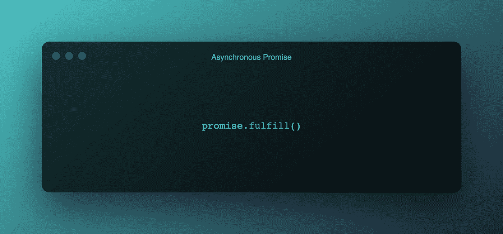
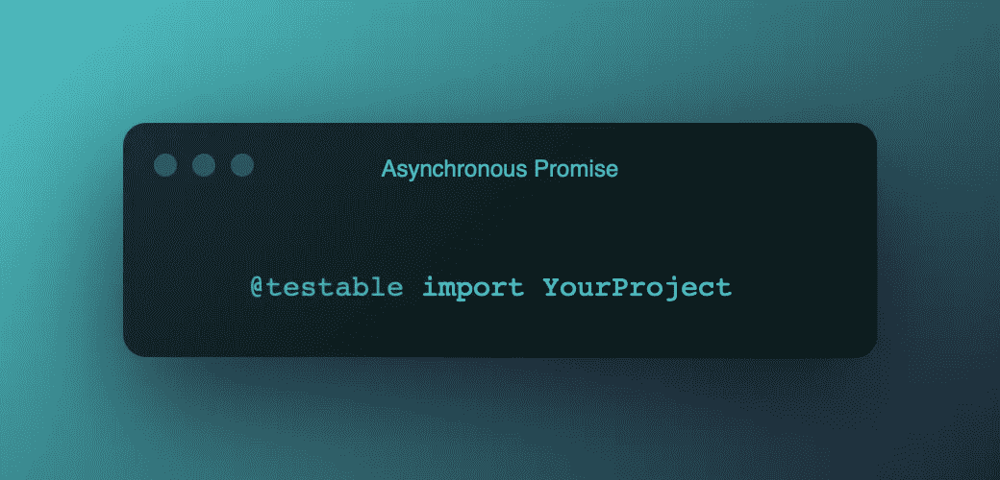
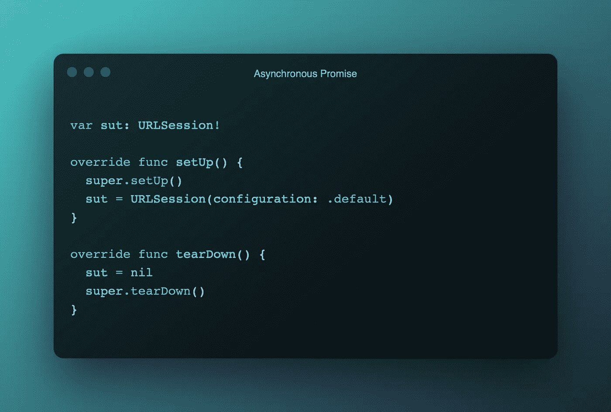
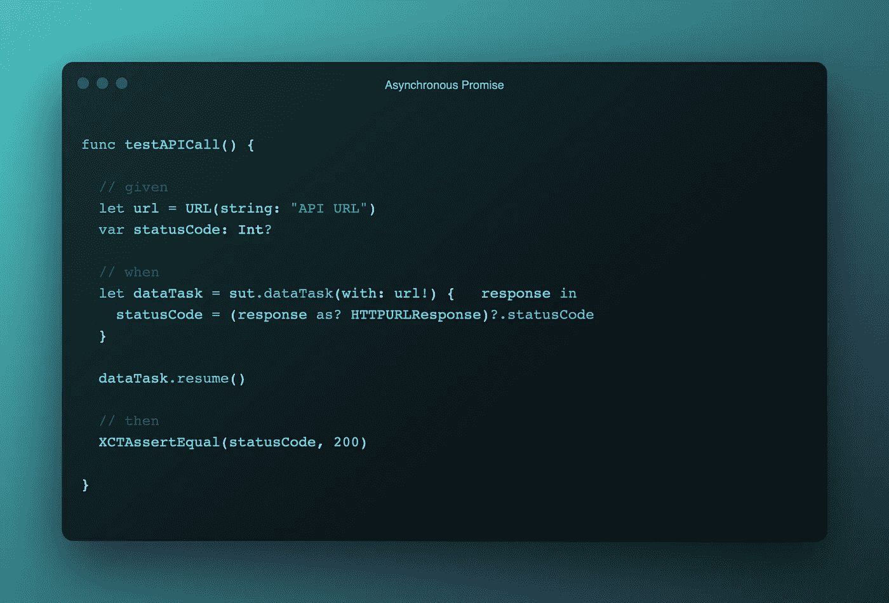
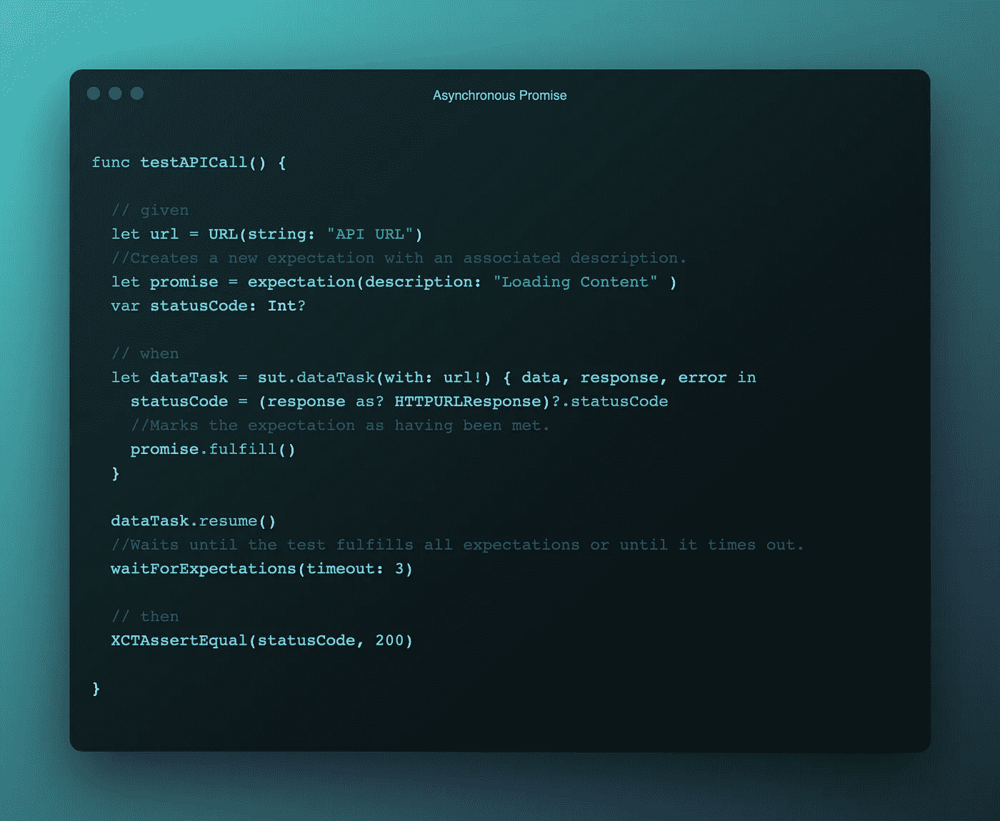

# 异步承诺

> 原文：<https://medium.com/nerd-for-tech/asynchronous-promise-e3a70a18cd58?source=collection_archive---------34----------------------->

## iOS 测试指南

测试异步代码并不简单。

**有什么问题？**

通常，当函数返回时，测试就结束了。使用这个理论，所有的异步代码都将被跳过，因为测试将在代码开始之前结束。

**有什么解决办法？**

一个承诺。我们需要告诉系统等待一段特定的时间，或者直到我们履行承诺。

**怎么做到的？**

在这里我们所说的承诺实际上是一种期望- `**XCTestExpectation**`，但承诺是软件行业中广泛使用的术语，你自己谷歌一下就知道了。

使用`**expectation(description:)**` 方法设置期望值，并提供解释期望值的描述。

当异步代码完成时，调用`**fulfill()**`方法。

然后使用`**waitForExpectations(timeout:)**`继续运行，直到超时间隔结束，或者达到预期。

让我们看一些代码。

导入您要测试的项目。

在这个例子中，我们将使用`**URLSession**` 。为此，您可以使用自己的类/结构或任何第三方库，如[***aloma fire***](https://github.com/Alamofire/Alamofire)。

编写`**setUp()**` 和`**tearDown()**`方法。

让我们在没有承诺的情况下编写测试，看看它是如何失败的。测试总是会失败，因为当调用`**XCTAssertEqual()**` 方法时，完成处理程序中的代码甚至没有启动。使用断点或打印语句来验证这一点。

是时候使用我们首先看到的方法来编写我们的测试了。我们将使用**给出的** - **当** - **然后**的格式来编写这个测试用例，如果你想了解更多关于这个格式的内容，那么就来看看 [**iOS:行为测试-给出当然后在 UI &单元测试**](/nerd-for-tech/ios-behavioural-testing-given-when-then-in-ui-unit-testing-part-1-41e3eff8811b) 。

现在您将能够看到在 3 秒钟之后或者在调用了`**fulfill()**`方法之后调用了`**XCTAssertEqual()**`方法。使用断点对此进行检查。

***就这样了伙计们，我该离开了。***

# 👾要点

**🙏🏽感谢-** [雷·温德里奇](https://www.raywenderlich.com)，[保罗·哈德森](https://www.hackingwithswift.com)，[雷·索恩](https://ray.so)