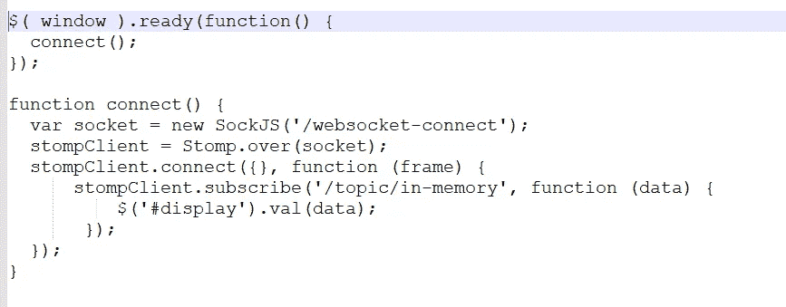
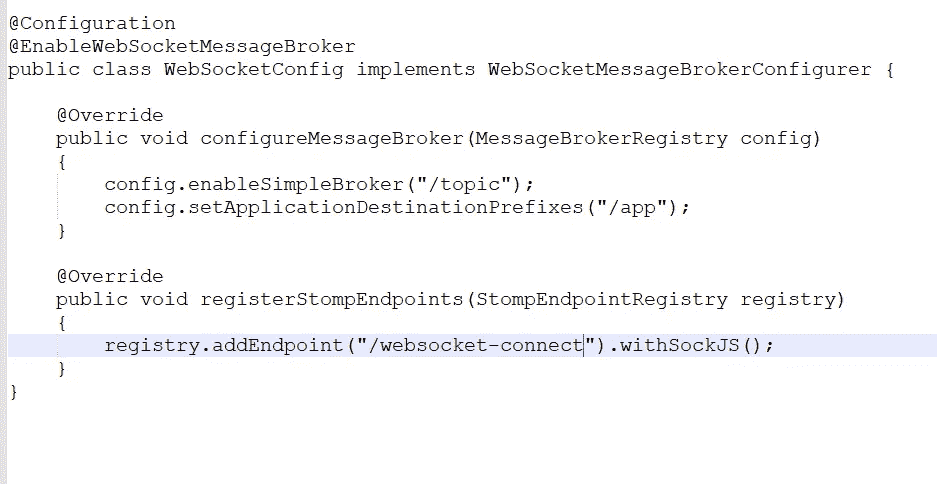
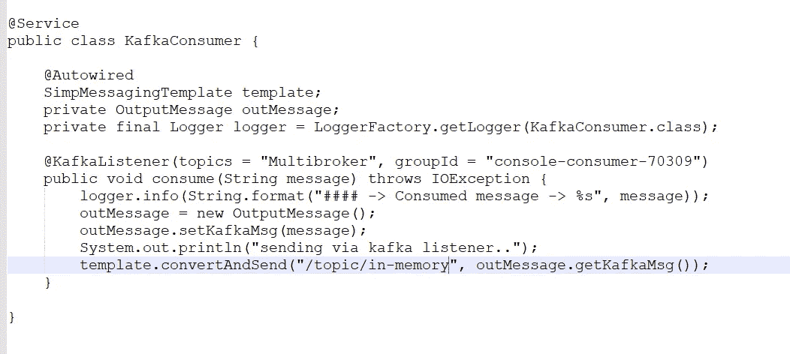
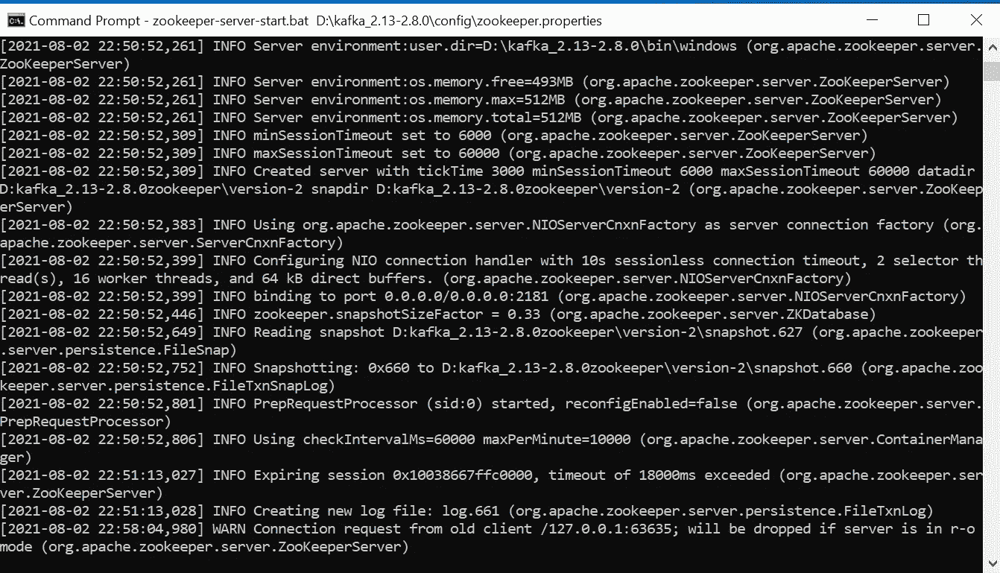
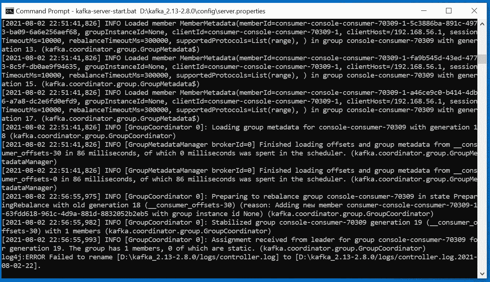
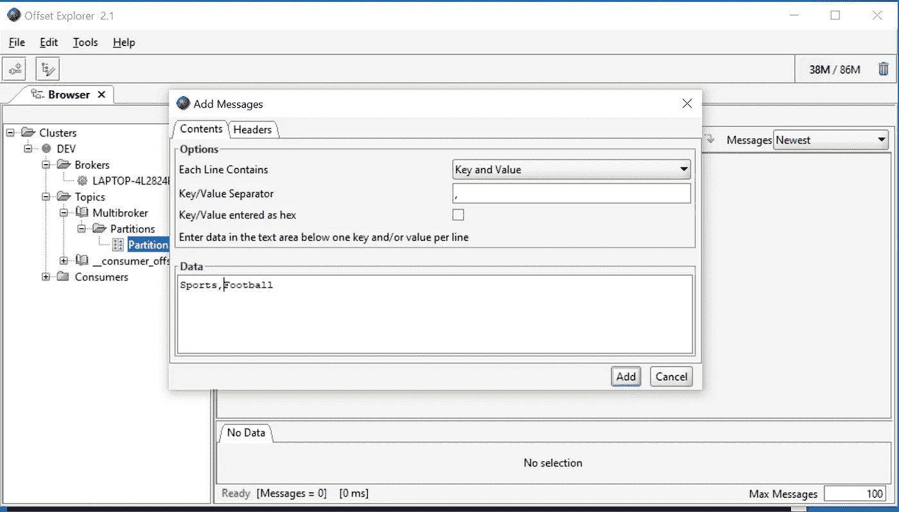
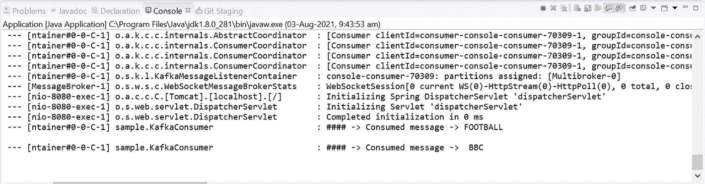
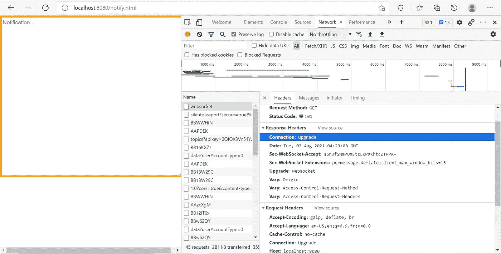
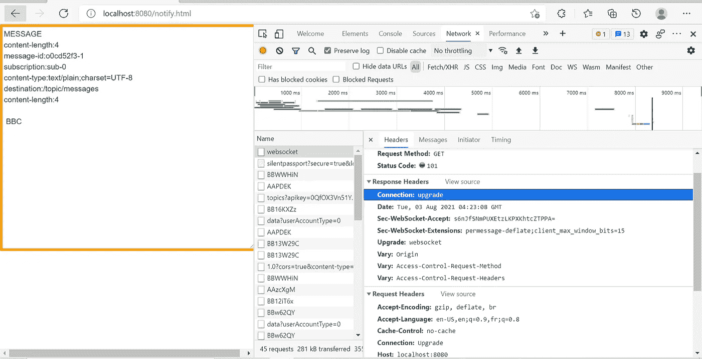

# 异步 WebSocket 消息中间件和微服务

> 原文：<https://medium.com/nerd-for-tech/asynchronous-websocket-messaging-middleware-and-microservices-1a50a8f14e4b?source=collection_archive---------4----------------------->

## 沿着 SOCK JS 的 HTTP 升级

## Apache Kafka PUSH 范例与 STOMP 客户端一起使用

STOMP 客户端、SOCK JS 和 WebSocket 架构

# 范围

写这篇文章是为了帮助*初学者*和*中级*对 WebSocket ***双向*** 和 ***全双工*** 通信到 ***API*** (应用程序接口)和 ***UI*** (用户界面)有了代码示例。
*解释以下概念:*
a. WebSocket，HTTP 升级
b. Sock JS，JavaScript 库
c. STOMP Client(简单面向文本的消息传递协议)
d. Kafka 异步推送范式

# 先决条件

a.Kafka _ 2.13–2 . 8 . 0
b . Offset Explorer 2.0(Kafka tool)
c .弹簧靴

# 什么是 WebSocket？而我们看到的优于 HTTP 的优势呢？

***HTTP*** 是同步的，是基于 ***拉*** 范式的。在拉范例中，客户端必须发起请求并轮询服务器以接收新数据，这是半双工和单向的**。** *每次建立连接都需要一个新的 TCP****(****传输控制协议* ***)*** *会话。*

***WebSocket*** 为全双工双向。这意味着客户端或服务器可以发起请求，并且通信可以与浏览器和服务器之间的持久连接并行进行，直到它们中的任何一个继续断开和关闭连接。
与 http 相反，websocket 支持异步通信，并允许服务器发起基于 ***推*** 范例的请求。服务器可以发起请求并向客户端推送实时信息。
*最初的 http 连接是* *升级为 websocket 并用于所有未来的通信中的单个***TCP 会话。***web socket 中的数据交换量相比http **要小得多。每次请求时，HTTP 都会产生一个开销，将头和 cookies 传输到服务器，这增加了延迟。websocket 提供持久的低延迟连接。*****

# ***这篇文章是如何组织的？它分享了哪些组件和产品来说明？***

******让我们来理解一下设计:-***
一个简单的浏览器客户端会通过 Sock JS，一个 JavaScript 库，建立 websocket 连接。浏览器发起的请求将升级到 websocket，以提供持久的、全双工的双向连接。Sock JS 客户端将尝试并连接使用最佳可用传输，即[websocket，xhr polling，xhr streaming]。
STOMP(简单面向文本的消息协议)在 websocket 协议之上运行，向服务器发起请求，并订阅内存中的消息代理。在这个设计中，Kafka 监听器从 Kafka Topic 接收数据，并异步发送到内存中的消息代理。由于 STOMP 客户端已经订阅了内存消息代理，它将接收数据并在客户端显示。来自客户端的数据传输和从服务器接收的数据异步发生。***

# ***让我们访问代码，并了解它是如何工作的？***

******a. JavaScript 代码******

******

******JavaScript 代码—连接和订阅******

***上面的 JavaScript 代码调用函数 connect()，该函数启动 http 连接并升级到 websocket。传递给 Sock JS 构造函数的端点是一个注册的 STOMP 端点，支持 Sock JS 与 websocket 通信。STOMP 客户端订阅内存中的消息代理，接收服务器端 Kafka 推送的异步数据。***

******b .弹簧开机配置类******

***配置代码显示了 STOMP 端点注册和启用内存中的消息代理。***

******

***STOMP 注册和启用内存中的消息代理***

******c . Spring boot Kafka Listener 类*** Kafka Listener 将从 Kafka Topic 异步接收数据，并将接收到的数据推送到 STOMP 客户端订阅的端点，即内存中的消息代理，如下图所示。
*更多关于阿帕奇卡夫卡及其术语的信息*、 [***查看此链接***](/geekculture/multi-broker-insights-into-apache-kafka-cluster-architecture-617b0abfc53e)**获取更多见解。*****

********

****卡夫卡听众****

# ****让我们运行应用程序:浏览器到服务器****

*******在这个应用程序中执行以下操作:-***
*1 .启动动物园管理员和卡夫卡经纪人*****

********

****Zookeeper 实例在端口 2181 上运行****

********

****在端口 9092 上运行的 Kafka Broker 0****

*****2。启动偏移浏览器工具向 Kafka 发送消息主题*****

********

****向 Kafka broker 发送消息—键/值对****

*****3。启动弹簧启动应用程序*****

********

****从 Kafka Broker 收到的消息****

*****4。在开发者工具模式下启动浏览器查看连接* ***升级*** *从 HTTP 到 WebSocket*****

********

****模式:开发人员工具—连接升级****

*****5。查看 STOMP 客户端订阅的来自 Kafka Topic 的消息*****

********

****推送通知—从 Kafka broker 收到的异步消息****

# ****结论****

****总结这篇文章，我们理解了 WebSocket 的定义和使用 Sock JS 和 STOMP client 的优点。应用程序的设计和实现有助于理解启动 websocket 连接和从 Kafka 主题异步接收数据以在客户端用户界面上发布的简单代码片段。****

*******发布于 2021 年 8 月 3 日*******

> *******其他中等文章，*由 *Ganesh Nagalingam*******
> 
> ****[*探寻语法树和补救代码气味利用 JAPA*访问者模式](/geekculture/quest-syntax-tree-and-remedy-code-smell-using-japa-visitor-patterns-f023a89842cf)****
> 
> ****[通过 CORS 将 Angular 与 Spring Cloud 建筑融合](/geekculture/amalgamate-angular-with-spring-cloud-architecture-through-cors-7f13b5fdb98f)****
> 
> ****[*多代理洞察 Apache Kafka 集群架构*](/geekculture/multi-broker-insights-into-apache-kafka-cluster-architecture-617b0abfc53e)****
> 
> ****[远程队列定义:IBM MQ v9.2](https://ganeshblog.medium.com/remote-queue-definition-ibm-mq-v9-2-c3ec4f568dab?source=user_profile---------5----------------------------)****
> 
> ****[Kubernetes Pods&Docker Containers:在 Windows 10 Home 中使用虚拟盒子旋转虚拟机](https://ganeshblog.medium.com/kubernetes-pods-docker-containers-spin-vm-using-virtual-box-in-windows-10-home-d3be783ff087?source=user_profile---------0----------------------------)****
> 
> ****[联合 OKTA IdP + WSO2 API 管理器作为 Spring boot 微服务集成的网关](https://ganeshblog.medium.com/federate-okta-idp-wso2-api-manager-as-gateway-to-spring-boot-microservices-integration-ba567567e81?source=user_profile---------1----------------------------)****
> 
> ****[将 IBM 业务流程管理器与混合 MobileFirst 应用程序集成](https://ganeshblog.medium.com/integrate-ibm-business-process-manager-with-hybrid-mobilefirst-application-5aed20841bf3?source=user_profile---------2----------------------------)****
> 
> ****[Kerberos v5:使用 Apache directory studio 在 Windows 10 Home 中进行 SSO 认证](https://ganeshblog.medium.com/kerberos-v5-sso-authentication-in-windows-10-home-using-apache-directory-studio-fb0151899185?source=user_profile---------3----------------------------)****
> 
> ****[整合服务提供商(sp)和 OKTA 身份提供商(IdP)](https://ganeshblog.medium.com/integrate-service-providers-sps-with-okta-identity-provider-idp-ce64a4e262ae?source=user_profile---------4----------------------------)****
> 
> ****[将 IBM WebSphere Service Registry and Repository 与 IBM Process Server 集成](https://ganeshblog.medium.com/integrate-ibm-websphere-service-registry-and-repository-with-ibm-process-server-f97eeb0e2ea?source=user_profile---------6----------------------------)****