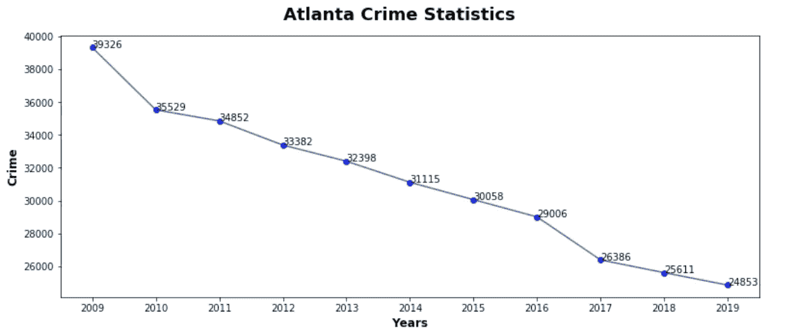
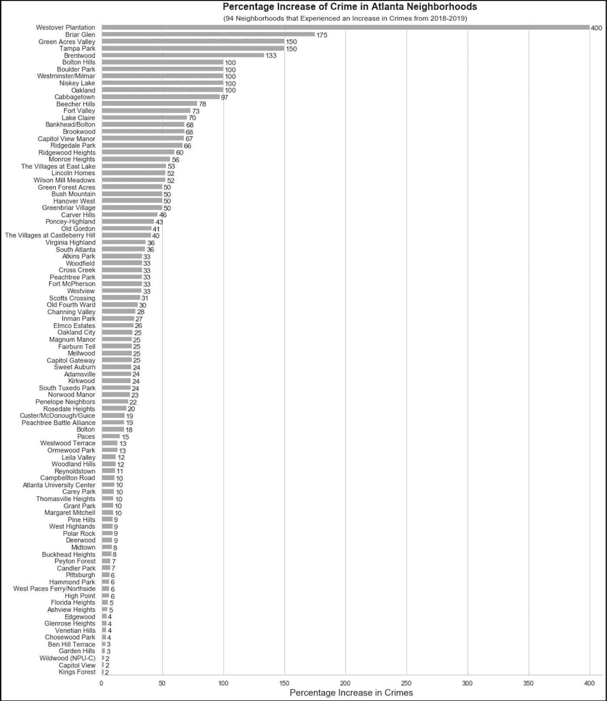
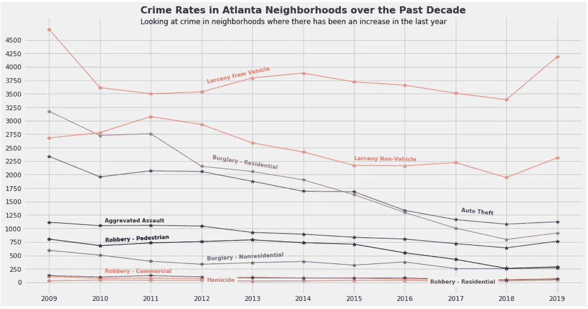

# 亚特兰大犯罪率在上升？

> 原文：<https://medium.com/nerd-for-tech/atlanta-crime-on-the-rise-857fb166dd79?source=collection_archive---------1----------------------->

水彩艺术印刷的美国佐治亚州亚特兰大的天际线由克里斯·史密斯

亚特兰大被称为南方的纽约。我在纽约生活了大半辈子，生活在两个最大的区之间——布朗克斯和曼哈顿——我觉得这很难相信。在搬家之前，我丈夫卖给我一个城市绿洲，那里有纽约所有的文化和激情，但是有更多的树和更少的犯罪。当我们安定下来时，我准备过一种清新、悠闲、安全的生活，但这个泡沫会很快破灭吗？

在我们买了房子后，我在社区里变得活跃起来。我加入了社区页面，以便及时了解发生的事情，并尽力做一个好邻居。许多反复出现的话题之一，尤其是在过去的一年里，是犯罪率的上升。甚至我热爱亚特兰大的丈夫也注意到了这一点。这是什么意思？我应该跑回童年时充满犯罪的舒适的街道吗？在收拾行李之前，我意识到，我可以用数据来检验这一点。

我能够从亚特兰大警察局网站([https://www.atlantapd.org/i-want-to/crime-data-downloads](https://www.atlantapd.org/i-want-to/crime-data-downloads))找到犯罪记录，这些记录包含 2009 年至 2019 年的犯罪报告。我试图用这些数据回答的第一个问题是亚特兰大的犯罪率在上升？

# **亚特兰大的犯罪率在上升吗？**

根据这张图表，自 2009 年以来，犯罪率似乎急剧下降。

在对数据进行快速汇总后，我可以看到整体犯罪率急剧下降，但这并不能让我满意。我有更多的问题，亚特兰大所有社区的犯罪率都在下降吗？还有，所有的犯罪都在减少吗？所以我深入研究了数据集，看看还能找到什么。

# 是的，但是……所有的社区都减少了吗？

该图探索了 2019 年发生的犯罪类型，并根据经度和纬度进行了绘制。

亚特兰大的所有社区犯罪率都下降了吗？我想知道我在北巴克黑德的邻居是否经历了一次激增(这将让我知道我是否需要订票)。亚特兰大警察局的数据集中记录了不同犯罪的邻居信息。利用这些信息，我可以按街区汇总犯罪率。下图显示了犯罪率上升的街区。

【https://plot.ly/~jiobu1/18/】互动图——显示 2018 年至 2019 年的数字增长

在该数据集中记录的 243 个社区中，38%，即 94 个社区，从 2018 年到 2019 年经历了犯罪的增加。我的邻居不在这个名单上，但周围的几个邻居都经历了增长。

# 哪些犯罪导致了这些街区犯罪率的上升？

我的下一个问题是，哪些犯罪导致了这种增长？为了找到答案，我选取了亚特兰大 PD 数据集的一个子集。我使用了经历了激增的 94 个社区，来看看哪些犯罪是造成这种增长的原因。

这些罪行被分为 11 类。

所有记录在案的犯罪都在增加，除了过失杀人。

为了更好地看到这一点，我创造了单独的情节来突出变化。

这些图表是利用 2018 年至 2019 年犯罪率上升的 94 个街区生成的

在 11 种犯罪类型中，有 10 种在这些社区有所增加。凶杀案上升了 46%，商业抢劫上升了 43%，住宅抢劫上升了 33%，车辆盗窃上升了 24%，恶性袭击上升了 19%，非车辆盗窃上升了 18%，住宅盗窃上升了 15%，行人抢劫上升了 11%，汽车盗窃上升了 4%，非住宅抢劫上升了 4%。唯一没有上升的类别是过失杀人。

# 结论…

虽然亚特兰大的整体犯罪率一直在下降，但几个社区的犯罪率却在上升。我找到城市绿洲的梦想可能很快就会破灭。所以…虽然我还没有买回纽约的机票，但我已经收拾好行李，以防万一。

从好的方面来看，亚特兰大仍然有更多的树。

你可以在 [Github](https://github.com/jiobu1/DS-Unit-1-Sprint-4-Data-Storytelling-Portfolio-Project/blob/master/Jisha_Obukwelu_Unit_1_Data_Storytelling_Project.ipynb) 上查看我的代码。