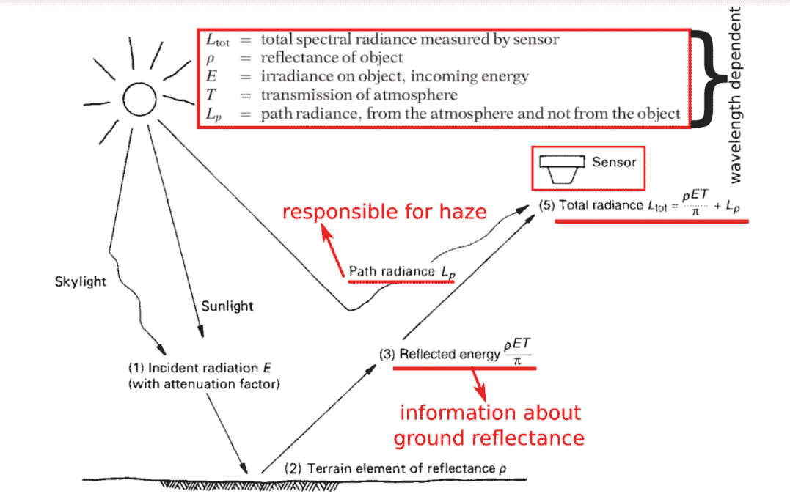
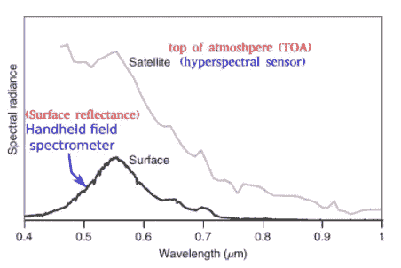
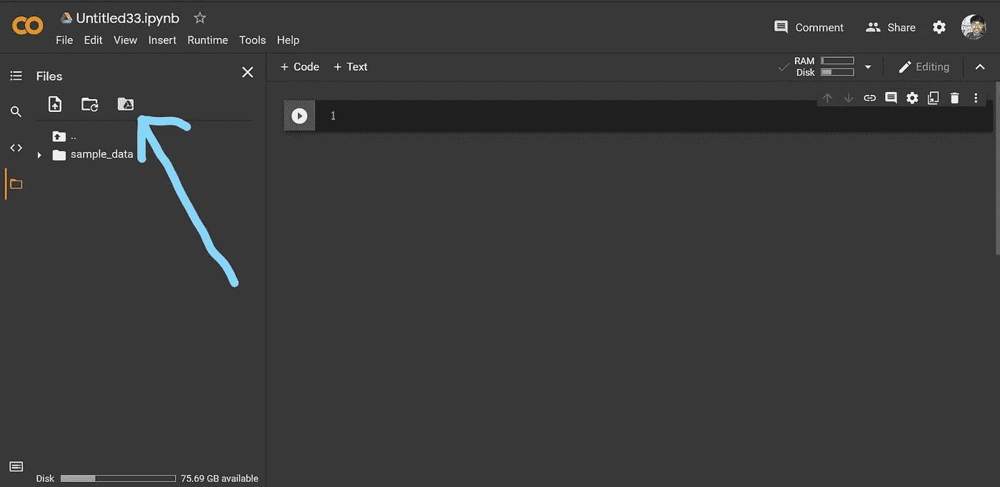
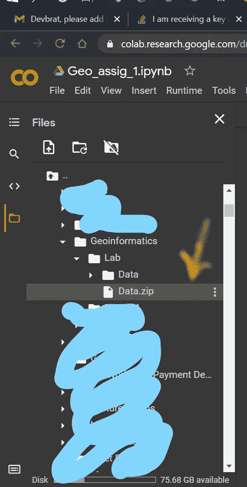
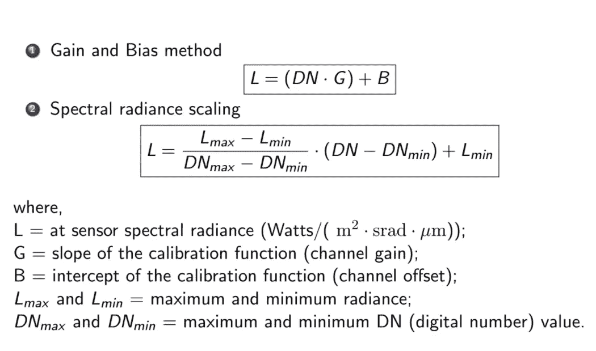
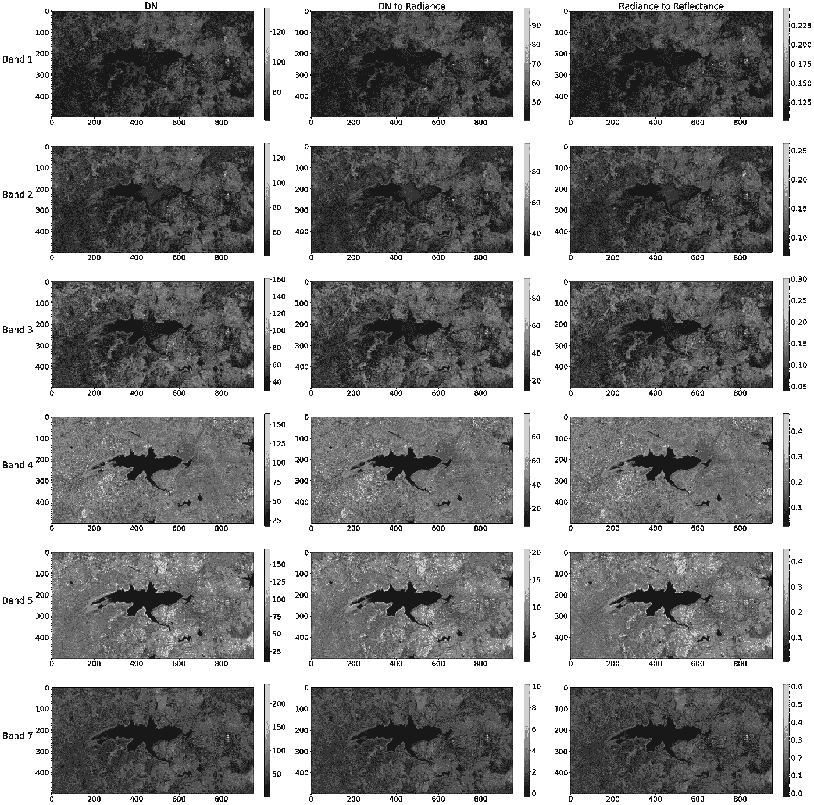
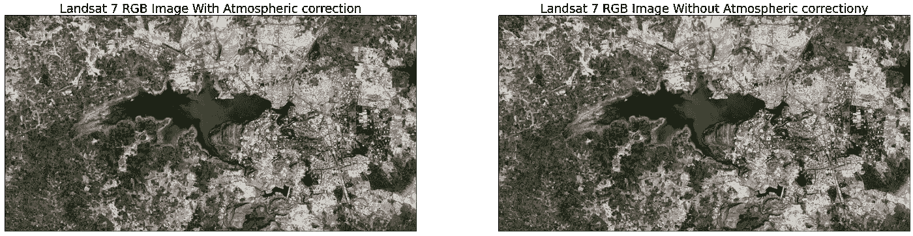
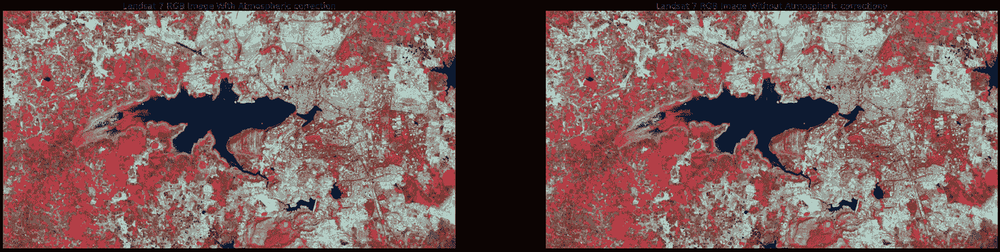
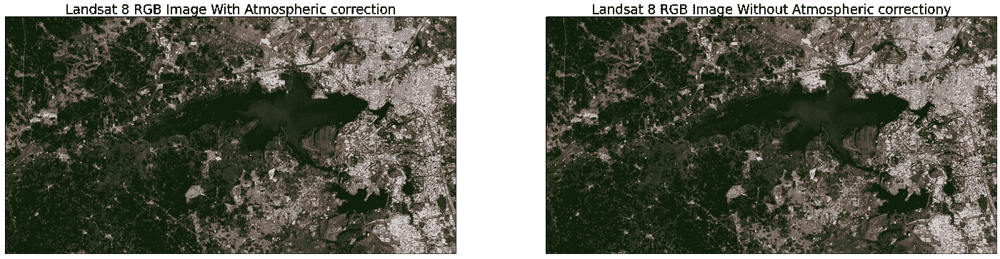
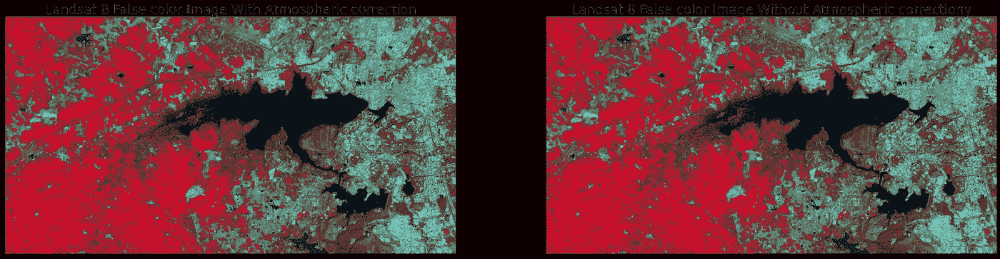

# 利用 Python 实现卫星图像的大气校正

> 原文：<https://medium.com/nerd-for-tech/atmospheric-correction-of-satellite-images-using-python-42128504afc3?source=collection_archive---------2----------------------->

本文将帮助您编写 python 代码，从卫星图像的 DN(数字编号)中提取反射率。在本教程中，我们将同时使用 Landsat 7 和 Landsat 8 的图像。你可以在这里得到完整的代码。

[](https://github.com/AslanDevbrat/Geoinformatics/blob/main/Geo_assig_1.ipynb) [## AslanDevbrat/地理信息学

### 包含地理信息学的项目工作。通过创建帐户为 AslanDevbrat/地理信息学的发展做出贡献…

github.com](https://github.com/AslanDevbrat/Geoinformatics/blob/main/Geo_assig_1.ipynb) 

# 为什么不能直接用卫星图片？



大气对光谱响应模式的影响

辐照度来自两个来源:

1.  直接反射的阳光
2.  漫射天光

*   在任何给定的图像中，阳光与天光的相对优势
    强烈地依赖于天气条件(例如，晴天对雾天对
    多云)。
*   辐照度随着太阳仰角的季节变化和
    地球和太阳之间距离的变化而变化。



发光

*   对于靠近地球表面放置的传感器，路径辐射通常很小或者可以忽略。
*   由于地球表面和航天器之间的大气路径较长，来自卫星系统的图像将更强烈地受到路径辐射的影响。

由于地球表面和
卫星在大气层上方的位置之间的大气层厚度，第二个光谱响应
图案显示了由于
外来路径辐射导致的短波长信号增强。在原始形式中，来自 eld 光谱辐射计的近地表测量不能与卫星测量直接比较，因为一个观测地表反射率，而另一个观测所谓的大气顶部(TOA)反射率。在进行这种比较之前，需要对卫星图像进行大气校正处理。原始光谱数据被修改以补偿大气散射和吸收的预期影响。

# 如何获取相关数据？

好吧，对于本教程，我会帮你搞定，但如果你真的想做自己的实验，你可以自由探索 [USGS](https://earthexplorer.usgs.gov/) 数据集。

首先，将这个 zip 文件添加到 google drive 的一个文件夹中，该文件夹名为“geo informatics Now Open[Google Colab](https://colab.research.google.com/)并创建一个新的笔记本。现在从左侧面板，“安装你的谷歌驱动器。”



安装驱动器

完成后，你会看到一个名为“drive”的文件夹。现在，在文件夹中找到保存数据集的文件夹。



找到 Data.zip 文件后，右键单击它并复制路径。现在运行下面的命令来解压缩数据集。

```
# unzipping the data.zip file!unzip /content/drive/MyDrive/Geoinformatics/Lab/Data.zip
```

现在你会在根目录中找到 3 个解压缩的文件。一个是 Bhopal_Mask.zip，另外两个是包含 Landsat 7 和 Landsat 8 卫星图像的文件夹。现在我们也将提取这些文件

```
#creating the folder named L7 and extracting the landsat7 data into it.!mkdir L7!tar -xvf  /content/LE07_L1TP_145044_20021210_20170127_01_T1.tar.gz -C /content/L7#creating the folder named L8 and extracting the landsat8 data into it.
!mkdir L8
!tar -xvf  /content/LC08_L1TP_146044_20201226_20201226_01_RT.tar.gz -C /content/L8# Unzipping the bhopal mask.zip
!unzip Bhopal_Mask.zip
```

到目前为止，数据收集部分已经完成。

# 我们将使用哪些 Python 库？

使用以下代码安装所需的库

```
# installing the all the required library!pip install elevation
!pip install richdem
!pip install pysheds
!pip install plantcv
!apt install imagemagick
!pip install fiona
!pip install rasterio
!pip install shapely
!pip install pyproj
!pip install geopandas
!pip install rioxarray
!pip install earthpy
```

然后导入库:

```
# importing the required librariesfrom osgeo import gdal
import matplotlib
import elevation
from matplotlib.pyplot import figure
import os
import earthpy as et
import fiona
import rasterio
import rasterio.mask
import matplotlib.pyplot as plt
import numpy as np
import geopandas as gpd
from rasterio.crs import CRS
import rioxarray as rxr
import earthpy as et
import geopandas as gpd
import xarray as xr
import rioxarray as rxr
import earthpy.spatial as es
import earthpy.plot as ep
```

# 使用 Landsat 7 影像

大气校正包括两个步骤:

1.  光芒万丈
2.  反射比辐射率

因此，让我们深入了解 DN 到辐射转换。我们有两种方法。

*   增益和偏置方法
*   光谱辐射标度

我们将看到这两种技术。此外，这两种技术给出了相同的结果。

# 光芒万丈



光芒万丈

**增益和偏置方法:**

现在出现的主要问题是，如何得到 G 和 B 的值？

因此，对于不同卫星的每个频段，G 和 b 都有另一个值，所有这些值都可以在卫星的元数据手册中找到。因此，如果您查看我们创建的 L7 文件夹，您会发现一个“…..MTL.txt "文件。那是一个元数据文件。在该文件中，G 存储为“*光辉 _ MULT _ 波段 _ <号>，*”，B 存储为“*光辉 _ 添加 _ 波段 _ <号>* ”所以如果你愿意，你可以手动设置每个波段和每个卫星的值**，**或者你可以像我一样聪明，用 python 的方式来设置。

这将创建一个元数据文件字典。如果你一直跟着我，看起来你对这篇文章很感兴趣。

**为什么要做掩蔽？**

掩蔽是必需的，因为我们使用的图像是巨大的。如果你操作这些图像，你可能会以一个内存溢出错误结束。因此，让我们的代码快速无崩溃。我们必须应用掩蔽。使用遮罩的另一个原因是当您只想研究图像中的特定区域时。然后我们掩盖图片的另一部分。

# 反射比辐射率

现在你拥有了你需要的一切。如果你画出校正后的图像，你会得到这样的结果。


Landsat7 的大气校正图像。

# 光谱辐射亮度法

类似于增益和偏置方法，我们将得到 Lmin、Lmax 和。形成元数据文件。

现在让我们使用光谱辐射法绘制校正后的图像。



使用光谱辐射方法校正 Landsat 7 的图像

需要注意的是，这两种方法创建的图像是相同的，所以选择哪种方法并不重要。两者都会给你同样的结果。此外，对于辐射率到反射率，我们只有一种方法，对于 DN 到辐射率，我们有两种方法。

现在，你不想看 RGB 合成图像吗？



伪彩色合成图像:



现在，如果你对 Landsat8 图像执行类似的步骤，你可以很快得到结果。

您的最终图像将是这样的:

RGB 图像:



真彩色合成

伪彩色合成:



伪彩色合成。

从以下 GitHub 或 colab notebook 获取完整代码。

[](https://github.com/AslanDevbrat/Geoinformatics/blob/main/Geo_assig_1.ipynb) [## AslanDevbrat/地理信息学

### 包含地理信息学的项目工作。通过创建帐户为 AslanDevbrat/地理信息学的发展做出贡献…

github.com](https://github.com/AslanDevbrat/Geoinformatics/blob/main/Geo_assig_1.ipynb) [](https://colab.research.google.com/drive/1DcwL8xAE1t5NnHuUXxtACFEBBgP64AvZ?usp=sharing) [## 谷歌联合实验室

colab.research.google.com](https://colab.research.google.com/drive/1DcwL8xAE1t5NnHuUXxtACFEBBgP64AvZ?usp=sharing)