# 将 IAM 角色附加到 EC2 实例以访问 DynamoDB

> 原文：<https://medium.com/nerd-for-tech/attach-an-iam-role-to-ec2-instance-to-access-dynamodb-2d6706ebeb91?source=collection_archive---------1----------------------->

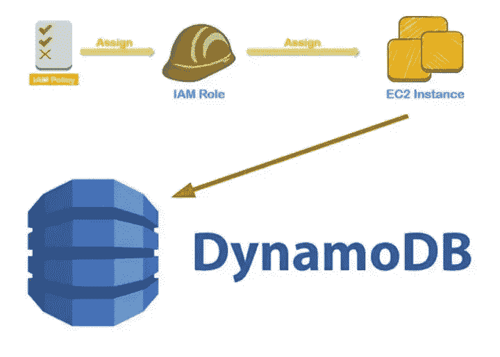

图片作者:Revathijoshi

## 代表团

1.  为您选择的东西创建一个 DynamoDB 表
    (例如电影、食物、游戏)
2.  向表格中添加 10 个或更多项目
3.  通过 AWS CLI 创建 t.2micro Ec2 实例
4.  使用 IAM 角色和最小特权原则，授予 EC2 实例对 DynamoDB 的读取权限。
5.  在 EC2 实例中使用 AWS CLI 扫描 DynamoDB 表
6.  在 EC2 实例中使用 AWS CLI 来验证您不能将项目写入 DynamoDB 表

## 行政和后勤

*   AWS DynamoDB 基础知识
*   AWS S3 基础知识
*   AWS CLI 基础
*   利用参考章节获得 AWS 文档协助


图片由[乔罗诺](https://pixabay.com/users/jorono-1966666/?utm_source=link-attribution&utm_medium=referral&utm_campaign=image&utm_content=3579691)从[皮克斯拜](https://pixabay.com//?utm_source=link-attribution&utm_medium=referral&utm_campaign=image&utm_content=3579691)拍摄

## 执行

当我试图决定用什么主题来创建我的表格时，我遇到了[ChampsOrChumps.com](https://champsorchumps.us/records/best-nfl-regular-season-records#tab-win-percentage)，这里有一些关于运动队及其各自城市的有趣统计数据。例如，他们通过胜率来跟踪拥有最佳常规赛记录的 NFL 球队，然后告诉你他们那年是否赢得了超级碗。我选择的主题代表了我作为迈阿密海豚队铁杆球迷的热情。尽管过去几年我们过得很艰难，但我仍然怀念我们的光辉岁月。海豚队是 NFL 历史上唯一一支整赛季保持不败的球队；他们在 1972 年赛季结束时没有损失，并在超级碗第七届的胜利达到高潮。好了，现在我们知道了我为什么选择这张桌子，让我们回到我们的实验室。

该表包含 50 个项目，每个项目有 4 个属性(团队、记录、结果和年份)。手动将每个项目和后续属性添加到 DynamodDB 中是可行的，但这不是对时间的理想使用。我将利用最近发布的 AWS 特性(2022 年 8 月),即**将数据** **从亚马逊 S3** 导入到一个新的 DynamoDB 表中。

在这个特性发布之前，将数据从 S3 大容量导入 DynamoDB 的选择有限。一个流行的解决方法是将 python 代码编写到 Lambda 函数中，像大多数特别的修复一样，您的结果各不相同。大容量导入数据还可能需要自定义数据加载器，这需要资源来构建和操作。来自 S3 的 DynamoDB import 帮助您从亚马逊 S3 将 TB 级的数据批量导入到一个新的 DynamoDB 表中，不需要任何代码或服务器。


# 步骤 1:导入数据并创建表格

首先登录 AWS 管理控制台，在 https://console.aws.amazon.com/dynamodb/的[打开 DynamoDB。在控制台左侧的导航窗格中，选择从 S3 导入。](https://console.aws.amazon.com/dynamodb/)

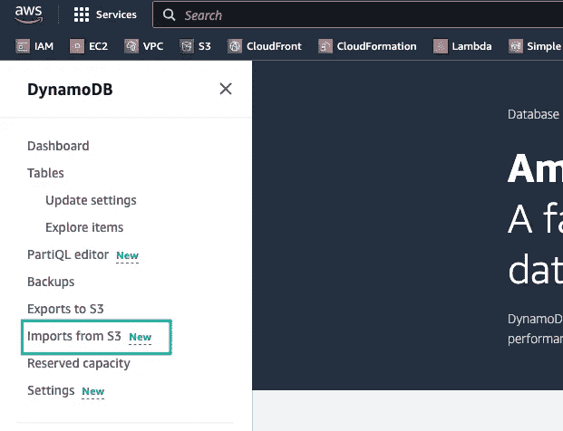

在出现的页面上，再次选择 Import from S3，您将被带到请求导入向导。如果该存储桶归您的帐户所有，您可以使用浏览 S3 按钮找到它。这是迄今为止最简单的选择。

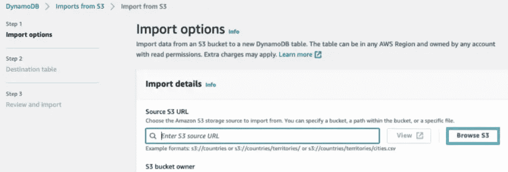

选择“浏览 S3”按钮后，您可以导入整个存储桶或该存储桶中的单个对象。在开始这个实验室之前，我从[ChampsOrChumps.com](https://champsorchumps.us/records/best-nfl-regular-season-records#tab-win-percentage)下载了数据，并将其转换成 CSV 文件上传到 S3。

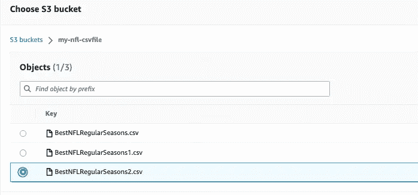

或者，您可以以`s3://bucket/prefix`格式输入 bucket 的 URL。如果您要从不同于当前登录的 AWS 帐户导入数据，这是一个很好的选择。

接下来，您必须指定您是否是 S3 存储桶的所有者。如果源桶属于不同的帐户，选择**不同的 AWS 帐户**。您需要提供存储桶所有者的帐户 ID。选择适当的导入文件格式。选项有 **DynamoDB JSON、Amazon Ion、**或 **CSV** 。选择错误的格式将导致导入过程失败。如果选择 CSV，您将有两个附加选项:CSV 标题和分隔符。

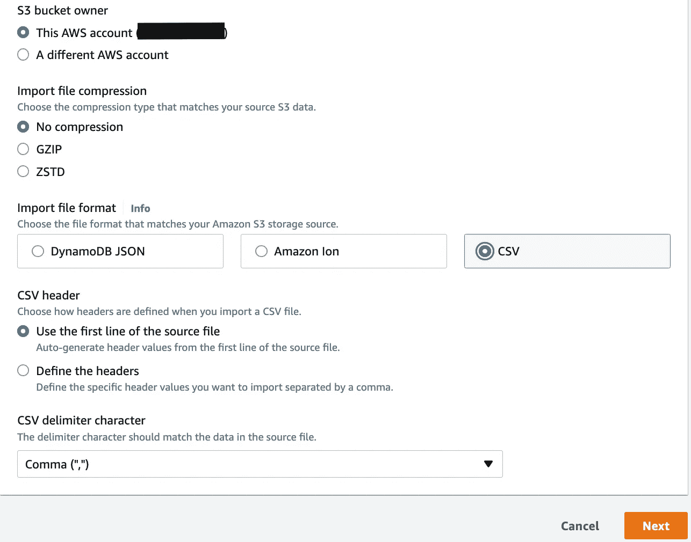

在下一个屏幕上，您将决定与为存储数据而创建的新表相关联的参数。正如您在下面看到的，我已经命名了我的表，并设置了分区和排序键。

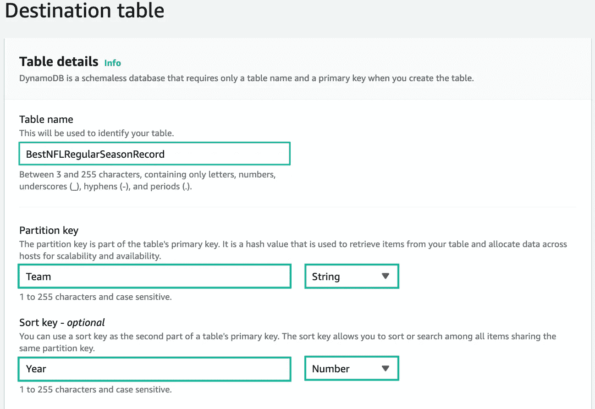

我们不得不使用排序键，因为有些球队不止一次出现在这个名单上。当分区键和排序键一起使用时，它们被称为*复合主键。*在具有分区键和排序键的表中，多个项目可以具有相同的分区键值。但是，这些项目必须有不同的排序键值。📝注意:主键和排序键必须与文件中的属性匹配，否则导入将失败。这些属性区分大小写。

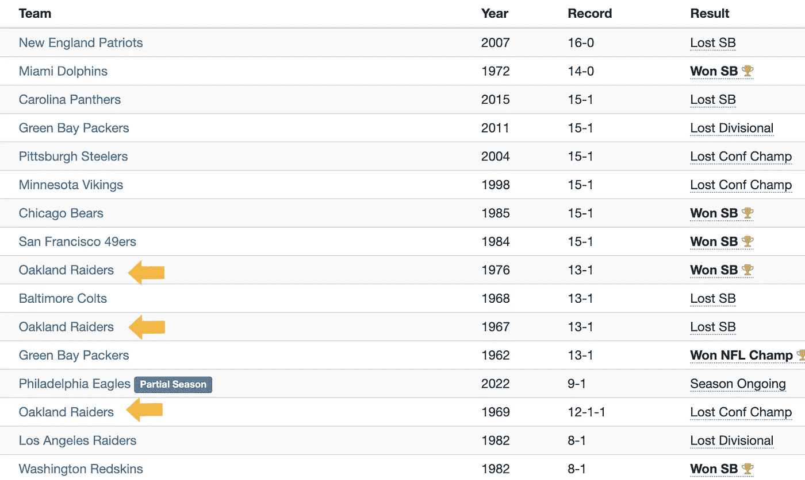

选择“下一步”查看您的导入选项，然后单击“导入”开始导入任务。您的新表列在“表”中，状态为“正在创建”此时，该表不可访问。

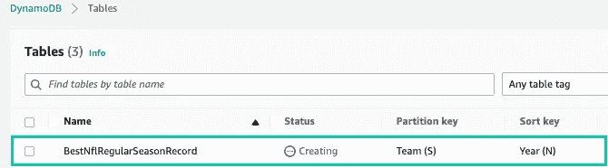

我们的数据从 S3 成功导入，并且为我们创建了一个 DynamoDB 表。

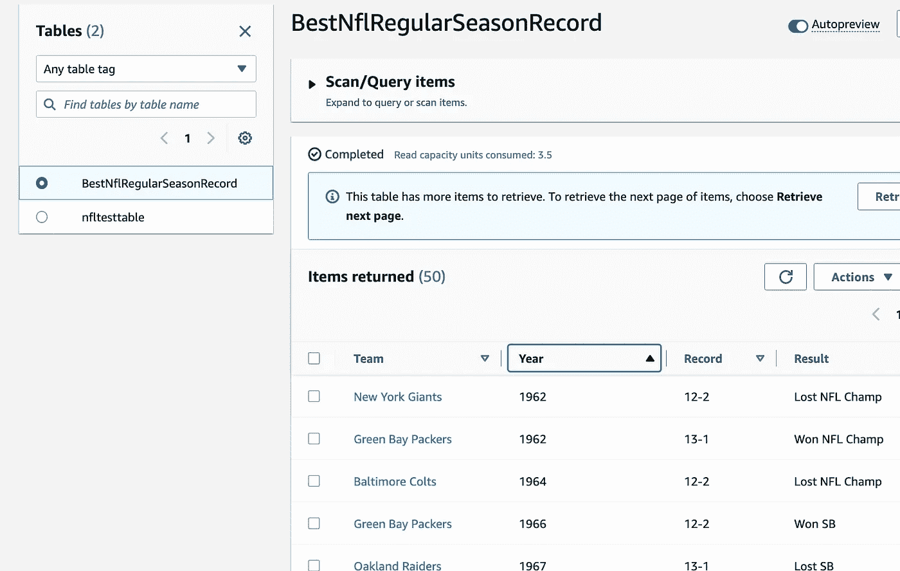

# **步骤 2:创建具有只读访问权限的 IAM 角色**

IAM 服务只支持一种基于资源的策略，称为角色*信任策略*，它附加到 IAM 角色。信任策略定义了哪些主体实体可以承担该角色。我正在使用 Visual Studio 代码创建我的。json 文件。下面可以看到一个模板。

```
{
  "Version": "2012-10-17",
  "Statement": [
      {
          "Sid": "",
          "Effect": "Allow",
          "Principal": {
              "Service": "ec2.amazonaws.com"
          },
          "Action": "sts:AssumeRole"
      }
  ]
```

用于创建角色和附加信任策略的 AWS CLI 命令

```
aws iam create-role --role-name <Name_Your_Role> --assume-role-policy-document file://<filelocation.json>
```

将权限策略附加到您的角色。最初，我想为我新创建的角色使用 AWS 管理的策略。唯一的要求是为 AWS 管理的 AmazonDynamoDBReadOnlyAccess 策略获取 ARN。但是，在审查该政策时，我注意到它允许访问我们的任务不需要的其他资源。我需要创建另一个。json 文件的权限符合我们的要求，同时遵守最小特权原则。

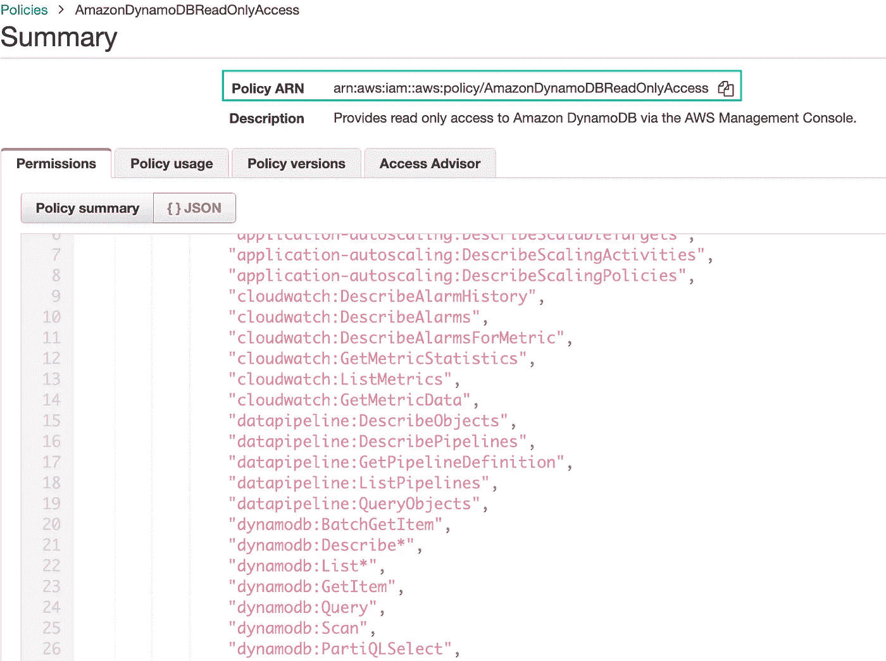

以下权限策略仅授予对`GetItem`、`BatchGetItem`、`Scan`、`Query`和`ConditionCheckItem` DynamoDB 操作的权限，因此在 BestNflRegularSeasonRecord 表上设置只读访问权限。您需要将您的表 ARN 粘贴到策略的资源部分，以指定您要授予对哪个表的访问权限。

```
{
    "Version": "2012-10-17",
    "Statement": [
        {
            "Sid": "ReadOnlyAPIActionsOnBooks",
            "Effect": "Allow",
            "Action": [
                "dynamodb:GetItem",
                "dynamodb:BatchGetItem",
                "dynamodb:Scan",
                "dynamodb:Query",
                "dynamodb:ConditionCheckItem"
            ],
            "Resource": "arn:aws:dynamodb:us-west-2:123456789012:table/BestNflRegularSeasonRecord"
        }
    ]
}
```

下面的命令将内联策略嵌入到角色中，以指定它可以做什么。

```
$ aws iam put-role-policy --role-name Test-Role-for-EC2 --policy-name Permissions-Policy-For-Ec2 --policy-document file://C:\policies\permissionspolicyforec2.json
```

创建 EC2 包含角色所需的实例概要文件。您需要为实例概要文件提供一个唯一的名称。

```
$ aws iam create-instance-profile --instance-profile-name <TestEc2Profile>
```

最后，将角色添加到实例概要文件中

```
$ aws iam add-role-to-instance-profile --instance-profile-name EC2-ListBucket-S3 --role-name Test-Role-for-EC2
```


# **步骤 3:创建 EC2 实例**

运行下面的命令来创建 EC2 实例。您需要在每个参数旁边提供一个值，除了 associate `--associate-public-address`

```
aws ec2 run-instances \
    --image-id ami-0b0dcb5067f052a63 \
    --instance-type t2.micro \
    --subnet-id subnet-01b370d32254f5d0b \
    --security-group-ids sg-025ec04872b1c4e46 \
    --associate-public-ip-address \
    --key-name cli-dev-proj \
    --tag-specifications "ResourceType=instance,Tags=[{Key=Name,Value=EC2-Wk8}]" 
    --iam-instance-profile "Name"="TestEc2Profile"
```

成功创建实例后，您需要获得您的公共 IP 地址，以便通过 SSH 进入系统。您可以通过运行以下命令来实现这一点。不要忘记将实例概要文件添加到 EC2 实例中。

```
aws ec2 describe-instances \
--query "Reservations[*].Instances[*].{PublicIP:PublicIpAddress,Name:Tags[?Key=='Name']|[0].Value,Status:State.Name}" --output table
```

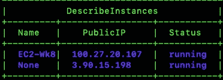

# 步骤 4:质量保证检查

现在是时候看看一切是否如预期的那样运行，或者我们是否需要重新开始。在 EC2 实例中使用 AWS CLI 扫描 DynamoDB 表

以下 AWS CLI 示例从`BestNflRegularSeasonRecord`表中读取一个项目。您可以通过 DynamoDB API 或 PartiQL 实现这一点，PartiQL 是 DynamoDB 的一种 SQL 兼容的查询语言。

```
# DynamoDB API
aws dynamodb query \
    --table-name BestNflRegularSeasonRecord \
    --key-condition-expression "Team = :name" \
    --expression-attribute-values  '{":name":{"S":"Miami Dolphins"}}' \
    --region us-east-1
```

该命令的输出显示，70 年代和 80 年代是迈阿密海豚队的辉煌岁月，当时我甚至还没有出生。

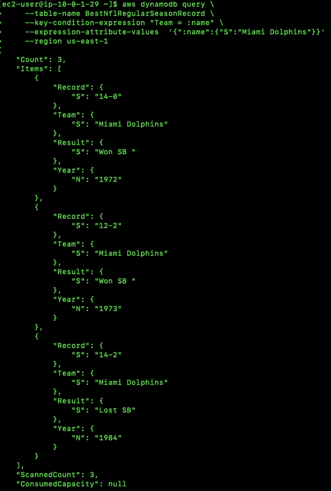

最后一步是确保我们的角色不能写

```
aws dynamodb put-item \
    --table-name BestNflRegularSeasonRecord  --region us-east-1 \
    --item \
        '{"Team": {"S": "San Diego Chargers"}, "Year": {"N": "2006"}, "Record": {"S": "14-0"}, "Result": {"S": "Lost SB"}}'
```

用黄色突出显示的部分确认我们的 EC2 实例不能在表中写入。

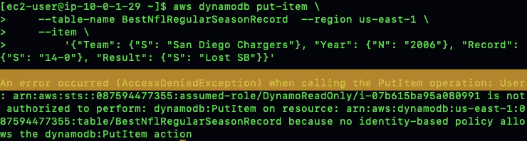

# 触地得分


我不得不参考许多不同的资源来找出步骤，并在这个实验室中开发不同阶段所需的语法。我贴出下面的参考资料，以帮助任何人解决类似的问题。参考资料的顺序与实验步骤的顺序相似。

# 参考资料和资源:

1.  [将亚马逊 S3 数据](https://aws.amazon.com/blogs/database/amazon-dynamodb-can-now-import-amazon-s3-data-into-a-new-table/)导入亚马逊 DynamoDB
2.  【DynamoDB 的备忘单
3.  IAM 策略授予[对 DynamoDB 表中项目的只读权限](https://docs.aws.amazon.com/amazondynamodb/latest/developerguide/read-only-permissions-on-table-items.html)
4.  [为服务创建角色](https://docs.aws.amazon.com/IAM/latest/UserGuide/id_roles_create_for-service.html)(AWS CLI)
5.  [通过 AWS CLI 创建 EC2](https://docs.aws.amazon.com/cli/latest/reference/ec2/run-instances.html#examples) 实例
6.  [查询表中的数据](https://docs.aws.amazon.com/amazondynamodb/latest/developerguide/getting-started-step-5.html)
7.  [将数据](https://docs.aws.amazon.com/amazondynamodb/latest/developerguide/getting-started-step-2.html)写入表格