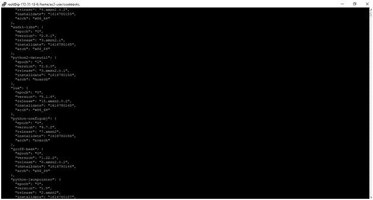
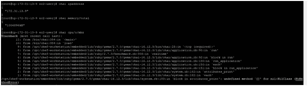
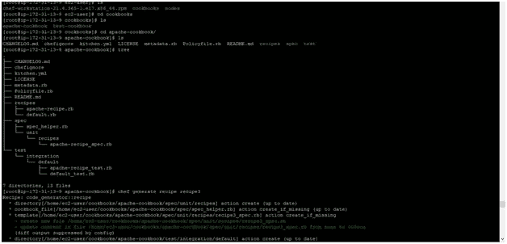
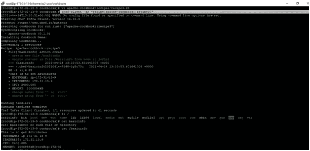

# CHEF 中的属性

> 原文：<https://medium.com/nerd-for-tech/attributes-in-chef-a56073de90ea?source=collection_archive---------14----------------------->

先决条件:[https://bansalkushagra . medium . com/how-to-create-a-cookbook-and-recipe-in-chef-AE 62 e 9 ba 8156](https://bansalkushagra.medium.com/how-to-create-a-cookbook-and-recipe-in-chef-ae62e9ba8156)

属性类型(基于优先级):

> A.默认
> 
> B.强制默认
> 
> C.常态
> 
> d.推翻
> 
> E.强制覆盖
> 
> f.自动的

该属性是一个键-值对，表示关于一个节点的特定细节。它用于查找上一次 chef-client 运行结束时节点的状态。或者，在当前 chef-client 运行结束时，节点应该处于什么状态。属性由节点、角色、食谱、配方和环境定义。

**实施:**

**步骤 1:** 访问您的亚马逊 EC-2 机器，并遵循以下命令:

命令:

> 须藤苏:去根
> 
> 奥海
> 
> ohai 地址
> 
> ohai 内存/总计
> 
> ohai cpu/o/mhz

**第 2 步:**使用菜谱-食谱查找属性

**命令:**

> cd 烹饪书
> 
> CD Apache-烹饪书
> 
> 主厨制作食谱回执 3
> 
> 光盘..//现在我们在 cookbooks 目录中
> 
> VI Apache-cookbook/recipes/recipe 3 . Rb

// .rb 扩展是强制性的

**代码:**

> file '/basicinfo' do
> 
> 内容”这是获取属性
> 
> 主机名:# {节点['主机名']}
> 
> IPADDRESS: #{node['ipaddress']}
> 
> CPU:# {节点['cpu']['0']['mhz']}
> 
> 内存:# {节点['内存']['总计']} "
> 
> 所有者'根'
> 
> 组“根”
> 
> 操作:创建
> 
> 结束

现在，运行食谱:

> chef-client-Zr " recipe[Apache-cookbook::recipe 3]"//执行配方

