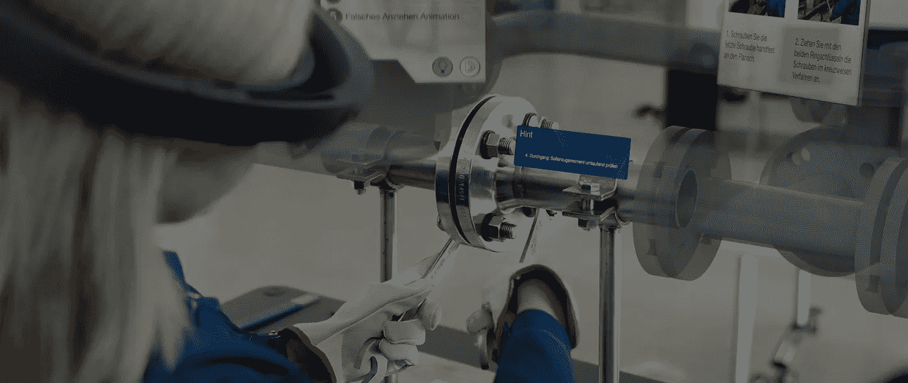
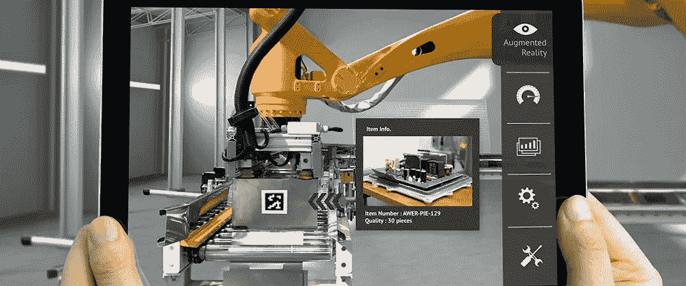
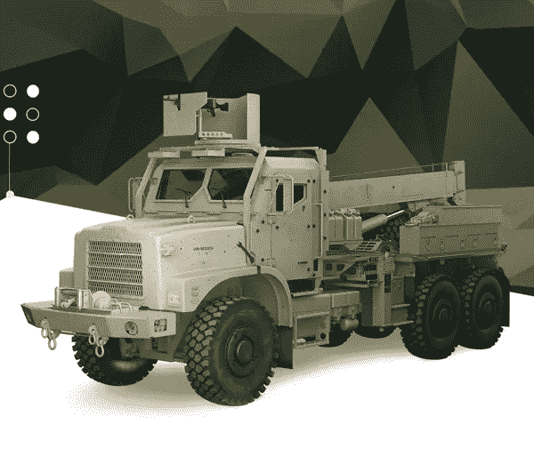
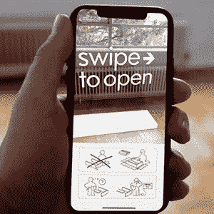
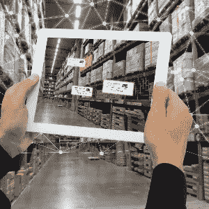
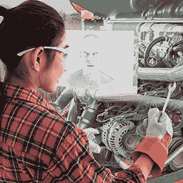
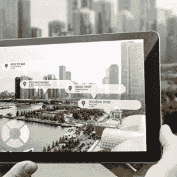

# 增强现实训练:建立训练过程

> 原文：<https://medium.com/nerd-for-tech/augmented-reality-training-building-the-training-process-program-ace-b7c54cc26841?source=collection_archive---------20----------------------->

在过去的十年里，职场培训领域发生了一场真正的革命。全世界数以千计的企业已经改进了员工培训的技术方法，抛弃了纸质手册和课堂讲授，转而采用虚拟培训和模拟。

许多人甚至转向沉浸式解决方案来满足他们的教育需求，增强现实培训尤其受欢迎。这引发了人们对[增强现实开发服务](https://program-ace.com/expertise/augmented-reality/)的兴趣，所以我们认为是时候给你提供关于这一现象的所有细节，以及你需要知道的一切，以创建一个增强现实培训解决方案。

# 什么是增强现实训练？

增强现实(AR)培训是一种通过软件呈现并可在 AR 设备上访问的教育体验，可帮助用户获得重要的专业技能。从本质上来说，这是一种可以在任何时间和任何地点通过合适的软件和设备启动的培训体验。

基于 AR 的培训是名为沉浸式培训的更广泛软件类别的一部分，其中包括 VR 和 MR 技术。要更广泛地了解 AR、VR 和 MR 用于教育目的，请查看我们关于[沉浸式培训](https://program-ace.com/blog/immersive-training/)的文章。

# AR 培训是如何运作的？

你可能知道，增强现实的工作原理是捕捉物理世界的真实镜头(通过相机)并在屏幕上复制它，但添加了数字对象、角色和模型。因此，呈现在屏幕上的视觉效果给人一种混合世界的印象，在那里物理和数字模型共存。

例如，一个叉车培训应用程序可能会要求用户坐下来，将他们的设备摄像头向下瞄准，他们的屏幕将会亮起，他们的脚旁边有虚拟踏板，膝盖上方有驾驶控制。

目前，学习和开发中的增强现实以移动设备为中心，因为有前置摄像头的智能手机，而符合这一参数的其他轻量级设备很少。尽管如此，一些品牌正在寻求通过智能眼镜打入市场，其中一些已经上市，另一些即将上市。

# AR 培训用在哪里？

在 AR 出现的十年左右的时间里，许多企业已经认识到 AR 技术不仅可以用于游戏，那些希望利用其潜力的企业已经为他们的企业构建了沉浸式应用程序。让我们来看看不同行业中一些最酷的增强现实培训示例:

1.  **交通**——伦敦的一个火车枢纽[创建了一个车站的数字 AR 复制品](https://www.globalrailwayreview.com/news/86707/hs2-augmented-reality-old-oak-common-station/)，以便工人们在它建成并开始运营之前熟悉它。
2.  **制造业**——总部位于美国的 Globalfoundries 公司[将他们的培训文档](https://www.eetasia.com/globalfoundries-use-ar-glasses-in-fab/)和材料改编为增强现实工业培训应用程序，以便更容易理解信息。
3.  **建筑**—gold beck 建筑公司在其运营中实施了一个增强现实建筑培训应用程序，该应用程序[利用 AR](https://www.smartcitiesworld.net/news/news/ar-app-provides-digital-concierge-services-to-buildings-5879) 为工人提供关于建筑工地的详细信息。
4.  **体育** —切尔西足球俱乐部[发布了一个公共应用](https://www.engadget.com/chelsea-fc-digital-ventures-perfect-play-coaching-app-133028828.html)，用于专业人士和业余爱好者的增强现实体育训练，以完善他们的控球技术。
5.  **汽车** —梅赛德斯在汽车培训中分布式使用增强现实，允许专家[探索现有和未来的车型](https://www.hrdive.com/news/how-mercedes-benz-uses-augmented-reality-to-train-employees-of-all-types/530425/)，以及它们的内部系统。

# 探索我们的 AR 培训案例研究

Program-Ace 通过为一个军事组织开发车轮更换培训应用程序，为沉浸式景观做出了自己的贡献。这款应用通过以 3D 形式复制多个车辆模型，并将用户置于必须更换车轮并进行相关维修的场景中，成功地将增强现实集成到军事训练中。

# 车轮更换培训—来自 Program-Ace 的 AR 培训应用程序

我们的团队使用现有的纸质手册作为软件的基础，但在保持最初提供的信息描述和说明的同时，增加了许多交互式选项的学习体验。车轮更换培训已成功部署在 Android 和 iOS 设备上，并帮助 5000 多名维修人员掌握了维修技能。

# 您可以构建的 AR 培训应用的类型

在创建应用程序时，你可以采用多种不同的方法，每种方法都有自己的方式来传达/阐释信息和传授新技能。以下是一些主要的变体:

1.  **手动/指南**

这往往是对现有学习材料的改编，但增加了几个互动选项。例如，以前是 2D 的手册，有一个步枪的插图，现在将在 3D 中可视化步枪，让用户旋转它，并与它互动。通常，基础材料中会出现相同的描述和说明，但它们的组织更有逻辑性，并且允许用户输入(模拟)。

**2。全模拟**

这种类型的应用程序更侧重于教授新技能，而不是提供描述和信息。在模拟中，用户必须在不同难度的场景中导航，直到他们能够成功执行与其工作相关的操作。例如，模拟复制装配线工人的动作将为用户提供有限的时间来组装产品，并在失败时提供重做的理由/机会。

**3。私人教练**

有时被称为虚拟助理，增强现实私人教练以比其他选项更个性化的方式指导和指示用户。通常，他们会有一个视觉模型和口头/文本对话，其中有鼓励和情感的话语，基本上扮演了大多数学习任务的常规培训师的角色。他们会对积极和消极的结果做出反应，调整他们的话语来引导用户走向积极的结果，同时为他们提供任务所需的所有信息。

**4。虚拟资源管理器**

这是一种自由的训练方法，缺少其他软件选项中的时间顺序。本质上，用户可以在众多的 3D 模型和交互选项之间自由导航，选择他们最感兴趣的。例如，他们可能选择仅仅修补模型，或者阅读描述，或者观看动画，或者这些方法的某种组合。虚拟探索者类型的应用程序非常适合扩展的培训项目，包括许多小时的内容/学习。

5.**自定义**

我们列出的四种类型只是概括，并不是必须坚持的严格框架。如果您有一个沉浸式培训计划的愿景，但不包括任何提到的功能，或者混合和混合它，欢迎您创建一个定制的解决方案。我们还应该提到，在没有经验的情况下创建复杂的功能可能会非常昂贵和耗时，因此您可以考虑为项目雇佣专家([阅读下面的](https://program-ace.com/blog/augmented-reality-training/#id))。

# 增强现实训练有哪些好处？

一个组织可能会选择增强现实来提高培训效率或完全取代现有的程序。如果您选择在您的公司实施它，您将很快看到好处和积极的结果，这将不仅影响接受培训的人，而且影响您的业务。以下是一些例子:

**员工福利:**

*   更容易理解信息
*   随时随地方便学习
*   增强现实的学习以个人的节奏进行
*   不涉及安全风险
*   没有压力或外部压力

**对企业的好处:**

*   提高员工参与度和信息保留率
*   复杂的主题和概念变得简单
*   由于解决方案的通用性，降低了成本
*   简单的物流——不需要特殊设备或教师
*   应用范围可以很容易地扩展到其他职位
*   更新可以在几个小时内自动应用

与此同时，在你的应用程序的开发或实现过程中，可能会遇到某些障碍。

# AR 培训的挑战:

*   必须提醒用户在使用应用程序时注意周围环境
*   很难保护智能手机应用程序上的机密信息
*   开发需要一个相对较大的专家团队
*   为表面和元素建立精确的跟踪系统可能非常困难
*   大而详细的 3D 模型可能很难在小屏幕上操作

所以你有它。从整体来看，好处是巨大的，而且这项技术比传统的训练方法更能创造出跨越式的体验。然而，必须在设计和开发中投入大量精力来消除或减轻可能出现的问题。

# AR 培训的技术要求

我们已经讨论了您可以为您的教育应用程序做出的各种设计和内容选择，但是技术选择呢？在开始开发之前，您需要确定一套技术规范，这不是一件容易的事情。

*   **选择跟踪系统**

追踪是 AR 技术的核心，也是相机镜头对体验至关重要的原因。您可以为您的应用程序选择两种跟踪方法中的一种，或两种方法的组合。我们指的是[基于标记和无标记跟踪](https://www.blippar.com/blog/2018/08/14/marker-based-markerless-or-location-based-ar-different-types-of-ar)。

基于标记的跟踪以预编程特定对象为中心，应用程序必须根据摄像机镜头识别这些对象。例如，如果这个人正在尝试使用控制面板进行 AR 标记训练，应用程序可能会对控制布局进行编程，以便在用户将相机聚焦在面板上时，快速显示附加信息和指令。

另一方面，你可以教你的应用程序通过无标记跟踪来独立思考。通过这种方法，该应用程序将分析摄像机镜头，并识别表面、与物体的距离、物体大小或更复杂的问题，如人类姿势和面部表情、设备元素的错位以及移动物体的速度。

对于最简单的 ar 应用程序来说，无标记方法非常受欢迎，因为它们只能识别平面，并在其上可视化 3D 模型。对于更复杂的 AR 培训计划(和大多数培训应用程序)，标记对于确保满足培训的所有相关条件和要求至关重要。

*   **选择合适的软件**

你将需要大量的软件，这些软件可以分为两组:1)创建 3D 模型、动画、用户界面和特效的软件；2)创建核心应用程序功能、容器和逻辑的软件。

设计软件方面，Blender，Maya，ZBrush，3DS Max 都是非常热门的选择。然而，你的选择应该基于你的应用的个人计划和需求，而不仅仅是受欢迎程度。至于游戏逻辑和功能，我们强烈建议选择像 [Unity 或者虚幻](https://program-ace.com/blog/unity-vs-unreal/)这样的游戏引擎。这两个平台是目前最先进的 AR 设计平台，内置了各种各样的工具，使这个过程变得更容易。

强烈建议在开发过程中使用 SDK(软件开发工具包)。例如，苹果已经为 iOS 应用开发提供了 ARKit SDK，谷歌也为 Android 应用开发了类似的 ARCore。这两个选项非常有用和受欢迎，但并没有构成顶级 AR SDKs 的完整列表[。](https://program-ace.com/blog/augmented-reality-sdk/)

*   **选择目标设备**

你希望你的员工通过他们的移动设备还是通过智能眼镜进行培训？为几十或几百名员工购买眼镜的硬件成本是天文数字，而这些眼镜的应用程序非常罕见，增加了开发的复杂性。

因此，如果你想让你的应用程序尽可能容易访问，我们建议在 Android 和/或 iOS 上发布。这两种操作系统都内置了大量的技术基础设施，全球有数十亿台设备支持这种用于培训员工的技术。

# 我们如何开发 AR 培训解决方案

多年来，Program-Ace 一直在为商业领域开发 AR 应用，我们在这一领域已经积累了[规模可观的产品组合](https://program-ace.com/success-stories/#ar;all)。我们制作的每个 AR 应用程序之前都有对必须实现的业务目标和将用作参考的材料的全面分析。

我们为自己的快速发展和一个已经掌握了复杂的 AR 技术的大型专业团队感到自豪。因此，如果您选择与我们合作您的 AR 项目，我们将看到它通过每个阶段，并根据您的要求交付它。你将在有能力的人手中，自由地监督和要求项目的修改，只要你认为合适。

找到其他在沉浸式技术方面拥有与我们类似经验的增强现实培训公司并不容易，找到一家拥有如此多专家来处理大大小小项目的公司是另一个挑战。

当你准备好讨论你的项目，或者只是问任何你感兴趣的问题时，请随时[联系我们](https://program-ace.com/contact-us/)。

*原载于*[*https://program-ace.com*](https://program-ace.com/blog/augmented-reality-training/)*。*