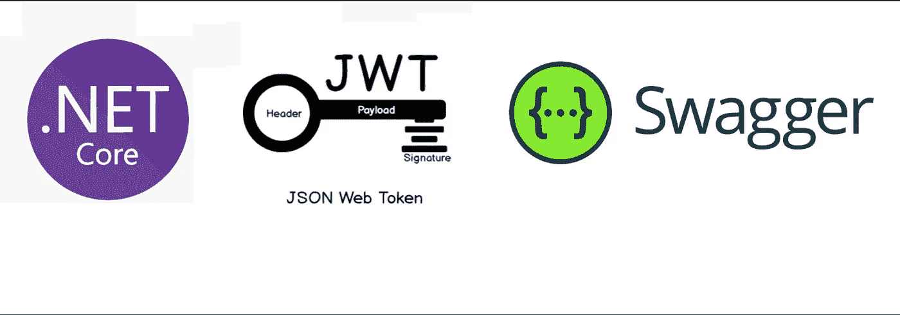
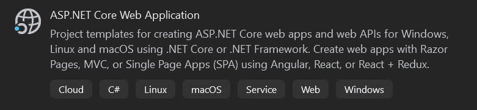
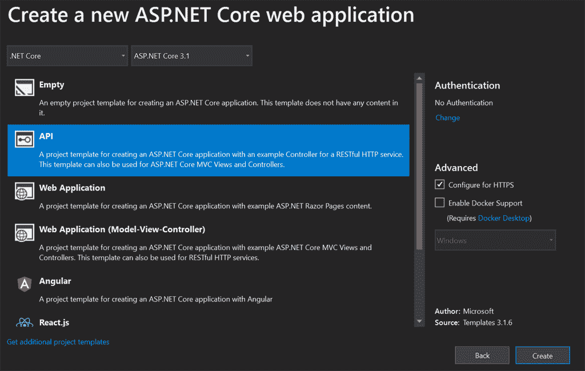
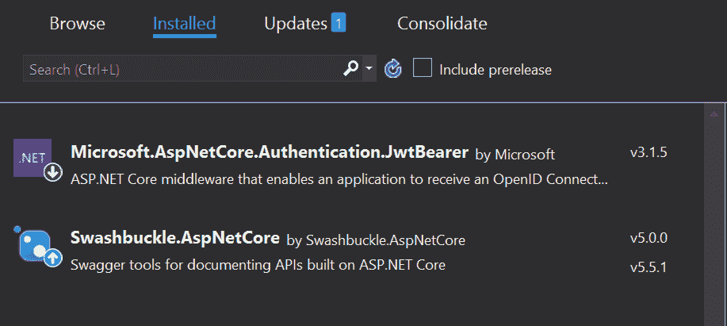
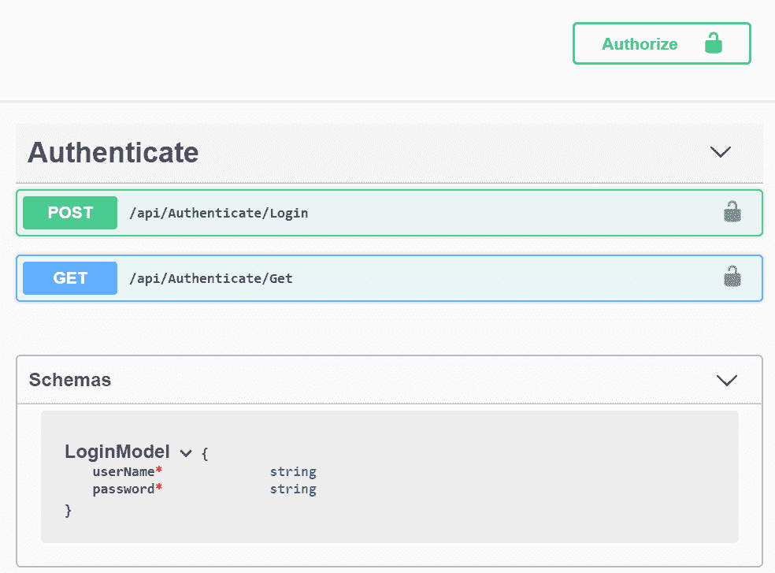
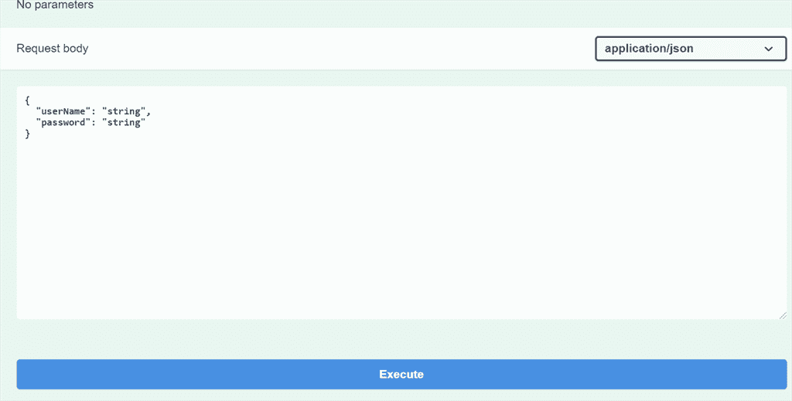
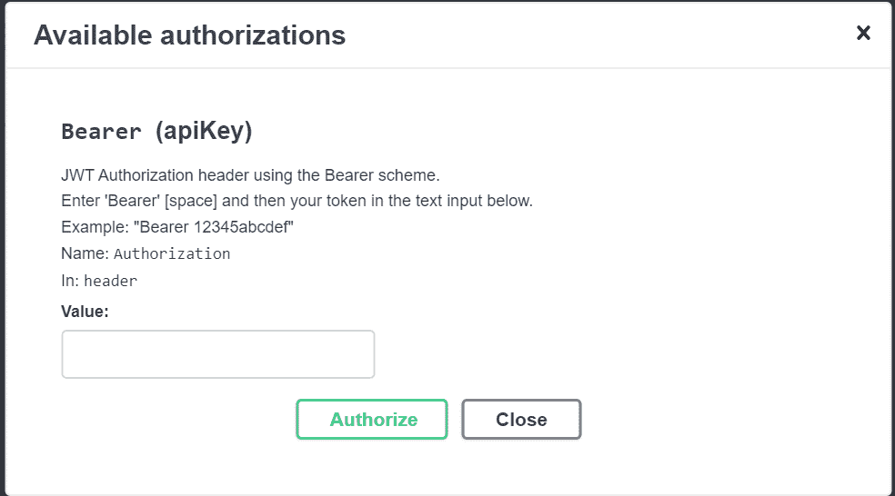

# 👨‍💻中的身份验证和授权。使用 JWT 令牌和 Swagger UI 的. NET 核心 Web API

> 原文：<https://medium.com/nerd-for-tech/authentication-and-authorization-in-net-core-web-api-using-jwt-token-and-swagger-ui-cc8d05aef03c?source=collection_archive---------0----------------------->

# 介绍

本文旨在使用 JSON Web 令牌简化认证和授权过程，并使用 Swagger UI 而不是 PostMan 检查整个过程。

# 什么是 ASP.Net 核心？

ASP。NET Core 是一个开源和云优化的 web 框架，用于开发可以在 Windows、Linux 和 Mac 上开发和运行的现代 web 应用程序。它包括 MVC 框架，该框架现在将 MVC 和 Web API 的特性结合到一个 Web 编程框架中。

*   ASP。NET 核心应用程序可以运行。净核心或完整的。NET 框架。
*   它旨在为部署到云中或在内部运行的应用程序提供优化的开发框架。
*   它由开销最小的模块化组件组成，因此您在构建解决方案时可以保持灵活性。
*   您可以在 Windows、Mac 和 Linux 上跨平台开发和运行您的 ASP.NET 核心应用

# 什么是 JSON Web 令牌？

JSON Web 令牌(或 JWT)只是一个包含特定声明的 JSON 有效负载。jwt 的关键属性是，为了确认它们是否有效，我们只需要查看令牌本身。…JWT 由 3 部分组成:报头、有效载荷和签名。

网址:[*https://jwt.io/*](https://jwt.io/)

# 什么是 Swagger，它在 ASP.NET 核心 Web API 中有什么用处？

**大摇大摆**

Swagger 是 RESTful API 的机器可读表示，它支持交互式文档、客户端 SDK 生成和可发现性。

Swashbuckle 是一个开源项目，用于为使用 ASP.NET 核心 MVC 构建的 Web APIs 生成 Swagger 文档。

**Github**

 [## JayKrishnareddy/AuthenticationandAuthorization

### Net Core 3.1 API，带有 Swagger UI 和 JWT 令牌认证，并以安全的方式进行授权…

github.com](https://github.com/JayKrishnareddy/AuthenticationandAuthorization) 

创建一个新项目并选择 ASP.NET 核心 Web 应用程序:

点击下一步按钮后:

单击 Create 按钮创建一个示例 API 项目。

# 创建一个认证控制器

在身份验证控制器下创建此方法:

创建另一种登录验证方法，通过硬编码方法对用户进行身份验证:

创建登录方法，以 JSON 格式传递参数来验证用户并生成令牌(JWT)。

要使用 JWT 令牌和 Swagger，我们需要将以上两个安装到我们的项目中

将该类添加到 Authenticate Controller 中，因为这些是验证用户所需的参数

**认证控制器**

**基本控制器**

添加此属性和构造函数以调用 appsettings.json 秘密 JWT 密钥及其颁发者:

添加这个代码 appsettings.json。我把它添加为基本键。您也可以根据自己的意愿添加它，并在 Issuer 下添加您的项目 URL。

将此代码添加到 Configure Services 方法下的 startup.cs 文件中，以启用 Swagger 并生成 JWT 载体令牌。

该方法由运行时调用。使用此方法将服务添加到容器中。

该方法由运行时调用。使用此方法配置 HTTP 请求管道。

当您运行该应用程序时，您将获得如下所示的 swagger UI:

传递参数以生成令牌:

然后点击执行按钮->你的令牌将被生成！

单击 Authorize 按钮，在 Value 框下添加这个令牌。

以如下例所示的方式添加令牌，即不记名令牌。

点击授权按钮

现在这个文档中的每个方法都已经被授权了！

如果你发现这篇文章对你有帮助，请为它鼓掌👏

……..继续学习！！！！