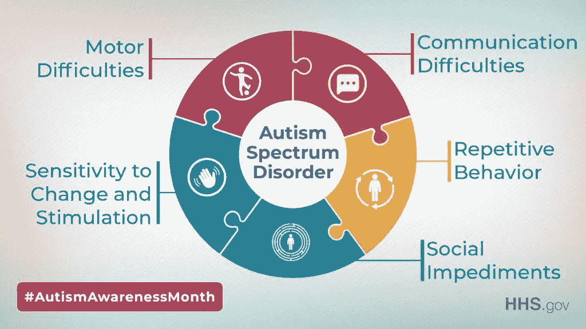
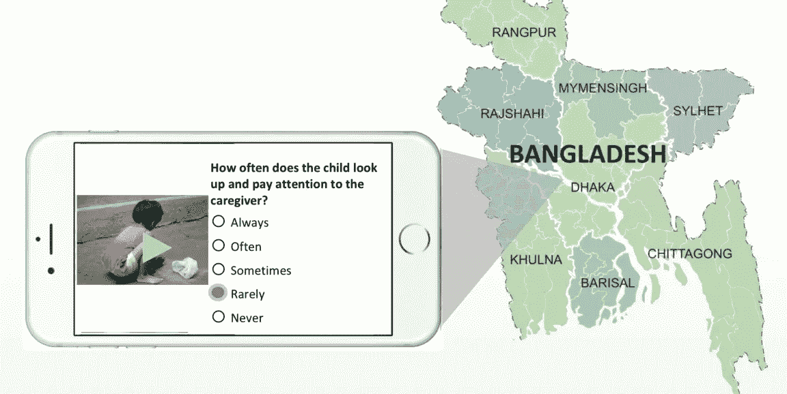
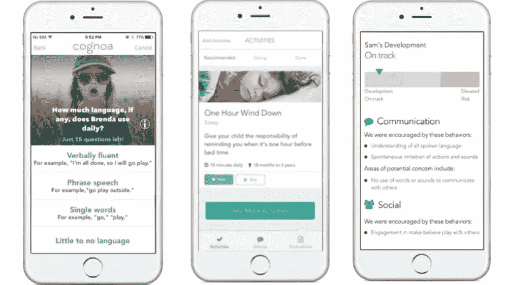
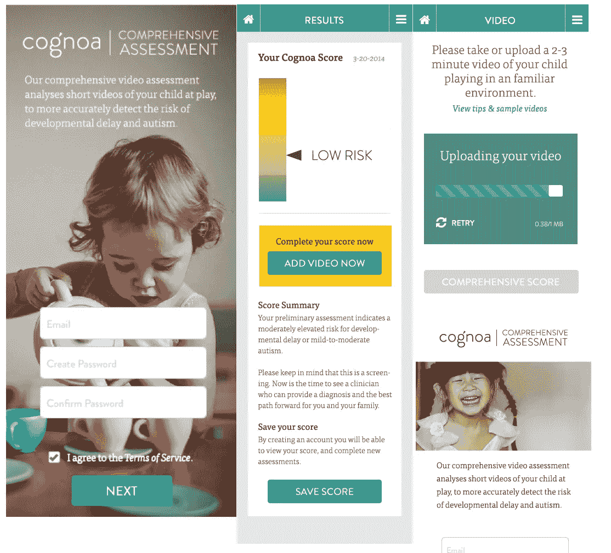

# 使用人工智能的自闭症检测和诊断

> 原文：<https://medium.com/nerd-for-tech/autism-detection-diagnosis-using-ai-33e6a27d9c97?source=collection_archive---------6----------------------->

来源:推特

> 据报道，2020 年，美国每 10，000 名儿童中约有 222 名患有自闭症谱系障碍，是世界上最高的诊断率之一。自闭症谱系障碍在男孩中比女孩更普遍。在美国，大约 3.63%的 3 至 17 岁男孩患有自闭症谱系障碍，相当于 1.25%的儿童。

## 什么是自闭症？

**自闭症谱系障碍(ASD)** 是一种**神经发育障碍，主要以认知互动减少和言语缺陷为特征。**

## 自闭症的症状:

症状可能包括**过度专注于一个物体，反应迟钝，缺乏对语言规范的理解(如声调或身体姿势)，重复手势，或自虐行为，如敲打头部**。其他潜在的迹象包括学会很晚说话，不和其他年轻人交流，避免目光接触，失去同情心，以及社会孤立。患有自闭症的儿童没有获得足够的语言技能，他们可以表现出，包括大喊大叫或哭泣，来交流他们的需求。

## 自闭症的检测:

**当没有医学分析(如验血)来识别症状时，自闭症谱系障碍(ASD)的诊断可能具有挑战性。医生正在研究孩子的心理历史和对待病人的态度。**

ASD 也可能在 18 个月或 18 个月以下被观察到。一个有经验的专家的评估在 2 岁时可能被认为是非常准确的。然而，许多婴儿直到非常大的时候才会得到最终诊断。

## 使用人工智能检测自闭症:

来源:Scope 博客

一个总部设在加州的组织报告说，它将获得美国食品和药物管理局批准的诊断工具，用于第一光谱自闭症障碍(ASD)。 **Cognoa 技术**使用人工智能在数周内诊断 ASD，比现有的治疗规范快得多。如果得到 FDA 的批准，第一个识别自闭症的方法将是初级保健。

Cognoa 的创新来自创始人 Dennis Wall 的实验室，他是斯坦福大学医学院的儿科副教授。

通过将电子健康记录数据应用于一系列算法，Wall 的团队能够辨别 ASD 障碍的独特特征，包括认知/心理特征，如对某人微笑的反应，对图片的共同承诺，独创性和创造力。

## 科尼奥阿的设备是如何工作的？

来源:Unite。人工智能

来源:货物

每当父母对儿科医生的咨询表示失望，或者孩子难以发送 ASD 测试调查时，儿科医生将向父母提供一个代码，以激活他们手机上的 Cognoa 软件。在应用程序中，父母对一个关于他们孩子发展习惯的 15 分钟测试做出反应，然后发布两个孩子的家庭视频，时长 1 到 2 分钟，捕捉孩子在正常情况下的行为。剪辑被提交给合格的 Cognoa 专家进行分析并解决相关问题。这些回答被整合到 Cognoa 的人工智能中，包括父母的回答和儿科医生的简短测验。该算法然后将报告传输给医生，医生做出诊断。

## 优点:

该工具的模型是基于成千上万个跨越年龄、文化和种族社区的实际案例的信息实现的，它不仅显示出提高了治疗时间，还消除了当前方法中隐含的许多不平等。

> 人工智能不会取代医生，而是会增强他们，使医生能够以更高的准确性和效率实践更好的医学。—本杰明·贝尔