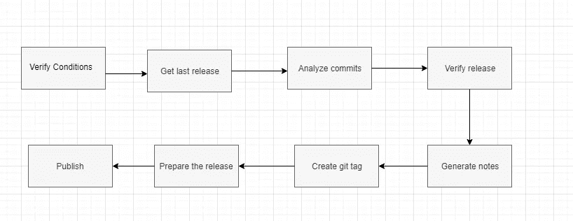

# 使用 GitLab pipeline 从语义上自动提升应用版本和发布

> 原文：<https://medium.com/nerd-for-tech/auto-bump-apps-versions-and-releases-using-gitlab-pipeline-e32f1d7fa3ee?source=collection_archive---------0----------------------->

> 我们在这篇文章中试图解决的问题是，我们需要控制、版本控制和语义自动标记我们的应用程序，以减少人为错误

我们的目标是使用 GitLab CI/CD 和[语义发布](https://github.com/semantic-release/semantic-release)来解决这个问题

**什么是语义释放？**

semantic-release 自动化了整个包发布工作流，包括确定下一个版本号、生成发布说明以及发布包。

它是如何工作的？

这里的关键是您的提交消息格式，语义发布使用提交消息来确定代码库中的更改类型。遵循提交消息的形式化约定，semantic-release 自动确定下一个[语义版本](https://semver.org/)号，生成变更日志，并发布发布。

例如，如果您需要添加一个热修复，您的提交消息应该以这种格式编写

`fix(pencil): {Your message}`

当您将一个“拉”请求与一个“发布”分支合并时，您应该有一个补丁发布，例如，如果在合并和批量发布后，分支主文件中最后创建的标记是 1.0.0，您应该有一个新的标记 1.0.1

如果您想添加一个特性，您的提交消息应该是这样的

`feat(pencil): {Your message}`

在那之后，你的下一个版本将会是 1.1.0，如果最后一个标签是 1.0.0 等等，你可以在这里找到所有的格式

[https://github.com/semantic-release/semantic-release](https://github.com/semantic-release/semantic-release)

**怎么用？**

要安装“语义发布”,您应该拥有 node ≥= 10.18

然后运行以下命令来安装该软件包

```
npm install --save-dev semantic-release
```

对于其他类型的应用程序，如 python 或 maven，您可以将其全局安装在您的 CI 环境中，语义支持许多流行的 CI 环境，如 CircleCI、Github actions 和 GitLab，我们将在后面看到这一点。

安装软件包后，您应该定义语义发布配置。这一步可以通过多种方式完成

我强烈推荐使用”。releaserc”文件，您也可以使用 package.json 文件来配置它

我们需要告诉“语义”关于我们的发布分支

```
{
  "release": {
    "branches": ["master", "next"]
  }
}
```

这个配置将使“语义”跳过任何其他分支，在分支列表之外创建一个发布

你也可以像这样配置你需要的插件

```
{
  "plugins": ["@semantic-release/commit-analyzer", "@semantic-release/release-notes-generator", "@semantic-release/npm"]
}
```

从这里你可以看到更多关于插件的内容

[https://github . com/semantic-release/semantic-release/blob/master/docs/usage/plugins . MD](https://github.com/semantic-release/semantic-release/blob/master/docs/usage/plugins.md)

在创建配置文件之后，并且在使用有效格式或合并请求向发布分支提交更改之后，您可以运行以下命令来生成版本并创建标记

```
npx semantic-release
```

**npx 是什么？**

npx 是“npm exec”的缩写，是一个 CLI，用于在本地 node_modules 文件夹或$PATH 中查找和执行 npm 二进制文件。如果找不到二进制文件，npx 将下载所需的包，并从其缓存位置执行它。该工具与 npm >= 5.2 捆绑在一起，或者可以通过 npm install -g npx 安装。

**更复杂的案件**

例如，如果我们创建了一个应用程序的新功能，版本变为 1.1.0，而我们的一些客户或用户仍然使用 1.0.0，他们不使用特色功能，他们报告 1.0.0 上有一个需要维护的错误，在这种情况下我们该怎么办？

语义发布允许基于多个 Git 分支和发布渠道来管理和自动化复杂的发布工作流。

*   通过分销渠道将某些版本分发给特定的用户群
*   通过分支机构合并管理分销渠道上产品的可用性
*   并行维护多行发布
*   在每次 Git 推送一个版本增量的正常流程之外，开发大型的未来版本

因此，在我们的案例中是关于维护的，在这种情况下，我们需要配置我们的分支来支持维护流程。

```
branches: [
  "+([0-9])?(.{+([0-9]),x}).x",
   "master"
]
```

在配置中，我们告诉 semantic，任何具有这个模式 1.0.x 或 1.1.x 等的分支都是发布分支，因此我们可以执行以下步骤来维护旧版本

*   从旧标签创建一个分支，例如，我们需要维护 1.0.0 版，而不需要对包含新特性的最新 1.1.0 版进行修改

```
 git checkout -b 1.0.x v1.0.0
```

*   添加您的修补程序，并提交一个消息，如一个例子

```
git commit -m "fix(pencil): {Your message}" 
```

*   推你的树枝
*   然后在这个分支上运行语义发布

```
npx semantic-release
```

现在我们将有一个新的修补程序标签 1.0.1

使用工作流有很多选项，您可以像这样检查

[https://github . com/semantic-release/semantic-release/blob/master/docs/usage/workflow-configuration . MD](https://github.com/semantic-release/semantic-release/blob/master/docs/usage/workflow-configuration.md)

**语义在幕后做什么？**

如果您想查看，只需在发布命令中添加 debug 标志

```
npx semantic-release --debug
```

下图解释了这些步骤



**使用 GitLab 的 CI/CD 中的语义**

在这一部分中，我将解释并创建一个自动构建、测试、发布和部署的工作流。

假设我们有一个 nodejs 应用程序或任何类型的应用程序，我们需要构建、测试、发布版本并将其部署在我们的 Kubernetes 集群中。当然，我将跳过关于 docker 构建和部署到 K8s 的讨论，但是如果你想了解这一点，你可以在完成这篇文章后查看我以前的文章😆

[](https://regoo707.medium.com/gitlab-ci-cd-from-git-to-k8s-a57c3bf3df3a) [## 从 git 到 K8s 的 GitLab CI/CD

### 在本文中，我将解释如何使用 GitLab CI/CD 来构建、测试和部署 nodejs 应用程序到 K8s(通过 rancher API)

regoo707.medium.com](https://regoo707.medium.com/gitlab-ci-cd-from-git-to-k8s-a57c3bf3df3a) 

我们需要什么？

*   非发布分支上的每一次提交，我们都需要运行、构建并创建一个 docker 映像，该映像由开发人员测试的分支名称标记
*   releases 分支上的每次提交，我们都需要基于这个分支上的最新标签来创建一个发布，并且依赖于我们之前解释过的提交消息形式
*   我们需要构建、测试、创建 docker 映像以及将我们的应用程序部署到 K8s 或任何我们正在使用它的环境中的每一个标签，我们不会关注这一点。
*   每次在 master 上提交时，我们都需要更新最新的 docker 图像标签

> 注意:对于 GitLab，我们需要配置一个必需的环境变量 semantic contains git lab access token 来授予对您的存储库的语义访问

```
GITLAB_TOKEN or GL_TOKEN
```

让我们写下我们的。gitlab-ci.yml

*   首先定义了我们的阶段

```
stages:
 - build
 - test
 - build-non-release-docker-image
 - release
 - build-release-docker-image
 - build-latest-docker-image
 - create-new-k8s-app-release
```

*   构建阶段，因为我们的应用程序是一个节点，我们将在我们的 runner 中使用节点图像

```
build:
  stage: build
  image: node
  script: 
    - echo "Start building App"
    - npm install
    - npm build
    - echo "Build successed!"
  artifacts:
    expire_in: 1 hour
    paths:
      - build
      - node_modules/
  except:
    changes:
      - "*.md"
      - ".gitignore"
```

*   测试阶段

```
test:
 stage: test
 image: node
 script:
 - echo “Testing App”
 - npm run test
 - echo “Test passed!”
 except:
 changes:
 - “*.md”
 - “.gitignore”
```

*   仅为非发布分支构建 docker 映像将在不包含在发布分支中的分支上触发

```
build-non-release-docker-image:
 stage: build-non-release-docker-image
 image: ubuntu:18.04
 script:
 - echo “Write scripts to build the docker image”
 only:
 - branches
 except:
 refs:
 - master
 - /^(([0–9]+)\.)?([0–9]+)\.x/
 changes:
 - “*.md”
 - “.gitignore”
```

*   我们的重点步骤是发布阶段只在发布分支上触发

```
release:
 stage: release
 image: node
 before_script:
 - echo “preparing environment”
 - npm install [@semantic](http://twitter.com/semantic)-release/gitlab
 script:
 - npx semantic-release
 only:
 refs:
 - master
 - /^(([0–9]+)\.)?([0–9]+)\.x/
 except:
 changes:
 - “*.md”
 - “.gitignore”
```

在这个阶段，我们准备了我们的环境，安装了语义 GitLab 集成插件，并运行 release 命令。

*   仅从标记创建 docker 映像和部署 stage

```
build-latest-docker-image:
 stage: build-latest-docker-image
 image: ubuntu:18.04
 script:
 — echo “image build successed”
 only:
 — master
 except:
 changes:
 — “*.md”
 — “.gitignore”create-new-k8s-app-release:
 stage: create-new-k8s-app-release
 image: ubuntu:18.04
 script:
 — echo “App version $CI_COMMIT_REF_NAME created successfully”
 only:
 — tags
```

该阶段仅在标签上触发

> 注意:语义将在创建标记时的提交消息上添加[skip CI],这将跳过标记创建时的管道触发，并且避免为手动创建的标记触发构建和部署是有意义的，但是您可以定制和添加一些解决方法，以使用 GitLab API 而不是在标记情况下的手动触发来触发管道。

最后，我希望我解释清楚了，并帮助您控制和组织您的应用程序发布和版本。