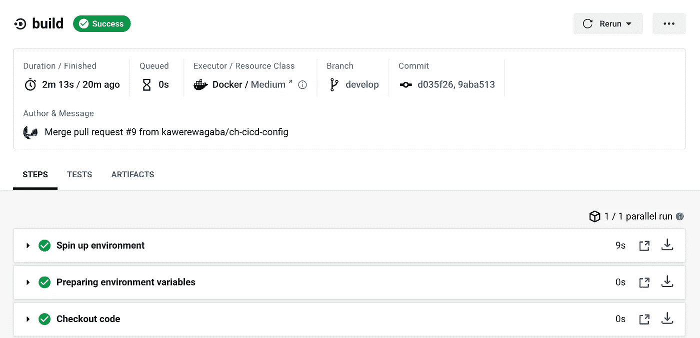
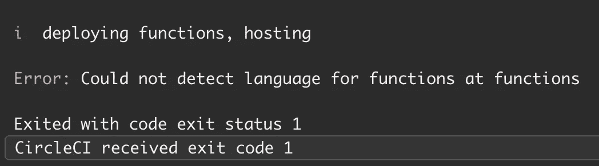
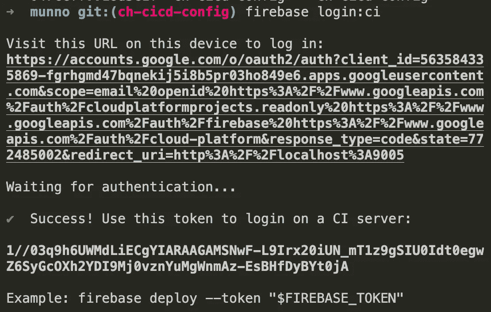
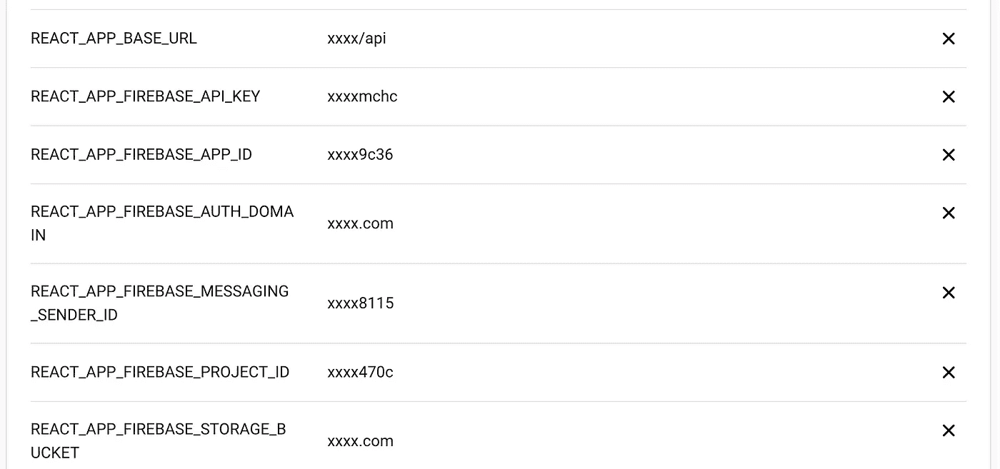

# 使用 CircleCI 将 React 应用程序自动部署到 Firebase 主机

> 原文：<https://medium.com/nerd-for-tech/auto-deploy-a-react-app-to-firebase-hosting-using-circleci-4ccf4e3a1fdb?source=collection_archive---------1----------------------->

## 对任何静态应用程序使用类似的步骤。



目标很简单:开发你的应用，承诺回购，看到实时变化。

假设:您至少理解 CI/CD 背后的思想和概念，并且确信这是正确的道路。这不是对 React 或持续集成或 Firebase 的介绍。

这篇文章是对现有文档的补充，也许可以帮助那些陷入困境的人摆脱困境。

上下文:您不希望每次需要推送补丁或功能时都手动构建和部署应用程序。您希望至少自动化构建和部署步骤。当与团队一起工作时，它也很方便，因为没有一个开发人员必须承担运行构建和部署它们的任务。

这是我们将要使用的配置，我将尽力解释每个部分的作用。想法是将您在本地运行的手动步骤转移到 CI 服务器中，使其自动化。

我们将使用`CircleCI`，因此检查官方[文档](https://circleci.com/docs/)会有所帮助。

货单`.circleci/config.yml`。写于 [YAML](https://yaml.org/) 。

您的应用在本地运行，并成功编译——太棒了！您已经在本地 repo 上初始化了`git`,并与远程存储库(可能在 Github 上)同步——太棒了！

您的工作流程可能会有所不同，但是我想假设您正在处理一个特性分支，您稍后会通过打开一个 pull request (PR)将该特性分支合并到一个默认分支中，比如说`develop`——您的团队成员可以对其进行审查。

接下来我们[将 CircleCI 连接到我们的 repo](https://circleci.com/docs/2.0/hello-world/) ，这样每次我们按下代码时它都会被触发。我们可以指定分支来触发构建——在我们的例子中是`develop`和`master`。您还可以为不同的环境添加不同的规则— `dev`和`prod`。

在 CircleCI 上，作业(可能)在 Docker 容器中运行，所以我们指定了我们的`node.js`运行时，因为我们是用 React 构建的。我们最终得到一个预装了`npm`和`yarn`的环境。

构建过程的`checkout`步骤将代码从我们的(连接的)repo 中提取到构建环境中——一个指定的工作目录，或者在我们的例子中是一个默认目录。

然后，我们安装所需的依赖项，并将我们的 React 代码构建到静态应用程序中— `HTML`、`CSS`、`JS`和其他资产，如`images`。这些静态文件(又名生产构建)将被部署到 Firebase 主机。

我想突出线条`15`。

```
yarn global add firebase-tools && firebase deploy --only hosting --token ${FIREBASE_TOKEN}
```

为了能够使用`firebase`命令，我们需要在`PATH`中包含二进制文件，所以我们在全局范围内安装了 firebase 工具。我曾见过工具作为开发依赖项安装在本地的设置，但这可能需要使用绝对路径调用`firebase`——类似于`./node_modules/.bin/firebase`——很难看。

之后，我们部署应用程序，就像在本地一样。添加`--only hosting`标志有助于 firebase 知道您只想部署主机，而不是功能或其他任何东西。

由于忽略了标志，我遇到了这个错误。



由于 CircleCI 是一个非交互式 CLI 环境，您将没有浏览器来登录到 [Firebase](https://firebase.google.com/docs/cli#linux) 中，因此您需要一个令牌来进行身份验证。此外，您应该已经在本地初始化了 firebase 以获得`.firebaserc`和`firebase.json`文件。

使用`firebase login:ci`在本地终端登录，获取令牌，并将其添加到 CircleCI 上的项目环境变量中。



最后，不要忘记在范围中包含必要的环境变量；将它们添加到您的项目中。



就是这样——至少对我来说是这样。一如既往，我在这里寻求任何反馈。