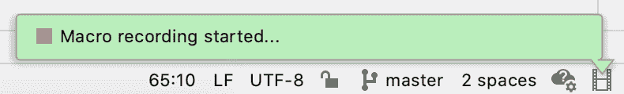
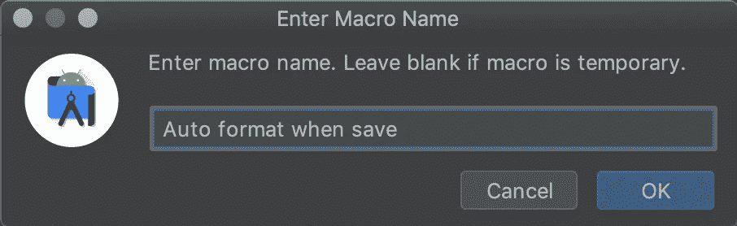
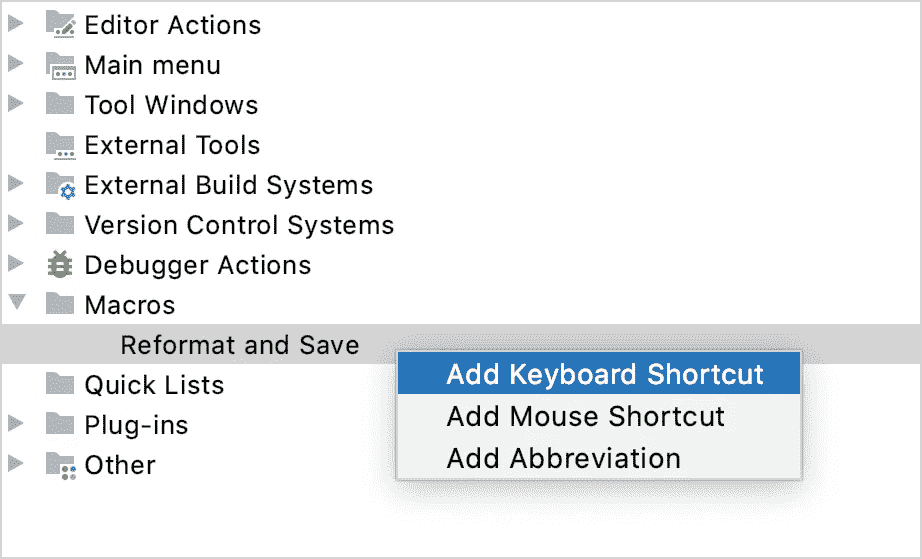

# Android Studio/Intellij IDEA 中的自动格式化代码

> 原文：<https://medium.com/nerd-for-tech/auto-format-code-in-android-studio-intellij-idea-1f0450ee44a3?source=collection_archive---------0----------------------->

每个组织/公司都有一定的代码格式规则，很多时候开发人员忘记了这些规则，面临很多问题，比如合并冲突、Jenkins 构建失败等等。要解决这个问题，你可以使用所有 Android Studio 和所有其他 IntelliJ 产品中都有的实用程序**宏**。

# 录制宏

*   在编辑器中打开任何文件。
*   从主菜单中，选择编辑|宏|开始宏记录。
*   按⌥⌘L 重新格式化代码(代码|重新格式化代码)。然后按⌘S 保存所有更改(文件|全部保存)。Android Studio/IntelliJ IDEA 会在状态栏中显示执行的动作。

*   通过选择编辑|宏|停止宏记录来停止记录。
*   在“输入宏名”对话框中，指定新宏的名称，然后单击“确定”。

*   如果宏仅供临时使用，可以将名称留空。

# 回放宏

*   若要播放临时宏，请打开“编辑”菜单，指向“宏”，然后单击“播放上一个宏”。
*   若要回放已命名的宏，请打开“编辑”菜单，指向“宏”，然后单击所需的宏名称。

# 编辑宏

*   打开“编辑”菜单，指向“宏”，然后单击“编辑宏”。

# 将键盘快捷键绑定到宏

*   在“设置/首选项”对话框⌘中，选择“键盘映射”。
*   展开“宏”节点，选择创建的“重新格式化并保存”宏。
*   右键单击宏，然后在上下文菜单中选择“添加键盘快捷键”

*   在“输入键盘快捷键”对话框中，按下⌘S 作为快捷键，然后单击“确定”。
*   Android Studio/IntelliJ IDEA 会警告你快捷键被分配给了另一个动作。单击“删除”可删除“文件|全部保存”操作的⌘S 快捷方式。如有必要，您可以随时重新分配它。
*   单击确定应用更改。

现在，当你**按下⌘S** 时，Android Studio/IntelliJ IDEA 将调用新的宏:重新格式化当前文件并保存你的项目。