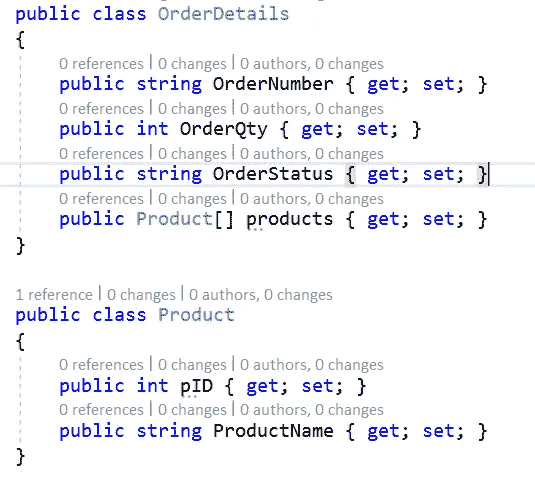
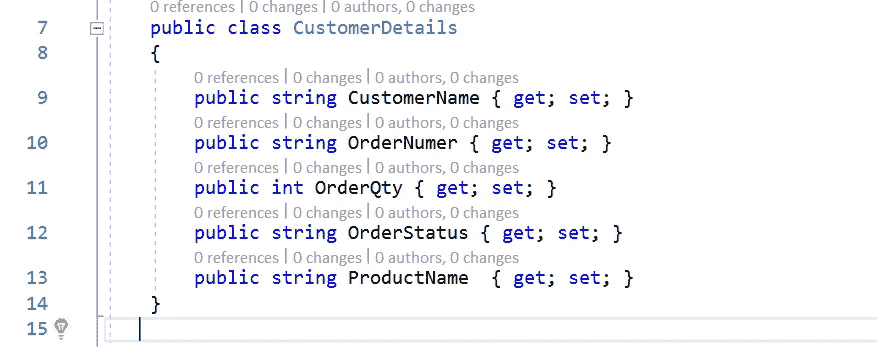
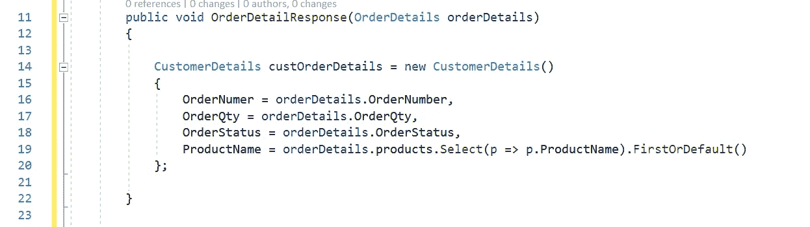
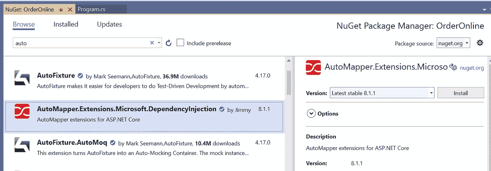
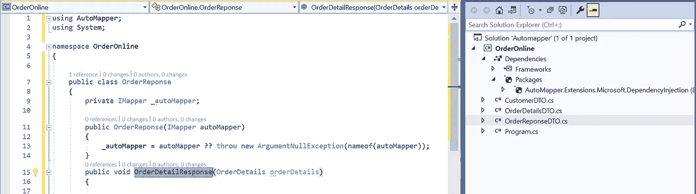
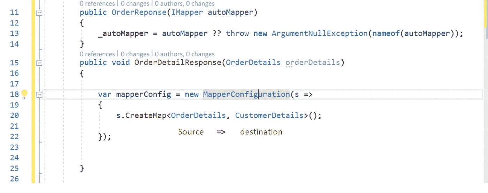
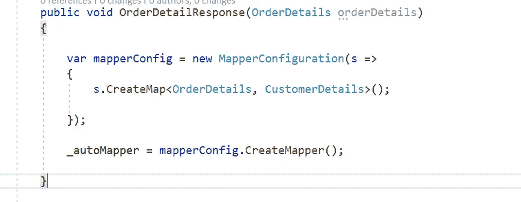
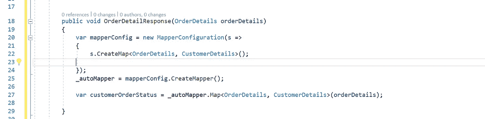
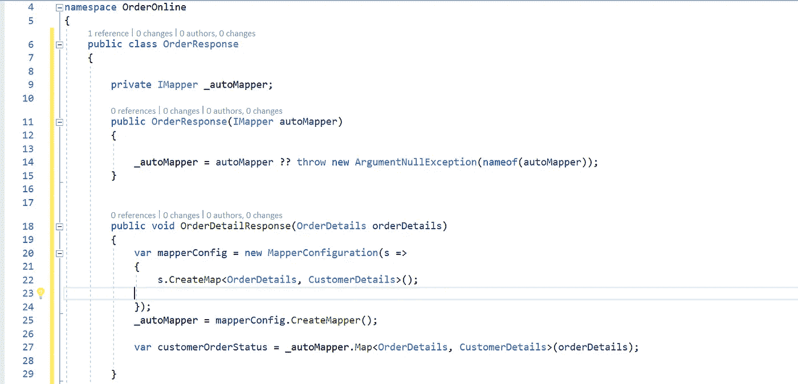

# 中的自动映射扩展。网络核心

> 原文：<https://medium.com/nerd-for-tech/automapper-extensions-in-net-core-274a70999d46?source=collection_archive---------4----------------------->

在 c#中，一个 POCO 类对象到另一个 POCO 类对象的映射可以通过将源属性逐个分配给目标属性来实现。

源 DTO 类:

OrderDetails.cs

目的地 DTO 舱位等级:

客户详细信息. cs

OrderDetailResponse 方法

在上面的代码中，第 16 到 19 行是我们将数据从源对象属性逐一映射到目的对象属性的地方。

为了避免逐个映射每个属性，我们可以使用 AutoMapper 包。使用这个包，我们可以定义源对象到目的对象，这避免了开发人员的责任。代码可以是可读的格式，代码看起来很干净。

**步骤 1** :从 nuget 安装 Automapper 包，如下图

**步骤 2** :在 OrderResponse 类中，我们将使用 Automapper 包声明 IMapper 接口。

**步骤 3** :在 OrderDetailResponse 方法内部，我们可以使用来自自动映射器引用的 MapperConfiguration 方法来定义源和目标 DTO 类。

**步骤 4** :使用 Create mapper()创建映射器，如下所示

**步骤 5** :现在我们使用 Map 将源数据映射到目标数据

在上面第 27 行代码中，我们将数据映射到目标对象

通过使用上面的 Automapper，我们避免了逐个映射每个属性。

使用 Automapper 包后，OrderResponse.cs 代码会像下面这样

订单响应. cs

**步骤 6** :添加以下代码，在 Startup 类的 ConfigureServices 方法中注册 AutoMapper。

这就完成了中的自动映射器实现。Net 核心应用程序:)