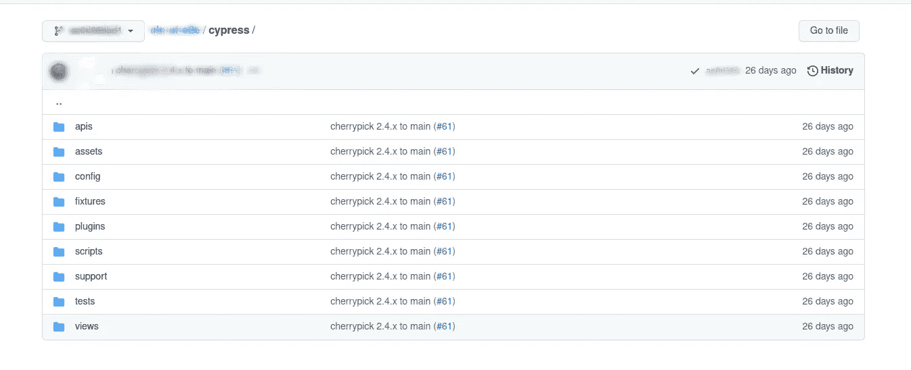

# 利用柏树改变生活的方法

> 原文：<https://medium.com/nerd-for-tech/automate-e2e-ui-tests-with-cypress-framework-afc46f59f2f4?source=collection_archive---------4----------------------->

构思一个好的用户体验故事非常重要。每个网站都应该有自动化的 E2E 用户界面测试。成功影响每一位顾客，让他们的浏览生活更加轻松。在这种情况下，自动化 E2E UI 测试是一个巨大的救命稻草。E2E 验证所有应用程序的依赖关系是否能一起正常工作，验证应用程序的业务逻辑，并有助于减少在部署到生产环境后发现缺陷的机会。


费伦茨·阿尔马西拍摄的照片

**为什么是柏树？**

Cypress 是一个 UI 测试自动化工具，开发它是为了编写用于创作端到端测试、集成测试和单元测试的 Javascript。当在本地或 CI 中运行您的测试时，Cypress 提供了一个非常方便的仪表板服务。构建在 Mocha 框架之上。

**柏树的特征**

*   赛普拉斯网络控制。
*   API 测试能力。
*   时间旅行
*   自动等待
*   实时重新加载
*   内置并行化和负载平衡

**支持的浏览器**

支持大多数常见的浏览器，如 chrome、firefox、Electron 和 Edge。但目前不支持 Safari 和 Internet Explorer 等浏览器。

**先决条件**

在安装 cypress 之前安装下面提到的包。

*   [Node.js](https://nodejs.dev/download/package-manager/)
*   [jq](https://snapcraft.io/jq)

**安装柏树**

从 npm 软件包管理器安装 cypress 并使用 cmd，

```
npm install cypress --save-dev
```

**运行测试**

来执行用。js 文件

```
npx cypress open
```

如果使用二进制安装。从项目根目录中，运行

```
./node_modules/.bin/cypress open
```

**目录结构:**

这里列出了一些广泛使用的文件夹结构。

广泛使用的带描述的文件夹结构

每个项目的目录结构都不同。最终，重要的是代码的效率。这是另一个示例目录结构。



Cypress 框架的示例文件夹结构

> 确保将 package.json 指向从`cypress/tests/`目录中选择测试。

**编写测试文件**

在 tests 下的指定目录中编写测试。这些测试文件在每个文件中可以有多个测试步骤。类似地，这些测试特定的功能/组件。

```
touch {your_project}/cypress/tests/ex_spec.js
```

**测试模板**

所有测试用例的测试模板应该是相似的。添加比测试中更多的库使得在其他测试用例中使用更容易。从而使测试步骤变得简短，代码更改变得简单。这里有一些样本模板，

样本测试模板是用。js 格式

**创建配置项实例的步骤**

1.  克隆您的项目/测试存储库
2.  安装柏树。步骤与本地安装相同。
3.  或者，如果需要，设置您的应用服务器。
4.  或者，设置环境变量。
5.  在[并行](http://Make%20sure%20to%20point%20the%20package.json%20to%20pick%20tests%20from%20cypress/tests/%20directory.)中设置并行化并运行测试。
6.  使用 [mochawesome](https://www.npmjs.com/package/mochawesome) 生成 JSON & HTML 报告
7.  下载定制报告并构建工件。

**Github 动作工作流程**

每当有新的拉请求时，这些 GitHub 动作工作流也将允许您每次都运行 E2E 测试。

。github/workflows/node.js.yml

添加上述文件后，可以看到新的传入拉请求的神奇之处。


**限制**

1.  目前支持 Javascript 和 typescript。还不支持其他语言。
2.  使用多个标签来执行测试。
3.  测试一次在一个浏览器上执行。
4.  iframes 的有限支持。Cypress [iframe 插件](https://www.npmjs.com/package/cypress-iframe)。

所有的测试执行都发生在浏览器中，这导致了快速、一致和可靠的测试结果。内置的测试运行器允许您直接从 Cypress UI 运行测试，并在测试失败的情况下对您的测试进行截图。cypress 提供的特性在其他 UI 自动化工具中是独一无二的。

[](https://docs.cypress.io/guides/core-concepts/introduction-to-cypress) [## Cypress 介绍| Cypress 文档

### Cypress 如何查询 DOM Cypress 如何管理主题和命令链断言看起来像什么以及它们如何…

docs.cypress.io](https://docs.cypress.io/guides/core-concepts/introduction-to-cypress)