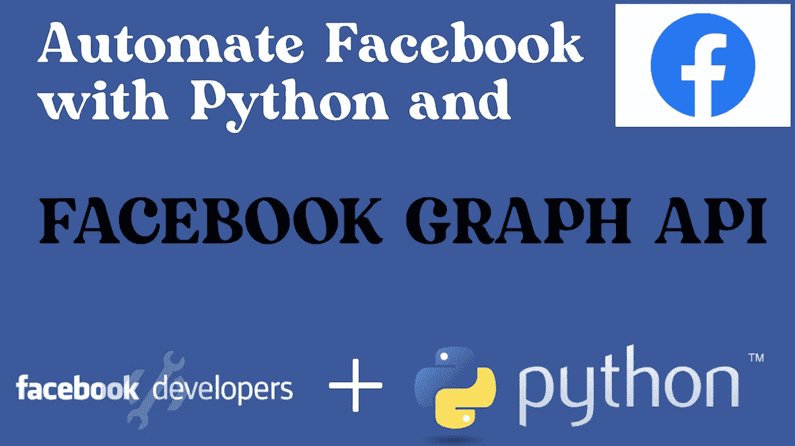
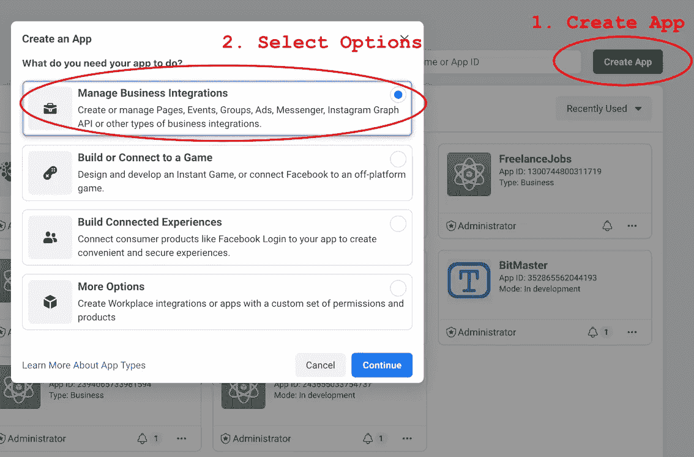
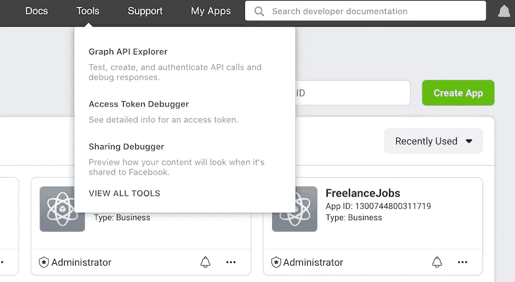
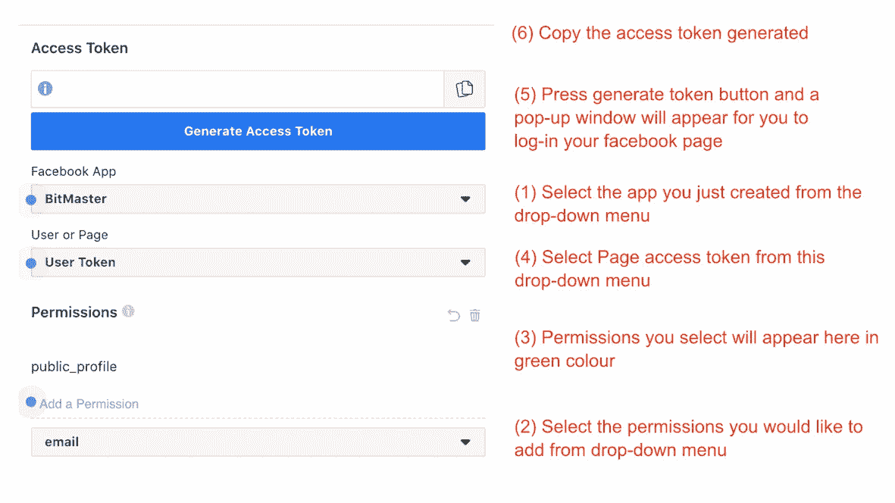

# 使用 Python 和脸书图形 API 自动化脸书帖子

> 原文：<https://medium.com/nerd-for-tech/automate-facebook-posts-with-python-and-facebook-graph-api-858a03d2b142?source=collection_archive---------0----------------------->

在本文中，我们将讨论如何通过使用 python 和 facebook graph API 自动化 facebook 页面帖子来简化您的 facebook 页面参与。

我们将在本文中讨论以下主题:

*   脸书图形 API 简介
*   获取您的 facebook 页面访问令牌
*   使用 Graph API 和 python 向您的 facebook 页面发送帖子
*   使用 Graph API 和 python 将照片发送到您的 facebook 页面
*   如何将短期访问令牌换成长期访问令牌
*   按计划向脸书发送邮件



# 脸书图形 API 简介

你可以通过这个链接访问脸书图形应用编程接口:[https://developers.facebook.com/docs/graph-api/](https://developers.facebook.com/docs/graph-api/)——该文档包含了从获取访问令牌到向 Facebook 发送帖子等与应用编程接口交互的代码片段。

脸书图形 API 提供了 url 端点，您可以向其发送 GET 和 POST 请求，以便与您的 facebook 页面进行交互或向您的 Facebook 帐户发送信息和帖子。你可以使用 API 来:(1)阅读时间线上的消息，(2)发送消息，(3)阅读帖子，(4)创建帖子，编辑帖子，甚至删除帖子。该 API 是一个强大的工具，可以通过编程方式与你的 facebook 帐户或页面进行交互，因此提供了一个工具来自动化你的 facebook。

我们将重点关注如何使用 API 来自动化帖子，特别是在脸书页面上。

在访问 graph API 之前，您需要访问令牌。这些就像数字钥匙，可以解锁你的账户，让你以编程的方式与之互动。

# 获取您的脸书页面访问令牌

我们将从获得短期访问令牌开始，这些令牌可以从 facebook 开发人员前端获得。转到网址:【https://developers.facebook.com/ 

创建一个 facebook 开发人员帐户并登录仪表板。在左上角，点击“创建应用程序”绿色按钮:



在下一页中，选择一个应用程序名称，然后按 enter。

然后转到工具，点击下拉列表中的第一个按钮——Graph API Explorer。



在此页面中，您将能够选择您的访问令牌。按照以下步骤获取您的脸书页面图形 API 访问令牌:



获取 facebook graph API 页面访问令牌的步骤

# 通过 Python 使用脸书图形 API 访问令牌将帖子发送到脸书页面

你还需要一个页面 ID——你想发布的 facebook 页面的页面 ID。你可以直接从你的 facebook 页面的“关于”标签下获得你的页面 ID。复制这个 ID 并将其粘贴到您的代码中。

我们将使用请求库，请在下面安装它:

```
pip install requests
```

这是创建帖子的代码:

```
import requests#Your Access Keys
page_id_1 = 123456789
facebook_access_token_1 = 'paste-your-page-access-token-here'msg = 'Purple Ombre Bob Lace Wig Natural Human Hair now available on [https://lace-wigs.co.za/'](https://lace-wigs.co.za/')
post_url = '[https://graph.facebook.com/{}/feed'.format(page_id_1)](https://graph.facebook.com/{}/feed'.format(page_id_1))
payload = {
'message': msg,
'access_token': facebook_access_token_1
}r = requests.post(post_url, data=payload)
print(r.text)
```

如果您在这个阶段得到一个错误，可能是:(1)您的页面 ID 有问题，或者(2)您的访问令牌有问题。查看上面访问 tokes 的步骤，确保:您选择了一个具有正确权限的页面访问 tokes。您需要的权限是:

*   页面 _ 显示 _ 列表
*   pages _ read _ engagement
*   页面 _ 管理 _ 帖子
*   公共 _ 个人资料

# 使用 Python 向脸书页面发送图像

要将图像发送到您的 facebook 页面，您可以使用以下代码:

```
import requestspage_id_1 = 123456789
facebook_access_token_1 = 'paste-your-page-access-token-here'image_url = '[https://graph.facebook.com/{}/photos'.format(page_id_1)](https://graph.facebook.com/{}/photos'.format(page_id_1))
image_location = '[http://image.careers-portal.co.za/f_output.jpg'](http://image.careers-portal.co.za/f_output.jpg')
img_payload = {
'url': image_location,
'access_token': facebook_access_token_1
}
#Send the POST request
r = requests.post(image_url, data=img_payload)
print(r.text)
```

我们发送的图像位于互联网上的以下位置:[http://image.careers-portal.co.za/f_output.jpg](http://image.careers-portal.co.za/f_output.jpg')

# 如何将短暂的令牌换成长久的令牌

我们上面讨论的从 Graph API 仪表板获取访问令牌的过程—仅提供短期令牌，从发布之日起一小时内有效。这意味着你可以用它写任何有意义的代码，因为代码一小时后就过期了。

返回 Graph API 仪表板，获取一个短期用户访问令牌。这与我们以前在页面上发布的令牌不同。在下拉列表中—选择用户令牌，而不是页面令牌。

一旦您获得了这个令牌，您就可以通过发送一个 CURL 请求将它交换为一个长期用户访问令牌，如下所示:

```
curl -i -X GET "https://graph.facebook.com/oauth/access_token?grant_type=fb_exchange_token&
  client_id={app-id}&
  client_secret={app-secret}&
  fb_exchange_token={short-lived-user-access-token}"
```

这个长期用户访问令牌现在将在 60 天内有效，而短期令牌的有效期为 1 小时。

但是我们需要一个页面访问令牌，所以使用下面的 CURL 请求将您的用户访问令牌换成页面访问令牌:

```
curl -i -X GET "https://graph.facebook.com/{page-id}?
  fields=access_token&
  access_token={user-access-token}"
```

在这个请求中最好使用一个长期用户令牌，因为它返回一个没有截止日期的页面令牌——根据脸书的说法，还没有经过测试。

然后您将获得一个页面访问令牌，现在您可以在代码中使用它。

# 用脸书图形 API 发送帖子到脸书网页，用 Python 编写时间表

在这个阶段，我们将使用 Python 时间表库来安排每天的文章。您可以创建一个连续或随机安排的帖子列表。

从安装时间表开始

```
pip install schedule
```

代码将类似于:

```
import requests
import scheduledef sendPost1():
        sending the post . . . . . def sendPost2():
        sending the post . . . . .schedule.every().day.at("08:30").do(sendPost1)
schedule.every().day.at("09:15").do(sendPost2)while True:
    schedule.run_pending()
    time.sleep(1)
```