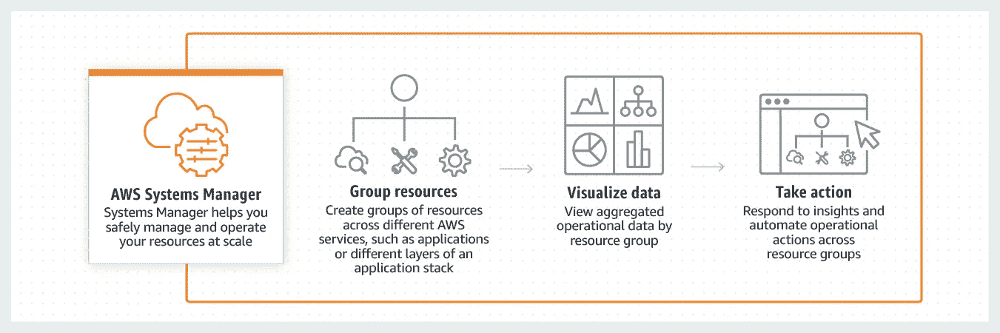

# 使用 AWS Systems Manager 自动打补丁

> 原文：<https://medium.com/nerd-for-tech/automate-patching-with-aws-systems-manager-2433988355ed?source=collection_archive---------2----------------------->

**用例**:您是大量需要定期修补的 EC2 实例的管理员。您希望使用 AWS Systems Manager 自动完成这一过程，而不是浪费工时手动修补每个实例。

## 系统经理

Systems Manager (SSM)让您能够了解和控制您的 AWS 基础架构。SSM 允许你组织你的…