# 自动将静态站点部署到 AWS

> 原文：<https://medium.com/nerd-for-tech/automate-static-site-deployment-to-aws-c6ea81e57824?source=collection_archive---------17----------------------->

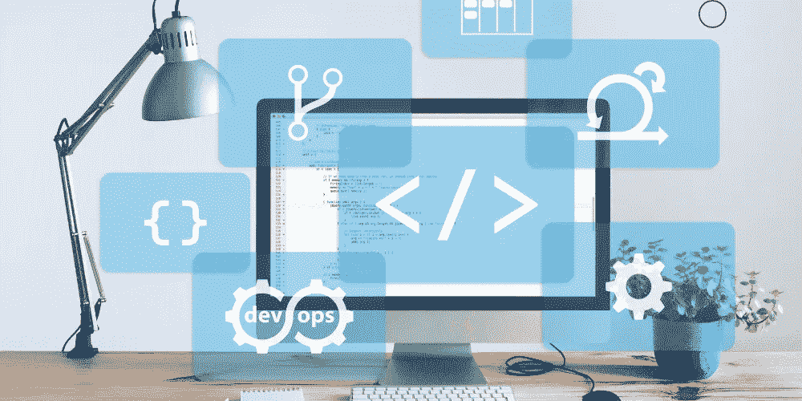

如果你已经做了一个静态网站，那么使用 AWS 的 S3 桶很容易让它活起来。问题是每次你做一个改变(比如添加一个新页面)，你需要手动更新你的 S3 桶。如果你也在使用 CloudFront(减少延迟，到 Gzip 等。)那么你也需要更新它。

我们可以自动完成这一过程，因此您不必担心这些繁琐的任务。有两个步骤:

1.  创建一个管道，在每次向 GitHub 推送更改时更新 S3
2.  清除 CloudFront 的缓存

# 步骤 0:设置 GitHub 存储库

如果您已经在使用存储库，那么您可以跳过这一步。否则，您应该建立一个免费的 GitHub 帐户，并将您的代码添加到 master 分支。

# S3

这样做的目的是，每次您将更改推送到主分支时，托管站点的 S3 存储桶也会得到更新。AWS 为此提供了一个简单的解决方案: **CodePipeline** 。

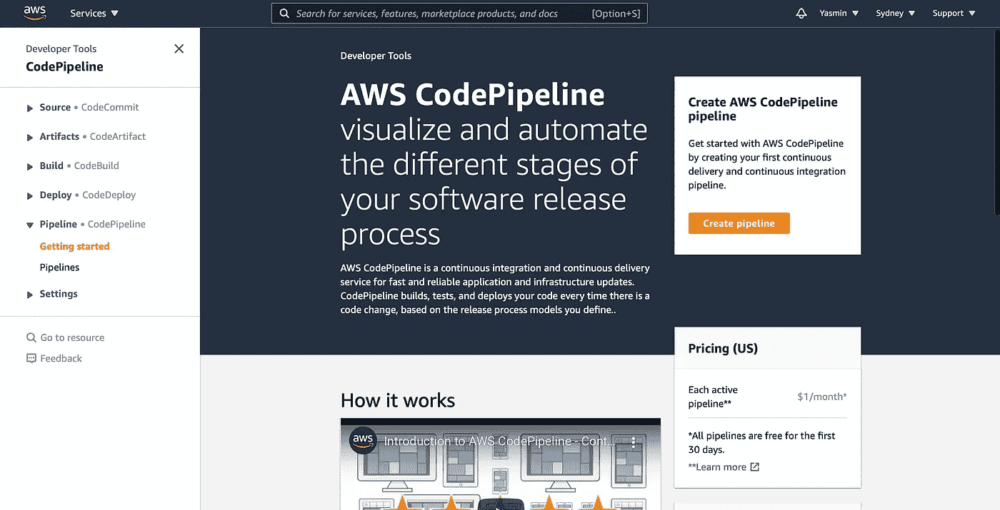

AWS 截至 2021 年的代码管道

> 确保您所在的地区与您的 S3 桶所在的地区相同。

要开始，按**创建管道**。

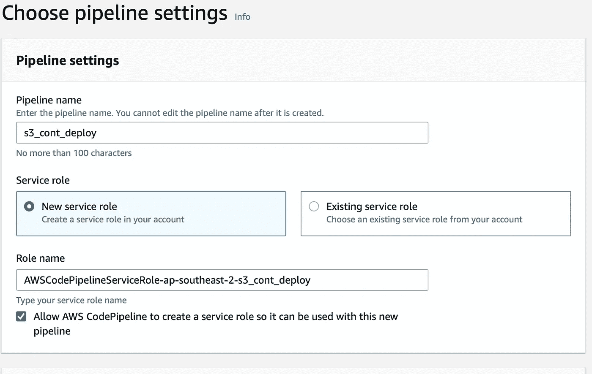

管道设置

我选择了名称 s3_cont_deploy，但它可以是任何名称。

点击下一步前，打开同一页面的**高级设置**:


选择**自定义位置**并搜索当前托管静态站点的桶。

将加密密钥保留为默认值。现在按下一步！

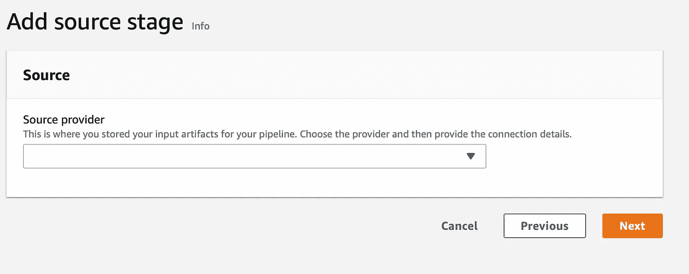

代码管道源代码提供程序

搜索 GitHub(版本 2)作为您的源代码提供者。

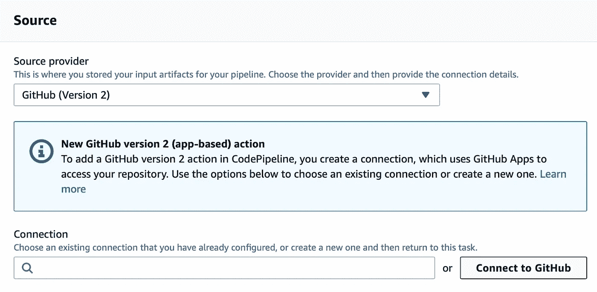

GitHub(版本 2)源代码提供者

然后会要求您指定一个连接。如果您之前已经从 AWS 连接到您的 GitHub 帐户，那么只需搜索该连接名称。否则，按下**连接到 Github** 。

一旦你按下**连接到 Github** 一个新的标签将会打开。

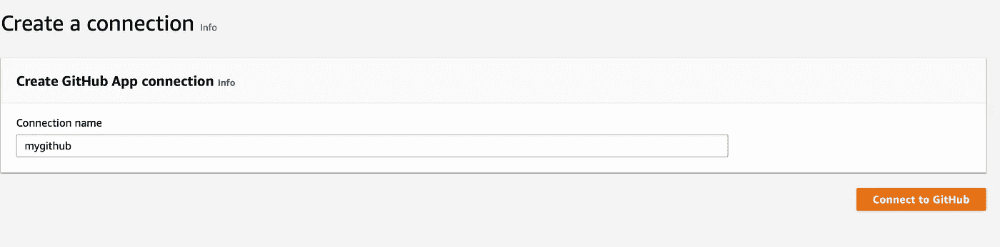

连接到 GitHub

在这里，您可以按照说明来证明您拥有 GitHub 帐户。

完成后，返回代码管道页面。现在，您应该会看到刚刚创建的新连接作为选项之一。

添加详细信息，例如代码的存储库和您想要部署的分支。我建议将此设置为主。

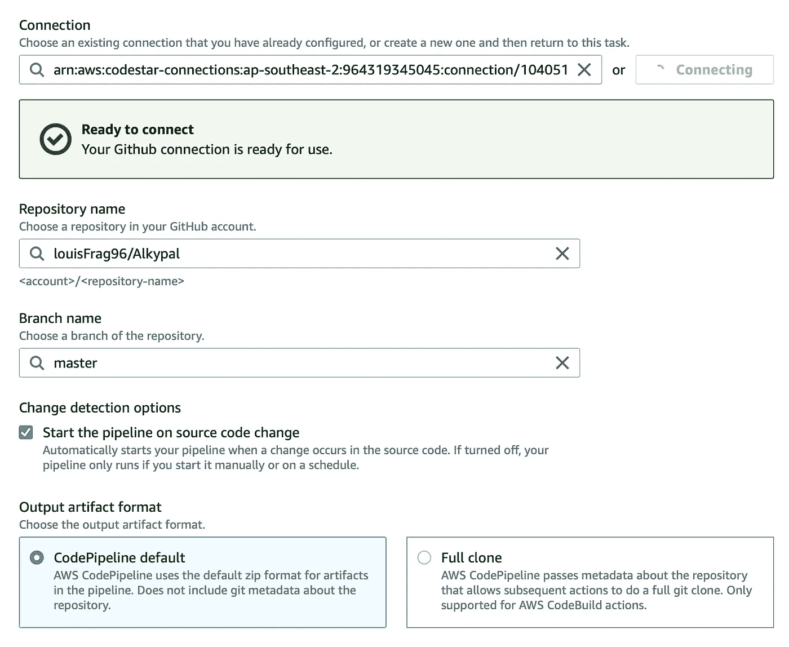

下一步是指定构建提供者。跳过这个阶段。

接下来是部署提供者。搜索亚马逊 S3，然后选择你的桶的地区和名称(我的名称是 alkypal.com.au)。勾选部署前提取文件，然后点击下一步！

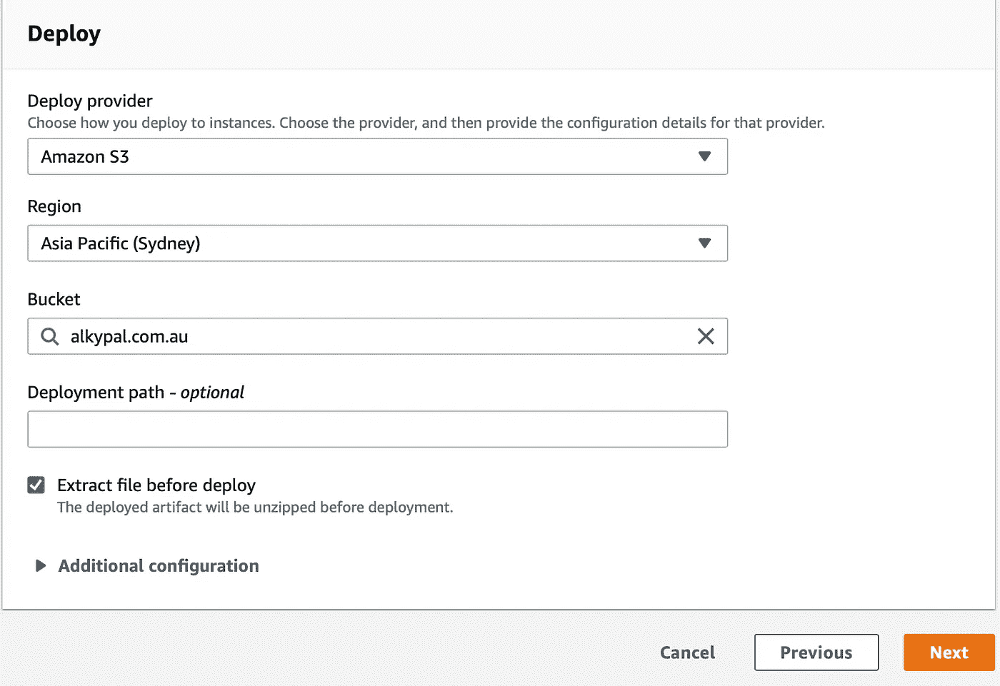

部署提供程序

现在您只需要检查管道并点击 create。

## 快速检查一下👀

为了确保一切按预期运行，请将一个图像文件添加到您的存储库中。它是什么并不重要，这只是为了测试。

确保将代码添加、提交并推送到主分支。

然后转到 **CodePipeline** 并选择具有您之前选择的名称的管道，您将看到如下内容:

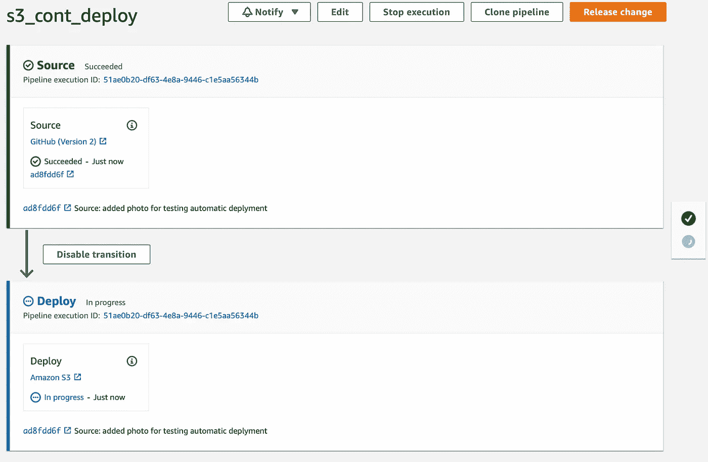

等待**部署**阶段完成(一旦变绿，状态变为成功，你就知道了)。

现在前往 S3，选择你的桶。检查并确保图像在您的桶中。如果是，那么您的管道正在按预期工作。请确保您从存储库和 S3 存储桶中删除了该图像！

# 步骤 2: Cloudfront

如果你使用的是 Cloudfront(大多数网站都使用),那么你也需要完成以下步骤，以确保浏览器中确实会出现变化。这个阶段有点长，所以我把它分成 3 个小步骤:

1.  设置 IAM 角色
2.  设置 lambda 函数，该函数使用在步骤 1 中创建的 IAM 角色
3.  添加您的 S3 桶作为步骤 2 中 lambda 函数的触发器

## 步骤 1:设置 IAM 角色

IAM 角色可用于授予资源对其他资源执行操作的权限。在我们的例子中，我们希望创建一个角色，该角色将授予 lambda 在 S3、Cloudfront 和 CloudWatch 上执行操作的权限。

搜索 **IAM** 后，选择**角色**，然后选择**创建角色。**

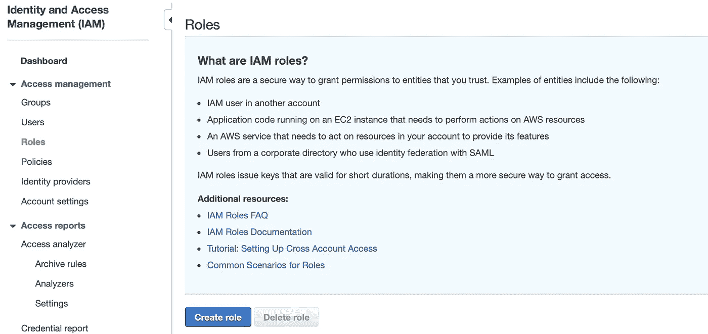

IAM 角色

选择 **AWS 服务**，然后选择**λ**。

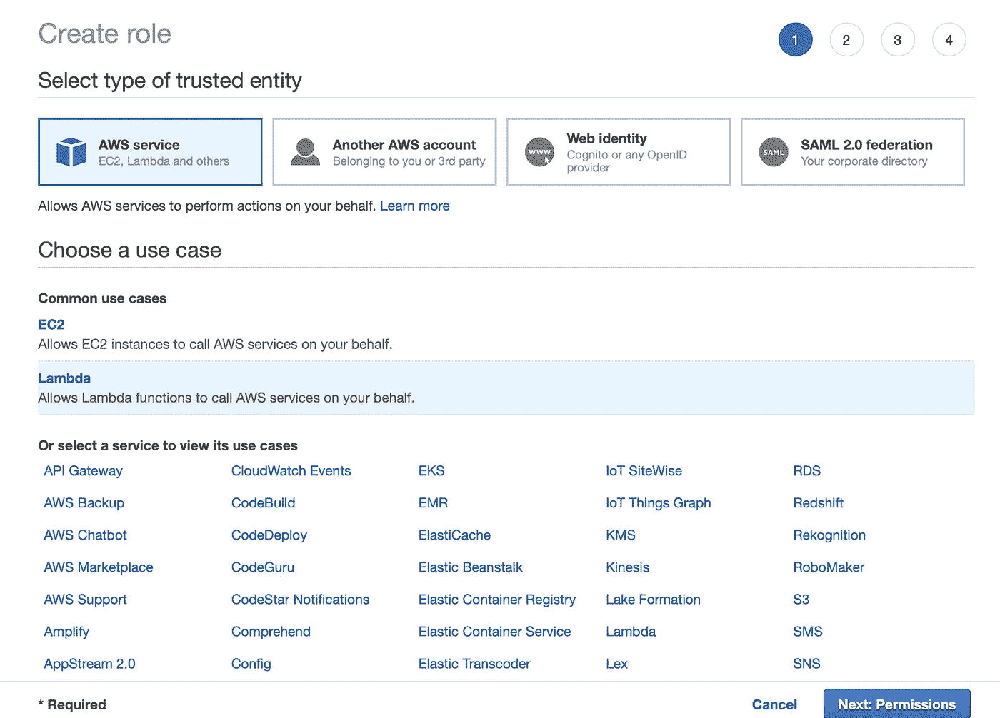

为 lambda 服务创建 IAM 角色

如前所述，我们需要添加 3 个策略。

1.  S3:搜索下面的术语，然后勾选政策。

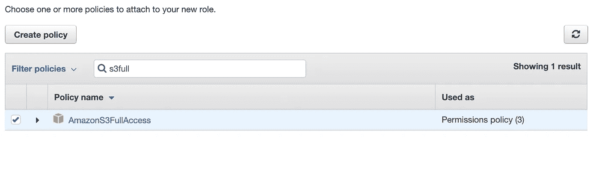

步骤 1:添加 AmazonS3FullAccess 策略

2.CloudWatch:再次勾选完全访问选项

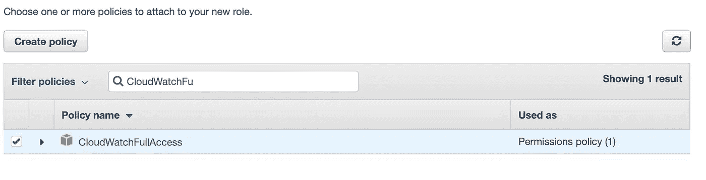

3.CloudFront:为此，选择 **Create Policy** ，这将带您进入一个新的选项卡。选择 JSON 并插入以下代码片段:

```
{
    "Version": "2012-10-17",
    "Statement": [
        {
            "Effect": "Allow",
            "Action": "s3:*",
            "Resource": "arn:aws:s3:::*"
        },
        {
            "Effect": "Allow",
            "Action": [
                "cloudfront:CreateInvalidation",
                "cloudfront:GetInvalidation",
                "cloudfront:ListInvalidations"
            ],
            "Resource": "*"
        }
    ]
}
```

现在返回到**创建角色**页面，选择您新创建的策略。

转到下一步，添加角色名称，我选择了 lambda_s3。创造角色！

## 步骤 2:创建 Lambda 函数

确保从头选择作者并添加这些设置:

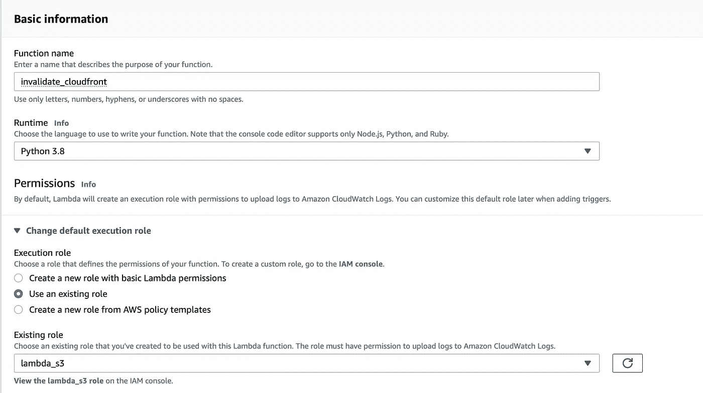

在这里，我们可以使用刚刚创建的角色来授予 lambda 函数权限。

一旦创建了函数，您将被带到新创建的函数，该函数目前*不执行任何操作*😩

我们需要添加一些代码。在代码源中添加以下代码片段，然后按 deploy。这个片段来自 [Yago Nobre](https://medium.com/u/cee15f751d86?source=post_page-----c6ea81e57824--------------------------------) 在[他的文章](/@yagonobre/automatically-invalidate-cloudfront-cache-for-site-hosted-on-s3-3c7818099868)。

```
from __future__ import print_function

import boto3
import time

def lambda_handler(event, context):
    path = "/" + event["Records"][0]["s3"]["object"]["key"]
    bucket_name = event["Records"][0]["s3"]["bucket"]["name"]

    client = boto3.client('s3')
    tags = client.get_bucket_tagging(Bucket=bucket_name)
    for tag in tags["TagSet"]:
        if tag["Key"] == "distribution_id":
            distribution_id = tag["Value"]
            break

    client = boto3.client('cloudfront')
    invalidation = client.create_invalidation(DistributionId=distribution_id,
        InvalidationBatch={
            'Paths': {
                'Quantity': 1,
                'Items': [path]
        },
        'CallerReference': str(time.time())
    })
```

它应该是这样的:

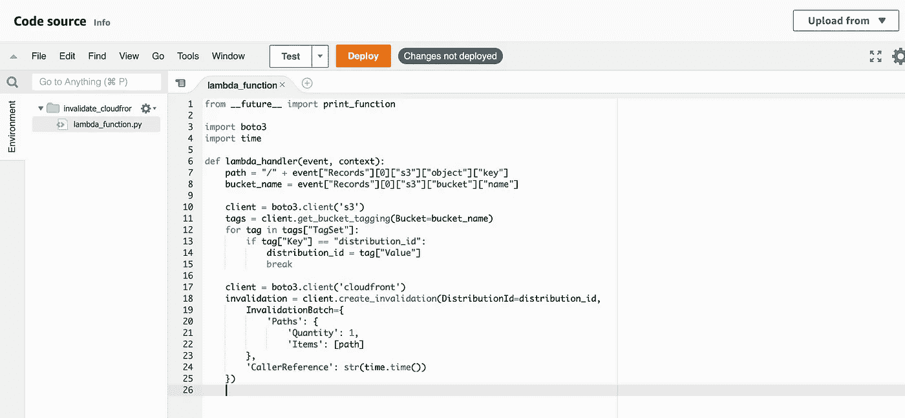

使 cloudfront 无效的 Lambda 函数

## 第三步:添加 S3 作为触发器

回到你的 S3 桶，在属性下你会发现**事件通知**。按下“创建事件通知”后，您应该会看到此页面:

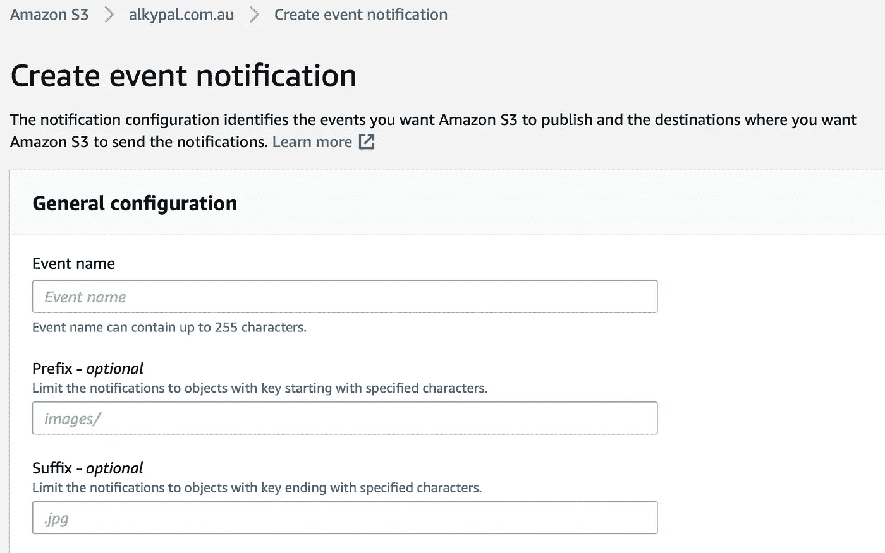

为您的通知命名。保留前缀和后缀 emtpy(我们希望 lambda 在每次更改时触发)。

在事件类型下，选择所有创建和删除事件。

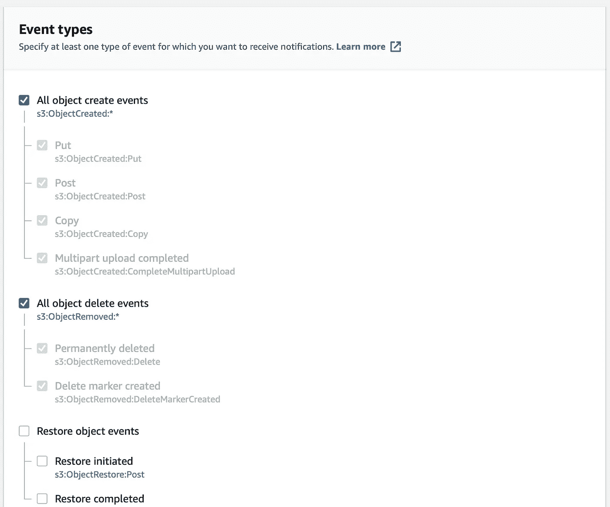

bucket 中所有删除和创建事件的触发器

选择我们刚刚创建的 lambda 函数。并保存更改。

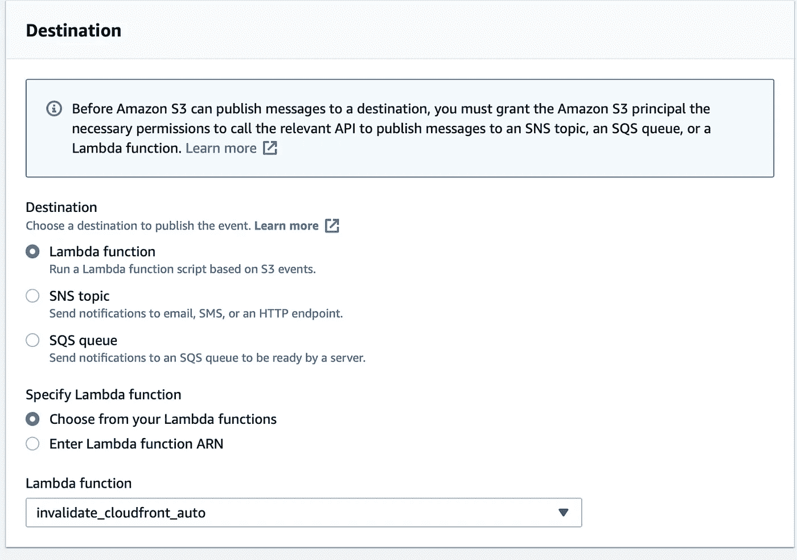

选择将被触发的功能

最后，回到 CloudFront，找到你的 CloudFront ID。在 properties 下的 S3 存储桶中，添加一个带有关键字“distribution_id”和 CloudFront ID 值的标签。

# 确保它正常工作…

为了确保您的更改被自动部署，您需要关闭浏览器的缓存。

现在只需更改您网站的一个文件。硬刷新页面(确保没有浏览器缓存)，你会看到变化！

搞定了。！！！！