# 使用 Power Automate 自动化您的日常工作。

> 原文：<https://medium.com/nerd-for-tech/automate-your-daily-routine-with-power-automate-881adaac66a9?source=collection_archive---------9----------------------->


图片来自[unsplash.com](https://unsplash.com/)

这就是我如何遇到 Power Automate 的傻故事。它把我们拖回到几个月前，那时我们必须尽快实现小型 MVP 项目，我第一次见到这个伟大的工具。

## 什么是 Power Automate(前微软流程)？

总的来说，该工具有助于处理重复性任务甚至业务流程，并将它们从耗时的手动工作转变为高效的自动化工作流程。

这听起来可能有点吓人，但实际上，它看起来是这样的:

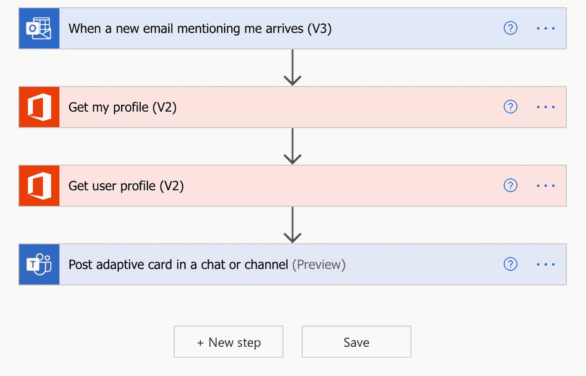

流程示例(电力自动化)

因此，当提到用户的新电子邮件到达时，PA 获得用户和在电子邮件中提到他们的人的简档。之后，它将消息发送给用户，并通知他有电子邮件。

这里我们应该强调 PA 的基本术语。工作流从**一个** **触发器**开始(在这个特殊的例子中，它是 Outlook 中的一封电子邮件)，然后整个处理由**动作**完成(获取个人资料并将消息发布到 MS 团队中的一个聊天室)。

## 如何创造你的第一个流量？

小菜一碟。只需打开 PA 仪表盘，打开“我的流程”选项卡，然后按“新流程”，选择“自动化云流程”。

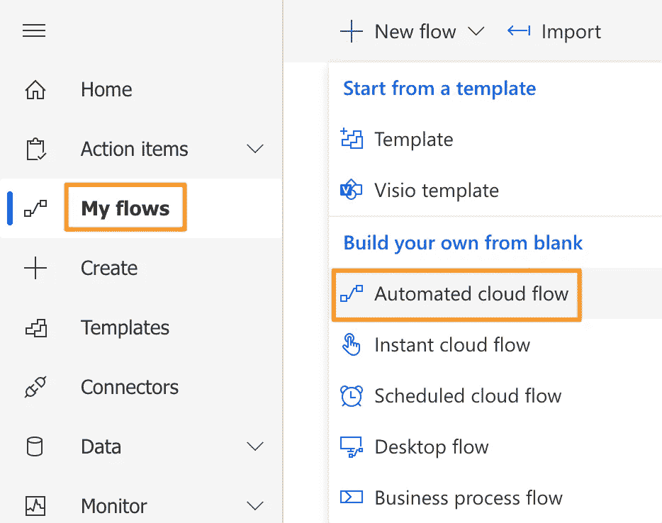

创建新流程(Power Automate)

然后你需要指定一个名字，一个触发器，然后点击“创建”。

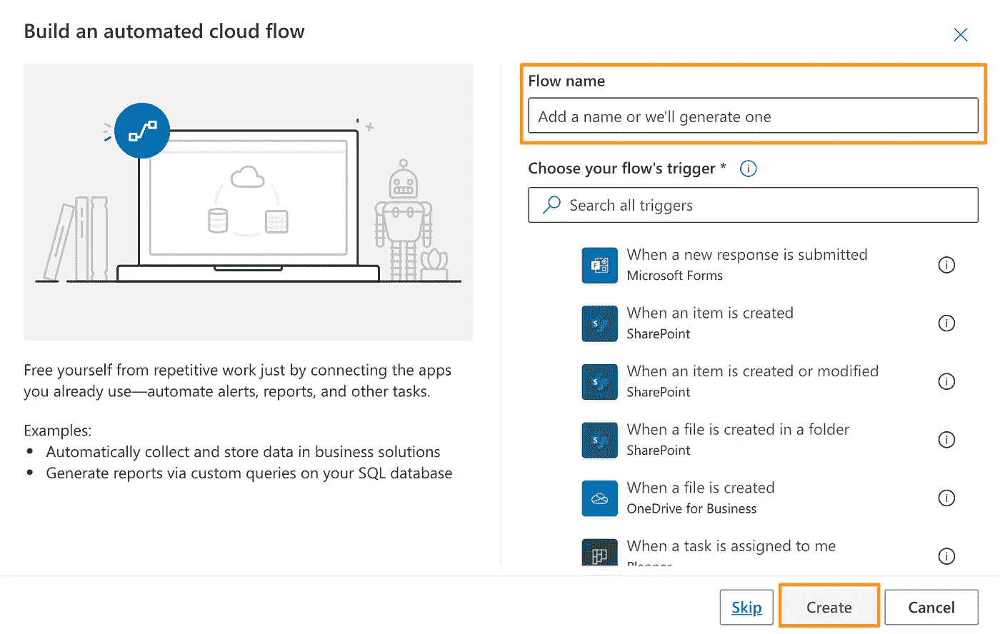

创建新流程(Power Automate)

仅此而已。现在，您可以打开全新工作流程的仪表板。

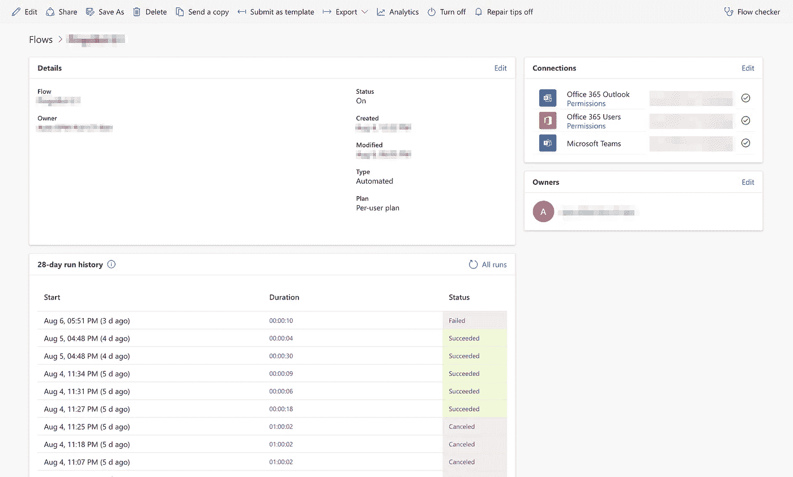

工作流仪表板(Power Automate)

它由几个部分组成:

**细节。**它包含了关于一个流的信息(名称、所有者、状态等等),可以随时编辑。

**运行历史。**最有帮助的一个。它提供了上个月的运行状态，可用于调试问题和检查从初始输入到最终输出的整个流程。

**连接。**动作和触发器中使用的所有服务。

**控制菜单。**从分享流程开始，到查看分析结果结束，这里可以完成大量控制操作。

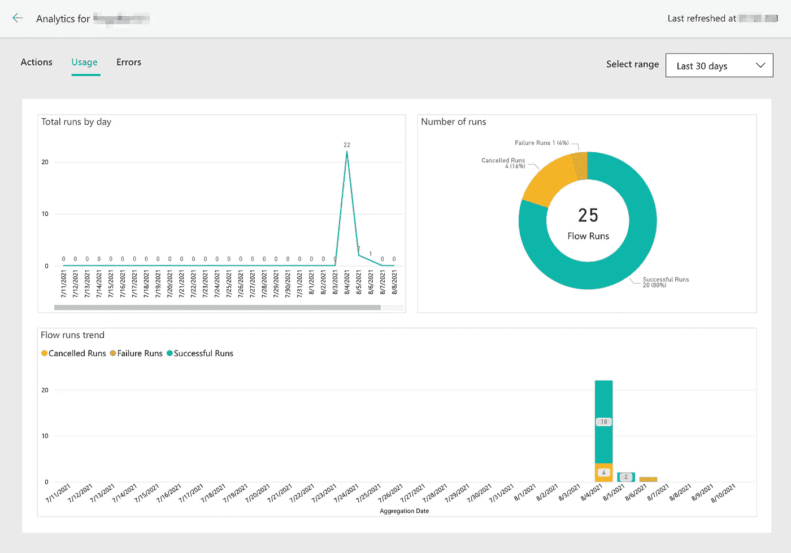

分析(电力自动化)

*文档:*

*   [https://docs . Microsoft . com/en-us/power-automate/get-started-logic-flow](https://docs.microsoft.com/en-us/power-automate/get-started-logic-flow)
*   [https://docs . Microsoft . com/en-us/power-automate/triggers-简介](https://docs.microsoft.com/en-us/power-automate/triggers-introduction)
*   [https://docs . Microsoft . com/en-us/power-platform/admin/analytics-flow](https://docs.microsoft.com/en-us/power-platform/admin/analytics-flow)

## 开始行动。

在本节中，我想深入探讨一些广泛传播的行为(与任何关系或特定产品无关)，并介绍一些表达方式。

先从变量说起。如果你有任何编程语言的经验，你肯定听说过变量。基本上，它们是用来存储信息的，可以随时更换。在 PA 中，我们有关于变量的各种运算。首先，变量应该通过相应的动作“初始化变量”进行初始化，然后可以通过“设置变量”动作进行更新。

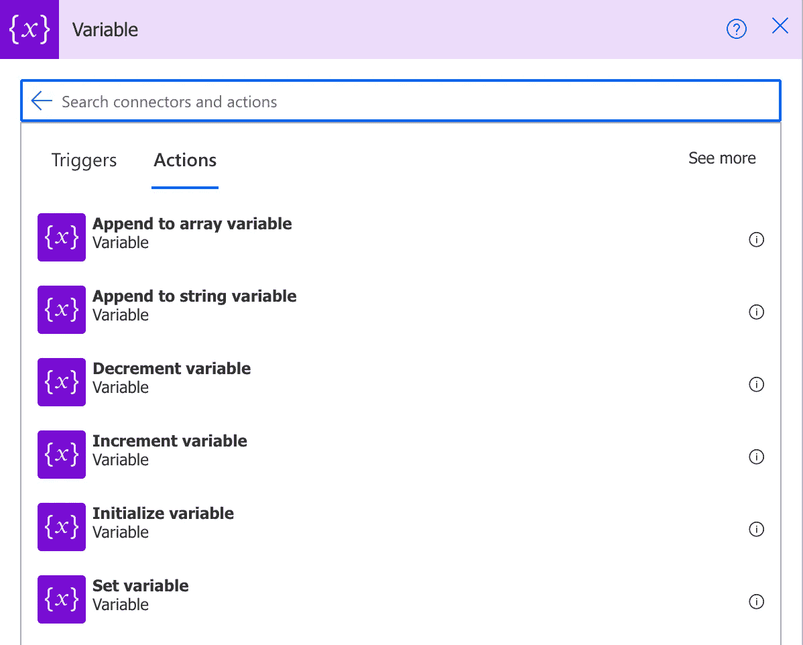

可变动作(电力自动化)

下一类行为叫做“控制”。它通常用于向流程添加一些逻辑。

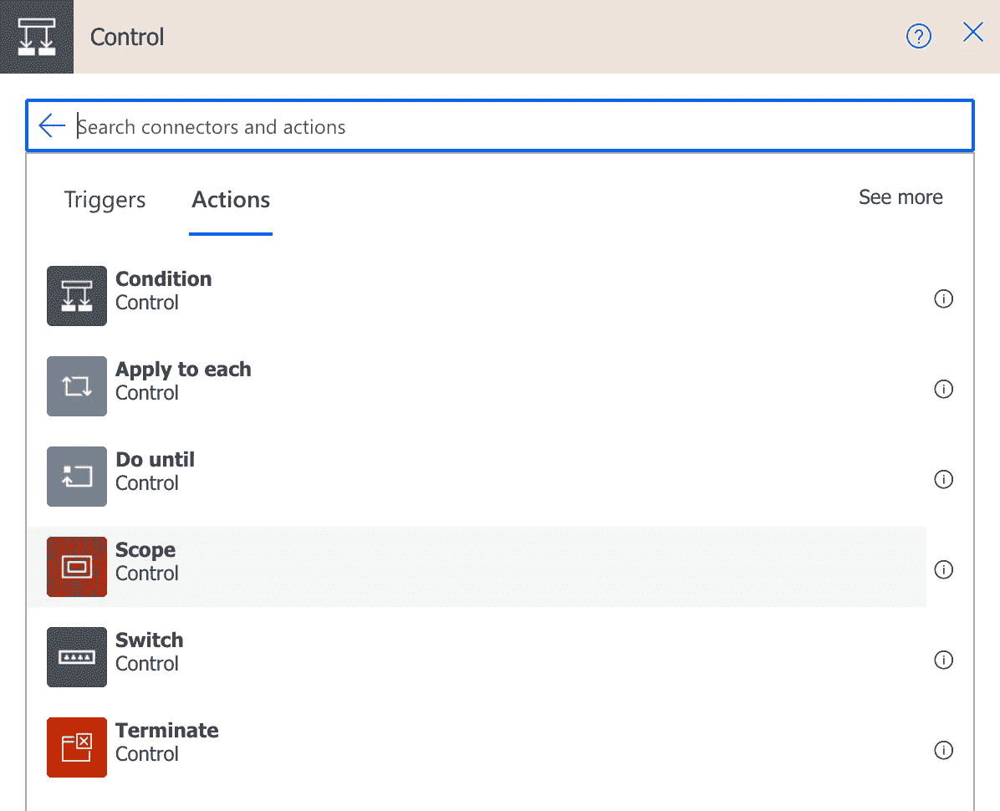

控制动作(电源自动化)

**【条件】【开关】**用于增加逻辑的分支，例如，如果名字是“汤姆”，则执行下面的动作，如果不是，则执行另一个动作。

**“应用于每一个”**和 **Do 直到**是循环，可以用于列表上的重复动作。

**“终止”**以给定的状态之一停止流程。

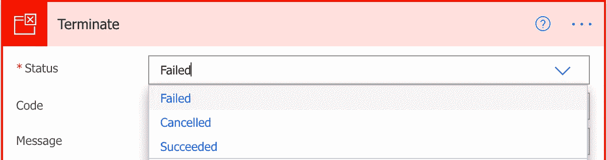

终止操作(电源自动)

最后，**【范围】**是一种特殊的动作，其中封装了其他一些动作，有助于以正确的方式组织流程。这意味着当你将动作放入一个范围内时，它们可以在视觉上被折叠，因此它使得设计器内的表示更加简单。

然而，可能会有一些问题，例如，变量不能在作用域内初始化。

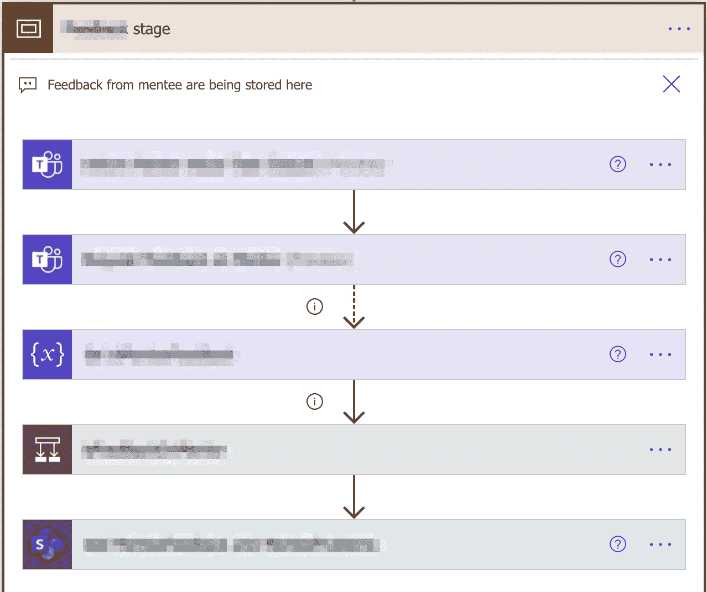

范围动作(电源自动)

还有一些其他类别的操作，如**“日期和时间”**、**“撰写”**和一些**特定于 MS Teams、MS Sharepoint** 等产品的其他操作。

但是可能要花上一生的时间才能看完

*文件:*

*   [https://docs . Microsoft . com/en-us/power-automate/apply-to-each](https://docs.microsoft.com/en-us/power-automate/apply-to-each)
*   [https://docs . Microsoft . com/en-us/power-automate/add-condition](https://docs.microsoft.com/en-us/power-automate/add-condition)
*   [https://docs . Microsoft . com/en-us/power-automate/create-variable-store-values](https://docs.microsoft.com/en-us/power-automate/create-variable-store-values)

## 表情介绍。

Power Automate 有广泛的操作选择，但有时需要像添加数字、连接字符串、解析 URL 等操作。这就是表情拯救世界的地方。Power Automate 利用了 Azure Logic 应用程序使用的相同的**工作流定义语言**。

例如，我需要获得用户输入的链接的 URL。在这里，我可以使用表达式" **uriHost"** 来检索 URI 主机，使用表达式 **"triggerBody"** 来返回触发器的输入数据。

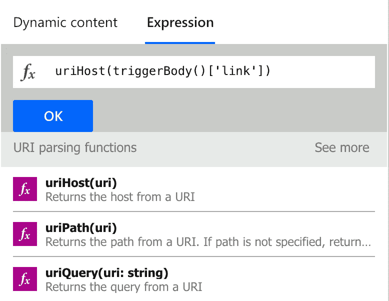

此外，在某些情况下，它可能会取代控制动作的大量使用。在我的例子中，所有的嵌套条件都被逻辑表达式代替了。

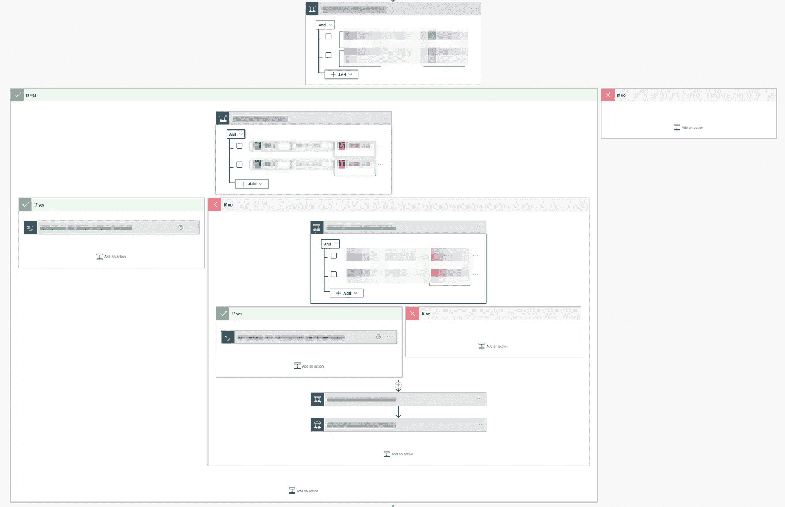

条件地狱(电力自动化)

```
if(empty(body('input')?['data']?['property']), 'Default Value', body('input')['data']['property'])
```

因此，在任何地方都要使用这些表达。它可以提高流的可读性，并且有助于不超过操作的 Power Automate 限制。

*文档:*

*   [https://docs . Microsoft . com/en-us/azure/logic-apps/logic-apps-workflow-definition-language](https://docs.microsoft.com/en-us/azure/logic-apps/logic-apps-workflow-definition-language)
*   [https://flow . Microsoft . com/en-us/blog/use-expressions-in-actions/](https://flow.microsoft.com/en-us/blog/use-expressions-in-actions/)
*   [https://docs . Microsoft . com/en-us/power-automate/use-expressions-in-conditions](https://docs.microsoft.com/en-us/power-automate/use-expressions-in-conditions)
*   [https://docs . Microsoft . com/en-us/power-automate/limits-and-config](https://docs.microsoft.com/en-us/power-automate/limits-and-config)

## 结论。

我们已经讨论了 Power Automate 的要点(触发器、动作)，甚至还略微涉及了一些高级主题(表达式、限制)。

从我的观点和最近的经验来看，Power Automate 应该用于日常事务的自动化，甚至用于创建 MVP(当然，如果适用的话)。

在我们的案例中，它是测试内部 MS Teams Bot 的完整逻辑的最佳选择，该逻辑包括 100 多个动作，在迁移到真实平台之前工作了几个月。

感谢您阅读全部内容！

[](https://docs.microsoft.com/en-us/power-automate/) [## Power Automate 文档- Power Automate

### Power Automate 是一项服务，可帮助您在喜爱的应用程序和服务之间创建自动化工作流，以…

docs.microsoft.com](https://docs.microsoft.com/en-us/power-automate/)