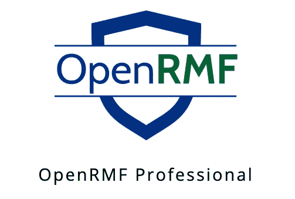
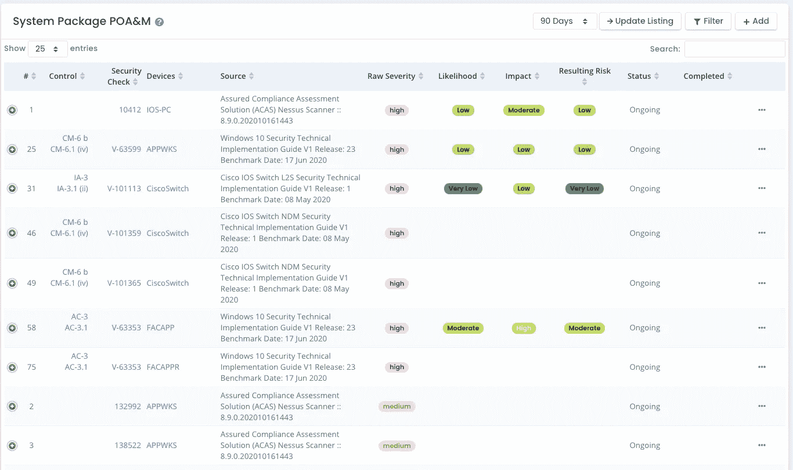
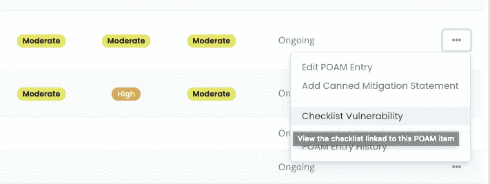
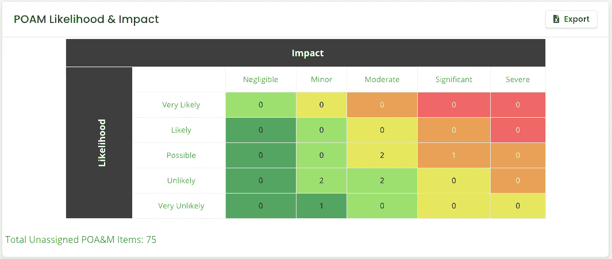

# 使用 OpenRMF Professional 为 RMF 和 FedRAMP 自动化您的 POA&M

> 原文：<https://medium.com/nerd-for-tech/automate-your-poa-m-for-rmf-and-fedramp-with-openrmf-professional-ef72aedcb4c2?source=collection_archive---------10----------------------->

使用 OpenRMF Professional 自动创建、跟踪、链接、更新和管理您的 POA&M 条目，查找 STIG 核对表漏洞和操作系统补丁漏洞！

OpenRMF Professional —网络合规自动化

# 保持你的 POA&M 更新是一项全职工作

如果您或您的团队成员曾经不得不在一个正在通过风险管理框架(RMF)或 FedRAMP 认证的项目中保持行动计划和里程碑(POA&M)的最新状态，那么您应该知道这带来的痛苦和冲突！即使使用旧的 DITSCAP 和 DIACAP 流程，您也必须有 POA&M 来跟踪开放项漏洞。您列出了实际的问题或漏洞，当您修复它们时(如果不只是接受风险)，为什么它是一个问题，任何缓解措施，严重性以及它来自哪里。而你手动做了(或者还在做)*。*

*即使对于一个小团队来说，这也是*的大量工作。对于一个有很多服务器、设备、软件应用程序、操作系统、数据库和其他网络连接的更大的系统实现来说，这是项目经理或项目分析师的*祸根*！仅仅是获得最新的扫描数据、清单状态、追踪人员以获得答案，以及将特定的 POA & M 项目 ID 号与适当的清单或扫描相匹配，就已经够单调乏味的了！**

# *自动创建和跟踪您的 POA&M 项目*

*这种情况我们需要的是 ***自动化*** —进入 OpenRMF Professional！该应用程序接收清单(SCAP 扫描结果和/或清单 CKL 文件)和补丁程序扫描(Nessus 文件),并在一个位置管理所有数据。它跟踪最新的信息，在每次更新时更新旧数据的版本，跟踪打开的清单的数量，并按状态和类型修补漏洞，让您可以轻松获得所有这些数据。*

*这是在基于 web 的应用程序中实现的，该应用程序是基于角色的，具有下至系统包级别的组权限。有了这些数据，OpenRMF Professional 还会 ***生成一个实时 POA & M*** ，该 POA M 链接回导致 POA & M 项被创建的清单条目或补丁漏洞。它是实时的，因为它链接到导致它的问题。*

**

*当该清单漏洞或补丁漏洞被更新并(希望)关闭或标记为“不是发现”时，POA&M 会自动更新相应 POA&M 条目的信息。POA&M 记录的历史副本被自动保存用于配置管理和跟踪目的。导致这种情况的自动交易的历史也会被审计。自动更新的详细原因也被添加到 POA&M 记录中。*

*这种自动化减轻了手动来回查找导致 POA&M 项目的数据的工作。它还有助于最小化或减轻基于最新对话、会议或电子邮件的状态的手动更新。并且它给出了关于为什么记录在那里以及为什么它具有当前状态和信息的精确可追溯性。所有这些都在一个完全基于网络的安全协作环境中进行。*

# *自动链接您的 POA&M 漏洞*

*对于自动创建的项目，有一个…菜单直接链接到清单或修补程序扫描信息。点击它，一个新的浏览器标签打开，直接带你到特定的漏洞。不用再打开多个文件，并试图确保您跟踪清单或扫描的正确版本，匹配数字并保持 POA&M 项目最新。*

*让 OpenRMF Professional 为您做这些。所以你可以把你的时间花在其他增值工作上，以达到你的 ATO、IATO、IATT 或更新的状态。*

**

*自动链接到创建此 POA&M 项目的清单或修补程序漏洞*

# *在需要时创建手动 POA&M 项目*

*如果您*必须*手动添加 POA&M 项目，您也可以这样做。只需在系统 ATO 包中使用正确的角色和权限单击“添加”按钮，就可以开始了。*

*这些项目将被手动更新，而不会链接到任何自动清单或补丁程序扫描，从而导致其创建。但是，所有这些 POA&M 项目让您能够全面了解项目的当前状态和风险，以及您为 ATO、IATO、IATT 或计划的合规性审计和更新关闭或减轻这些项目的计划。都在一个地方。*

# *自动显示风险多维数据集*

*从所有这些实时 POA&M 数据中，您可以运行一个报告，并快速查看您的风险立方体中排列的项目数量。您还可以看到需要与 POA&M 项目条目相关的可能性、影响、严重性和风险相匹配的未分配项目的数量。该报告提取实时数据。当您的 POA&M 通过自动和手动方式更新时，此风险数据也会更新。*

*不再用日期和时间来命名 MS Excel 文件，以确保您拥有最新的信息。OpenRMF Professional 为您准备了它！*

**

*实时 POA&M 产生的风险可能性和影响*

# *OpenRMF 专业人士来拯救*

*OpenRMF Professional 自动化了大部分 RMF 和 FedRAMP 流程，有助于将 ATO 或批准时间减少 40–50%。OpenRMF 的协作环境消除了许多手工劳动和孤立的工作，包括调整 NIST 控制和子控制、清单、补丁扫描、POA & Ms 和合规生成，然后在一个安全的中央数据库结构中管理所有信息。这允许自动生成和更新 POA & M、测试计划概要以及各种其他安全和 RMF 或 FedRAMP 报告。*

*为所有网络安全合规性数据建立一个基于 web 的中央存储库，为每个系统包提供基于角色的安全性，使用单一的真实来源简化 RMF 和 FedRAMP 流程，并消除错误、大量手动个人跟踪和返工。它还为领导层提供了对所有系统包安全和风险信息状态的直接洞察，从而消除了实施 RMF 和 FedRAMP 流程的神秘感。*

*一旦达到 ATO 或批准级别，OpenRMF 将持续监控和跟踪 POA&M 项目、系统和应用的整体风险，并在系统包的整个生命周期内跟踪更新的扫描和清单。*

*点击这里查看[。求 30 天无义务评估自己试试！](https://www.soteriasoft.com/products/openrmf-professional.html)*