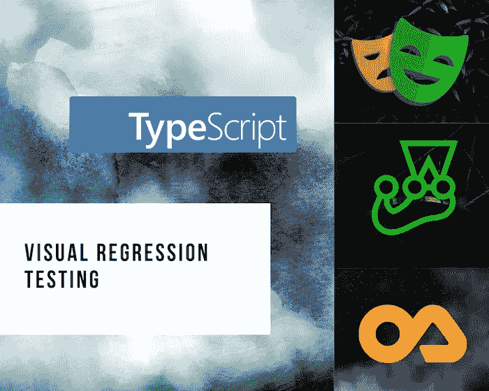
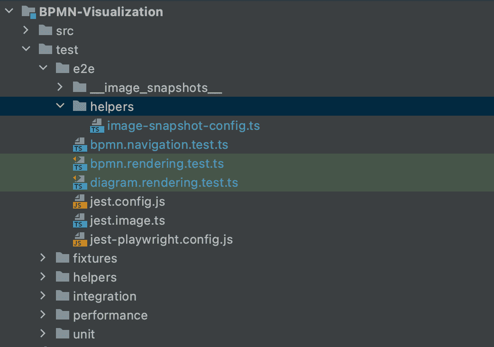
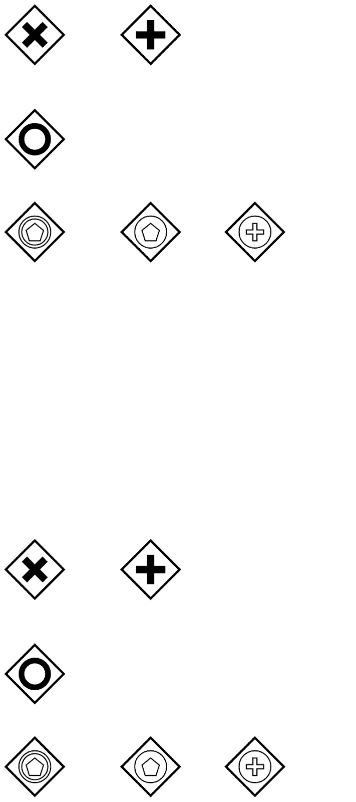

# 使用类型脚本、剧作家、笑话和笑话图像快照进行自动化视觉回归测试

> 原文：<https://medium.com/nerd-for-tech/automated-visual-regression-testing-with-typescript-playwright-jest-and-jest-image-snapshot-86db6f3364f5?source=collection_archive---------0----------------------->

用[https://www.canva.com](https://www.canva.com)制造

# **简介**

如你所知，拥有自动化的可视化回归测试(除了单元测试和集成测试之外)对于确保用户良好的体验是非常重要的。
这确保了不会有意外的破坏，并确认当现有代码被修改或依赖关系被更新时，用户流和应用程序的外观是正常的。

最近写了一篇关于[用 TypeScript，Jest，Jest Image Snapshot 和**木偶师**](/nerd-for-tech/automated-visual-regression-testing-with-typescript-puppeteer-jest-and-jest-image-snapshot-9e14dd9d0fe7) 进行视觉回归测试的文章。如果你使用木偶师，你知道你只能在铬下测试。Firefox 的实现是实验性的，根本不支持 Webkit。
今天，我给你提供一个木偶师的替代品:**剧作家** 剧作家和木偶师很像。《木偶戏》中出现的所有功能在《剧作家》中还没有出现。但是这个工具的优点是你可以在 Chromium，Firefox，Webkit，Google Chrome & Microsoft Edge 上运行你的测试，此外只需要一个命令。

在本文中，我将解释如何在一个 TypeScript 项目中使用 Jest——作为测试运行程序——和 Jest-Image-Snapshot(Jest matcher)——来设置和运行测试，以获取当前网页的截图，并将生成的截图与截图基线进行比较，从而找到用户界面中的回归。
如果你看了我之前的文章，会觉得挺像的。

# 项目示例

我将以 [BPMN 可视化](https://github.com/process-analytics/bpmn-visualization-js)项目(版本 0.13.0)为例。(这个例子已经被简化，所以它更清楚地显示了本文中解释的配置和特性。)这个项目的目标是加载 BPMN 内容，并呈现它。
自动化视觉测试将通过每次重构、添加新组件、更新不同 BPMN 元素的定位算法或更新 MxGraph 渲染库来简化我们的生活。

此外，我将配置测试在 Chromium、Firefox 和 Webkit 上运行。

# 先决条件

作为第一步，我们需要安装所需的包作为 devDependencies:

*   **Jest** +其类型定义:一个 JavaScript 测试框架
    [Jest](https://jestjs.io/) 是一个全功能的测试框架，由脸书开发。它需要很少的配置，基本上开箱即用。

> npm install -D jest @types/jest

*   剧作家:一个 Node.js 库，用一个 API 自动化 [Chromium、Firefox、Webkit、Google Chrome &微软 Edge](https://playwright.dev/docs/browsers) 。可以在浏览器上手动执行大部分操作并截图。

> npm 安装-D 剧作家笑话-剧作家预设

*   **Jest-Image-Snapshot** + its 类型定义:一个 Jest 匹配器，用于执行图像比较

> NPM I-D jest-image-snapshot @ types/jest-image-snapshot

# 配置

让我们配置前面的库。

## 配置 Jest

我不会在这里详细介绍配置 Jest 的所有不同方法。如果您已经在您的单元/e2e 测试中使用 Jest，这对您来说并不陌生。如果你想知道更多关于 Jest 的解释，有很多很棒的文章。

在这个例子中，我们有 4 个 Jest 配置:单元测试、集成测试、e2e 测试和性能测试。我们在 e2e 测试套件中添加了视觉测试。在这里，我将解释我们如何为 e2e 测试配置 Jest。

首先，在*创建 Jest 配置文件。/测试/e2e* 目录:

。/测试/e2e/jest.config.js

这个配置将根目录设置为根项目目录，运行*。ts* 文件与 ts-jest 模块，并在*的任何子目录下查找 *.spec.ts* 和 *test.ts* 文件。/测试/e2e* 目录。

## 配置剧作家

*   在 Jest 配置中指定预设，如剧作家的[官方文档中所指定:](https://playwright.dev/docs/test-runners#jest--jasmine)

。/测试/e2e/jest.config.js

*   为运行服务器的剧作家配置创建一个新文件& [为所有测试启动一次浏览器:](https://playwright.dev/docs/api/class-browsertype#browsertypelaunchoptions)

。/test/e2e/jest-剧作家

使用这个配置，我们在端口 **10002** 上启动一个服务器，超时 30 秒，并启动 3 个浏览器。

## 扩展 Jest expect 断言机制以使用 Jest 图像快照

这可能是新的部分，但稍加配置，我们很快就会准备好。

默认情况下， **Jest** 对 **Jest-Image-Snapshot** 及其断言 **toMatchImageSnapshot** 一无所知。所以我们需要扩展 Jest。为此，创建一个新文件，如下所示:

。/test/e2e/jest.image.js

为了避免在每个测试文件中扩展 Jest 或在所有测试文件中全局导入之前的文件，我们需要配置 Jest，以便在使用[**setupFilesAfterEnv**](https://jestjs.io/docs/en/configuration#setupfilesafterenv-array)(Jest 属性)**将测试框架安装到环境中之后立即运行它。**

。/测试/e2e/jest.config.js

## 添加新命令

为了简化测试执行，在 **package.json** 文件中添加以下脚本:

。/package.json

现在，您可以使用以下命令运行您的 e2e 测试:

> 国家预防机制运行测试:e2e

**注意:如果您在不同的操作系统上运行测试，那么 cross-env** 非常有用。

# 试验

你可以在 Github 上的[自述文件](https://github.com/americanexpress/jest-image-snapshot#%EF%B8%8F-api)中找到不同的属性来定制 **Jest-Image-Snapshot** 。

## 用 Jest-Image-Snapshot 创建一个基本测试

如果一切都配置正确，我们现在准备好通过组合**剧作家**和**玩笑**和**玩笑图像快照**来创建我们的第一个视觉回归测试！

。/测试/e2e/bpmn.rendering.test.ts

在测试运行之后，将会创建一个新目录—**_ _ image _ snapshot _ _**——为每个*到 MatchImageSnapshot* 调用创建一个图像。默认情况下，使用**测试路径**、**当前测试名称**、**计数器**和**默认标识符**计算快照的名称。

**生成的快照示例:**

*bpmn-rendering-test-ts-no-bpmn-gateway-visual-regression-1-snap . png*

**注意:**确保快照文件在您的源代码控制中提交，以便与其他开发人员和 CI 环境共享。

## 在不同机器上测试

一对一像素匹配的一个问题是，测试很可能在开发它的机器之外的机器上出错，因为每个环境呈现相同应用程序的方式都略有不同。

例如，假设我们希望在每次创建对 GitHub 中主分支的 pull 请求时，在 CI 环境中运行测试。无需对代码进行任何修改，测试就可以在本地通过；但是在 CI 环境中，它会失败，并显示如下消息:

> 错误:预期图像与快照匹配或接近匹配，但与快照相差 0.0005804554357724534%(2.7861860917077763 个不同像素)。

并且用于 diff 的新图像文件被存储在**_ _ image _ snapshot s _ _/_ _ diff _ output _ _**目录中，其名称为**<snapshot _ name>-diff . png**。

如果我们使用前面的测试，我们将得到如下结果:

*bpmn-rendering-test-ts-no-bpmn-gateway-visual-regression-1-diff . png*

可以修改之前的 **jest-image-snapshot** 配置，更新***failure threshold****(默认值:0)*&***failure thresholdtype****(默认值:像素)*。这些属性用于计算容许差异的阈值(在测试失败之前)。

。/测试/e2e/bpmn.rendering.test.ts

**警告:**如果您将故障阈值增加太多，当本地和 CI 环境差异太大时，可能无法检测到视觉退化。

## 订购快照

如果你有 10 个或者更多的测试，在目录**_ _ image _ snapshot _ _**中找到哪个截图对应哪个测试/特性会变得复杂。

根据测试修改 **customSnapshotsDir** 属性，使其具有不同的值。

。/test/e2e/ *助手/图像-快照-配置. ts*

。/测试/e2e/bpmn.rendering.test.ts

。/测试/e2e/bpmn.navigation.test.ts

## 重复使用快照

有时，即使在不同的操作之后，预期的结果/快照也是相同的。为了避免 Github 存储库中有大量相同的快照，最好重用一个快照。

为此，需要覆盖默认的**customSnapshotIdentifier**&**customDiffDir**属性。

*   **customSnapshotIdentifier**:给这个快照的自定义名称。它防止用**测试路径**、**当前测试名称**、**计数器**和**默认标识符**计算快照的名称。
*   **customDiffDir** :保存 diff 的目录的自定义绝对路径。由于我们在不同的测试中使用相同的快照，为了知道哪个 diff 文件对应于哪个测试，我们需要根据测试设置不同的值。

。/test/e2e/ *助手/图像快照配置. ts*

。/测试/e2e/图表.渲染.测试. ts

# 结论

有了这么多的操作系统、web 浏览器和屏幕分辨率，视觉测试可以成为一个强大的工具来确保应用程序在所有可能的环境下都能正常工作。作为其他测试的补充，绝对值得一试。

现在，您已经拥有了使用 Jest &剧作家在 TypeScript 中开始第一次视觉回归测试所需的一切。

感谢您的阅读，希望对您有所帮助或启发:)

# 参考

*   https://Github.com/process-analytics/bpmn-visualization-js BPMN 可视化 github 库:
*   Jest-image-snapshot 的 Github 库:【https://github.com/americanexpress/jest-image-snapshot 
*   剧作家文档: [https://playwrightdev/](https://playwright.dev/)