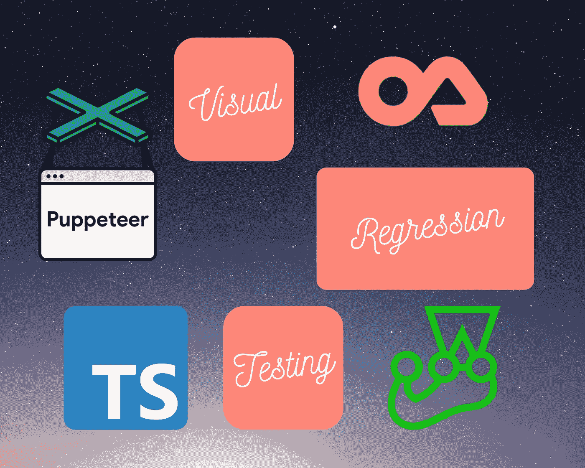
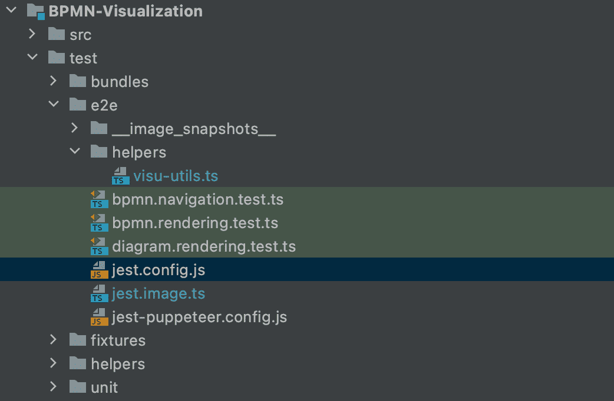
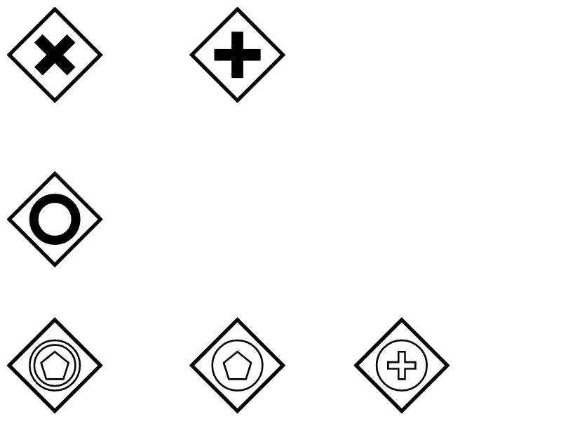

# 使用 TypeScript、木偶师、Jest 和 Jest 图像快照进行自动化视觉回归测试

> 原文：<https://medium.com/nerd-for-tech/automated-visual-regression-testing-with-typescript-puppeteer-jest-and-jest-image-snapshot-9e14dd9d0fe7?source=collection_archive---------4----------------------->

用[https://www.canva.com](https://www.canva.com)制造

# **简介**

作为开发人员，我们的工作是确保我们的用户获得没有回归的体验。
像任何优秀的开发人员一样，当我添加一个特性或修复一个 bug 时，我也会创建单元、集成和端到端测试。这确保了在修改现有代码时，不会意外破坏任何东西，并确认用户流是起作用的。

像许多人一样，我已经习惯了使用手动过程来直观地检查设计看起来是否符合预期。

重构、添加新组件或更新包有时会改变应用程序的外观。点击每一个可能的用户旅程可能会很费力，我们也不能避免忘记一个测试或错过一个小的视觉变化。

那么，我们如何确保视觉效果总是正确的，并且测试起来不那么痛苦呢？我以前听说过没有视觉回归的自动测试。我前段时间研究过使用 Selenium，但是改变了项目，不再需要它了。

现在，我在当前的项目中需要进行可视化检查，我发现有不同的库——很容易学习——可以截取当前网页的截图，并将生成的截图与截图基线进行比较，以找到用户界面(UI)中的回归。

在本文中，我将解释如何在 TypeScript 项目中使用其中一个库—Jest-Image-Snapshot(Jest matcher)。

# 项目示例

我将以 [BPMN 可视化](https://github.com/process-analytics/bpmn-visualization-js)项目(版本 0.10.0)为例。(这个例子已经被简化，所以它更清楚地显示了本文中解释的配置和特性。)这个项目的目标是加载 BPMN 内容，并呈现它。自动化视觉测试将通过每次重构、添加新组件、更新不同 BPMN 元素的定位算法或更新 MxGraph 渲染库来简化我们的生活。

# 先决条件

作为第一步，我们需要安装所需的包作为 devDependencies:

*   **Jest** +其类型定义:一个 JavaScript 测试框架
    [Jest](https://jestjs.io/) 是一个全功能的测试框架，由脸书开发。它需要很少的配置，基本上开箱即用。

> npm install -D jest @types/jest

*   **木偶师** +其类型定义:一个控制 Chrome 或 Chrome 的节点库，既有无头模式又有用户界面。可以在浏览器上手动执行大部分操作并截图。

> npm install -D 木偶师@ types/木偶师 jest-木偶师

*   Jest-Image-Snapshot +其类型定义:Jest 匹配器，用于执行图像比较

> NPM I-D jest-image-snapshot @ types/jest-image-snapshot

# 配置

让我们配置前面的库。

## 配置 Jest

我不会在这里详细介绍配置 Jest 的所有不同方法。如果您已经在您的单元/e2e 测试中使用 Jest，这对您来说并不陌生。如果你想知道更多关于 Jest 的解释，有很多很棒的文章。

在这个例子中，我们有 3 个 Jest 配置:单元测试、e2e 测试和性能测试。我们在 e2e 测试套件中添加了视觉测试。在这里，我将解释我们如何为 e2e 测试配置 Jest。

首先，在*创建 Jest 配置文件。/测试/e2e* 目录:

**。/test/e2e/jest.config.js**

这个配置将根目录设置为根项目目录，运行*。ts* 文件，并在*的任何子目录下查找 *.spec.ts* 和 *test.ts* 文件。/测试/e2e* 目录。

## 配置木偶师

*   按照 Jest 的[官方文档中的规定，在 Jest 配置中指定预设:](https://jestjs.io/docs/en/puppeteer)

**。/test/e2e/jest.config.js**

*   为运行服务器的木偶师配置创建一个新文件& [为所有测试启动一次浏览器:](https://pptr.dev/#?product=Puppeteer&version=v5.5.0&show=api-puppeteerlaunchoptions)

**。/test/e2e/jest-puppeter . config . js**

使用这个配置，我们在端口 **10002** 上启动一个超时 30s 的服务器，启动一个超时 2 分钟的浏览器，并将浏览器进程 stdout 和 stderr 通过管道传输到 **process.stdout** 和 **process.stderr** 。

## 扩展 Jest expect 断言机制以使用 Jest 图像快照

这可能是新的部分，但稍加配置，我们很快就会准备好。

默认情况下， **Jest** 对 **Jest-Image-Snapshot** 及其断言 **toMatchImageSnapshot** 一无所知。所以我们需要扩展 Jest。为此，创建一个新文件，如下所示:

**。/test/e2e/jest.image.ts**

为了避免在每个测试文件中扩展 Jest 或者在所有测试文件中全局地导入先前的文件，我们需要配置 Jest，以便在测试框架已经安装在带有[**setupFilesAfterEnv**](https://jestjs.io/docs/en/configuration#setupfilesafterenv-array)(Jest 属性)**的环境中之后立即运行它。**

**。/test/e2e/jest.config.js**

## 添加新命令

为了简化测试执行，在 **package.json** 文件中添加以下脚本:

。/ **package.json**

现在，您可以使用以下命令运行您的 e2e 测试:

> 国家预防机制运行测试:e2e

**注意** : **如果你在不同的操作系统上运行测试，跨环境**是有用的。

# 试验

你可以在 Github 上的[自述文件](https://github.com/americanexpress/jest-image-snapshot#%EF%B8%8F-api)中找到不同的属性来定制 **Jest-Image-Snapshot** 。

## 用 Jest-Image-Snapshot 创建一个基本测试

如果一切都配置正确，我们现在准备好通过组合**木偶师**和**小丑**和**小丑图像快照**来创建我们的第一个视觉回归测试！

***。/test/e2e/bpmn . rendering . test . ts***

在测试运行之后，将会创建一个新的目录—**_ _ image _ snapshot _ _**——为每个*到 MatchImageSnapshot* 调用创建一个图像。默认情况下，使用**测试路径**、**当前测试名称**、**计数器**和**默认标识符**计算快照的名称。

**生成的快照示例:**

*bpmn-rendering-test-ts-no-bpmn-gateway-visual-regression-1-snap . png*

**注意**:确保快照文件在您的源代码控制中提交，以便与其他开发人员和 CI 环境共享。

## 在不同机器上测试

一对一像素匹配的一个问题是，测试很可能在开发它的机器之外的机器上出错，因为每个环境呈现相同应用程序的方式都略有不同。

例如，假设我们希望在每次创建对 GitHub 中主分支的 pull 请求时，在 CI 环境中运行测试。无需对代码进行任何修改，测试就可以在本地通过；但是在 CI 环境中，它会失败，并显示如下消息:

> 错误:预期图像与快照匹配或接近匹配，但与快照相差 0.0005804554357724534%(2.7861860917077763 个不同像素)。

diff 的一个新镜像文件保存在**_ _ image _ snapshot _ _/_ _ diff _ output _ _**目录中，文件名为**<【snapshot _ name】>-diff . png**。

如果我们使用前面的测试，我们将得到如下结果:

*bpmn-rendering-test-ts-no-bpmn-gateway-visual-regression-1-diff . png*

可以修改之前的 **jest-image-snapshot** 配置，更新***failover threshold****(默认值:0)*&***failover threshold type****(默认值:像素)*。这些属性用于计算容许差异的阈值(在测试失败之前)。

***。/test/e2e/bpmn . rendering . test . ts***

**警告**:如果故障阈值增加过多，当本地和 CI 环境差异过大时，可能无法检测到视觉退化。

## 订购快照

如果你有 10 个或者更多的测试，在目录**_ _ image _ snapshot _ _**中找到哪个截图对应哪个测试/特性会变得复杂。

根据测试修改 **customSnapshotsDir** 属性，使其具有不同的值。

***。/test/e2e/helpers/visu-utils . ts***

***。/test/e2e/bpmn . rendering . test . ts***

**。/test/e2e/bpmn . navigation . test . ts**

## 重复使用快照

有时，即使在不同的操作之后，预期的结果/快照也是相同的。为了避免 Github 存储库中有大量相同的快照，最好重用一个快照。

为此，有必要覆盖默认的**customSnapshotIdentifier**&**customDiffDir**属性。

*   **customSnapshotIdentifier**:给这个快照的自定义名称。这防止了用**测试路径**、**当前测试名称**、**计数器**和**默认标识符**计算快照的名称。
*   **customDiffDir** :保存 diff 的目录的自定义绝对路径。由于我们在不同的测试中使用相同的快照，为了知道哪个 diff 文件对应于哪个测试，我们需要根据测试设置不同的值。

**。/test/e2e/*helpers/visu-utils . ts***

**。/test/e2e/diagram . rendering . test . ts**

# 结论

有了这么多的操作系统、web 浏览器和屏幕分辨率，视觉测试可以成为一个强大的工具来确保应用程序在所有可能的环境下都能正常工作。作为其他测试的补充，绝对值得一试。

现在，您已经拥有了使用 Jest & Puppeteer 在 TypeScript 中开始第一次视觉回归测试所需的一切。

感谢您的阅读，希望对您有所帮助或启发:)

# 参考

*   https://Github.com/process-analytics/bpmn-visualization-js BPMN 可视化 github 库:
*   Jest-image-snapshot 的 Github 库:【https://github.com/americanexpress/jest-image-snapshot 
*   木偶师文档:【https://pptr.dev/ 
*   如何用笑话操纵木偶:[https://jestjs.io/docs/en/puppeteer](https://jestjs.io/docs/en/puppeteer)