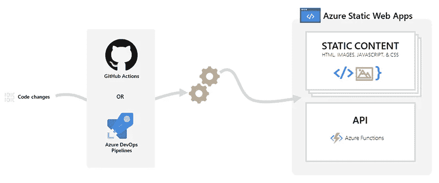
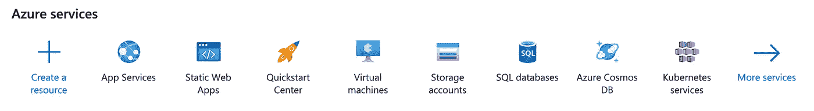
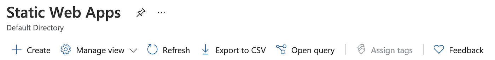
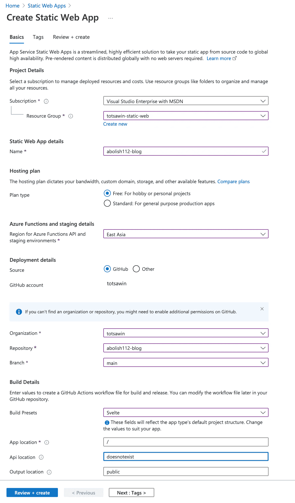
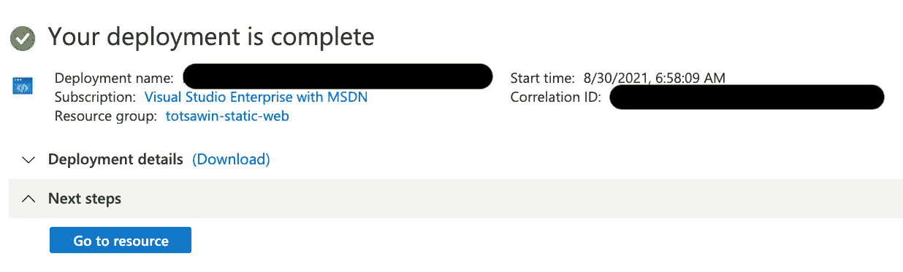

# 使用 Github 操作和 Azure 静态 Web 应用程序自动部署应用程序

> 原文：<https://medium.com/nerd-for-tech/automatically-deploy-application-with-github-actions-and-azure-static-web-apps-a2d11198361a?source=collection_archive---------3----------------------->

Azure Static Web Apps 是一种从代码库中自动构建和部署全栈 Web 应用程序到 Azure 的服务。

本图片改编自[文件:010-民主 Monument.jpg](https://commons.wikimedia.org/wiki/File:010-Democracy_Monument.jpg)作者[摄影:Nawit science](https://commons.wikimedia.org/wiki/User:Nawit_science)

# 什么是 Azure 静态 Web 应用？

> Azure Static Web Apps 是一种从代码库中自动构建和部署全栈 Web 应用程序到 Azure 的服务。

来自 [Azure 静态 Web 应用文档](https://docs.microsoft.com/en-us/azure/static-web-apps/overview)

# 先决条件

*   [GitHub](https://github.com/) 仓库
*   [Azure](https://portal.azure.com/) 账号

# 创建静态 Web 应用程序的步骤

1.转到 [*微软 Azure 门户*](https://portal.azure.com/)

2.选择*静态网络应用*

选择**静态网络应用**

3.选择*创建*

选择**创建**

4.在*基础*选项卡中，填写配置信息并将其链接到 GitHub 存储库。

**项目详情**

*   *订阅*:选择您的 *Azure 订阅*
*   *资源组*:选择你的资源组，如果有的话，或者选择*新建—* 你可以把*资源组*当成一个文件夹来放这个 app

**静态 Web 应用程序详情**

*   *名称*:输入你的应用名称

**托管计划**:

*   *计划类型*:选择*自由*(或者*标准*——你可以看到*比较计划*)

**Azure 功能和升级细节**

*   *地区*:选择离你最近的地区

**部署详情** *:* 选择 GitHub。然后，点击*用 GitHub 登录*按钮，用 GitHub 认证。

*   *组织*:选择您喜欢的*组织*名称。
*   *资源库*:选择您想要从中创建静态 Web 应用程序的 GitHub *资源库*
*   *分支*:选择*主*分支——或者您希望 GitHub 动作在该分支上有代码变更时触发部署的分支

**建造细节**:

*   *构建预置*:选择*苗条*，因为我在这个演示中使用苗条，除非选择你的 JavaScript 框架。
*   *应用位置*:如果应用在根目录下，保持默认值( */* )。
*   *Api 位置*:如果您还没有创建 Api，请留空(以后可以更新)
*   *输出位置*:选择 *public —* Svelte 在 public 文件夹内生成构建的工件。由于输出位置取决于您选择的框架，请在填写前检查

填写配置信息，并将其链接到 GitHub 存储库

5.选择页面底部的*审核和创建*按钮

选择*审核并创建*

6.选择*创建。*

选择*创建。*

7.选择*转到资源*。

选择*转到资源*

8.通过单击下面的 URL 导航到该应用程序。在这一步，Azure 构建并部署应用程序，并自动为您生成 URL。

9.应用程序启动并运行！

应用程序已成功部署

**备注**:在引擎盖下，Azure 将 **Azure 静态 Web 应用工作流文件**提交到您的存储库——参见您的 repo 中的最新提交。这是 *yaml* 文件，它规定了静态 Web 应用程序的构建和部署过程。您将看到您在那里提供的一些配置，如果需要，您可以更新，例如 API 位置。

# 更新静态 Web 应用程序的步骤

将新代码推送到*主*(或任何指定分支)，将自动触发新部署。

# 结论

Azure Static Web Apps 非常简单，易于使用。创建 Azure 静态 Web 应用有三种方式，即 [VS 代码](https://docs.microsoft.com/en-us/azure/static-web-apps/getting-started?tabs=vanilla-javascript)、 [Azure 门户](https://docs.microsoft.com/en-us/azure/static-web-apps/get-started-portal?tabs=vanilla-javascript)和 [Azure CLI](https://docs.microsoft.com/en-us/azure/static-web-apps/get-started-cli?tabs=vanilla-javascript) 。我演示了如何使用 Azure portal，但是它们都非常简单。创建后，应用程序将随着代码的变化自动构建和部署——超级简单！！！

# 参考

1.  [让我们开始使用 Azure 静态 web 应用](https://www.youtube.com/watch?v=wsQ7nVLkHhA&t=915s)
2.  [Azure 静态 Web 应用文档](https://docs.microsoft.com/en-us/azure/static-web-apps/)