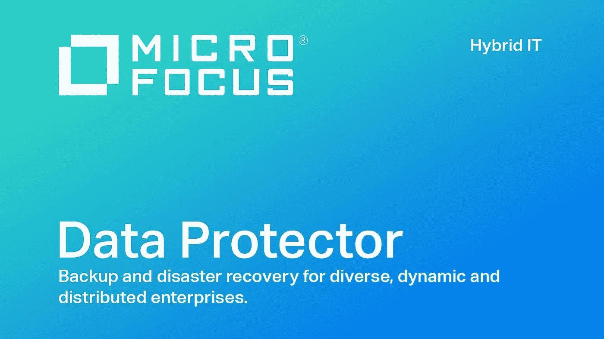
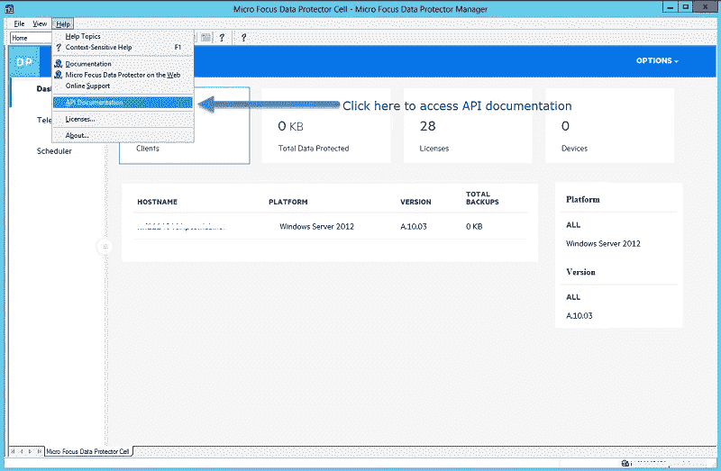
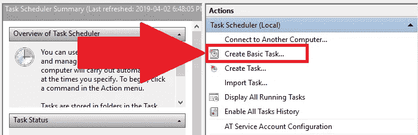

# 使用 AWS Lambda(Python)+DP API+Windows Scheduler+SES 实现微焦点数据保护自动化

> 原文：<https://medium.com/nerd-for-tech/automating-microfocus-data-protector-using-aws-lambda-python-dp-apis-windows-scheduler-ses-d27a589fa19e?source=collection_archive---------1----------------------->

## 互联网默认是不安全的。SSL 证书增加了安全级别。


[https://unsplash.com/photos/4iTPiW1HSSg](https://unsplash.com/photos/4iTPiW1HSSg)

## 什么是 Dataprotector？

Micro Focus Data Protector 是适用于大型、复杂和异构 IT 环境的企业级备份和灾难恢复解决方案。它是一种备份解决方案，可为快速增长的业务数据提供可靠的数据保护和高度可访问性，并提供专为企业范围和分布式环境定制的全面备份和恢复功能。



## DP —原料药

幸运的是，Data Protector 使用 Swagger 作为 API 的框架。您可以从数据保护器 GUI 上的**帮助** > **API 文档**菜单选项访问数据保护器 API。



它有很多 API，但是让我们把重点放在这个解决方案需要的 API 上。基本上，**登录**和**过滤**。

1.  登录—[https://XXX . XXX . XXX . com:xxxx/auth/realms/data protector/protocol/OpenID-connect/token](https://gpcgrbdpcm02.srv.gapac.com:7116/auth/realms/DataProtector/protocol/openid-connect/token)
2.  过滤器—[https://](https://gpcgrbdpcm02.srv.gapac.com:7116/idb/sessions/filter/)[XXX . XXX . XXX](https://gpcgrbdpcm02.srv.gapac.com:7116/auth/realms/DataProtector/protocol/openid-connect/token)[。com:xxxx/IDB/sessions/filter/](https://gpcgrbdpcm02.srv.gapac.com:7116/idb/sessions/filter/)

底线是登录 API 将为我们提供一个*访问令牌*来进行后续请求。

## 登录代码—

```
url = "https://[xxx.xxx.xxx](https://gpcgrbdpcm02.srv.gapac.com:7116/auth/realms/DataProtector/protocol/openid-connect/token)[.com:xxxx](https://gpcgrbdpcm02.srv.gapac.com:7116/idb/sessions/filter/)/auth/realms/DataProtector/protocol/openid-connect/token"payload = {"username":"user_name|*|[xxx.xxx.xxx](https://gpcgrbdpcm02.srv.gapac.com:7116/auth/realms/DataProtector/protocol/openid-connect/token)[.com](https://gpcgrbdpcm02.srv.gapac.com:7116/idb/sessions/filter/)", "password":"password", "client_id":"dp-gui", "grant_type":"password"}response =  json.loads(session.post(url, data = payload, verify = r"path_to_cert\[xxx.xxx.xxx](https://gpcgrbdpcm02.srv.gapac.com:7116/auth/realms/DataProtector/protocol/openid-connect/token)[.com](https://gpcgrbdpcm02.srv.gapac.com:7116/idb/sessions/filter/)_cacert.pem").text)
```

现在，这需要一个 SSL 证书进行身份验证，并且应该存在于您试图向其发出请求的服务器中。这是一个自签名证书，它没有证书链或密钥/证书文件。该 pem 文件中只有一个证书。您需要直接从服务器(*您将要向*发出请求)下载证书到项目目录。然后，在发出请求时，在 verify param 中提供下载的 pem 文件的路径。

## SSL 问题和解决方案—

你可能会得到这样的错误—

1.  **SSL 验证失败** —为此，请检查证书路径和验证参数。**不要试图绕过认证**。
2.  **授权类型** — **不尝试对有效载荷进行 base 64 编码**。按原样发送，即普通的 json 对象

## 可以让它自动化的代码—

登录后:

1.  它试图根据会话过滤器(在 API 文档中提供)过滤会话 **check_session** 。

```
url = "[https://](https://gpcgrbdpcm02.srv.gapac.com:7116/idb/sessions/filter/)[xxx.xxx.xxx](https://gpcgrbdpcm02.srv.gapac.com:7116/auth/realms/DataProtector/protocol/openid-connect/token)[.com](https://gpcgrbdpcm02.srv.gapac.com:7116/idb/sessions/filter/)[:xxx/idb/sessions/filter/](https://gpcgrbdpcm02.srv.gapac.com:7116/idb/sessions/filter/)"payload = "{\r\n  \"filter\": {\r\n    \"status\": [0,1,12,15],\r\n    \"sessionType\": [0]\r\n  }\r\n}"
    headers = {
        'Authorization': 'Bearer {}'.format(access_token),
        'Content-Type': 'application/json'
        }response = json.loads(session.post(url, headers=headers, data = payload, verify = r"path_to_cert\[xxx.xxx.xxx](https://gpcgrbdpcm02.srv.gapac.com:7116/auth/realms/DataProtector/protocol/openid-connect/token)[.com](https://gpcgrbdpcm02.srv.gapac.com:7116/idb/sessions/filter/)_cacert.pem").text)return response
```

现在，这里它使用了一个**状态过滤器**和一个**会话类型过滤器**。状态输入可以以两种支持的格式之一提供:

例子—

```
{
   "filter":{
      "status":36
   }
}
```

该过滤器将返回状态为“**已完成**”和“**未通过**”的会话。值 **36** 通过设置位位置 **2** 和 **5** 形成。怎么会？—

```
**1*2⁵**+0*2⁴+0*2³+**1*2²**+0*2¹+0*2⁰ = 36
```

上面这个类似于这个—

```
{
   "filter":{
      "status":[2,5]
   }
}
```

上述过滤器将返回“**已完成**”和“**失败**”类型的会话。

下表描述了每种会话类型的位位置映射—

```
**Bit position Status Type**
0 Running
1 Running with Errors
2 Completed
3 Completed with Errors
4 Aborted with Failure
5 Failed
6 Aborted
7 Aborted with Errors
8 Mounted
9 Mounted with Errors
10 Queueing
11 Queueing with Errors
12 Running with Failures
13 Completed with Failures
14 Mounted with Failures
15 Queueing with Failures
16 Completed Mirror with Failures
17 Session Status No
```

类似地，会话输入也可以有两种类型—

```
{
   "filter":{
      "sessionType":131073
   }
}
```

上述过滤器将返回“**备份**”和“**整合**”类型的会话。通过设置位位置 **0** 和 **17** 形成值 **131073** 。

```
{
   "filter":{
      "sessionType":[0,17]
   }
}
```

上述筛选将返回“**备份**”和“**合并**”类型的会话。

下表描述了每种会话类型的位位置映射—

```
**Bit position Session Type**
0 Backup
1 Restore
2 Database Query
3 Media Management
4 Backup preview
5 Restore preview
6 Test
7 BAR session(backup)
8 BAR session(restore)
9 Media management daemon
10 Purge
11 Restart
12 Admin session
13 Admin UDP
14 Admin purge
15 Backup Diskonly
16 Copy
17 Consolidation
18 Key management daemon
```

2.然后使用 **check_duration** 中的自定义参数“ **hours** ”过滤长时间运行的作业

```
epoch_time = int(time.time())
    # print(f"Now - {epoch_time} Session Start Time - {session_start_time}")
    if (epoch_time - session_start_time) > hours * 3600:
        return True
    else:
        return False
```

3.它创建了一个小结构，要发送给 **API-gateway** 。

```
if long_run_status:
            output['Name'] = response['items'][item]['name']
            output['Datalist'] = response['items'][item]['datalist']
            output['SessionType'] = session_type_dict[str(response['items'][item]['sessionType'])]
            output['Status'] = status_dict[str(response['items'][item]['status'])]
            output['StartTime'] = convert_epoch_to_datetime(response['items'][item]['startTime'])
            output['Owner'] = response['items'][item]['owner']
            long_running_sessions.append(output)
```

你可以选择扔掉它—

```
with open ("longrunningjobs.json", 'w+') as fp:
    json.dump(long_running_sessions, fp)
```

4.最后，它向 lambda API-gateway 发送一个请求，在那里有效负载 JSON 被转换成 CSV 并通过电子邮件发送。(*你可以在我的其他 aws lambda 博客*中找到电子邮件代码和 CSV 转换器)

```
url = "[https://api-gateway.us-east-1.amazonaws.com/default/l](https://6o8iu7eqjg.execute-api.us-east-1.amazonaws.com/default/backuprecovery-sendemail)ambda_name"headers = {
        'Content-Type': 'application/json'
    }response = requests.get(url, headers=headers, data = json.dumps(long_running_sessions))
```

您可以选择在 lambda 本身中编写这个函数，并将其与电子邮件代码集成在一起。但是，lambda 应该为特定的服务器附加 vpc，代码应该在部署包中包含证书。

## 端到端代码—

## 带有 windows 调度程序的 EC2(一个实验)—附带 VPC

在我的情况下，我有一个 EC2 有 VPC 重视，所以想用它。下一步是安排它。

步骤:

1.  用以下内容创建一个. bat 文件

```
"path_to_python/python.exe" "path_to_project_folder/main.py"
pause
```

2.在 windows 任务计划程序中创建基本任务



选择一个触发器，action as start a program，然后浏览 bat 文件的路径并完成。

到了这一页的这一部分，我希望你喜欢读这篇文章，就像我喜欢写它一样。如果遇到阻挡者，请立即联系我！

我可以在这里找到—[https://www.linkedin.com/in/kuharan/](https://www.linkedin.com/in/kuharan/)