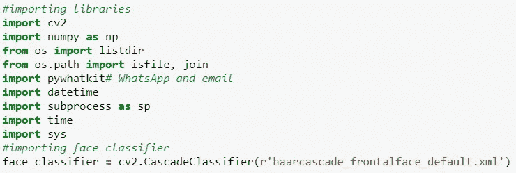
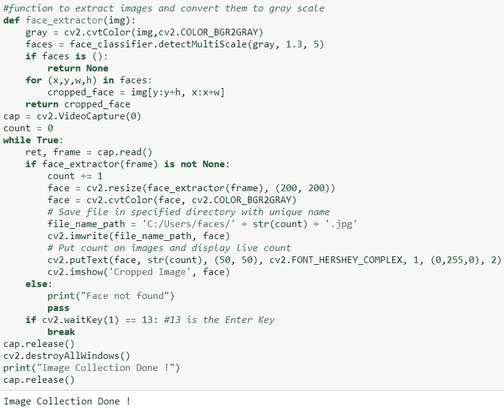
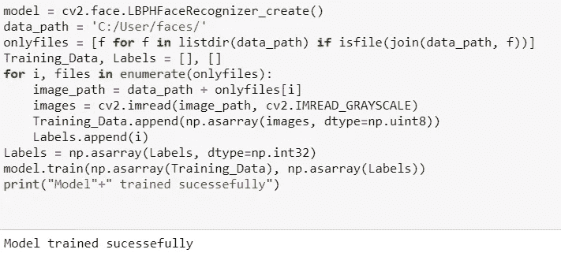
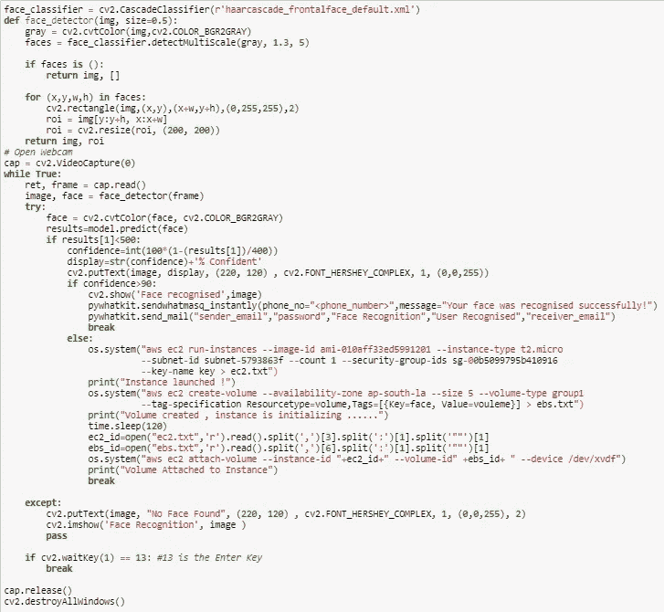

# 使用 Python 自动化 WhatsApp、电子邮件和启动 AWS 实例

> 原文：<https://medium.com/nerd-for-tech/automating-whatsapp-email-and-launching-a-aws-instance-using-python-752562023c0d?source=collection_archive---------16----------------------->

# 目标:

创建一个程序，在识别特定人脸时执行以下任务—

*   当它识别出你的脸之后:
    - >它会发送一封电子邮件到你的邮箱。
    - >还可以给你的朋友或任何人发送 WhatsApp 消息。
*   当它识别出另一张脸，可能是你的朋友或家人的脸时，它应该做以下事情:
    - >在 AWS 中创建 EC2 实例。
    - >创建 5 GB EBS 卷并将其连接到实例。

> 让我们开始任务吧！

# 第一部分:建立和训练人脸识别模型

为此，我们将使用**哈尔级联正面人脸检测器来**训练我们的模型。

收集数据集

训练模型

完成，现在我们可以使用这个模型来执行我们的任务。

# 第二部分:自动启动 WhatsApp、电子邮件和 AWS EC2 实例

## 先决条件:

*   **AWS CLI 设置**

> 为此，请参考以下内容-
> 
> ->[https://docs . AWS . Amazon . com/CLI/latest/user guide/CLI-chap-install . html](https://docs.aws.amazon.com/cli/latest/userguide/cli-chap-install.html)
> 
> -->[https://docs . AWS . Amazon . com/CLI/latest/user guide/CLI-chap-configure . html](https://docs.aws.amazon.com/cli/latest/userguide/cli-chap-configure.html)

*   **Python 库名为**[**PyWhatKit**](https://pypi.org/project/pywhatkit/)**也应该按照下面给出的函数安装才会用到——**

> **功能 1:** `send_mail(email_sender: str, password: str, subject: str, message: str, email_receiver: str)`
> 
> **功能二:** `sendwhatmsg(phone_no: str, message: str, time_hour: int, time_min: int, wait_time: int = 20, print_wait_time: bool = True, browser: str = None)`

## 实施:

因此，通过这种方式，在面部被识别时，程序分别向指定的电子邮件和号码发送电子邮件和 WhatsApp 消息，如果它无法识别面部，它会在 AWS 中启动 EC2 实例，同时创建 5 GB EBS 卷并将其附加到该实例。

> GitHub 资源库链接供参考:[https://GitHub . com/AmimaShifa/Automating-Email-WhatsApp-and-launching-AWS-instance-using-Python/tree/main/task % 206](https://github.com/AmimaShifa/Automating-Email-WhatsApp-and-launching-AWS-instance-using-Python/tree/main/task%206)