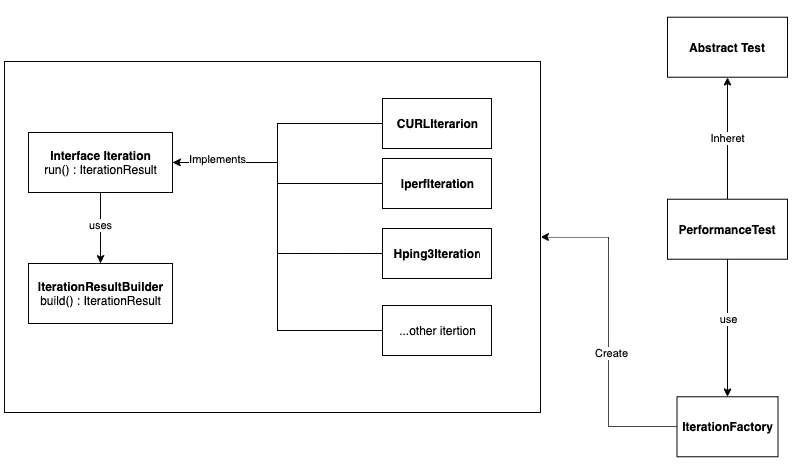

# 自动化性能测试——通用方法

> 原文：<https://medium.com/nerd-for-tech/automation-performance-testing-the-generic-approach-d53240b61cc2?source=collection_archive---------12----------------------->

对于我们大多数人来说，性能自动化测试很容易变得一团糟。在本帖中，我将带你看一个故事，故事以我处理过的最漂亮的设计结尾。

> 首先，我要感谢 [**埃拉德·巴拉姆**](https://www.linkedin.com/in/elad-baram-5726331/) 在这个设计过程中对我的指导。Elad 是[**Cato-Networks**](https://www.catonetworks.com/)**的自动化主管，这是 SASE 有史以来制造的第一个产品。如果你对计算机网络感兴趣，你应该多读一些关于这家令人敬畏的公司的信息。**

****

**我真的很喜欢狗和电脑图片**

*   **[故事时间](#c140)**
*   **[什么是性能测试？](#eaeb)**
*   **[出现的问题](#1c72)**
*   **[算法](#0917)**
*   **[设计](#17c1)**
*   **[测试](#b842)**
*   **[结论](#b5b4)**

# **故事时间**

**想象一下一家快速发展创业公司。非常快。4 年内，你从 3 名员工发展到 400 人。从 0 美元到 1B 美元。**

**这正是你不希望你的创业失败的时刻。**

**如果你跌到了 100 万美元——好吧，没人会知道。但是现在——即使一个企业客户停机 5 秒钟也能让你上《纽约时报》的头版——但不是出于好的原因。**

**在卡托网络公司，这就是故事。我们每周发布一个版本，速度非常快。从零到英雄——五年内，卡托网络公司成为独角兽，并为 SASE 产品定下基调。**

**就在那一刻，团队开始意识到-**

> **我们需要知道我们的产品性能如何。我们需要性能测试！**

# **什么是性能测试？**

**您卑微的仆人接到了一个任务——“***Orel，为我们构建一个性能测试路线图*** ”。所以 Orel 做的第一件事就是研究性能测试到底需要什么。经过大量研究，我提出了以下主要的性能测试类型:**

1.  **负载测试**
2.  **尖峰测试**
3.  **压力测试**
4.  **耐久性测试**
5.  **容量测试**
6.  **可扩展性测试**

**因为这篇文章的目标是代码设计，而不是解释如何创建一个性能测试路线图，所以我不打算谈论这个话题。你可以在这里了解更多。**

****

**有一会儿我以为是同一只狗**

# **问题**

**因此，我建立了一个庞大的路线图，可以在 6 个月后给我们带来巨大的成果，但管理层希望尽快取得成果。我们不能等 6 个月才知道下一个性能问题何时会发生。这使我想到以下问题:**

*   ****一般类型的测试**——我们想在负载测试/峰值测试等之间轻松选择**
*   ****通用测试工具** —对于某些场景，hp3 可能是最好的工具，而对于其他场景，它可能是 iperf**
*   ****可读性和易用性**——您希望其他人能够轻松地使用、更改和配置您的测试。甚至可能是对编码一点都不感兴趣的人**
*   ****时间** —您希望尽快得到结果**

****这让我们构建了一个测试。这种通用设计的一个测试，它可以满足所有上述要求。****

****

**这就像为每一种尺寸的脚做一双鞋**

# **该算法**

**我们很快意识到[二分搜索法算法](https://en.wikipedia.org/wiki/Binary_search_algorithm)可以用于测试任何性能测试。**

**二分搜索法算法通过跳跃重数 2 或 0.5 来寻找一个数字或结果。**

**例如，如果我们想要搜索吞吐量性能:**

1.  **我们从 100mbps 的基线开始**
2.  **如果成功的话——我们跳到了 200mbps**
3.  **如果上述步骤不起作用，我们尝试了 150mbps**
4.  **如果成功的话——现在我们知道我们的产品在 150mbps 时工作，在 200mbps 时失败。如果 50mbps 的精度对我们来说足够了，我们就在这里停下来写结果。**

**我会用类似 python 的语言编写代码，因为算法更容易阅读(最初是用 java 编写的):**

```
pass_result=None
fail_result=Nonedef binary_search(baseline : float , precision : float):
  is_passed = run_test(baseline)
  if is_passed:
     pass_result = baseline      
     if fail_result==None or fail_result-pass_result > precision:
         baseline *= 2
         binary_search(baseline,precision)
     else:
         write_results(pass_result, fail_result)
  else:
     fail_result = baseline
     if pass_result==None or fail_result-pass_result > precision:
         baseline /= 2
         binary_search(baseline,precision)
     else:
         write_results(pass_result, fail_result)
```

# **设计(最终)**

**我们创建了一个如下所示的 json 文件:**

```
{
"client": str,
"server_under_test": str,
"test_type": str,
"testing_tool": str,
"precision": float,
"baseline": float
}
```

*   ****客户端/服务器-** 机器的 IP**
*   ****test_type-** 上面我在[中提到的“什么是性能测试？”](#eaeb)零件**
*   ****测试 _ 工具**-hp3/iperf/ixia/别的什么**
*   ****精度** -我们搜索通过的测试和失败的测试之间的差异。基本上这是停止测试的条件。**
*   ****基线** -开始测试的基线数**

**下面是**设计的简单性**没有使用[**UML 图**](https://he.wikipedia.org/wiki/Unified_Modeling_Language) :**

****

**原始设计的简单性**

**如你所见，这里有 3 种设计模式——工厂、构建者和单例。此外，使用这种设计，在***performance test***类中使用智能逻辑，我们可以运行所有需要的场景。**

**让我们深入研究一下代码**

> ****旁注:**除了算法——从现在开始我要用 java 来写这篇文章中的代码。Peter Norvig 证明了在 GOF 的书中发现的 23 种设计模式中有 16 种在动态语言(如 python)中是不可见的或更简单的。而且——这感觉与 python 的禅宗相违背。对于我来说， **Java 就像是设计的钢琴。谈到设计，我觉得我们应该像用钢琴作曲一样使用 java。****

# **迭代结果**

**我们将在代码中使用一个简单明了的构建器模式:**

```
public class IterationResult {public static class Builder {private String server;
        private String client;
        private double baseline;
        private boolean isPassed;public Builder() {
        }public Builder withServer(String server){
            this.server = server; return this;  //By returning the builder each time, we  can create a fluent interface.
        }

        public Builder withClient(String client){
            this.client = client;
            return this;
        }

        public Builder withBaseline(double baseline){
            this.baseline = baseline;
            return this;
        }public Builder withIsPassed(boolean isPassed){
            this.isPassed = isPassed;
            return this;
        }public IterationResult build(){
            IterationResult iterationResult = new IterationResult();  
            iterationResult.server = this.server;
            iterationResult.client = this.client;
            iterationResult.baseline = this.baseline;
            iterationResult.isPassed = this.isPassed;return iterationResult;
        }
    }private IterationResult() {
        //Constructor is now private.
    }
}
```

# **迭代工厂**

**创建迭代的简单工厂模式**

****第一步** -迭代界面:**

```
public interface Iteration
{
 IterationResult run(float baseline , String clientIp, String  serverIp);
}
```

****步骤二**——创建迭代:**

****Hping:****

```
public class HpingIteration implements Iteration {
   [@Override](http://twitter.com/Override)
   public IterationResult run(float baseline , String clientIp, String serverIp) {
      String result = SshConnector.Instance.sendCommand("hping3 "+serverIp + " " +baseline , clientIp);
   IterationResult ret = new IterationResult().Builder().withServer(serverIp).withClient(clientIp).withBaseline(baseline).withIsPassed(this.parseResultIsPassed(result)).build();
return ret; }
}
```

****Iperf:****

```
public class IperfIteration implements Iteration {
 [@Override](http://twitter.com/Override)
 public IterationResult run(float baseline , String clientIp, String serverIp) {
 String result = SshConnector.Instance.sendCommand("Iperf -s" + serverIp + " -c " + clientIp " -amount “ + baseline, clientIp)
    IterationResult ret = new IterationResult().Builder().withServer(serverIp).withClient(clientIp).withBaseline(baseline).withIsPassed(this.parseResultIsPassed(result)).build();
return ret;
 }
}
```

****步骤三** -迭代工厂**

***(我停止在这里发送参数(clientIp/serverIp/baseline/etc…)，如果你读到这里，我希望你明白这个想法)***

```
public class IterationFactory {

   public Iteration getIteration(String iterationType){
      if(iterationType == null){
         return null;
      }  
      if(iterationType.equalsIgnoreCase("curl")){
         return new CurlIteration();

      } else if(shapeType.equalsIgnoreCase("hping3")){
         return new Hping3Iteration();

      } else if(shapeType.equalsIgnoreCase("iperf")){
         return new IperfIteration();
      }

      return null;
   }
}
```

# **测试**

**因为我们不喜欢递归代码——我们通过以下方式使用上述基础设施:**

```
public class PerformanceTest extends Test{public void run(JsonObject json){

      String clientIp = json.get("clientIp")
      String serverIp = json.get("serverIp")
      ...etc...
      BinarySearch binarySearch = new BinarySearch(baseline, precision, clientIp, serverIp, test_type, tool);
      while(binarySearch.isShouldContinue()){
          binarySearch.runNextIteration();
      }
      writeResults(runDate ,binarySearch.getPassedResults(),  binarySearch.getFailedResults() );
     }
}
```

**由于 BinarySearch 对象实现起来非常简单——我将让您来理解我是如何做到的。[我这里已经给你写好算法了](#0917)。不要忘记使用[单例](https://www.tutorialspoint.com/design_pattern/singleton_pattern.htm)。**

# **结论**

**有时候，限制可以产生绝妙的想法。**

**我需要睡觉。**

**再见。❤**