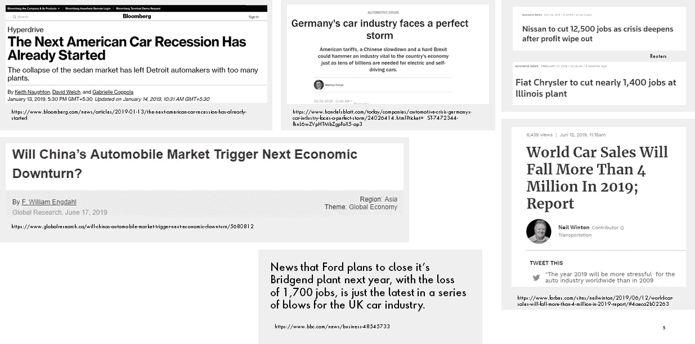
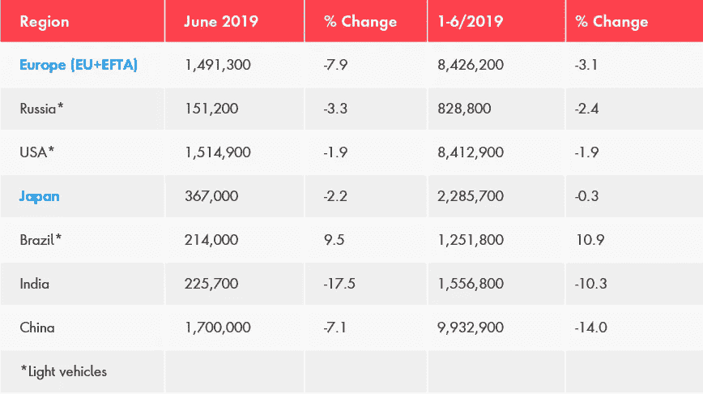
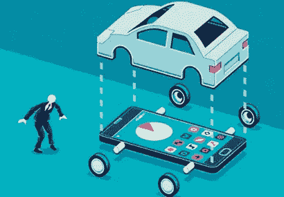
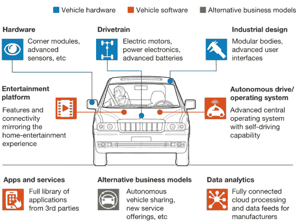
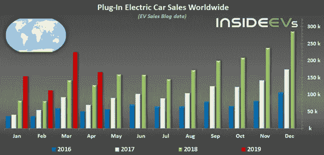
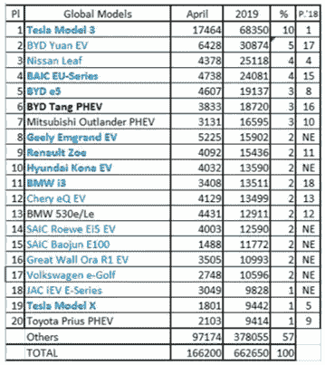
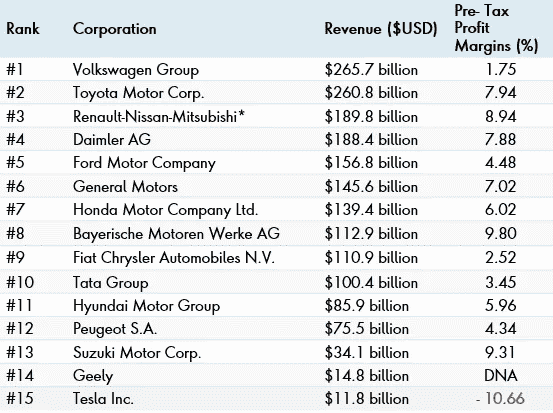

# 技术与移动 101:解开汽车价值链

> 原文：<https://medium.com/nerd-for-tech/automotive-disruptors-101-unbundling-the-automotive-value-chain-part-1-3afbddca94eb?source=collection_archive---------0----------------------->

了解所有你想知道的关于汽车工业如何以及为什么在最近经历了颠覆。

**第 1 部分**将涵盖行业背景以及为什么它正在经历巨大的变化
**第 2 部分**将包括挑战传统汽车公司的主要参与者以及对其商业模式的见解

If 如果你想了解汽车行业近年来发生的重大变革的方式和原因；挑战传统汽车公司的主要参与者:打车服务和拼车服务的区别；像微软&谷歌这样的技术公司在这个领域做了什么；以及类似的问题，那么这一系列就是你的一站式服务。

W hy？在这次冠状病毒疫情期间，知识的民主化似乎已经成为一种趋势。我已经看到许多人提供免费的课程，所以我想我也会尽自己的一份力量。

为什么是我？
我在汽车行业的整个价值链中工作了近 8 年，目前正在帮助汽车公司通过咨询和产品管理实现数字化业务转型。

**注:**数据和公司的选择标准是基于从*福布斯颠覆汽车行业的初创企业名单*、crunch base 和地点(美国、欧盟、以色列、中国等)的可用数据组合中进行的抽样。)的创业公司。时间线会回到六个月前，但仍然会给你一个强有力的叙述。

# 第一部分:汽车行业前景

**1.1 全球汽车行业陷入危机？(冠状病毒前期)**

几个来源:新闻头条(2019 年 5 月-6 月-7 月)

关于陷入危机的汽车行业的新闻文章和头条新闻屡见不鲜
在发展中国家和发达国家市场陷入停滞后，主要原始设备制造商一直在裁员
自 2009 年(上一次衰退)以来，全球经济中的汽车销售首次出现大幅放缓

**1.2 让我们用一些最近的数字来理解这个现象。**

2019 年全球汽车销量(半年)
2019 年 6 月和 2019 年上半年，VDA 监测的全球各主要市场新增轻型和乘用车注册量如下:

资料来源:VDA

*   在 2019 年上半年，**汽车销量在全球所有主要汽车市场**均有所下降，只有巴西的销量增长了 11%(可能是**巴西**处于复苏模式——巴西 7 月汽车产量较 6 月跃升 14.2%——来源:路透社)
    基本上，就汽车产量而言，巴西是一个相对较小的市场，仍在努力挖掘其潜力
*   日本汽车市场持平，而**美国和俄罗斯市场收缩约 2%**
*   在欧盟，新的乘用车注册量下降了 3% ,但仍保持在相对较高的水平。
*   在印度，2019 年上半年的新车销量下降了十分之一，而中国仍然是世界上最大的新车市场，尽管收缩了 14%

你可以在这里得到所有的理由——[https://www . best-selling-cars . com/international/2019-latest-international-world wide-car-sales/](https://www.best-selling-cars.com/international/2019-latest-international-worldwide-car-sales/)
但请你把注意力放在数字上。

**1.3 为什么汽车行业举步维艰？**

我们看到所有主要市场的销售都在下滑。生产和销售汽车是一回事，应对技术挑战是另一回事。但是谁在敦促汽车制造商改变他们一直以来看待事物的方式呢？让我们来看看一些趋势

1.客户正在脱离直接所有权
→ **拼车和微移动性**越来越受到青睐

基本上，当你可以同时工作和旅行时，为什么还要购买一辆汽车，而代价是一名优步司机帮你导航到你的工作场所。

2.客户更加关注简单透明的购买方式，如**上线(电子商务)**
→汽车比较网站(AutotraderCarbuyer)和纯数字经销商(Joydrive)正在接管

我现在买车有多方便？为什么我不干脆租一辆或者在网上买一辆，这样我就不用时不时地去经销店了？

3.与传统驾驶体验相比，客户越来越喜欢**车内体验**
→与车辆系统无缝集成(苹果/安卓)

来源:CBInsights

请记住，除非你买的是苹果电脑，否则你总是更喜欢电脑的配置，而不是品牌。不管你是买戴尔、惠普还是联想，英特尔的配置都很重要。在选择购买新车时，人们可能会偏爱安卓系统或说苹果汽车游戏。

在未来，随着技术玩家进入汽车领域以利用他们的能力，汽车将成为一台带轮子的电脑，甚至可以比作智能手机。

4.客户的环保意识越来越强，正在寻找可行的选择
→ **传动系统的替代燃料**变得更加主流

5.客户希望更好地利用通勤时间
→ **从长远来看，无人驾驶汽车**将发挥关键作用

重申第一点，为什么还要担心司机。让机器人带你去某个地方——提高你的安全性、舒适性，还可能优化你的时间。

> 以上各点要注意的重要的是“客户”。从倡导“生产概念”到现在专注于解决客户的问题，这个行业已经走过了漫长的道路。

意识到这一点的传统汽车公司仍在努力应对不断变化的消费趋势。让我们来看看科技是如何颠覆汽车的基本构造的

来源:麦肯锡

**1.4 电动汽车的崛起**

销售的下降包括内燃机汽车的销售。现在我们来看看另一面——**电动车**。

资料来源:InsideEVs

*   2018 年是电动汽车销量创纪录的一年。我们在 2019 年看到了同样的增长。
    **电动乘用车全年销量 126 万辆，同比大幅增长 74%** 。一些观察:-
    →中国市场的增长——当地政府的推动
    →特斯拉——Model 3 成为销量最高的电动汽车
    →欧洲的柴油危机
*   发达经济体发生的事情将在发展中经济体重演，如印度、巴西、俄罗斯和其他国家(触发因素——污染和空气质量指数)

*   总体需求可能在下降，好消息是 e **电气化转变继续在步伐**前进，在 2019 年 3 月取得重大成果。
*   **电动汽车** (BEV、PHEV、HEV) **突破 10 万辆大关，共计 12.54 万辆**。
*   需求增长了 31%，主要是由德国、挪威、西班牙和荷兰的注册人数推动的。

**1.5** 从上述数据中我们可以看出，电动汽车的**崛起是不可避免的，大多数公司都期待在这一领域进行投资。**但是，这只是汽车行业目前正在讲述的一个大故事的一小部分。

电动汽车(E)只是描述这个行业趋势的助记手段的一部分——**ACES。**

# 第二部分:新兴趋势和商业模式

王牌在这里停留，我们谈到了传统汽车巨头如何试图应对新兴趋势。我们也看到了王牌的一瞥。现在让我们深入一点。

**2.1 汽车行业的主要参与者**

来源:[https://www . visual capitalist . com/15-corporations-make-most-cars/(2018)](https://www.visualcapitalist.com/15-corporations-make-most-cars/(2018))

*   在某种程度上，该行业过去和现在都是由原始设备制造商主导的。
*   这些公司中的大多数都是在一个母公司下拥有多个品牌的企业集团。这些品牌要么是母公司为瞄准新市场而战略性创建的，要么是并购的结果。(2018)

**特斯拉是批次中最年轻的**；它没有与汽车制造相关的遗产或品牌；它不盈利(按年计算)，而且根据一些批评家的说法，估值很高。
但与其他汽车相比，特斯拉有一点很奇怪——电动汽车
**。**

**虽然特斯拉做了很多事情，如能源管理，这是其业务的核心，但在这里很难涵盖。**

**如上所述，“电动”并不是汽车制造商应该警惕的唯一因素。由于各种原因，这个行业正在发生很多变化。让我们来看看它们。**

****2.2 客户购买行为的变化；数字引领潮流****

**转到 **1.3** 并再次通读这些要点。完成了吗？好吧。**

**现在，我想强调并引用考克斯研究中的一些关键观察结果。不仅如此，许多白皮书和观点都指向相同的趋势。**

*   ****未来的客户可能只将经销商用于服务业务**，并从不同渠道购买汽车。**
*   **尽管从下面的数据中可以看出，我们发现**客户对现有的销售流程缺乏信任，但在购买新车时仍然需要咨询建议**和支持。对于原始设备制造商来说，这将是一个复杂的局面。**

**C**

****→** 83 %的顾客希望完成网上购物的一个或多个步骤
→不到 1 %的顾客喜欢现有的零售流程，65 %的顾客认为他们是被迫购买的**

**在完成销售中，代理权仍然是至关重要的**

**→只有 11%的消费者希望在远离经销商的地方完全在线审查和签署**

**D **经销商员工被认为是有价值的顾问****

**→有趣的是，即使有在线购买选项，62 %的消费者仍然希望得到经销商员工的帮助**

**D **经销商通过提供在线销售步骤获得竞争优势****

**→ 85 %的消费者更有可能从特定的经销商处购买，这样他们就可以在线开始或完成几乎所有的车辆购买**

**现在想想这个。原始设备制造商必须应对不断变化的技术趋势，同时满足不断变化的客户期望。**

> **这些公司需要什么:-
> a)资源(资本和技术)
> b)人才，以及
> c)思维模式**

**从以上三点来看，**心态**是最重要也是最难达到的。初创企业可能没有资源和人才，但他们有心态。我认为，大型科技公司具备这三个条件。**

> **结论(第一部分):可以看出，汽车价值链现在不再是线性的。价值链的中断带来了新的技术玩家，他们争夺不同的市场份额，挑战传统的原始设备制造商。
> 
> 利润池正在转移，拥有各种商业模式的新玩家开始涌现，他们的现金支出能力远高于原始设备制造商。**
> 
> **范围(第二部分):**
> 
> **1.您将能够**了解汽车价值链中颠覆者所部署的基本战略。****
> 
> **2.此外，这些文章将重点介绍从他们当前的**商业模式、参与投资者数量、资金、市场潜力以及最重要的是可预见的威胁**中学到的知识，作为一个定位点，这样你就可以深入研究大型汽车巨头如何试图在动荡的生态系统中茁壮成长。**

****小测验:**想知道 OEM 汽车制造商的利润率和收入分配吗？请将您对以下问题的答案发送给我，我将在第 2 部分中揭示这些问题:-**

**【https://www.linkedin.com/in/shubhamtripathi-iimb/】T21 或
shubham5strings@yahoo.in**

**请在下面写下你的意见，如果有任何反馈，请通过 LinkedIn 联系我。让我们一起增长知识。**