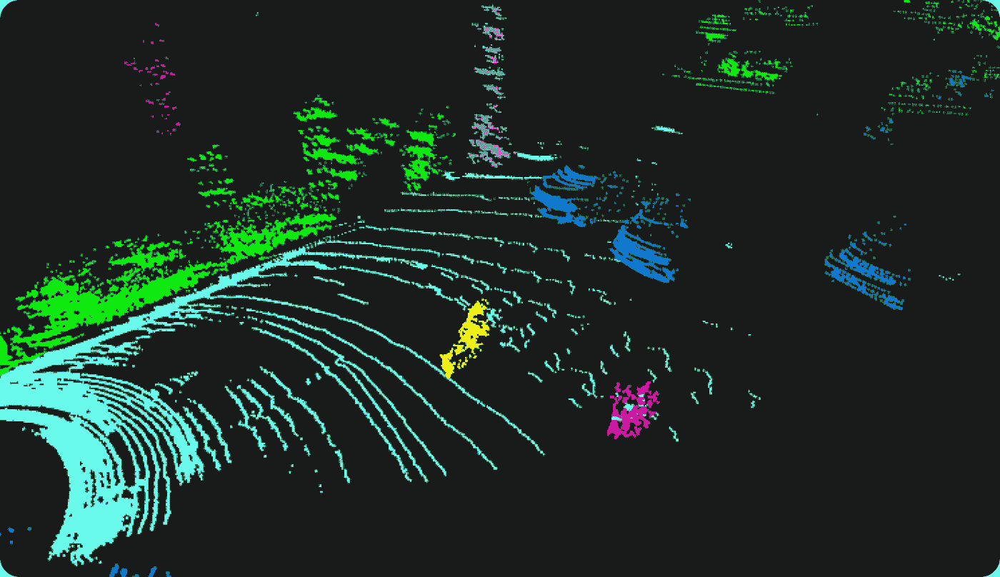
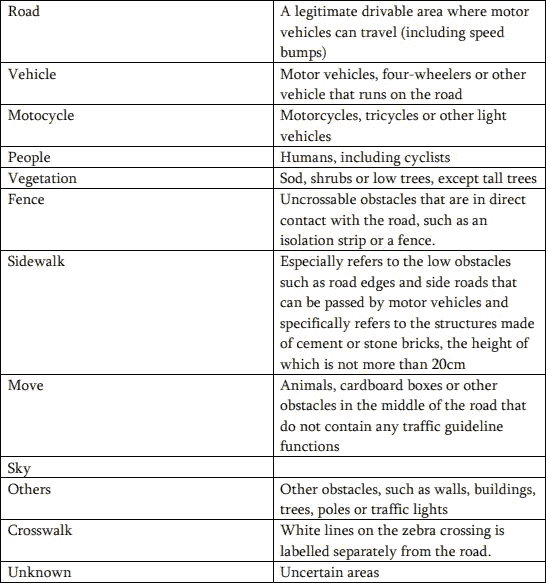

# 自动驾驶标注案例研究——三维点云中的语义分割

> 原文：<https://medium.com/nerd-for-tech/autonomous-driving-annotation-case-study-semantic-segmentation-in-3d-point-cloud-98e6da4f4dc0?source=collection_archive---------1----------------------->

字节桥 3D 语义分割标注项目

# 三维语义分割

3D 语义分割就是对图像中的每个像素进行分类，确定每个类别，然后划分区域。

在自动驾驶中，分割标注可以帮助车辆很好地理解周围的道路环境，如道路、车辆、行人、绿色植物和其他障碍物。

接下来，我们来看一个 3D 语义分割标注项目。

## 项目要求:

1.  **贴标指令**

(1)未标记的数据

如果原始/未标注数据质量差或原始图像模糊，请不要标注。

如果图像重复出现(例如停车情况，除了交通堵塞)，只标记第一帧。

(2)注释类别

长方体应该在 2 个像素内匹配主体的轮廓。

像素小于 10×10 像素的模糊物体不需要单独标注，可以用“其他障碍物”标签标注。

如果对象小于 10x10 像素，但其边界清晰可见，则应进行标记。

如果不能确定物体的类别，可以用标签“其他障碍物”来标记。

无需想象，只标注可见障碍物及其可见部分(透明部分除外，如果遮挡部分占 80%以上，则无需标注物体)。

**2。标签类别**

# 结束

将你的数据标注任务外包给[字节桥](https://tinyurl.com/2947u6xk)，你可以更便宜更快的获得高质量的 ML 训练数据集！

*   无需信用卡的免费试用:您可以快速获得样品结果，检查输出，并直接向我们的项目经理反馈。
*   100%人工验证
*   透明和标准定价:[有明确的定价](https://www.bytebridge.io/#/?module=price)(包含人工成本)

## 为什么不试一试？