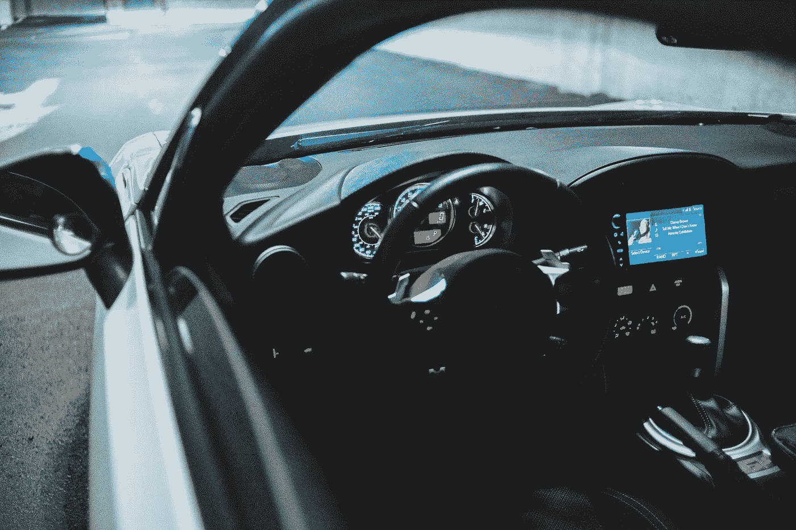
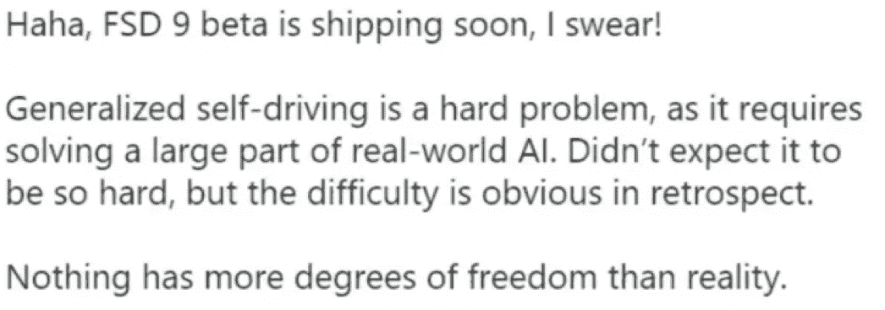

# 自动驾驶，谁在默默赚钱？

> 原文：<https://medium.com/nerd-for-tech/autonomous-driving-who-is-making-money-in-silence-a83887912f98?source=collection_archive---------6----------------------->

## **特斯拉:实现真正的自动驾驶比想象中更难**

近日，特斯拉 CEO 埃隆马斯克(Elon Musk)在接受媒体采访时表示:“实现真正的自动驾驶比想象的要困难得多。”因为“整个交通系统实际上是为人类的眼睛和大脑设计的。要真正开发出可以取代人类司机的汽车，AI 必须恢复人眼的视觉成像和神经网络对视觉的处理功能。”

## **自动驾驶在中国腾飞**

去年，自动驾驶行业呈现出良好的发展态势。北京、上海、广州、深圳等一线城市不断扩大自动驾驶规模，一些新一线城市也开始推出大量自动驾驶产品。

分场景来看，RoboTaxi 已经在全国多地上线，北京已经开启试运营。在封闭的园区，无人物流车、无人配送车，甚至无人销售车已经开始工作；在普通道路上，无人驾驶清扫车将逐步推出。

## **自动驾驶技术如何商业化？**

这也是所有自动驾驶公司面临的难题。

目前，大多数自动驾驶公司都在积极推出产品，各种产品如 RoboTaxi、无人送货车、无人清扫车、无人穿梭车等自动驾驶产品已经开始进入大众的生活，让普通人也能感受到其中的魅力。

另一方面，对于自动驾驶公司来说，虽然技术已经实现，但仍然无法依靠这些产品养活自己。仍然需要外部融资来支持公司的增长，这也成为“许多自动驾驶公司头疼的问题。”。

公开数据揭示，2021 年自动驾驶行业融资规模数十亿美元，这也认可了自动驾驶公司仍无法获得自我造血能力，需要依靠融资输血。

然而，一些公司正在打破自动驾驶商业化的困境，**相信机场、工厂、公园等场景可以更早实现大规模商业化。所以在这个领域占了先机，走到了现阶段自动驾驶商业化的最前沿。**

更容易实现商业化的方向:先用无人车获取收入和数据，继续扩大和细化技术。等技术完善了，再进一步拓展到 RoboTaxi 和更多领域。我们应该解决无国界问题，在公园、机场、工厂和其他场景中实施无人驾驶技术。同时，无人送货车和 RoboTaxi 车队在城市的开放道路上投入试运行。我们将逐步实现商业化的战略:从携带物到人，从封闭、半封闭到开放的道路。

## **自动驾驶的产业化重点**

自动驾驶的主流算法模型主要基于有监督的深度学习。它是一种算法模型，推导出已知变量和因变量之间的函数关系。需要大量的结构化标记数据来训练和调整模型。

在此基础上，要想让自动驾驶汽车变得更加“智能”，形成可在不同垂直落地场景下复制的自动驾驶应用商业模式闭环，模型需要有海量、高质量的真实道路数据支撑。

## **结束**

将您的数据标注任务外包给[字节桥](https://tinyurl.com/2t2rhwm9)，您可以更便宜、更快速地获得高质量的 ML 训练数据集！

*   无需信用卡的免费试用:您可以快速获得样品结果，检查输出，并直接向我们的项目经理反馈。
*   100%人工验证
*   透明和标准定价:[有明确的定价](https://www.bytebridge.io/#/?module=price)(包含人工成本)

## 为什么不试一试呢？

来源:

1 https://www.zhev.com.cn/news/show-1641982333.html

2 https://baijiahao.baidu.com/s?id = 1721028806572608297 & wfr = spider & for = PC